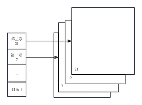
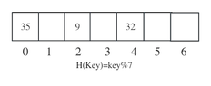

# 综述

## 基础概念

数据(Data): 对客观事物的符号表示, 在计算机科学中指所有能输入到计算机中并被计算机程序并被计算机程序处理的符号的总称。是一个大的概念。例如, 学生管理系统中的学生姓名, 年龄是数据, 管理系统本身也是数据。

数据元素(Data Element): 是数据的基本单位, 在计算机程序中通常作为一个整体进行考虑和处理。数据元素可由若干个数据项(Data Item)组成。

数据项(Data Item): 数据项是对客观事物某一方面特性的数据描述。

数据元素之间的关系: 可以是元素之间代表某种含义的自然关系, 也可以是为方便处理问题而人为定。这种自然或人为定义的「关系」称为数据元素之间的逻辑关系, 相应的结构称为逻辑结构。

数据结构(Data Structure): 指相互之间具有(或存在)一种或多种特定关系的数据元素的集合。

抽象数据类型(Abstract Data Type, ADT): 指一个数学模型及定义在该模型上的一组操作。ADT的定义仅是一组逻辑特性描述, 与其在计算机内部如何表示和存储实现无关。因此, 不论ADT的内部结构如何变化, 只要其数学特性不变, 都不影响其外部使用。ADT的形式化定义是三元组: 
```
ADT = (D,S,P)
```
其中, D是数据对象, S是D上的关系集, P是对D的基本操作集。

例如: 一个由字符组成的队列ABC, 那么这里面的数据对象就是每个字符A, B, C, 关系则为前驱和后继A的后继是B, B的后继是C等, 操作集则为可以在C后面进入新的字符, 或者A移出队列等。

## 数据的逻辑结构

数据元素之间的逻辑结构有4种基本类型

### 集合结构

结构中的数据元素除了「同属于一个集合」的关系, 没有其他关系。也就是说, 它们属于一个「组织」, 如下图所示:  


### 线性结构

结构中的数据元素之间存在一对一的关系, 并且除了首尾的数据元素之外, 都有前驱和后继节点, 如下图所示:   


### 树形结构

结构中的数据元素之间存在一对多的层次关系。例如, 一个大学, 党委书记是领导班子的班长, 负责领导党委副书记、组织部长、宣传部长等；组织部长领导干部处主任等。如下图所示: 


###  图状结构或网状结构

结构中的数据元素之间存在多对多的关系。例如, 北京和上海是我国重要的交通枢纽, 可以连通全国各大城市, 城市之间的连通关系构成图状结构, 如下图所示:  


## 数据的物理结构

数据结构要在计算机中处理, 就必须存储到计算机中。物理结构是逻辑结构在计算机内存中的存储形式。就如同两个人在一起, 虽然身处异地, 但是这两个人仍然是情侣, 二者是情侣是逻辑结构, 彼此所处的地理位置就是物理结构。

在目前的计算机中, 指令和数据都是以二进制的形式存放在内存中的。在设计时, 物理结构必须包括数据元素的存储和元素之间的关系的表示, 并且物理结构体现逻辑结构的逻辑关系。比如和两个情侣有彼此的手机号码的小卡片。因此, 根据逻辑结构在计算机中的表示和实现方式的不同, 物理结构可以分为以下4种。

###  顺序存储结构

把数据元素存放在地址连续的存储单元里, 其数据间的逻辑关系和物理关系是一致的。顺序存储结构具有以下特点。

1. 占用一大片连续内存空间, 通过物理位置关系直接反映逻辑关系。
2. 不需要额外空间存储逻辑关系, 空间利用率高。
3. 可顺序访问, 支持随机访问。
4. 往往通过数组实现。
5. 数据元素的插入和删除操作通过移动元素完成。

如图1-1: 


> 什么是随机访问？  
随机访问是在O(1)的时间复杂度内随意访问该数据结构中的任意一个节点, 假设该数据结构有10个节点, 你可以随意访问第1个到第10个节点。比如说磁带, 如果你想听某个歌曲, 必须要转到先目标处的位置, 才能播放, 这就不叫随机访问

### 链式存储结构

把数据元素存放在任意的存储单元里, 也就是说, 这些存储单元可以是连续的, 也可以是不连续的。所以, 数据元素的存储位置并不能反映逻辑关系, 因此需要用指针存放数据元素的地址, 通过地址(指针)就可以, 找到相关联数据元素的位置。
链式存储结构具有以下特点:  

1. 不要求占用连续内存空间, 逻辑连续, 物理可不连续, 通过指针反映逻辑关系。
2. 不仅要存储数据, 还要存储数据之间的关系(指针), 故总空间需求较大, 存储密度低。
3. 只可顺序访问, 不支持随机访问, 也就是说, 必须沿着指针的
4. 数据元素的插入和删除操作通过修改指针完成

如图:   


### 索引存储结构

除了建立存储结点信息, 还建立附加的索引表来标识结点的地址。索引表由若干索引项组成。索引存储结构是用结点的索引号来确定结点存储地址的。

索引存储结构的优点是检索速度快；缺点是增加了附加的索引表, 会占用较多的存储空间。在数据表中, 就是用索引表来进行存储与检索的。其特点如下。

1. 不要求占用连续内存空间；逻辑连续, 物理可不连续；通过索引表记录逻辑关系。
2. 不仅要存储数据, 还需要额外存储空间, 通过索引表存储逻辑关系, 故总空间需求较大, 存储密度低。
3. 可顺序访问, 支持随机访问, 数据元素的插入和删除操作通过修改索引表中相关数据元素的存储'
4. 需要额外操作时间对索引表进行维护。


### 散列存储结构

将数据元素的存储位置与关键码之间建立确定对应关系的查找技术。散列法存储的基本思想是由结点的关键码值决定结点的存储地址。散列存储结构具有以下特点。  
1. 物理位置通过哈希函数计算得到。
2. 逻辑不连续, 物理可不连续。
3. 可顺序访问, 由于存在冲突, 仅支持部分随机访问。

|||
|:-:|:-:|
|图 1-2 |图 1-3 |


### 要点提示

#### 索引存储和散列存储的区别

根据地址就可以找到对应的关键字。可以理解成一个黄页, 你根据一个人的名字, 就可以找到他的电话。所以索引存储又被称为直接寻址。数组就是一个常见的索引存储结构, 可以通过下标来直接访问, 下标(也就是关键字和地址相关)。

「散列存储」名字中的「散列」就是常听到的 `hash` (哈希值),  `hash`  是通过一种算法来运算出来的, 比如 MD5。在这种存储格式下, 地址会通过 `hash` 算法来运算成一个相同长度的  `hash` 值, 然后存放这个  `hash`  值, 而不是直接存放地址。在访问关键字的时候会通过运算解码 `hash` 值, 然后再访问。这个时候, 节点的存储地址和关键字是有某种映射关系的。

#### 二者区别

二者区别可以说就是多了一个  `hash`  函数运算的过程。但是为什么要多这一步操作, 而且还会「浪费」计算机的性能呢？

是为了是节省空间。

因为计算机的存储空间是有限的, 如果不考虑存储空间的限制, 那么可以创建一个字典, 为每个可能的关键字保留一个位置, 然后通过索引直接寻址。但是在一些情况下, 实际存储的关键字数目往往比可能的关键字数目要少很多很多, 就造成了巨大的空间浪费。如果这时候使用散列存储来替代索引存储。例如散列表使用一个长度与实际存储的关键字数目成比例的数组来存储, 访问的时候将哈希值转换成对应的下标。
散列技术还有一个好处就是有优异的平均情况性能, 而且在关键字集合是静态的时候, 散列技术也可以提供出色的最坏性能。
在时间复杂度上, 完全散列(perfect `hash`ing)和基本的字典操作所需的都是O(1)的时间, 也就是说, 并没有太大时间上的区别。

对于考试里会出现相关题目, 只要记得散列存储结构的存储地址和关键字存在某种映射关系即可。

## 算法的评价以及复杂度

### 什么是算法

算法(Algorithm): 求解问题的一系列计算或者操作。是对特定问题求解方法(步骤)的一种描述。例如, 考研, 那么考研就是问题, 而查信息、买资料、备考就是解决考研这个问题的步骤。事实上, 大家在生活中, 处处都在用算法解决问题。  

算法评价: 回到大家考研的例子, 有的小伙伴备考过程中, 效率很高；有的小伙伴复习效率比较低, 那么为了能够成功上岸, 我们必须对复习过程(解决问题的过程)进行评估。同样地, 大家知道, 设计的算法有好有坏, 所以设计的算法必须要有一些评价指标。这些指标包括正确性、可读性和健壮性。但是考试中关心的是衡量算法性能的指标: 时间复杂性, 空间复杂性。

### 什么是算法的复杂度

#### 算法的时间复杂度

时间复杂度: 算法执行时间需通过依据该算法编制的程序在计算机上运行时消耗的时间来度量。

时间复杂度的表示方式: 算法中基本操作重复执行的次数是问题规模n的某个函数f(n),其时间量度记作T(n)=O(f(n)),称为算法的渐近时间复杂度, 简称时间复杂度。一般地, 常用最深层循环内的语句中原操作的执行频度(重复执行的次数)来表示。

时间复杂性分为, 最好时间复杂性、最坏时间复杂性、平均时间复杂性。这里面最有用的指标是最坏时间复杂性, 它标识了一个算法执行的最差效率, 要是它是能接受的, 那么这个算法的执行效率就不用担心了。

时间复杂度是随输入规模变化而变化的一个值, 是一个函数关系, 所以时间复杂度的计算其实就是推导出当前算法和输入规模之间的这个关系函数。这个关系函数可以是根据算法的具体步骤一步步相加最后推到出来的详细的一个函数表达式, 但是其实我们知道时间复杂度函数一定是一个自变量为输入规模n的单调递增的一元函数。这种单调递增函数当自变量趋近于无穷大(即+∞)时, 函数表达式里的常数项和阶数不是最高的项对变化来说是可以忽略不记的, 所以我们用渐进复杂度就可以表示当输入规模趋于无穷大时候的时间复杂度。

「O」的定义（了解）: 若f(n)是正整数n的一个函数, 则O(f(n))表示存在M大于等于0, 使得当n大于等于n时, $|O(f(n))|≤M|f(n)|$,通俗的说, 就是f(n)当n趋近于$+∞$时的同阶无穷大。

表示时间复杂度的阶有以下几种: 
+ $O(1)$:常量时间阶
+ $O(n)$:线性时间阶
+ $O(log_2n)$:对数时间阶
+ $O(nlog_2n)$:线性对数时间阶

以下6种计算算法时间复杂度的多项式是最常用的, 其关系为

$$
O(1)<0(log_2n)<O(n)<O(nlog_2n)<O(n^2)<O(n^3)<O(a^n)
$$
指数时间的关系为
$$
O(2^m)<O(n!)<O(n)
$$
常数级、对数级、线性级、多项式级是能接受的范围。指数级、阶乘级是灾难性的。
### 时间复杂度的计算规则（重点，务必掌握）

1. 加法规则

   加法规则的适合情况：并列计算

   例如：
    ```c
   for(int i = 0;i < n ;i++){
   	一些操作
   }
   // 上面的语句的时间复杂度是o(n)
   for(int j = 0;j < n ;j++){
   	一些操作
   }
   // 上面的语句的时间复杂度是o(n)
   因此，这两个语句合并到一起的时间复杂度就是O(n+n) ==> O(2n)
   由于计算公式，max(n,n) 会回退到O(n)数量级而不是2n。
   从另外一个角度来讲，2只是一个系数，当n趋近于无穷的时候，2是否存在没有意义。


$T(n)=T1(n)+T2(n)=O(f(n))+O(g(n))=O(max(f(n),g(n)))$
2. 乘法规则

   乘法规则适用于嵌套的情况
   
      ```c
   for(int i = 0;i < n ;i++){
   	// 外侧语句的时间复杂度是o(n)
   	for(int j = 0;j < n ;j++){
       // 内侧语句的时间复杂度是o(n)
   		一些操作
   	}
   }
   
   // 上面的语句的总时间复杂度是o(n*n) ==> o(n^2)
   // 总时间复杂度 = 内侧 * 外侧
   // 这个指数2颗不能省略哦
      ```
   
   $T(n)=T1(n)*T2(n)=O(f(n))*O(g(n))=O(f(n)*g(n))$


#### 算法的空间复杂度

空间复杂度(Space Complexity)是对一个算法在运行过程中临时占用存储空间大小的量度，记做S(n)=O(f(n))。比如直接插入排序的时间复杂度是O($n^2$),空间复杂度是O(1) 。而一般的递归算法就要有O(n)的空间复杂度了，因为每次递归都要存储返回信息。一个算法的优劣主要从算法的执行时间和所需要占用的存储空间两个方面衡量。

分析一个算法所占用的存储空间要从各方面综合考虑。如对于递归算法来说，一般都比较简短，算法本身所占用的存储空间较少，但运行时需要一个附加堆栈，从而占用较多的临时工作单元;若写成非递归算法，一般可能比较长，算法本身占用的存储空间较多，但运行时将可能需要较少的存储单元。


## 概念速背「408同学无需掌握」

什么是数据结构？  
简单地说, 数据结构是以某种特定的布局方式存储数据的容器,是相互之间存在一种或多种特定关系的数据元素的集合。

数据的组织形式？  
数据元素之间存在的一种或多种特定关系。

数据的数据类型？  
A 原子类型∶是不可以再分解的基本类型, 包括整型、实型、字符型等。  
B 结构类型∶由若干个类型组合而成, 是可以再分解的。例如, 整型数组是由若干整型数据组成的。

算法的概念  
算法是特定问题求解步骤的描述, 在计算机中表现为指令的有限序列, 算法是独立存在的一种解决问题的方法和思想。对于算法而言, 语言并不重要, 重要的是思想。

算法和数据结构区别是什么?  
数据结构只是静态的描述了数据元素之间的关系, 高效的程序需要在数据结构的基础上设计和选择算法。
算法是为了解决实际问题而设计的。
数据结构是算法需要处理的问题载体。
数据结构与算法相辅相成。

算法的特性    
算法具有五个基本的特性: 输入、输出、有穷性、确定性和可行性  
输入输出: 算法具有零个或多个输入、至少有一个或多个输出。  
有穷性: 指算法在执行有限的步骤之后, 自动结束而不会出现无限循环, 并且每一个步骤在可接受的时间内完成。  
确定性: 算法的每一步骤都有确定的含义, 不会出现二义性。  
可行性: 算法的每一步都必须是可行的, 也就是说, 每一步都能通过执行有限次数完成。

数据结构分类   
按照视点的不同, 我们把数据结构分为逻辑结构和物理结构。
逻辑结构: 集合结构、线性结构、树形结构、图形结构
物理结构: 是指数据的逻辑结构在计算机中的存储形式, 共分为两种: 顺序存储和链式存储。

## 习题

### 选择

1. 设 n 是描述问题规模的非负整数，下面程序片段的时间复杂度是(   )。
```c
x=2;
while(x<n/2)
	x=2*x;
```
   A.O(log$_2$n)            B.O(n)               C.O(nlog$_2$n)           D.O(n²)

2. 求整数n(n≥0)    阶乘的算法如下，其时间复杂度是(   )。
```c
int  fact(int  n)
	{
	if(n<=1)
		return  1;
		return  n*fact(n-1);  
	 }
```
   A.O(log$_2$n)            B.O(n)               C.O(nlog$_2$n)           D.O(n²)

3. 已知两个长度分别为m 和 n 的升序链表，若将它们合并为一个长度为m+n 的降序链表，则 最坏情况下的时间复杂度是(   )。

   A.O(n)               B.O(m×n)             C.O(min(m,n))        D.O(max(m,n))
   


4. 下列程序段的时间复杂度是(    )。
```c
count=0;
for(k=1;k<=n;k*=2)
	for(j=1;j<=n;j++)   
 		count++;
```

A.O(log$_2$n)           B.O(n)                C.O(nlog$_2$n)          D.O(n²) 

5. 在数据结构中，数据的最小单位是(  )。

   A. 数据元素     B. 字节       C.  数据项      D.  结点

6. 在数据结构中，数据的基本单位是(    )。

   A. 数据项      B. 数据类型     C.  数据元素     D.  数据变量

7. 数据对象是指(   )。

   A.  描述客观事物且由计算机处理的数值、字符等符号的总称

   B. 数据的基本单位

   C.  性质相同的数据元素的集合

   D. 相互之间存在一种或多种特定关系的数据元素的集合

8. 以下说法正确的是(   )。

   A.  数据元素是数据的最小单位

   B. 数据项是数据的基本单位

   C. 数据结构是带有结构的数据元素的集合

   D.  数据结构是带有结构的各数据项集合

9. 数据结构研究的内容涉及(   )。

   A. 数据如何组织             	B. 数据如何存储

   C. 数据的运算如何实现          D. 算法用什么语言来描述

10. 在定义 ADT 时，除数据对象和数据关系外，还需说明(   )。

    A. 数据元素    B. 算法       C. 基本操作     D. 数据项

11. 在数据结构中，从逻辑上可以将之分为(   )。

    A.  动态结构和静态结构		B.  紧凑结构和非紧凑结构

    C. 内部结构和外部结构 		D. 线性结构和非线性结构

12. 从逻辑上可以把数据结构分为(   )两大类。

    A. 动态结构、静态结构         B. 顺序结构、链式结构

    C. 线性结构、非线性结构        D.  初等结构、构造型结构

13. 数据结构中数据元素之间的逻辑关系被称为(   )。

    A. 数据的存储结构            B. 数据的基本操作

    C. 程序的算法              D. 数据的逻辑结构

14. 以下与数据的存储结构无关的术语是(   )。

    A. 循环队列    B. 链表       C. 哈希表      D.  栈

15. 以下数据结构中，哪一个是线性结构? (    )

    A. 广义表     B. 二叉树      C. 稀疏矩阵     D.  串

16. 以下哪个数据结构不是多型数据类型? (   )

    A. 栈       B. 广义表      C. 有向图      D.  字符串

17. 以下数据结构中，(  )是非线性数据结构。

    A.  树        B. 字符串      C.  队        D.  栈

18. 下列数据中，(  )是非线性数据结构。

    A. 栈       B. 队列       C.  完全二叉树    D. 堆

19. 连续存储设计时，存储单元的地址(  )。

    A.  一定连续              B. 一定不连续

    C. 不一定连续              D. 部分连续，部分不连续

20. 以下属于逻辑结构的是(  )。

    A. 顺序表     B. 哈希表      C. 有序表      D. 单链表

21. 算法的计算量的大小称为计算的(  )。

    A. 效率      B. 复杂性      C. 现实性      D.  难度 

22. 算法的时间复杂度取决于(  )。

    A. 问题的规模   B.  待处理数据的初态           C.A 和 B

23. 计算机算法指的是(1),它必须具备(2)这三个特性。

    (1)A.   计算方法  	 B. 排序方法    	C.  解决问题的步骤序列  	 D. 调度方法

    (2)A.   可执行性、可移植性、可扩充性   B.  可执行性、确定性、有穷性

    ​    C. 确定性、有穷性、稳定性     	   D.  易读性、稳定性、安全性

24. 一个算法应该是(  )。

    A. 程序                		 B. 问题求解步骤的描述

    C. 要满足五个基本特性         D.A和C

25. 下面说法错误的是(  )。

    (1)算法原地工作的含义是指不需要任何额外的辅助空间

    (2)在相同的规模n 下，复杂度O(n)的算法在时间上总是优于复杂度 O(2")的算法

    (3)所谓时间复杂度是指最坏情况下，估算算法执行时间的一个上界

    (4)同一个算法，实现语言的级别越高，执行效率就越低

    A.(1)               B.(1),(2)            C.(1), (4)  	 D.(3)

26. 计算算法的时间复杂度是属于一种(  )。

    A. 事前统计的方法            B. 事前分析估算的方法

    C. 事后统计的方法            D. 事后分析估算的方法

27. 可以用(   )定义一个完整的数据结构。

    A. 数据元素    B. 数据对象     C. 数据关系     D. 抽象数据类型

28. 当输入非法错误时， 一个“好”的算法会进行适当处理，而不会产生难以理解的输出结果。这称为算法的(   )。

    A. 可读性     B. 健壮性      C. 正确性      D. 有穷性

29. 算法分析的目的是(    )。

    A. 找出数据结构的合理性         B. 研究算法中的输入和输出的关系

    C. 分析算法的效率以求改进        D. 分析算法的易懂性和文档性

30. 设计一个“好”的算法应考虑达到的目标是(   )。

     A.可行的     B. 健壮的      C. 无二义性     D. 可读性好的

31. 数据元素之间的关系称为(   )。

     A. 操作       B. 结构       C. 数据对象     D.  数据集合

32. (多选)一个算法具有(    )等特点。

     A. 有0个或多个输入量         B. 健壮性

     C.  正确性               		D. 可行

     ### 应用题

33. 数据存储结构包括哪几种类型?数据逻辑结构包括哪几种类型?

34. 数据元素之间的关系在计算机中有几种表示方法?各有什么特点? 

35. 数据类型和抽象数据类型是如何定义的?二者有何相同和不同之处?抽象数据类型的主要 特点是什么?使用抽象数据类型的主要好处是什么?

36. 回答问題(每题2分)。
     (1)在数据结构课程中，数据的逻辑结构、数据的存储结构及数据的运算之间存在着怎样的关系?
     (2)若逻辑结构相同但存储结构不同，则为不同的数据结构。这样的说法对吗?举例说明之。
     (3)在给定的逻辑结构及其存储表示上可以定义不同的运算集合，从而得到不同的数据结构。这样的说法对吗?举例说明之。
     (4)评价各种不同数据结构的标准是什么?

37. 评价一个好的算法，你是从哪几方面来考虑的? 

38. 解释和比较以下各组概念。
     (1)算法的时间复杂性。
     (2)算法。
     (3)频度。

39. 根据数据元素之间的逻辑关系， 一般有哪几类基本的数据结构? 

40. 对于一个数据结构， 一般包括哪三个方面的讨论? 

41. 当你为解决某一问題而选择数据结构时，应从哪些方面考虑? 

42. 若将数据结构定义为一个二元组 (D,R),    说明符号D 、R 应分别表示什么? 

43. 数据结构与数据类型有什么区别?

44. 算法的五个重要特征是什么? 

45. 一个算法所需时间由下述递归方程表示，试求出该算法的时间复杂性的级别(或阶)。(以 大O 形式表示。)

$$
\begin{equation}
 T(n)=
 \begin{cases}
 0 & \text{n=1}\\
 2T(n/2)+n & \text{n>1}
\end{cases}
\end{equation}
$$


其中：n 是问题的规模，为简单起见，设n 是2的整数幂。

46. 下面程序段的时间复杂度是什么?

``` c
    for(i=0;i<n;i++)
    	for(j=0;,j<m;j++)
    		a[i][j]=0;
```

47. 运算是数据结构的一个重要方面。试举一例，说明两个数据结构的逻辑结构和存储方式完 全相同，只是对于运算的定义不同。因而两个结构具有显著不同的特性，是两个不同的结构。

48. 在编制管理通讯录的程序时，什么样的数据结构合适?为什么?

49. 试举一例，说明对相同的逻辑结构，同一种运算在不同的存储方式下实现，其运算效率不 同。

50. 有实现同一功能的两个算法A1 和 A2,  其中A1的时间复杂度为T=O(2"),A2   的时间复杂度为T2=0(n²),  仅就时间复杂度而言，请具体分析这两个算法哪一个好。

## 答案

| 1.A   | 2.B  | 3.D   | 4.B   | 5.C  | 6.C  | 7.C  | 8.C  | 9.A BC | 10.C |
| ----- | ---- | ----- | ----- | ---- | ---- | ---- | ---- | ------ | ---- |
| 11.D  | 12.C | 13.D  | 14.D  | 15.D | 16.D | 17.A | 18.C | 19.A   | 20.C |
| 21.B  | 22.C | 23.1C | 23.2B | 24.B | 25.A | 26.B | 27.D | 28.B   | 29.C |
| 30.BD | 31.B | 32.AD |       |      |      |      |      |        |      |

33. 存储结构包括顺序存储、链式存储、索引存储和散列存储。逻辑结构包括线性结构和非线性结构。更细分也可以说，逻辑结构包括集合、线性结构、树形结构和图形(网状)结构。

34. 四种表示方法。

    1. 顺序存储方式。数据元素顺序存放，每个存储结点只含一个元素。存储位置反映数据元 素间的逻辑关系。存储密度大，但有些操作(如插入、删除)效率较差。
    1. 链式存储方式。每个存储结点除包含数据元素信息外还包含一组(至少一个)指针。指 针反映数据元素间的逻辑关系。这种方式不要求存储空间连续，便于动态操作(如插入 删除等),但存储空间开销大(用于指针),另外不能折半查找等。
    1. 索引存储方式。除数据元素存储在一地址连续的存储空间外，尚需建立一个索引表，索引表的索引项指示存储结点的存储位置(下标)或存储区间端点(下标，非稠密索引), 兼有静态和动态特性。
    1. 散列存储方式。利用散列函数和解决冲突的方法，将关键字散列在连续的有限的地址空 间内，并将散列函数的值解释成关键字所在元素的存储地址。其特点是存取速度快，只 能按关键字随机存取，不能顺序存取，也不能折半存取。

35. “数据类型”是程序设计语言中的一个概念，它是一个值的集合和操作的集合，如 C 语言中的整型、实型、字符型等。整型值(对具体机器都应有整数范围)的操作有加、减、乘、除、 求余等。实际上，数据类型是厂家提供给用户的已实现了的数据结构。

36. (1)数据的逻辑结构反映数据元素之间的逻辑关系(即数据元素之间的关联方式或“邻接关 系”),数据的存储结构是数据结构在计算机中的表示，包括数据元素的表示及其关系的 表示。数据的运算是对数据定义的一组操作，运算是定义在逻辑结构上的，和存储结构无关，而运算的实现则依赖于存储结构。

    (2)逻辑结构相同但存储结构不同，可以是不同的数据结构。例如，线性表的逻辑结构属于线性结构，采用顺序存储结构为顺序表，而采用链式存储结构称为线性链表。

    (3)栈和队列的逻辑结构相同，其存储表示也可相同(顺序存储和链式存储),但由于其运算集合不同而成为不同的数据结构。

    (4)数据结构的评价非常复杂，可以考虑两个方面： 一是所选数据结构是否准确、完整地刻画了问题的基本特征；二是是否容易实现(如对数据分解是否恰当；逻辑结构的选择是 否适合于运算的功能，是否有利于运算的实现；基本运算的选择是否恰当)

37. 评价好的算法有四个方面。 一是算法的正确性；二是算法的易读性；三是算法的健壮性；四 是算法的时空效率。

38. (1)算法的时间复杂性是算法输入规模的函数。算法的输入规模或问题的规模是作为该算法 输入的数据所含数据元素的数目，或与此数目有关的其他参数。有时考虑算法在最坏情 况下的时间复杂度或平均时间复杂度。

    (2)算法是对特定问题求解步骤的描述，是指令的有限序列，其中每一条指令表示一个或多个操作。算法具有五个重要特性：有穷性、确定性、可行性、输入和输出。
    (3)频度。在分析算法时间复杂度时，有时需要估算基本操作的原操作，它是执行次数最多的一个操作，该操作重复执行的次数称为频度。

39. 集合、线性结构、树形结构、图形或网状结构。

40. 逻辑结构、存储结构、操作(运算)。

41. 通常考虑算法运行所需要的存储空间量和时间量。后者又涉及四方面：程序运行时所需输 入的数据总量，对源程序进行编译所需时间，计算机执行每条指令所需时间和程序中指令 重复执行的次数。

42. D  是数据对象，是数据元素的有限集合，R 是 D 上数据元素之间关系的有限集合。

43. 「数据结构」这一术语有两种含义， 一是作为一门课程的名称；二是作为一个科学的概念。 作为科学概念，目前尚无公认定义， 一般认为，讨论数据结构要包括三个方面， 一是数据 的逻辑结构，二是数据的存储结构，三是对数据进行的操作(运算)。而数据类型是值的集合和操作的集合，可以看作是已实现了的数据结构，后者是前者的一种简化情况。

44. 算法的五个重要特征是有穷性、确定性、可行性、零个或多个输入和1至多个输出。

45. $O(nlog_{2}n)$

    设 $n=2^k(k≥0)$,  根据题目所给定义，有：

    $T(2^K)=2T(2^{K-1})+2^K=2^2T(2^{k-2})+2*2^k$

    由此，可得一般递推关系式：

    $T(2^K)=2^{i}T(2^{K-1})+i*2^k$

    进而，可得：

    $T(2^K)=2^{i}T(2^{0})+k*2^k = (K+1)2^k$

    即

    $T(n)=n(log_2n+1)=n(log_2(2n))=O(nlog_2n)$

46. $O(m*n)$

47. 见上面题栈和队列的比较。

48. 应从两方面进行讨论：如通讯录较少变动(如城市私人电话号码),主要用于查询，以顺序 存储较方便，既能顺序查找也可随机查找；若通讯录经常有增删操作，用链式存储结构较 为合适，将每个人的情况作为一个元素(即一个结点存放一个人),设姓名作关键字，链表 安排成有序表，这样可提高查询速度。

49. 留给读者自己思考

50. 留给读者自己思考
