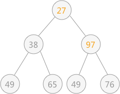
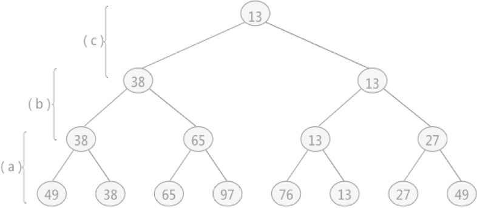
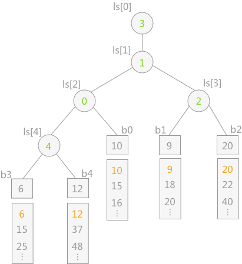

# 排序

## 什么是排序
「排序」通常是指将集合中无序的元素变为有序的过程。例如: [8,3,4,5,2]是无序的, [2, 3, 4，5，8]则变成了从小到大一次有序的。
## 排序算法
排序算法就是解决上述问题的步骤。   排序就是把集合中的元素按照一定的次序排序在一起。一般来说有升序排列和降序排列2种排序，在算法中有8中基本排序：


|稳定排序|不稳定排序|
|:-:|:-:|
|冒泡排序|选择排序|
| 插入排序|希尔排序|
| 归并排序|快速排序|
|基数排序|计数排序|
|堆排序||
|桶排序||


## 评价标准
稳定性是一个 特别重要的评估标准。稳定的算法在排序的过程中不会改变元素彼此的位置的相对次序，反之不稳定的排序算法经常会改变这个次序，这是我们不愿意看到的。我们在使用排序算法或者选择排序算法时，更希望这个次序不会改变，更加稳定，所以排序算法的稳定性，是一个特别重要的参数衡量指标依据。就如同空间复杂度和时间复杂度一样，有时候甚至比时间复杂度、空间复杂度更重要一些。所以往往评价一个排序算法的好坏往往可以从下边几个方面入手：
1. 时间复杂度：即从序列的初始状态到经过排序算法的变换移位等操作变到最终排序好的结果状态的过程所花费的时间度量。
2. 空间复杂度：就是从序列的初始状态经过排序移位变换的过程一直到最终的状态所花费的空间开销。
3. 使用场景：排序算法有很多，不同种类的排序算法适合不同种类的情景，可能有时候需要节省空间对时间要求没那么多，反之，有时候则是希望多考虑一些时间，对空间要求没那么高，总之一般都会必须从某一方面做出抉择。
4. 稳定性：稳定性是不管考虑时间和空间必须要考虑的问题，往往也是没什么用的因素。

## 排序的策略

组织各种排序算法的一种方法是对基本思想进行分类，或者「战略」。 一些关键策略是：

+ 交换排序: 如果发现两件物品顺序不对，就交换它们。 重复直到所有项目都井然有序。

  基于交换的排序有：冒泡排序和快速排序

+ 选择排序: 找到最小的项目，放在第一个位置，找到最小的剩下的物品，放在第二个位置。

  基于选择的排序有简单选择排序和堆排序

+ 插入排序: 一次取出一个项目并将它们插入到初始空数据结构使得数据结构继续是在每个阶段排序。
  
  基于插入的排序有：直接插入排序，折半插入排序，希尔排序。

## 冒泡排序(bubble sort)

### 什么是冒泡排序

冒泡排序算法是把较小的元素往前调或者把较大的元素往后调。这种方法主要是通过对相邻两个元素进行大小的比较，根据比较结果和算法规则对该二元素的位置进行交换，这样逐个依次进行比较和交换，就能达到排序目的。冒泡排序的基本思想是，首先将第1个和第2个记录的关键字比较大小，如果是逆序的，就将这两个记录进行交换，再对第2个和第3个记录的关键字进行比较，依次类推，重复进行上述计算，直至完成第(n一1)个和第n个记录的关键字之间的比较，此后，再按照上述过程进行第2次、第3次排序，直至整个序列有序为止。排序过程中要特别注意的是，当相邻两个元素大小一致时，这一步操作就不需要交换位置，因此也说明冒泡排序是一种严格的稳定排序算法，它不改变序列中相同元素之间的相对位置关系。

冒泡排序遵循交换排序方法。 它很容易实现，但往往跑起来特别慢。 假设我们有一个大小为 n 的数组 a，我们希望对其进行排序。 气泡排序从比较 a[n-1] 和 a[n-2] 开始，如果顺序错误则交换它们。然后它比较 a[n-2] 和 a[n-3] 并在需要时交换它们，依此类推。 这意味着一旦到达 a[0]，最小的条目将位于正确的位置。 然后从再次返回，比较成对的“邻居”，但单独留下第零个条目（这是已知是正确的）。再次到达前面后，第二小的条目将到位。 它不断地“遍历”数组，直到它被排序。 更一般地，在第 i 个冒泡排序阶段“从后面”比较相邻条目，并根据需要交换它们。与它的右邻居相比，具有最低索引的项目是 a[i-1]。 之后在第 i 个阶段，条目 a[0],...,a[i-1] 处于它们的最终位置。

例如，对无序表{49，38，65，97，76，13，27，49}进行升序排序的具体实现过程如图 1 所示：

||
|:--:|
|图10-1 第一次起泡|

如图 10-1 所示是对无序表的第一次起泡排序，最终将无序表中的最大值 97 找到并存储在表的最后一个位置。具体实现过程为：
首先 49 和 38 比较，由于 38<49，所以两者交换位置，即从（1）到（2）的转变；

然后继续下标为 1 的同下标为 2 的进行比较，由于 49<65，所以不移动位置，（3）中 65 同 97 比较得知，两者也不需要移动位置；
直至（4），97 同 76 进行比较，76<97，两者交换位置，如（5）所示；

同样 97>13（5）、97>27（6）、97>49（7) ，所以经过一次冒泡排序，最终在无序表中找到一个最大值 97，第一次冒泡结束；


||
|:--:|
|图10-2 第二次起泡|
由于 97 已经判断为最大值，所以第二次冒泡排序时就需要找出除 97 之外的无序表中的最大值，比较过程和第一次完全相同。

经过第二次冒泡，最终找到了除 97 之外的又一个最大值 76，比较过程完全一样，这里不再描述。

### 冒泡排序的实现

```c
#include <stdio.h>
#include <stdlib.h>
int main() {
    int a[]= {12,4,132,55,46,232,789,1,0,98,523,666};//随机数组
    int n = sizeof(a)/sizeof(a[0]);//获取数组大小
    int i,j,k;
//比较相邻的两个数据，如果第二个数小，就交换位置。从后向前两两比较，一直到比较最前两个数据。
        for(i = 1; i < n; i ++) {
            for(j = 0; j < n-1; j ++) {
                if(a[j] > a[j+1]) {//从小到大排序
                    k = a[j];
                    a[j] = a[j+1];
                    a[j+1] = k;
                }
            }
        }  
    for(i = 0; i < n; i ++)//输出排序后的结果
        printf("%d ",a[i]);
    return 0;
}
//运行结果如下：
//0 1 4 12 46 55 98 132 232 523 666 789
```

### 算法分析

+ 空间复杂度：因为冒泡排序并未借助其他多余的空间，只是在原地进行排序，所以时间复杂度为$O(1)$
+ 时间复杂度：每进行的一轮的冒泡每个元素都需要与相邻的元素进行比较，而这个过程要经历n轮，所以不难看出冒泡排序的时间复杂度为$O(n^2)$。
+ 稳定性：冒泡排序在元素交换的过程中，相等的两个元素的值的相对位置不会发生变化，所以冒泡排序是一种稳定的排序算法。
  

## 插入排序(insertion sorting)

### 什么是插入排序

插入排序算法是基于某序列已经有序排列的情况下，通过一次插入一个元素的方式按照原有排序方式增加元素。这种比较是从该有序序列的最末端开始执行，即要插入序列中的元素最先和有序序列中最大的元素比较，若其大于该最大元素，则可直接插入最大元素的后面即可，否则再向前一位比较查找直至找到应该插入的位置为止。插入排序的基本思想是，每次将1个待排序的记录按其关键字大小插入到前面已经排好序的子序列中，寻找最适当的位置，直至全部记录插入完毕。执行过程中，若遇到和插入元素相等的位置，则将要插人的元素放在该相等元素的后面，因此插入该元素后并未改变原序列的前后顺序。我们认为插入排序也是一种稳定的排序方法。插入排序分直接插入排序、折半插入排序和希尔排序3类。

例如采用直接插入排序算法将无序表{3,1,7,5,2,4,9,6}进行升序排序的过程为：
首先考虑记录 3 ，由于插入排序刚开始，有序表中没有任何记录，所以 3 可以直接添加到有序表中，则有序表和无序表可以如图 10- 所示:

|| |
|:--:| :--:|
| 图10-3 |图10-4|
|向有序表中插入记录 1 时，同有序表中记录 3 进行比较，1<3，所以插入到记录 3 的左侧，如图 10-4所示：|向有序表插入记录 7 时，同有序表中记录 3 进行比较，3<7，所以插入到记录 3 的右侧，如图 10-5 所示：|

|| |
|:--:| :--:|
| 图10-5 |图10-6|

向有序表中插入记录 5 时，同有序表中记录 7 进行比较，5<7，同时 5>3，所以插入到 3 和 7 中间，如图 10-6 所示：

|| |
|:--:| :--:|
|图10-7|图10-8|

向有序表插入记录 2 时，同有序表中记录 7进行比较，2<7，再同 5，3，1分别进行比较，最终确定 2 位于 1 和 3 中间，如图 10-7 所示。

照此规律，依次将无序表中的记录 4，9 和 6插入到有序表中，如图 10-8 所示。

### 复杂度分析

插入排序的平均时间复杂度也是 $O(n^2)$，空间复杂度为常数阶 $O(1)$，具体时间复杂度和数组的有序性也是有关联的。

插入排序中，当待排序数组是有序时，是最优的情况，只需当前数跟前一个数比较一下就可以了，这时一共需要比较 **N-1** 次，时间复杂度为 **O(N)**。最坏的情况是待排序数组是逆序的，此时需要比较次数最多，最坏的情况是 $O(n^2)$。

### 插入排序代码实现

```c
#include<stdio.h>
#include<stdlib.h>
int main() {
    int a[]= {12,4,132,55,46,232,789,1,0,98,523,666};//随机数组
    int n = sizeof(a)/sizeof(a[0]);//获取数组大小
    int i,j,k;
 //在要排序的一组数中，假定前n-1个数已经排好序，现将第n个数插到前面的有序数列中，
 //使得这n个数也是排好顺序的。如此反复循环，直到全部排好顺序。
    for(i = 0; i < n-1; i ++) {
        for(j = i+1; j > 0; j --)
            if(a[j] < a[j-1]) {
                k = a[j-1];
                a[j-1] = a[j];
                a[j] = k;
            } else
                break;
    }
    for(i = 0; i < n; i ++)//输出排序后的结果
        printf("%d ",a[i]);
    return 0;
}
//运行结果如下：
//0 1 4 12 46 55 98 132 232 523 666 789
```

## 选择排序(selection sort)

选择排序算法的基本思路是为每一个位置选择当前最小的元素。选择排序的基本思想是，基于直接选择排序和堆排序这两种基本的简单排序方法。首先从第1个位置开始对全部元素进行选择，选出全部元素中最小的给该位置，再对第2个位置进行选择，在剩余元素中选择最小的给该位置即可；以此类推，重复进行“最小元素”的选择，直至完成第(n-1)个位置的元素选择，则第n个位置就只剩唯一的最大元素，此时不需再进行选择。使用这种排序时，要注意其中一个不同于冒泡法的细节。举例说明：序列58539．我们知道第一遍选择第1个元素“5”会和元素“3”交换，那么原序列中的两个相同元素“5”之间的前后相对顺序就发生了改变。因此，我们说选择排序不是稳定的排序算法，它在计算过程中会破坏稳定性。 

例如对无序表{56，12，80，91，20}采用简单选择排序算法进行排序，具体过程为：
第一次遍历时，从下标为 1 的位置即 56 开始，找出关键字值最小的记录 12，同下标为 0 的关键字 56 交换位置：

|| |
|:--:| :--:|
|图10-|图2|

第二次遍历时，从下标为 2 的位置即 56 开始，找出最小值 20，同下标为 2 的关键字 56 互换位置：

|| |
|:--:| :--:|
|图3|图4|

第三次遍历时，从下标为 3 的位置即 80 开始，找出最小值 56，同下标为 3 的关键字 80 互换位置：

第四次遍历时，从下标为 4 的位置即 91 开始，找出最小是 80，同下标为 4 的关键字 91 互换位置：

到此简单选择排序算法完成，无序表变为有序表。

### 复杂度

选择排序的时间复杂度是$O(n^2)$, 额外空间复杂度为$O(1)$。

### 选择排序代码实现

```c
#include <stdio.h>
#include <stdlib.h>
int main() {
    int a[]= {12,4,132,55,46,232,789,1,0,98,523,666};//随机数组
    int n = sizeof(a)/sizeof(a[0]);//获取数组大小
    int i,j,k;
        //第一次遍历n-1个数，找到最小的数值与第一个元素交换
        //第二次遍历n-2个数，找到最小的数值与第二个元素交换
        // 以此类推
        //第n-1次遍历，找到最小的数值与第n-1个元素交换，排序完成。
    for(i = 0; i < n-1; i ++) {
        for(j = i+1; j < n; j ++) {
             if(a[i] > a[j]) {//从小到大排序
                    k = a[i];
                    a[i] = a[j];
                    a[j] = k;
             }
         }
    }
    for(i = 0; i < n; i ++)//输出排序后的结果
        printf("%d ",a[i]);
    return 0;
}
//运行结果如下：
//0 1 4 12 46 55 98 132 232 523 666 789
```
## 快速排序(Fast Sort)

### 基础快速排序

快速排序的基本思想是:通过一趟排序算法把所需要排序的序列的元素分割成两大块，其中，一部分的元素都要小于或等于另外一部分的序列元素，然后仍根据该种方法对划分后的这两块序列的元素分别再次实行快速排序算法，排序实现的整个过程可以是递归的来进行调用，最终能够实现将所需排序的无序序列元素变为一个有序的序列。 

快速排序是C.R.A.Hoare于1962年提出的一种划分交换排序。它采用了一种分治的策略，通常称其为分治法(Divide-and-ConquerMethod)。

该方法的基本思想是：

- 先从数列中取出一个数作为基准数。

- 分区过程，将比这个数大的数全放到它的右边，小于或等于它的数全放到它的左边。

- 再对左右区间重复第二步，直到各区间只有一个数。  


虽然快速排序称为分治法，但分治法这三个字显然无法很好的概括快速排序的全部步骤。因此我的对快速排序作了进一步的说明：挖坑填数+分治法：

先来看实例。

以一个数组作为示例，取区间第一个数为基准数。

| 0    | 1    | 2    | 3    | 4    | 5    | 6    | 7    | 8    | 9    |
| ---- | ---- | ---- | ---- | ---- | ---- | ---- | ---- | ---- | ---- |
| 72   | 6    | 57   | 88   | 60   | 42   | 83   | 73   | 48   | 85   |

初始时，i = 0; j = 9;  X = a[i] = 72

由于已经将 a[0] 中的数保存到 X 中，可以理解成在数组 a[0] 上挖了个坑，可以将其它数据填充到这来。

从j开始向前找一个比X小或等于X的数。当j=8，符合条件，将a[8]挖出再填到上一个坑a[0]中。a[0]=a[8]; i++; 这样一个坑a[0]就被搞定了，但又形成了一个新坑a[8]，这怎么办了？简单，再找数字来填a[8]这个坑。这次从i开始向后找一个大于X的数，当i=3，符合条件，将a[3]挖出再填到上一个坑中a[8]=a[3]; j--;

| 0    | 1    | 2    | 3    | 4    | 5    | 6    | 7    | 8    | 9    |
| ---- | ---- | ---- | ---- | ---- | ---- | ---- | ---- | ---- | ---- |
| 48   | 6    | 57   | 88   | 60   | 42   | 83   | 73   | 88   | 85   |

i = 3;  j = 7;  X=72

再重复上面的步骤，先从后向前找，再从前向后找。

从j开始向前找，当j=5，符合条件，将a[5]挖出填到上一个坑中，a[3] = a[5]; i++;

从i开始向后找，当i=5时，由于i==j退出。

此时，i = j = 5，而a[5]刚好又是上次挖的坑，因此将X填入a[5]。

数组变为：

| 0    | 1    | 2    | 3    | 4    | 5    | 6    | 7    | 8    | 9    |
| ---- | ---- | ---- | ---- | ---- | ---- | ---- | ---- | ---- | ---- |
| 48   | 6    | 57   | 42   | 60   | 72   | 83   | 73   | 88   | 85   |

可以看出a[5]前面的数字都小于它，a[5]后面的数字都大于它。因此再对a[0…4]和a[6…9]这二个子区间重复上述步骤就可以了。  

对挖坑填数进行总结:
1．i =L; j = R; 将基准数挖出形成第一个坑a[i]。
2．j--由后向前找比它小的数，找到后挖出此数填前一个坑a[i]中。
3．i++由前向后找比它大的数，找到后也挖出此数填到前一个坑a[j]中。
4．再重复执行2，3二步，直到i==j，将基准数填入a[i]中。

#### 快速排序代码实现

```c
#include <stdio.h>
#include <stdlib.h>
int arr[]= {12,4,132,55,46,232,789,1,0,98,523,666};//随机数组
int n = sizeof(arr)/sizeof(arr[0]);//获取数组大小
void adjustHeap(int i, int lef) {
    int temp=arr[i];
    for(int k=i*2+1; k<lef; k=k*2+1) { //从i结点的左子结点开始，也就是2i+1处开始
        if(k+1<lef&&arr[k]<arr[k+1]) {
            k++;
        }
        if(arr[k]>temp) { //如果子节点大于父节点，将子节点值赋给父节点（不用进行交换）
            arr[i]=arr[k];
            i=k;
        } else {
            break;
        }
    }
    arr[i]=temp;//将temp值放到最终的位置
}
void swap(int a, int b) {
    int temp=arr[a];
    arr[a] = arr[b];
    arr[b] = temp;
}
void heapsort() {
    // 1、构建大顶堆
    for(int i = n/2-1; i>=0; i--) {
        //从第一个非叶子节点从下至上，从右至左调整结构
        adjustHeap(i,n);
    }
    //2、调整堆结构+交换堆顶元素与末尾元素
    for(int j=n-1; j>0; j--) {
        swap(0,j);//将堆顶元素与末尾元素进行交换
        adjustHeap(0, j);//重新对堆进行调整
    }
}
int main() {
    int i;
    heapsort();
    for(i = 0; i < n; i ++)
        printf("%d ",arr[i]);
    return 0;
}
//运行结果如下：
//0 1 4 12 46 55 98 132 232 523 666 789

```
### 随机化快速排序

#### 概念及其介绍

**随机化快速排序基本思想：**通过一趟排序将要排序的数据分割成独立的两部分，其中一部分的所有数据都比另外一部分的所有数据都要小，然后再按此方法对这两部分数据分别进行快速排序，整个排序过程可以递归进行，以此达到整个数据变成有序序列。

#### 适用说明

快速排序是一种比较快速的排序算法，它的平均运行时间是 **O(nlogn)**，之所以特别快是由于非常精练和高度优化的内部循环，最坏的情形性能为 **O(n^2)**。像归并一样，快速排序也是一种分治的递归算法。从空间性能上看，快速排序只需要一个元素的辅助空间，但快速排序需要一个栈空间来实现递归，空间复杂度也为**O(logn)。**

#### 过程图

在一个数组中选择一个基点，比如第一个位置的 4，然后把4挪到正确位置，使得之前的子数组中数据小于 4，之后的子数组中数据大于 4，然后逐渐递归下去完成整个排序。


如何和把选定的基点数据挪到正确位置上，这是快速排序的核心，我们称为 Partition。

过程如下所示，其中 **i** 为当前遍历比较的元素位置：


### 双路快速排序

#### 概念及其介绍

双路快速排序算法是随机化快速排序的改进版本，partition 过程使用两个索引值（i、j）用来遍历数组，将 **<v** 的元素放在索引i所指向位置的左边，而将 **>v** 的元素放在索引j所指向位置的右边，**v** 代表标定值。

#### 适用说明

时间和空间复杂度同随机化快速排序。 对于有大量重复元素的数组，如果使用上一节随机化快速排序效率是非常低的，导致 partition 后大于基点或者小于基点数据的子数组长度会极度不平衡，甚至会退化成 **O(n\*2)** 时间复杂度的算法，对这种情况可以使用双路快速排序算法。

#### 过程图示

使用两个索引值（i、j）用来遍历我们的序列，将 **<=v** 的元素放在索引 i 所指向位置的左边，而将 **>=v** 的元素放在索引 j 所指向位置的右边，平衡左右两边子数组。


## 归并排序(merge sort)

归并排序算法就是把序列递归划分成为一个个短序列，以其中只有1个元素的直接序列或者只有2个元素的序列作为短序列的递归出口，再将全部有序的短序列按照一定的规则进行排序为长序列。归并排序融合了分治策略，即将含有n个记录的初始序列中的每个记录均视为长度为1的子序列，再将这n个子序列两两合并得到n/2个长度为2(当凡为奇数时会出现长度为l的情况)的有序子序列；将上述步骤重复操作，直至得到1个长度为n的有序长序列。需要注意的是，在进行元素比较和交换时，若两个元素大小相等则不必刻意交换位置，因此该算法不会破坏序列的稳定性，即归并排序也是稳定的排序算法。 

### 概念及其介绍

归并排序（Merge sort）是建立在归并操作上的一种有效、稳定的排序算法，该算法是采用分治法(Divide and Conquer）的一个非常典型的应用。将已有序的子序列合并，得到完全有序的序列；即先使每个子序列有序，再使子序列段间有序。若将两个有序表合并成一个有序表，称为二路归并。

### 适用说明

当有 n 个记录时，需进行 logn 轮归并排序，每一轮归并，其比较次数不超过 n，元素移动次数都是 n，因此，归并排序的时间复杂度为 O(nlogn)。归并排序时需要和待排序记录个数相等的存储空间，所以空间复杂度为 O(n)。

归并排序适用于数据量大，并且对稳定性有要求的场景。

### 过程图示

归并排序是递归算法的一个实例，这个算法中基本的操作是合并两个已排序的数组，取两个输入数组 A 和 B，一个输出数组 C，以及三个计数器 i、j、k，它们初始位置置于对应数组的开始端。

A[i] 和 B[j] 中较小者拷贝到 C 中的下一个位置，相关计数器向前推进一步。

当两个输入数组有一个用完时候，则将另外一个数组中剩余部分拷贝到 C 中。


自顶向下的归并排序，递归分组图示：


对第三行两个一组的数据进行归并排序


对第二行四个一组的数据进行归并排序


整体进行归并排序


## 堆排序(heap sort)

对于堆的定义也可以使用完全二叉树来解释，因为在完全二叉树中第 i 个结点的左孩子恰好是第 2i 个结点，右孩子恰好是 2i+1 个结点。如果该序列可以被称为堆，则使用该序列构建的完全二叉树中，每个根结点的值都必须不小于（或者不大于）左右孩子结点的值。

### 复杂度

时间复杂度:$O(alog_2n)$，额外空间复杂度$O(1)$

### 操作步骤

以无序表`{49，38，65，97，76，13，27，49}`来讲，其对应的堆用完全二叉树来表示为：


> 提示：堆用完全二叉树表示时，其表示方法不唯一，但是可以确定的是树的根结点要么是无序表中的最小值，要么是最大值。

通过将无序表转化为堆，可以直接找到表中最大值或者最小值，然后将其提取出来，令剩余的记录再重建一个堆，取出次大值或者次小值，如此反复执行就可以得到一个有序序列，此过程为堆排序。

堆排序过程的代码实现需要解决两个问题
1. 如何将得到的无序序列转化为一个堆？
2. 在输出堆顶元素之后（完全二叉树的树根结点），如何调整剩余元素构建一个新的堆？

首先先解决第 2 个问题。图 3 所示为一个完全二叉树，若去除堆顶元素，即删除二叉树的树根结点，此时用二叉树中最后一个结点 97 代替，如下图1所示：

||||
|:-:|:-:|:-:|
|图 1|图 2|图 3|

此时由于结点 97 比左右孩子结点的值都大，破坏了堆的结构，所以需要进行调整：首先以 堆顶元素 97 同左右子树比较，同值最小的结点交换位置，即 27 和 97 交换位置：由于替代之后破坏了根结点右子树的堆结构，所以需要进行和上述一样的调整，即令 97 同 49 进行交换位置：通过上述的调整，之前被破坏的堆结构又重新建立。从根结点到叶子结点的整个调整的过程，被称为「筛选」。解决第一个问题使用的就是不断筛选的过程，如下图所示，无序表`{49，38，65，97，76，13，27，49}`初步建立的完全二叉树，如下图所示：


在对上图做筛选工作时，规律是从底层结点开始，一直筛选到根结点。对于具有 n 个结点的完全二叉树，筛选工作开始的结点为第 ⌊n/2⌋个结点（此结点后序都是叶子结点，无需筛选）。

所以，对于有 9 个结点的完全二叉树，筛选工作从第 4 个结点 97 开始，由于 97 > 49 ,所以需要相互交换，交换后如下图所示：


|||||
|:-:|:-:|:-:|:-:|
|图 1|图 2|图 3|图 4|


接下来再筛选第 3 个结点 65 ，由于 65 比左右孩子结点都大，则选择一个最小的同 65 进行交换，交换后的结果为。最后筛选第 2 个结点，由于其符合要求，所以不用筛选；最后筛选根结点 49 ，同 13 进行交换，交换后的结果如图3。交换后，发现破坏了其右子树堆的结构，所以还需要调整，最终调整后的结果为：


### 堆排序代码实现

```c
#include <stdio.h>
#include <stdlib.h>
int arr[]= {12,4,132,55,46,232,789,1,0,98,523,666};//随机数组
int n = sizeof(arr)/sizeof(arr[0]);//获取数组大小
void adjustHeap(int i, int lef) {
    int temp=arr[i];
    for(int k=i*2+1; k<lef; k=k*2+1) { //从i结点的左子结点开始，也就是2i+1处开始
        if(k+1<lef&&arr[k]<arr[k+1]) {
            k++;
        }
        if(arr[k]>temp) { //如果子节点大于父节点，将子节点值赋给父节点（不用进行交换）
            arr[i]=arr[k];
            i=k;
        } else {
            break;
        }
    }
    arr[i]=temp;//将temp值放到最终的位置
}
void swap(int a, int b) {
    int temp=arr[a];
    arr[a] = arr[b];
    arr[b] = temp;
}
void heapsort() {
    // 1、构建大顶堆
    for(int i = n/2-1; i>=0; i--) {
        //从第一个非叶子节点从下至上，从右至左调整结构
        adjustHeap(i,n);
    }
    //2、调整堆结构+交换堆顶元素与末尾元素
    for(int j=n-1; j>0; j--) {
        swap(0,j);//将堆顶元素与末尾元素进行交换
        adjustHeap(0, j);//重新对堆进行调整
    }
}
int main() {
    int i;
    heapsort();
    for(i = 0; i < n; i ++)
        printf("%d ",arr[i]);
    return 0;
}
//运行结果如下：
//0 1 4 12 46 55 98 132 232 523 666 789
```

## 希尔排序(Shell sort)

### 概念及其介绍

希尔排序(Shell Sort)是插入排序的一种，它是针对直接插入排序算法的改进。

希尔排序又称缩小增量排序，因 DL.Shell 于 1959 年提出而得名。

它通过比较相距一定间隔的元素来进行，各趟比较所用的距离随着算法的进行而减小，直到只比较相邻元素的最后一趟排序为止。

### 适用说明

希尔排序时间复杂度是 **O(n^(1.3-2))**，空间复杂度为常数阶 **O(1)**。希尔排序没有时间复杂度为 **O(n(logn))** 的快速排序算法快 ，因此对中等大小规模表现良好，但对规模非常大的数据排序不是最优选择，总之比一般 **O(n^2 )** 复杂度的算法快得多。

### 过程图示

希尔排序目的为了加快速度改进了插入排序，交换不相邻的元素对数组的局部进行排序，并最终用插入排序将局部有序的数组排序。

在此我们选择增量 **gap=length/2**，缩小增量以 **gap = gap/2** 的方式，用序列 **{n/2,(n/2)/2...1}** 来表示。

如图示例：

1. 初始增量第一趟 **gap = length/2 = 4**


3. 第二趟，增量缩小为 2


3. 第三趟，增量缩小为 1,得到最终排序结果


## 基数排序(Radix Sort)

基数排序是按照低位先排序，然后收集；再按照高位排序，然后再收集；依次类推，直到最高位。有时候有些属性是有优先级顺序的，先按低优先级排序，再按高优先级排序。最后的次序就是高优先级高的在前，高优先级相同的低优先级高的在前。

原理是将整数按位数切割成不同的数字，然后按每个位数分别比较。基数排序的方式可以采用LSD（Least significant digital）或MSD（Most significant digital），LSD的排序方式由键值的最右边开始，而MSD则相反，由键值的最左边开始。

- **MSD**：先从高位开始进行排序，在每个关键字上，可采用计数排序。
- **LSD**：先从低位开始进行排序，在每个关键字上，可采用桶排序。

### 算法描述

- 取得数组中的最大数，并取得位数；
- arr为原始数组，从最低位开始取每个位组成radix数组；
- 对radix进行计数排序（利用计数排序适用于小范围数的特点）；

### 动图演示


### 排序过程

分步图示说明：设有数组 array = {53, 3, 542, 748, 14, 214, 154, 63, 616}，对其进行基数排序：


在上图中，首先将所有待比较数字统一为统一位数长度，接着从最低位开始，依次进行排序。

- 按照个位数进行排序。
- 按照十位数进行排序。
- 按照百位数进行排序。

排序后，数列就变成了一个有序序列。

### 记数排序

### 概述
计数排序是一个非基于比较的排序算法，元素从未排序状态变为已排序状态的过程，是由额外空间的辅助和元素本身的值决定的。该算法于1954年由 Harold H. Seward 提出。它的优势在于在对一定范围内的整数排序时，它的复杂度为Ο(n+k)（其中k是整数的范围），快于任何比较排序算法。当然这是一种牺牲空间换取时间的做法，而且当  的时候其效率反而不如基于比较的排序，因为基于比较的排序的时间复杂度在理论上的下限是 。

### 算法思路
计数排序对输入的数据有附加的限制条件：

1、输入的线性表的元素属于有限偏序集 S；

2、设输入的线性表的长度为 n，|S|=k（表示集合 S 中元素的总数目为 k），则 k=O(n)。

在这两个条件下，计数排序的复杂性为O(n)。

计数排序的基本思想是对于给定的输入序列中的每一个元素 x，确定该序列中值小于 x 的元素的个数（此处并非比较各元素的大小，而是通过对元素值的计数和计数值的累加来确定）。一旦有了这个信息，就可以将 x 直接存放到最终的输出序列的正确位置上。例如，如果输入序列中只有 17 个元素的值小于 x 的值，则 x 可以直接存放在输出序列的第 18 个位置上。当然，如果有多个元素具有相同的值时，我们不能将这些元素放在输出序列的同一个位置上，因此，上述方案还要作适当的修改。

### 算法过程
根据待排序集合中最大元素和最小元素的差值范围，申请额外空间；遍历待排序集合，将每一个元素出现的次数记录到元素值对应的额外空间内；对额外空间内数据进行计算，得出每一个元素的正确位置；将待排序集合每一个元素移动到计算得出的正确位置上。
### 详解算法
先假设 20 个数列为：{9, 3, 5, 4, 9, 1, 2, 7, 8，1，3, 6, 5, 3, 4, 0, 10, 9, 7, 9}。

让我们先遍历这个无序的随机数组，找出最大值为 10 和最小值为 0。这样我们对应的计数范围将是 0 ~ 10。然后每一个整数按照其值对号入座，对应数组下标的元素进行加1操作。

比如第一个整数是 9，那么数组下标为 9 的元素加 1，如下图所示。


第二个整数是 3，那么数组下标为 3 的元素加 1，如下图所示。


继续遍历数列并修改数组......。最终，数列遍历完毕时，数组的状态如下图。


数组中的每一个值，代表了数列中对应整数的出现次数。

有了这个统计结果，排序就很简单了，直接遍历数组，输出数组元素的下标值，元素的值是几，就输出几次。比如统计结果中的 1 为 2，就是数列中有 2 个 1 的意思。这样我们就得到最终排序好的结果。

## 外部排序

外部排序指的是大文件的排序，即待排序的记录存储在外存储器上，待排序的文件无法一次装入内存，需要在内存和外部存储器之间进行多次数据交换，以达到排序整个文件的目的。

中文名外部排序指内排序快速排序，堆排序，归并排序内排序可以在内存中完成的排序相关初始化堆。

### 外部排序规则种类

排序是计算机程序设计中的一种重要操作，它的功能是将任意序列的数据元素或记录重新按关键字顺序排列成有序的序列。 有序序列为记录的查找、插入和删除提供了方便，可以有效提高搜索效率。因此，研究各类排序方法是计算机研究中的重要课题之一。根据待排序记录数量及其在排序过程中涉及的存储器，可将排序方法分为两大类: 一类是内部排序, 指的是待排序记录存放在计算机存储器中进行的排序过程；另一类是外部排序, 指的是待排序记录的数量很大，以至于内存一次不能容纳全部记录，在排序过程中尚需对外存进行访问的排序过程。 

外部排序指的是大文件的排序，当待排序的文件很大时，无法将整个文件的所有记录同时调入内存进行排序，只能将文件存放在外存，这种排称为外部排序。外部排序的过程主要是依据数据的内外存交换和“内部归并”两者结合起来实现的。

一般提到排序都是指内排序，比如快速排序，堆排序，归并排序等，所谓内排序就是可以在内存中完成的排序。RAM的访问速度大约是磁盘的25万倍，我们当然希望如果可以的话都是内排来完成。但对于大数据集来说，内存是远远不够的，这时候就涉及到外排序的知识了。

外部排序最常用的算法是多路归并排序，即将原文件分解成多个能够一次性装入内存的部分分别把每一部分调入内存完成排序。然后，对已经排序的子文件进行归并排序。

### 外部排序的步骤
一般来说外排序分为两个步骤：预处理和合并排序。首先，根据可用内存的大小，将外存上含有n个纪录的文件分成若干长度为t的子文件（或段）；其次，利用内部排序的方法，对每个子文件的t个纪录进行内部排序。这些经过排序的子文件（段）通常称为顺串(run)，顺串生成后即将其写入外存。这样在外存上就得到了m个顺串（m=[n/t]）。最后，对这些顺串进行归并，使顺串的长度逐渐增大，直到所有的待排序的记录成为一个顺串为止。

上一节介绍了很多排序算法，插入排序、选择排序、归并排序等等，这些算法都属于内部排序算法，即排序的整个过程只是在内存中完成。而当待排序的文件比内存的可使用容量还大时，文件无法一次性放到内存中进行排序，需要借助于外部存储器（例如硬盘、U盘、光盘），这时就需要用到本章介绍的外部排序算法来解决。

外部排序算法由两个阶段构成：

1. 按照内存大小，将大文件分成若干长度为 l 的子文件（l 应小于内存的可使用容量），然后将各个子文件依次读入内存，使用适当的内部排序算法对其进行排序（排好序的子文件统称为“归并段”或者“顺段”），将排好序的归并段重新写入外存，为下一个子文件排序腾出内存空间；
2. 对得到的顺段进行合并，直至得到整个有序的文件为止。

例如，有一个含有 10000 个记录的文件，但是内存的可使用容量仅为 1000 个记录，毫无疑问需要使用外部排序算法，具体分为两步：

- 将整个文件其等分为 10 个临时文件（每个文件中含有 1000 个记录），然后将这 10 个文件依次进入内存，采取适当的内存排序算法对其中的记录进行排序，将得到的有序文件（初始归并段）移至外存。
- 对得到的 10 个初始归并段进行如图 1 的两两归并，直至得到一个完整的有序文件。

> 注意：此例中采用了将文件进行等分的操作，还有不等分的算法，后面章节会介绍。


||
|:-:|
|2-路平衡归并|

如图所示有 10 个初始归并段到一个有序文件，共进行了 4 次归并，每次都由 m 个归并段得到 ⌈m/2⌉ 个归并段，这种归并方式被称为 2-路平衡归并。

> 注意：在实际归并的过程中，由于内存容量的限制不能满足同时将 2 个归并段全部完整的读入内存进行归并，只能不断地取 2 个归并段中的每一小部分进行归并，通过不断地读数据和向外存写数据，直至 2 个归并段完成归并变为 1 个大的有序文件。

对于外部排序算法来说，影响整体排序效率的因素主要取决于读写外存的次数，即访问外存的次数越多，算法花费的时间就越多，效率就越低。

计算机中处理数据的为中央处理器（CPU），如若需要访问外存中的数据，只能通过将数据从外存导入内存，然后从内存中获取。同时由于内存读写速度快，外存读写速度慢的差异，更加影响了外部排序的效率。

对于同一个文件来说，对其进行外部排序时访问外存的次数同归并的次数成正比，即归并操作的次数越多，访问外存的次数就越多。图 1 中使用的是 2-路平衡归并的方式，举一反三，还可以使用 3-路归并、4-路归并甚至是 10-路归并的方式，图为 5-路归并的方式：


|  |
| :----------------------------------------------------------: |
|                         5-路平衡归并                         |

对比 图 1 和图 2可以看出，对于 k-路平衡归并中 k 值得选择，增加 k 可以减少归并的次数，从而减少外存读写的次数，最终达到提高算法效率的目的。除此之外，一般情况下对于具有 m 个初始归并段进行 k-路平衡归并时，归并的次数为：s=⌊logk⁡m ⌋（其中 s 表示归并次数）。

从公式上可以判断出，想要达到减少归并次数从而提高算法效率的目的，可以从两个角度实现：

- 增加 k-路平衡归并中的 k 值；
- 尽量减少初始归并段的数量 m，即增加每个归并段的容量；

> 其增加 k 值的想法引申出了一种外部排序算法：多路平衡归并算法；增加数量 m 的想法引申出了另一种外部排序算法：置换-选择排序算法。两种外部排序算法会在后序章节中详细介绍。

通过上一节对于外部排序的介绍得知：对于外部排序算法来说，其直接影响算法效率的因素为读写外存的次数，即次数越多，算法效率越低。若想提高算法的效率，即减少算法运行过程中读写外存的次数，可以增加 k –路平衡归并中的 k 值。

但是经过计算得知，如果毫无限度地增加 k 值，虽然会减少读写外存数据的次数，但会增加内部归并的时间，得不偿失。

例如在上节中，对于 10 个临时文件，当采用 2-路平衡归并时，若每次从 2 个文件中想得到一个最小值时只需比较 1 次；而采用 5-路平衡归并时，若每次从 5 个文件中想得到一个最小值就需要比较 4 次。以上仅仅是得到一个最小值记录，如要得到整个临时文件，其耗费的时间就会相差很大。

为了避免在增加 k 值的过程中影响内部归并的效率，在进行 k-路归并时可以使用“败者树”来实现，该方法在增加 k 值时不会影响其内部归并的效率。

## 败者树实现内部归并

败者树是树形选择排序的一种变形，本身是一棵完全二叉树。

在树形选择排序一节中，对于无序表`{49，38，65，97，76，13，27，49}`创建的完全二叉树如图 1 所示，构建此树的目的是选出无序表中的最小值。

这棵树与败者树正好相反，是一棵“胜者树”。因为树中每个非终端结点（除叶子结点之外的其它结点）中的值都表示的是左右孩子相比较后的较小值（谁最小即为胜者）。例如叶子结点 49 和 38 相对比，由于 38 更小，所以其双亲结点中的值保留的是胜者 38。然后用 38 去继续同上层去比较，一直比较到树的根结点。


|  |
| :------------------------------: |
|          图10-27 胜者树          |

而败者树恰好相反，其双亲结点存储的是左右孩子比较之后的失败者，而胜利者则继续同其它的胜者去比较。

例如还是图 1 中，叶子结点 49 和 38 比较，38 更小，所以 38 是胜利者，49 为失败者，但由于是败者树，所以其双亲结点存储的应该是 49；同样，叶子结点 65 和 97 比较，其双亲结点中存储的是 97 ，而 65 则用来同 38 进行比较，65 会存储到 97 和 49 的双亲结点的位置，38 继续做后续的胜者比较，依次类推。

> 胜者树和败者树的区别就是：胜者树中的非终端结点中存储的是胜利的一方；而败者树中的非终端结点存储的是失败的一方。而在比较过程中，都是拿胜者去比较。

|  |
| :------------------------------: |
|          图10-28 胜者树          |


如图所示为一棵 5-路归并的败者树，其中 b0—b4 为树的叶子结点，分别为 5 个归并段中存储的记录的关键字。 ls 为一维数组，表示的是非终端结点，其中存储的数值表示第几归并段（例如 b0 为第 0 个归并段）。ls[0] 中存储的为最终的胜者，表示当前第 3 归并段中的关键字最小。

当最终胜者判断完成后，只需要更新叶子结点 b3 的值，即导入关键字 15，然后让该结点不断同其双亲结点所表示的关键字进行比较，败者留在双亲结点中，胜者继续向上比较。

例如，叶子结点 15 先同其双亲结点 ls[4] 中表示的 b4 中的 12 进行比较，12 为胜利者，则 ls[4] 改为 15，然后 12 继续同 ls[2] 中表示的 10 做比较，10 为胜者，然后 10 继续同其双亲结点 ls[1] 表示的 b1（关键字 9）作比较，最终 9 为胜者。整个过程如下图所示：


> 注意：为了防止在归并过程中某个归并段变为空，处理的办法为：可以在每个归并段最后附加一个关键字为最大值的记录。这样当某一时刻选出的冠军为最大值时，表明 5 个归并段已全部归并完成。（因为只要还有记录，最终的胜者就不可能是附加的最大值）

除了增加 k-路归并排序中的 k 值来提高外部排序效率的方法，而除此之外，还有另外一条路可走，即减少初始归并段的个数，也就是本章第一节中提到的减小 m 的值。

> m 的求值方法为：m=⌈n/l⌉（n 表示为外部文件中的记录数，l 表示初始归并段中包含的记录数）

如果要想减小 m 的值，在外部文件总的记录数 n 值一定的情况下，只能增加每个归并段中所包含的记录数 l。而对于初始归并段的形成，就不能再采用上一章所介绍的内部排序的算法，因为所有的内部排序算法正常运行的前提是所有的记录都存在于内存中，而内存的可使用空间是一定的，如果增加 l 的值，内存是盛不下的。

所以要另想它法，探索一种新的排序方法：置换—选择排序算法。

例如已知初始文件中总共有 24 个记录，假设内存工作区最多可容纳 6 个记录，按照之前的选择排序算法最少也只能分为 4 个初始归并段。而如果使用置换—选择排序，可以实现将 24 个记录分为 3 个初始归并段，如图 1 所示：


置换—选择排序算法的具体操作过程为：

1. 首先从初始文件中输入 6 个记录到内存工作区中；
2. 从内存工作区中选出关键字最小的记录，将其记为 MINIMAX 记录；
3. 然后将 MINIMAX 记录输出到归并段文件中；
4. 此时内存工作区中还剩余 5 个记录，若初始文件不为空，则从初始文件中输入下一个记录到内存工作区中；
5. 从内存工作区中的所有比 MINIMAX 值大的记录中选出值最小的关键字的记录，作为新的 MINIMAX 记录；
6. 重复过程 3—5，直至在内存工作区中选不出新的 MINIMAX 记录为止，由此就得到了一个初始归并段；
7. 重复 2—6，直至内存工作为空，由此就可以得到全部的初始归并段。

拿图中的初始文件为例，首先输入前 6 个记录到内存工作区，其中关键字最小的为 29，所以选其为 MINIMAX 记录，同时将其输出到归并段文件中，如下图所示：


此时初始文件不为空，所以从中输入下一个记录 14 到内存工作区中，然后从内存工作区中的比 29 大的记录中，选择一个最小值作为新的 MINIMAX 值输出到 归并段文件中，如下图所示：


初始文件还不为空，所以继续输入 61 到内存工作区中，从内存工作区中的所有关键字比 38 大的记录中，选择一个最小值作为新的 MINIMAX 值输出到归并段文件中，如下图所示：


如此重复性进行，直至选不出 MINIMAX 值为止，如下图所示：


当选不出 MINIMAX 值时，表示一个归并段已经生成，则开始下一个归并段的创建，创建过程同第一个归并段一样，这里不再赘述。

在上述创建初始段文件的过程中，需要不断地在内存工作区中选择新的 MINIMAX 记录，即选择不小于旧的 MINIMAX 记录的最小值，此过程需要利用“败者树”来实现。

同上一节所用到的败者树不同的是，在不断选择新的 MINIMAX 记录时，为了防止新加入的关键字值小的的影响，每个叶子结点附加一个序号位，当进行关键字的比较时，先比较序号，序号小的为胜者；序号相同的关键字值小的为胜者。

在初期创建败者树时也可以通过不断调整败者树的方式，其中所有记录的序号均设为 0 ，然后从初始文件中逐个输入记录到内存工作区中，自下而上调整败者树。过程如下：

1. 首先创建一个空的败者树，如下图所示：

   
   |||
   |:-:|:-:|

   > 提示：败者树根结点上方的方框内表示的为最终的胜者所处的位置。

2. 从初始文件中读入关键字为 51 的记录，自下往上调整败者树，如上图所示

   > 提示：序号 1 默认为比 0 小，为败者。
   
3. 从初始文件中读入关键字为 49 的记录，调整败者树如下图所示：

   
   
   
4. 从初始文件依次读入关键字为 39、46、38、29 的记录，调整败者树如下图所示：

   
   

由败者树得知，其最终胜者为 29，设为 MINIMAX 值，将其输出到初始归并文件中，同时再读入下一个记录 14，调整败者树，如下图所示：


注意：当读入新的记录时，如果其值比 MINIMAX 大，其序号则仍为 1；反之则为 2 ，比较时序号 1 比序号 2的记录大。

通过不断地向败者树中读入记录，会产生多个 MINIMAX，直到最终所有叶子结点中的序号都为 2，此时产生的新的 MINIMAX 值的序号 2，表明此归并段生成完成，而此新的 MINIMAX 值就是下一个归并段中的第一个记录。

通过对置换-选择排序算法的学习了解到，通过对初始文件进行置换选择排序能够获得多个长度不等的初始归并段，相比于按照内存容量大小对初始文件进行等分，大大减少了初始归并段的数量，从而提高了外部排序的整体效率。

大家思考一个问题：无论是通过等分还是置换-选择排序得到的归并段，如何设置它们的归并顺序，可以使得对外存的访问次数降到最低？

例如，现有通过置换选择排序算法所得到的 9 个初始归并段，其长度分别为：`9，30，12，18，3，17，2，6，24`。在对其采用 3-路平衡归并的方式时可能出现如图所示的情况：

||
|:-:|
|3-路平衡归并|

> 提示：图 1 中的叶子结点表示初始归并段，各自包含记录的长度用结点的权重来表示；非终端结点表示归并后的临时文件。

假设在进行平衡归并时，操作每个记录都需要单独进行一次对外存的读写，那么图 1 中的归并过程需要对外存进行读或者写的次数为：（9+30+12+18+3+17+2+6+24）*2*2=484（图中涉及到了两次归并，对外存的读和写各进行 2 次）

从计算结果上看，对于图 1 中的 3 叉树来讲，其操作外存的次数恰好是树的带权路径长度的 2 倍。所以，对于如何减少访问外存的次数的问题，就等同于考虑如何使 k-路归并所构成的 k 叉树的带权路径长度最短。

若想使树的带权路径长度最短，就是构造赫夫曼树。

> 在学习赫夫曼树时，只是涉及到了带权路径长度最短的二叉树l为赫夫曼树，其实扩展到一般情况，对于 k 叉树，只要其带权路径长度最短，亦可以称为赫夫曼树。

若对上述 9 个初始归并段构造一棵赫夫曼树作为归并树，如图所示：


依照图所示，其对外存的读写次数为：(2*3+3*3+6*3+9*2+12*2+17*2+18*2+24*2+30)*2=446

通过以构建赫夫曼树的方式构建归并树，使其对读写外存的次数降至最低（k-路平衡归并，需要选取合适的 k 值，构建赫夫曼树作为归并树）。所以称此归并树为最佳归并树。

### 附加「虚段」的归并树

上述图中所构建的为一颗真正的 3叉树（树中各结点的度不是 3 就是 0），而若 9 个初始归并段改为 8 个，在做 3-路平衡归并的时候就需要有一个结点的度为 2。

对于具体设置哪个结点的度为 2，为了使总的带权路径长度最短，正确的选择方法是：附加一个权值为 0 的结点（称为“虚段”），然后再构建赫夫曼树。例如图 2 中若去掉权值为 30 的结点，其附加虚段的最佳归并树如图 3 所示：


附加虚段的最佳归并树

> 注意：虚段的设置只是为了方便构建赫夫曼树，在构建完成后虚段自动去掉即可。

对于如何判断是否需要增加虚段，以及增加多少虚段的问题，有以下结论直接套用即可：

在一般情况下，对于 k–路平衡归并来说，若 (m-1)MOD(k-1)=0，则不需要增加虚段；否则需附加 k-(m-1)MOD(k-1)-1 个虚段。

本章用了 4 节的内容介绍了实现外部排序的两个过程：

- 将整个初始文件分为多个初始归并段;
- 将初始归并段进行归并，直至得到一个有序的完整文件；

为了提高整个外部排序的效率，本章分别从以上两个方面对外部排序进行了优化：

1. 在实现将初始文件分为 m 个初始归并段时，为了尽量减小 m 的值，采用置换-选择排序算法，可实现将整个初始文件分为数量较少的长度不等的初始归并段。
2. 同时在将初始归并段归并为有序完整文件的过程中，为了尽量减少读写外存的次数，采用构建最佳归并树的方式，对初始归并段进行归并，而归并的具体实现方法是采用败者树的方式。

## 拓展速背

### 排序稳定性

假设Ki=Kj（1<=i<=n,1<=j<=n,i!=j），且在排序前的序列中ri领先于rj。如果排序后ri仍领先于rj，则称所用的排序方法时稳定的；反之，若可能使得排序后的序列中rj领先ri，则称所用的排序方法是不稳定的。

### 内排序与外排序

  内排序是在排序整个过程中，带排序的所有记录全部被放置到内存中，外排序是由于排序的记录个数太多，不同时放在内存中，整个排序过程需要在内外存之间多次交换数据才能进行。
  根据排序过程中借助的主要操作，将内排序分为：插入排序、交换排序、选择排序和归并排序。


## 习题

### 选择


1. 已知关键字序列5,8,12,19,28,20,15,22是小根堆(最小堆),插入关键字3,调整后得到的 小根堆是(  )。

   A.3,5,12,8,28,20,15,22,19       B.3,5,12,19,20,15,22,8,28

   C.3,8,12,5,20,15,22,28,19       D.3,12,5,8,28,20,15,22,19

2. 若数据元素序列11,12,13,7,8,9,23,4,5是采用下列排序方法之一得到的第二趟排序后的结 果，则该排序算法只能是(  )。

   A. 起泡排序    B. 插入排序     C.  选择排序     D. 二路归并排序

3. 采用递归方式对顺序表进行快速排序。下列关于递归次数的叙述中，正确的是(   )。

   A. 递归次数与初始数据的排列次序无关

   B. 每次划分后，先处理较长的分区可以减少递归次数

   C.  每次划分后，先处理较短的分区可以减少递归次数

   D. 递归次数与每次划分后得到的分区的处理顺序无关

4. 对一组数据(2,12,16,88,5,10)进行排序，若前三趟排序结果如下：

   第一趟排序结果：2,12,16,5,10,88

   第二趟排序结果：2,12,5,10,16,88

   第三趟排序结果：2,5,10,12,16,88

   则采用的排序方法可能是(  )。 

   A. 起泡排序    B.希尔排序     C. 归并排序     D. 基数排序

5. 为实现快速排序算法，待排序序列宜采用的存储方式是(  )。 

   A. 顺序存储     B. 散列存储     C. 链式存储     D. 索引存储

6. 已知序列25,13,10,12,9是大根堆，在序列尾部插入新元素18,将其再调整为大根堆，调整 过程中元素之间进行的比较次数是( )。 

   A.1                B.2                 C.4                 D.5

7. 排序过程中，对尚未确定最终位置的所有元素进行一遍处理称为一趟排序。下列排序方 法中，每一趟排序结束时都至少能够确定一个元素最终位置的方法是(  )。

   I. 简单选择排序  Ⅱ.希尔排序 Ⅲ.快速排序 IV.堆排序 V. 二路归并排序

   A. 仅I 、Ⅲ 、IV      B.  仅 I 、Ⅲ 、V       C. 仅Ⅱ、Ⅲ、IV      D.  仅Ⅲ、IV 、V

8. 对同一待排序列分别进行折半插入排序和直接插入排序，两者之间可能的不同之处是(   )。

   A. 排序的总趟数            B. 元素的移动次数

   C. 使用辅助空间的数量         D. 元素之间的比较次数

9. 对给定的关键字序列110,119,007,911,114,120,122进行基数排序，则第2趟分配收集后得 到的关键字序列是(  )。

   A.007,110,119,114,911,120,122      B.007,110,119,114,911,122,120

   C.007,110,911,114,119,120,122     D.110,120,911,122,114,007,119

10. 用希尔排序方法对一个数据序列进行排序时，若第1趟排序结果为9,1,4,13,7,8,20,23, 15,则该趟排序采用的增量(间隔)可能是(  )。

    A.2               B.3                C.4                D.5

11. 下列选项中，不可能是快速排序第2趟排序结果的是(  )。

    A.2,3,5,4,6,7,9       B.2,7,5,6,4,3,9        C.3,2,5,4,7,6,9        D.4,2,3,5,7,6,9

12. 下列排序算法中元素的移动次数和关键字的初始排列次序无关的是(  )。

    A. 直接插入排序   B. 起泡排序    C. 基数排序     D. 快速排序

13. 已知小根堆为8,15,10,21,34,16,12,删除关键字8之后需重建堆，在此过程中，关键字之间的比较数是(  )。

    A.1               B.2                C.3                D.4

14. 希尔排序的组内排序采用的是(  )。

    A. 直接插入排序  B.  折半插入排序   C. 快速排序     D.  归并排序

15. 排序算法的稳定性是指(  )。

    A. 经过排序之后，能使值相同的数据保持原顺序中的相对位置不变

    B. 经过排序之后，能使值相同的数据保持原顺序中的绝对位置不变

    C. 算法的排序性能与被排序元素的数量关系不大

    D.  算法的排序性能与被排序元素的数量关系密切

16. 下面给出的四种排序法中，(  )排序法是不稳定性排序法。

    A. 插入       B. 冒泡      C. 二路归并     D. 堆

17. 下列排序算法中，其中(  )是稳定的。

A. 堆排序，冒泡排序          B. 快速排序，堆排序

C. 直接选择排序，归并排序        D. 归并排序，冒泡排序

18. 稳定的排序方法是(  )。【北方交通大学2000 二、3(2分)】

A. 直接插入排序和快速排序       B. 折半插入排序和起泡排序

C. 简单选择排序和四路归并排序     D. 树形选择排序和Shell 排序

19. 下列排序方法中，哪一个是稳定的排序方法?(  )。【北方交通大学2001 一、8(2分)】

A.  直接选择排序  B.  二分法插入排序  C.  希尔排序    D. 快速排序

20. 下列排序算法中，(  )是稳定排序。【北京理工大学2007 一、10(1分)】

A. 希尔排序     B. 快速排序     C. 堆排序      D.  直接插入排序

21. 如果待排序序列中两个数据元素具有相同的值，在排序前后它们的相互位置发生颠倒，则


 

称该排序算法是不稳定的。(  )就是不稳定的排序方法。【清华大学1998 一、3(2分)】 A. 起泡排序    B.  归并排序     C.Shell 排序

D. 直接插入排序   E. 简单选择排序

22. 若要求排序是稳定的，且关键字为实数，则在下列排序方法中应选(   )排序为宜。【中

科院计算所2000 一、5(2分)】

A. 直接插入     B. 直接选择     C.  堆

D. 快速       E.  基数

23. 若需在 O(nlog₂n)的时间内完成对数组的排序，且要求排序是稳定的，则可选择的排序方法

是 (  )。【中国科技大学1998 二、4(2分)】【中科院计算所1998 二、4(2分)】

A. 快速排序     B. 堆排序      C. 归并排序     D.  直接插入排序

24. 下面的排序算法中，不稳定的是(  )。【北京工业大学1999 一、2(2分)】 . A. 起泡排序     B. 折半插入排序   C. 简单选择排序

D. 希尔排序     E.  基数排序     F. 堆排序

25. 下列内部排序算法中：   【北京工业大学2000 一 、1(10分每问2分)】

A. 快速排序     B. 直接插入排序   C.  二路归并排序

D. 简单选择排序  E. 起泡排序     F. 堆排序

(1)其比较次数与序列初态无关的算法是(  )

(2)不稳定的排序算法是(  )

(3)在初始序列已基本有序(除去n 个元素中的某k 个元素后即呈有序，k<<n)  的情况下，

排序效率最高的算法是(  )

(4)排序的平均时间复杂度为O(n-logn)的算法是(  ) , 为O(nn) 的算法是(  )

26. 排序趟数与序列的原始状态有关的排序方法是(  )排序法。【北京航空航天大学1999

一、9(2分)】

A. 插入       B. 选择       C.  冒泡       D.  快速

27. 下面给出的四种排序方法中，排序过程中的比较次数与排序方法无关的是(  )。【北京

航空航天大学2000 一、10(2分)】

A. 选择排序法    B. 插入排序法    C.快速排序法   D.  堆排序法

28. 排序方法中，关键字比较的次数与记录的初始排列无关的是(  )。【北京交通大学2013

二、14(2分)】

A. 简单选择排序  B.  快速排序     C. 直接插入排序   D.Shell排序

29. 对下列四种排序方法，在排序中关键字比较次数同记录初始排列无关的是(  )。

A. 直接插入     B. 二分法插入    C.  快速排序     D.  归并排序

30. 在下列排序算法中，哪一个算法的时间复杂度与初始排序无关? (   )

A.  直接插入排序   B.  气泡排序      C.快速排序     D. 直接选择排序

31. 下述几种排序方法中，要求内存量最大的是(  )。【中南大学2005 一、6(2分)】 A.  归并排序     B. 快速排序     C. 插入排序     D. 选择排序
32. 快速排序方法在(  )情况下最不利于发挥其长处。【华南理工大学2007】
