# 线性表

## 什么是线性表

线性表(linear list)是最基本、最简单、也是最常用的一种数据结构。一个线性表是n个具有相同特性的数据元素的有限序列。

线性表中数据元素之间的关系是一对一的关系, 即除了第一个和最后一个数据元素之外, 其它数据元素都是首尾相接的(注意, 这句话只适用大部分线性表, 而不是全部)。比如, 循环链表一种线性表 (把最后一个数据元素的尾指针指向了首位结点，做题时若有问如：循环队列、循环链表为什么结构，为物理结构而非逻辑结构)。

使用线性表表示数据的方式可以这样理解, 即「把所有数据用一根线串起来, 再存储到物理空间中」。线性表的标准定义是由n(≥0)个数据元素(结点)组成的有限序列, 用数学表达式来定义线性表：如果线性表表示为数据元素(a1,a2,…,an)组成的有限序列, 那么该序列中的所有结点具有相同的数据类型。

## 线性表的基本特点

​	结合前文所述，其基本特点有：

1. 线性表强调元素具有相同的数据类型。每个数据元素所占空间大小相同；数据元素数量有限；
2. 元素的下标表示该元素在线性表中的位置, 但这个位置仅仅表示元素的先后关系, 并不表示元素之间的大小关系。
3. 除了第一个元素和最后一个元素之外, 每个数据元素都有唯一的前驱和后继元素。
4. **序列**：具有逻辑上的顺序性，数据元素有先后次序

   

   

## 线性表的主要存储结构

线性表的存储结构可细分为顺序存储结构和链式存储结构

+ 将数据依次存储在连续的整块物理空间中, 这种存储结构称为顺序存储结构(简称顺序表)。
+ 数据分散的存储在物理空间中, 通过一根线保存着它们之间的逻辑关系, 这种存储结构称为链式存储结构(简称链表)。

### 顺序存储结构

特点：
1. 结点中只有自身的信息域, 没有关联信息域。因此, 顺序存储结构的存储密度大度、存储空间利用率高。
2. **插入、删除操作不方便**：需要移动大量元素，插入和删除操作会引起大量元素的移动
3. **随机访问**：即可以在 O(1) 时间内找到第 i 个元素（根据数组下标直接找）；通过计算地址直接访问任何数据元素, 即可以随机访问。
4. **拓展容量不方便**：即便采用动态分配的方式实现，拓展长度的时间复杂度也比较高；

如图2-1:  
|  |
| :-------------------------: |
|            图2-1            |

### 顺序表的随机存取

我们简单讲了顺序结构在内存中占有连续的地址空间,顺序表具有随机访问能力。例如,有线性表(1, 10, 30, 4, 15, 26, 27), 假设数据元素都是整数(int 类型的数据), 每个整数占有4字节的空间,这个顺序表在内存中的结构如下表所示, 
|数组|1|10|30|4|15|26|27|
|----|----|----|----|----|----|----|----|
|下标|0|1|2|3|4|5|6|
|元素大小|4B|4B|4B|4B|4B|4B|4B|

当把这个顺序表存储在内存中时, 每个数据元素要有一个位置(编号),这个编号成为内存地址(指针)(可以参考C语言基础中关于内存的讲解部分), 逻辑上相邻的数据元素在位置上也相邻, 如数据元素 1和数据元素 10 的地址相差4B。假如给定数据元素 1 在内存中的地址是 100,则数据元素 10 的地址就是104(100+1×4),数据元素 30 的地址是 108(100+2×4), 以此类推后续数据元素的地址。

推广到一般情况, 假设线性表在内存中存储时, 每个元素占用L个存储空问, 则相邻两个元素在内存中的存储地址相差L, 如果已知第一个元素的内存地址, 只要给出位置下标, 就可以利用上述公式计算得出该位置的地址。结合第一讲中的时间复杂度的概念, 不管数据元素在哪个位置, 只要给出下标i.都可以读取或更新该元素的值。这个特点就是随机访问, 记住一点：只要是顺序结构, 都具备这个特点。

举个例子：如若有 int A[10];  我们会认为数组A是能够随机存取的，能这样说的根本原因就是因为可以直接按上文所说的计算得出A[i]的地址，如i=2时，A[i]地址为A[0]的地址 + 2*sizeof（A[0]）	(A[0]的地址在int A[10]以后就被系统给出,其中相邻两个元素在内存中存储地址相差的L通常可以用sizeof(A[0])来得到)。

### 程序操作

#### 顺序存储类型描述

```c
#define MAXSIZE 1024			// 定义最大长度
typedef struct Seqlist{
  int	length;							// 存储长度
  DataType data[MAXSIZE];	// 定义数据存储空间
}Seqlist, *PSeqlist
```

#### 顺序表的查找

查找数据元素在表中的位置, 可以从表头开始一直遍历表中元素。如果找到与要查找元素e相等的元素, 就返回元素在表中的位置, 由于数组下标从0开始, 则元素在表中对应的位置序号值应为对应数组。

查找顺序表中第i个元素的值(按序号查找), 如果找到, 将将该元素值赋给e。查找第i个元素的值时, 首先要判断查找的序号是否合法, 如果合法, 返回第i个元素对应的值。

```c
int GetData(PSeqList L, int i)
{
    if (L->length < 1 || i > L->Length)
    {
        return 0;
    }
    //数据元素的序号从1开始, 数组下表从0开始, 第i个元素对应的数组下标为i-1;
    return L->data[i - 1];
}
```
#### 顺序表的插入
在数据表的第i个位置插入元素, 在顺序表的第i个位置插入元素e, 首先将顺序表第i个位置的元素依次向后移动一个位置, 然后将元素e插入第i个位置, 移动元素要从后往前移动元素, 即：先移动最后一个元素, 在移动倒数第二个元素, 依次类推；插入元素之前要判断插入的位置是否合法, 顺序表是否已满, 在插入元素之后要将表长L->length++;

在顺序表L=(a1, a2, a3 ... an)中的第i(1<i<n)个位置上插入一个新结点e，实现步骤如下。
1. 将线性表中的第i个至第n个结点后移一个位置（需要先从最后一个元素开始移动）。
2. 将结点e插人到结点a-1之后。
3. 线性表长度加1。

例如图2-1中在第二个元素后面加入元素27, 则存储空间变为如图2-2所示

| 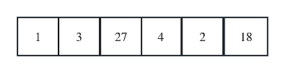 |
| :------------------------------: |
|              图2-2               |

```c
int InsList(PSeqList L, int i, DataType e)
{
  	// 此处不重要，考研不做鲁棒性检查
    // 判断插入位置是否合法
    if (i < 1 || i > L->Length-1)
    {
        printf("插入位置不合法!\n");
        return 0;
    }
    // 判断顺序表是否已满
    if (L->length >= MaxSize )
    {
        printf("顺序表已满, 不能插入！\n");
        return 0;
    }
    for (k = i; k <= L->length; k--)
    {
        L->data[k + 1] = L->data[k];
    }
    L->data[i - 1] = e;
    L->length++;   //数据表的长度加1
    return 1;
}
```
#### 顺序表的删除

1. 取出删除元素。
2. 从删除元素位置开始遍历到最后一个元素位置, 分别将它们都向前移一个位置。
3. 线性表表长-1。

例如图2-1删除元素4, 则存储空间变为如图2-所示

对于2的理解我们常可以认为，因为顺序表的特性是除第一个和最后一个外的元素都需要有前驱和后继，倘若不进行2操作将他们往前移一个位置，将会破坏顺序表的这一特性。

|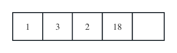|
|:-:|
|图2-3|

```c
//初始条件：顺序线性表L已经存在, 1<=i<=ListLength(L)
//操作结果：删除L的第i个元素, 并用e返回其值, L长度-1
Status ListDelete(SeqList *L,int i,ElemType e)
{
    int k;
    if(L->length==0)//判断表长是否为空
    {
        return error;
    }
    if(i<1 || i>L->length)//删除位置是否正确
    {
        return error;
    }
 
    *e=L->data[i-1];//返回删除的值
 
    if(i<L->length)
 
    {
        //将要插入位置后的数据元素向前移一位
 
        for(k=i;k<L->length;k++)
        {
            L->data[k-1]=L->data[k];
        }
    }
   
    L->length--;//线性表表长-1
 
    return ok;
}
```

### 链式存储结构

链表是一种物理存储单位上非连续非顺序的存储结构, 数据元素的逻辑顺序是通过链表中的指针链接次序实现的。

特点:
+ 结点除自身的信息域外, 还有表示关联信息（常常指的是下一个元素或上一个元素的位置）的指针域。因此, 链式存储结构的存储结构小、存储空间利用率低。
+ 在逻辑上相邻的结点在物理上不必相邻, 因此, 不可以随机存取, 只能顺序存取。
+ 插入和删除操作方便灵活, 不必移动结点只需修改结点中的指针域即可实现。

单链表:线性表的链接存储结构, 用一组任意(不联系, 零散分布) 的存储单元存放线性表的元素.      
单链表是由若干结点构成的, 结点包含数据域和指针域。（图中head是头指针，指向链表的第一个元素），通常，我们使用**头指针**来更加方便的对链表进行处理（省去判断是否为空的环节）。

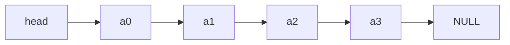


### 链表的操作

#### 定义

```c
// 定义节点
typedef struct node
{
    ElemType data;         //数据域，存储数据元素  
    struct node *next;     //指针域，存储指向后继结点的地址 
}Node,*Link;               //定义别名 Node, Link
```
#### 遍历操作(默认有头指针)

```c
void displayNode(Link head)
{
    Link p = head->next;          // p指向首元结点
    while(p != NULL)
    {
        printf("%d\t",p->data);  // 输出数据 
        p = p->next;             //b移向下一个结点
    }
}
```
#### 求链表长度

1. p初始化, 累加器count初始化
2. 重复执行下述操作, 直到p为空;
3. 工作指针p后移
4. count++
5. 循环结束，返回累加器count的值

上图中, 链表长度为4, a3指向的NULL并非真实存在

```c
int length(Link head)
{
    int count = 0;
    Link p = head->next;
    while(p != NULL)
    {
        p = p->next;
        count++;
    }
    return count;
}

```

#### 链表查找

操作接口:`bool queryNode(Link head, ElemType x)`

思路: 依次遍历链表的数据域与要查找的数据进行比较。直到找到为止。当然如果找不到也不能强求，返回`false`就好了

例如：

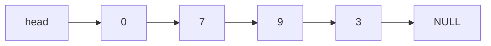

在这样的链表中，可以通过遍历找到9，但是如果想找到21是不可能的。

```c
int queryNode(Link head, ElemType x)
{
    Link p = head->next;
    while(p != NULL)
    {
        if(p->data == x) //查找成功
        {
            printf("%d",p->data);
            return 0;
        }
        p = p->next;   //没有找到,移动结点
    }
    return -1;     //查找失败返回-1
}
```
#### 链表插入

操作接口:bool insertNode(Link head, int index, ElemType item);

插入到第i个结点, 先找到第i-1个节点, 然后, 让插入结点的指针域指向i-1个结点的指向的指针域, 再修改第i-1结点的指针域, 使其指向插入结点. 注意, 修改指针指向的顺序不要颠倒, 不然会导致找不到第i个结点. 对于边界情况也同样适合.

1. 工作指针p初始化
2. 查找第i-1个结点, 并使该指针p指向该结点
3. 若查找不成功,则返回false
    否则:
    生成一个元素值为x的新结点node
    将新结点插入到p所指向的结点
    返回true

例如在a2后面插入a9

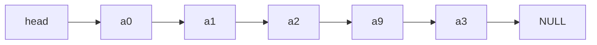

```c
int insertNode(Link head, int index, ElemType item)
{
	  int count=0;
    Link p = head;
    Link node;
    while(p != NULL && count < index-1)   //找到第index前一个结点
    {
        p = p->next;
        count++;
    }
    if(p == NULL)
    {
        return -1;                    //没有找到第i-1个结点
    }
    else
    {
        node = (Link)malloc(sizeof(Node));//申请一个结点
        node->data = item;                //结点的数据域
        node->next = p->next;             //①修改指针指向关系
        p->next = node;					  				//②
        return 0;
    }
}
```
  需要注意的是，代码注释中标注了①，②的顺序（即修改指针指向关系的步骤）切记不能搞反

#### 链表删除节点

操作接口: bool deleteNode(Link head,DateType x);思路:
引入两个指针p,q, p指向要删除的结点, q指向要删除结点的前一个结点

找到要删除的结点, 用free()函数释放该节点, 并修改删除结点两边指针关系情况,
要保证p,q指针一前一后: 在插在过程中, 若发现结点p指向的数据域不等于x, 则p,q指针同时向前移动即可

若在查找过程一直没有找到要删除的结点(链表遍历完毕),则退出循环,返回错误。

例如，上图中删除a2的结果为

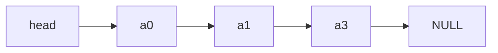

### 线性表的其他存储结构

单链表或静态链表每次从头开始访问, 如果想从任意位置开始访问, 那么使用单链表或静态链表就比较难做到。如果想直接找前驱, 那么使用单链表或静态链表也是很难实现的。所以我们使用如下的数据结构
#### 循环单链表

在单链表的基础上, 设计了一种「循环性」单向链表,称为「单向循环链表」。相比于单向链表, 单向循环链表的最大特点是「尾结点的指针域指向头结点『, 可以从任何位置出发访问单链表,如图:  

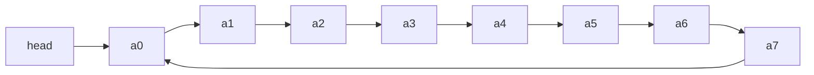


在考研中, 循环单链表的操作和单链表相同, 只需要记住两个特殊的知识点。

1. 当单链表为空时,head->next == head.
2. 当结点是表尾结点时, p->next == head.

#### 双向链表

双向链表是链表的一种, 是指构成链表的每个结点中设立两个指针域：一个指向其直接前驱的指针域, 另外一个指向后继的指针域。如图为不带头的双链表: 

**双链表的判空**

| 双链表     | 判空条件      |
| ---------- | ------------- |
| 带头结点   | L->next==NULL |
| 不带头结点 | L==NULL       |

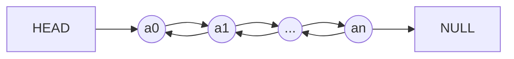


**插入 **：由于双链表可以很快地找到前驱结点，所以双链表的插入、删除操作的时间复杂度都为O(1)。双链表的插入操作可以概括为【先连后，后连前】，若在指针 *p 指向的结点之后插入结点 *q，首先，新结点q与原本 *p的指针域相连，即下一个结点，然后将结点q插入到结点p之后，再将其prior和next域相连，代码如下：

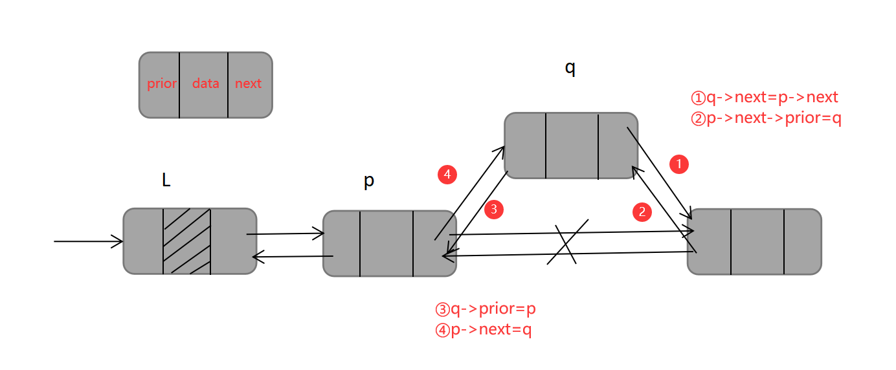

```c
q->next=p->next;
p->next->prior=q;
q->prior=p;
p->next=q;
```

**删除 **：双链表的删除操作，双链表的删除操作的代码如下：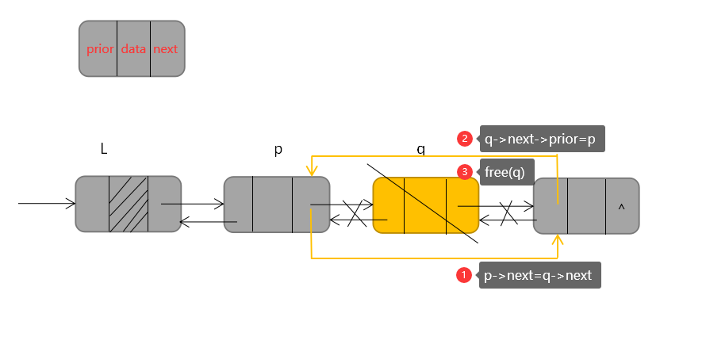


```cpp
p->next=q->next;
q->next->prior=p;
free(q);
```

#### 双向循环链表

双循环向链表结合了双链表和循环链表的特点，即有两个指针域，又能够循环，所以循环双链表往往是功能最强大的。

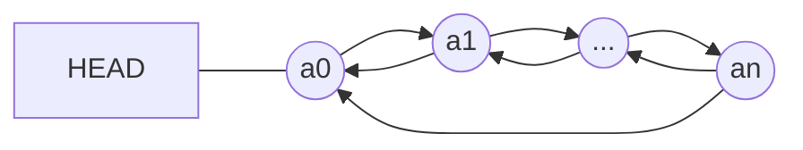

**循环双链表的插入操作**：若要在指针 *p 指向的结点后插入结点 *p，其代码如下：

```cpp
q->next=p->next;
p->next->prior=q;
q->prior=p;
p->next=q;
```

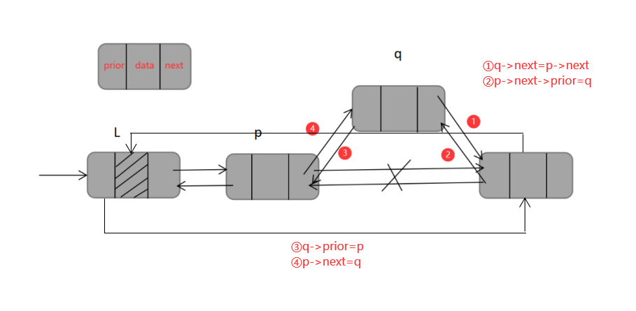

### 静态链表

静态链表, 也是线性存储结构的一种, 它兼顾了顺序表和链表的优点于一身, 可以看做是顺序表和链表的升级版。使用静态链表存储数据, 数据全部存储在数组中(和顺序表一样), 但存储位置是随机的, 数据之间"一对一"的逻辑关系通过一个整形变量(称为"游标", 和指针功能类似)维持(和链表类似)。

例如, 使用静态链表存储 {1,2,3} 的过程如下：

创建一个足够大的数组, 假设大小为6, 如图所示：


|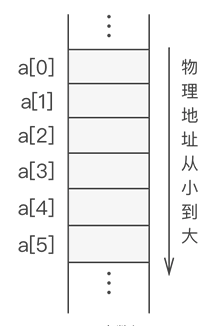|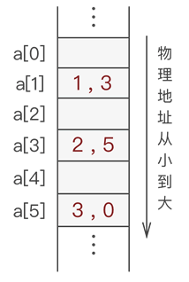|
|:-:|:-:|
|图2-11 空数组|图2-12 静态链表存储数据|

接着, 在将数据存放到数组中时, 给各个数据元素配备一个整形变量, 此变量用于指明各个元素的直接后继元素所在数组中的位置下标, 如图所示：  


通常, 静态链表会将第一个数据元素放到数组下标为 1 的位置(a[1])中。

上图中, 从 a[1] 存储的数据元素 1 开始, 通过存储的游标变量 3, 就可以在 a[3] 中找到元素 1 的直接后继元素 2；同样, 通过元素 a[3] 存储的游标变量 5, 可以在 a[5] 中找到元素 2 的直接后继元素 3, 这样的循环过程直到某元素的游标变量为 0 截止(因为 a[0] 默认不存储数据元素)。

类似这样, 通过 "数组+游标" 的方式存储具有线性关系数据的存储结构就是静态链表。
静态链表中的节点

通过上面的学习我们知道, 静态链表存储数据元素也需要自定义数据类型, 至少需要包含以下 2 部分信息：
+ 数据域：用于存储数据元素的值；
+ 游标：其实就是数组下标, 表示直接后继元素所在数组中的位置；

因此, 静态链表中节点的构成用 C 语言实现为：

```c
typedef struct {
    int data;//数据域
    int cur;//游标
}component;
```

**静态链表的特点**

+ 特点：用数组的方式实现的链表

+ 优点：增、删操作不需要大量移动元素

+ 缺点

  （1）不能随机存取，只能从头结点开始依次往后查找；

  （2）容量固定不可变

+ 适用场景

  （1）不支持指针的低级语言；

  （2）数据元素数量固定不变的场景（如操作系统的文件分配表 FAT）

#### 备用链表

上图的静态链表还不够完整, 静态链表中, 除了数据本身通过游标组成的链表外, 还需要有一条连接各个空闲位置的链表, 称为备用链表。

备用链表的作用是回收数组中未使用或之前使用过(目前未使用)的存储空间, 留待后期使用。也就是说, 静态链表使用数组申请的物理空间中, 存有两个链表, 一条连接数据, 另一条连接数组中未使用的空间。通常, 备用链表的表头位于数组下标为 0(a[0]) 的位置, 而数据链表的表头位于数组下标为 1(a[1])的位置。

静态链表中设置备用链表的好处是, 可以清楚地知道数组中是否有空闲位置, 以便数据链表添加新数据时使用。比如, 若静态链表中数组下标为 0 的位置上存有数据, 则证明数组已满。

例如, 使用静态链表存储 {1,2,3}, 假设使用长度为 6 的数组 a, 则存储状态可能如图 3 所示： 

|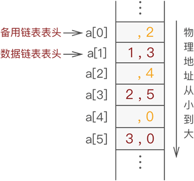 |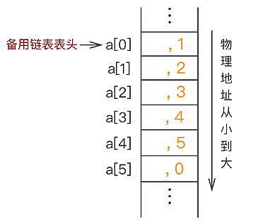 |
|:-:|:-:|
|图2-13 备用链表和数据链表|图2-14 未存储数据之前静态链表的状态|

#### 备用链表和数据链表

图 2-13 中, 备用链表上连接的依次是 a[0]、a[2] 和 a[4], 而数据链表上连接的依次是 a[1]、a[3] 和 a[5]。

#### 静态链表的实现

假设使用静态链表(数组长度为 6)存储 {1,2,3}, 则需经历以下几个阶段。

在数据链表未初始化之前, 数组中所有位置都处于空闲状态, 因此都应被链接在备用链表上, 如下图2-16所示：  

当向静态链表中添加数据时, 需提前从备用链表中摘除节点, 以供新数据使用。
备用链表摘除节点最简单的方法是摘除 a[0] 的直接后继节点；同样, 向备用链表中添加空闲节点也是添加作为 a[0] 新的直接后继节点。因为 a[0] 是备用链表的第一个节点, 我们知道它的位置, 操作它的直接后继节点相对容易, 无需遍历备用链表, 耗费的时间复杂度为 O(1)。

因此, 在基础上, 向静态链表中添加元素 1 的过程如图所示：
|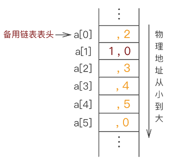| 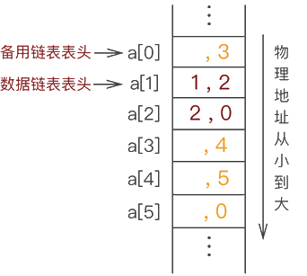 |
|:-:|:-:|
|图2-16. 静态链表中添加元素 1|图2-17 静态链表中继续添加元素 2|

静态链表中继续添加元素 2  ,在图2-17的基础上, 继续添加元素 3，由此, 静态链表就创建完成了。

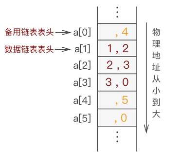   


#### 顺序表和链表比较

|          | 顺序表                                     | 单链表                                                       |
| -------- | ------------------------------------------ | ------------------------------------------------------------ |
| 优点     | 可随机存取，查找效率高，扩容、增、删不方便 | 不要求大片连续空间； 扩容、增、删方便                        |
| 缺点     | 要求大片连续空间，扩容、增、删不方便       | 不可随机存取，查找效率低； 存储密度低，要耗费一定空间存放指针 |
| 适用     | 表长可以估算，查询操作多                   | 表长难以估算，增、删操作多                                   |
| 作者建议 | 绝大部分情况使用顺序表                     | 除了考试，基本不会用到链表                                   |
|          |                                            |                                                              |

## 概念速背

线性表基本概念：线性表是零个或者多个数据元素的有限序列, 数据元素之间是有顺序的, 数据元素个数是有限的, 数据元素的类型必须相同

线性表的性质    
1. a0 为线性表的第一个元素, 只有一个后继。
2. an 为线性表的最后一个元素, 只有一个前驱。
3. 除 a0 和 an 外的其它元素 ai, 既有前驱, 又有后继。
4. 线性表能够逐项访问和顺序存取。

线性表Operation(操作)  
```c
// 初始化, 建立一个空的线性表L。
InitList(*L);
 
// 若线性表为空, 返回true, 否则返回false
ListEmpty(L);
 
// 将线性表清空
ClearList(*L);
 
// 将线性表L中的第i个位置的元素返回给e
GetElem(L, i, *e);
判断线性表是否合法
判断位置是否合法
直接通过数组下标的方式获取元素
 
// 在线性表L中的第i个位置插入新元素e
ListInsert(*L, i, e);
插入元素算法
判断线性表是否合法
判断插入位置是否合法
判断空间是否满足
把最后一个元素到插入位置的元素后移一个位置
将新元素插入
线性表长度加1
 
// 删除线性表L中的第i个位置元素, 并用e返回其值
ListDelete(*L, i, *e);
判断线性表是否合法
判断删除位置是否合法
将元素取出
将删除位置后的元素分别向前移动一个位置
线性表长度减1
 
// 返回线性表L的元素个数
ListLength(L);
 
// 销毁线性表
DestroyList(*L);
 
```
线性表的存储

通常线性表可以采用顺序存储和链式存储。

线性表采用顺序存储的优点和缺点
       优点：
				无需为线性表中的逻辑关系增加额外的空间。
				可以快速的获取表中合法位置的元素。

​		缺点：
​				插入和删除操作需要移动大量元素

为什么要引入线性表的链式存储(单向链表)?  
		前面我们写的线性表的顺序存储(动态数组)的案例, 最大的缺点是插入和删除时需要移动大量元素, 这显然需要耗费时间, 能不能想办法解决呢？链表。
	链表为了表示每个数据元素与其直接后继元素之间的逻辑关系, 每个元素除了存储本身的信息外, 还需要存储指示其直接后继的信息。

单链表的定义  
		线性表的链式存储结构中, 每个节点中只包含一个指针域, 这样的链表叫单链表。通过每个节点的指针域将线性表的数据元素按其逻辑次序链接在一起。

单链表的概念解释  
	表头结点
			链表中的第一个结点, 包含指向第一个数据元素的指针以及链表自身的一些信息。

​	数据结点
​			链表中代表数据元素的结点, 包含指向下一个数据元素的指针和数据元素的信息。

​	尾结点
​			链表中的最后一个数据结点, 其下一元素指针为空, 表示无后继。

​	单链表的相关操作有哪些?
​			和上面的顺序表操作思路一样, 参考上面的就好了。

​	单链表的优点和缺点是什么?
​		优点：
​				无需一次性指定链表的容量
​				插入和删除操作无需移动数据元素  
​		缺点：
​				除了要存储数据元素本身, 还有要存储数据元素之间的逻辑关系
​				获取指定数据的元素需要顺序访问之前的元素


问：双向链表的原理
	双向链表(double linkedlist)是在单链表的每个结点中, 再设置一个指向其前驱结点的指针域。所以在双向链表中的结点都有两个指针域, 一个指向直接后继, 另一个指向直接前驱。


## 习题

### 选择

1. 线性表是一个(   )。  

   A. 有限序列，可以为空                   B. 有限序列，不能为空

   C. 无限序列，可以为空                   D.  无限序列，不能为空

   

2. 线性表的顺序存储结构是一种(   )。  
    A. 随机存取的存储结构                   B.  顺序存取的存储结构
    C. 索引存取的存储结构                   D.Hash  存取的存储结构

    

3. (多选)在下列叙述中，  (    )是错误的。

    A. 线性表的逻辑顺序与物理顺序总是一致的

    B. 二叉树的顺序存储结构比链式存储结构节省存储空间

    C. 二叉树的度小于等于2

    D. 每种数据结构都具有两种基本运算(操作):插入、删除元素(结点)

    

4. 能在O(1)  时间内访问线性表的第i 个元素的结构是(  )。
    A. 顺序表          B. 单链表           C. 单向循环链表     D.  双向链表

    

5. 下面关于线性表的叙述中，错误的是哪一个?(   )

    A. 线性表采用顺序存储，必须占用一片连续的存储单元

    B. 线性表采用顺序存储，便于进行插入和删除操作

    C. 线性表采用链接存储，不必占用一片连续的存储单元

    D. 线性表采用链接存储，便于插入和删除操作

    

6. 线性表是具有n 个 (   )的有限序列 (n>0)。
    A. 表元素           B.  字符             C. 数据元素         D.  数据项    E.  信息项

    

7. 单链表中，增加一个头结点的目的是(   )。
    A. 使单链表至少有一个结点               B. 标识表结点中首结点的位置
    C. 方便运算的实现                       D.  说明单链表是线性表的链式存储

    

8. 若某线性表最常用的操作是存取任一指定序号的元素和在最后进行插入和删除运算，则利用 (    )存储方式最节省时间。
    A. 顺序表                               B. 双链表
    C.  带头结点的双循环链表                 D. 单循环链表

    

9. 某线性表中最常用的操作是在最后一个元素之后插入一个元素和删除第一个元素，则采用(    )存储方式最节省运算时间。
   A.  单链表                               B. 仅有头指针的单循环链表
   C. 双链表                             D. 仅有尾指针的单循环链表

   

10. 设一个链表最常用的操作是在末尾插入结点和删除尾结点，则选用(    )最节省时间。
    A. 单链表                                      B. 单循环链表
    C. 带尾指针的单循环链表                D. 带头结点的双循环链表

11. 若某线性表最常用的操作是在最后一个结点之后插入一个结点或删除最后一个结点，则采用存储结构算法的时间效率最高的是(   )。  
      A. 单链表                              B. 给出表尾指针的单循环链表
      C. 双向链表                            D.  给出表尾指针的双向循环链表
    
     
    
12. 对于一个线性表既要求能够进行较快速的插入和删除，又要求存储结构能反映数据之间的逻辑关系，则应该用(   )。
      A. 顺序存储方式   B.  链式存储方式     C. 散列存储方式     D.  以上均可以

     

13. 在线性表的下列存储结构中，读取元素花费时间最少的是(   )。
      A. 顺序表          B. 单链表          C. 双向链表         D. 循环链表

     

14. 若线性表最常用的操作是存取第I 个元素及其前驱和后继元素的值，为节省时间应采用的存 储方式(   )。
      A. 单链表          B. 双向链表         C.  单循环链表       D.  顺序表

     

15. 在链式存储结构中，数据之间的关系是通过(   )体现的。
      A. 数据在内存的相对位置                B.  指示数据元素的指针
      C. 数据的存储地址                      D. 指针

     

16. 静态链表中指针表示的是(   )。  
      A. 下一元素的地址                      B. 内存储器的地址
      C. 下一元素在数组中的位置             D.  左链或右链指向的元素的地址

     

17. 链表不具有的特点是(    )。
      A. 插入、删除不需要移动元素           B. 可随机访问任一元素
      C. 不必事先估计存储空间                D. 所需空间与线性长度成正比

     

18. 18.在 n 个结点的线性表的数组实现中，算法的时间复杂性是 O(1)的操作是(  )。
      A. 访问第i 个结点(1≤i≤n)   和求第i 个结点的直接前驱(2≤i≤n)
      B. 在第i 个结点后插入一个新结点(1≤i≤n)
      C. 删除第i个结点(1≤i≤n)
      D. 以上都不对

     

19. (1)静态链表既有顺序存储的优点，又有动态链表的优点。所以，它存取表中第i 个元素的时间与i无关。

    (2)静态链表中能容纳的元素个数的最大数在表定义时就确定了，以后不能增加。

    (3)静态链表与动态链表在元素的插入、删除上类似，不需做元素的移动。以上错误的是(    )。

    A.(1),(2)                   B.(1)                                C.(1),(2),(3)               D.(2)

     

20. 静态链表与动态链表相比，其缺点是(    )。
     A. 插入、删除时需移动较多数据          B. 有可能浪费较多存储空间
     C.  不能随机存取                        D. 以上都不是

     

21. 若长度为n 的线性表采用顺序存储结构，在其第i 个位置插入一个新元素的算法的时间复杂 度 为 (   )(1≤ i≤n+1)。
     A.O(0)                          B.O(1)                             C.O(n)                             D.O(n²)

     

22. 若长度为n 的线性表采用顺序存储结构，在其第i(1≤i≤n+1)    个位置之前插入一个新元素的 算法的移动结点的平均次数为(   )。 
     A.n                               B.n/2                               C.(n-1)/2                        D.(n+1)/2

     

23. 从一个长度为n 的顺序表中删除第i个元素(1≤i≤n)时，需向前移动(  )个元素。
     A.n-i                             B.n-i+1                            C.n-i-1                            D.i

     

24. 对顺序存储的线性表，设其长度为n,  在任何位置上插入或删除操作都是等概率的。删除一 个元素时平均要移动表中的(   )个元素。
     A.n/2                            B.(n+1)/2                        C.(n-1)/2                         D.n

     

25. 线性表 (al,a2,…,an)        以链接方式存储时，访问第i 个位置元素的时间复杂性为(    )。

     A.O(i)                           B.O(1)                             C.O(n)                             D.O(i-1)

     

26. 在一个单链表中，已知指针 p 指向其中的某个结点，若在该结点前插入一个由指针s 指向的结点，则需执行(   )。 
     A.s->next=p->next;p->next=s;                            B.p->next=s;s->next=p;
     C.r=p->next;p->next=s;s->next=p;                      D. 仅靠已知条件无法实现

     

27. 在一个单链表中，若p 所指的结点不是最后一个结点，在p 之后插入s 所指的结点，则执行 (   )。  
     A.s->next=p;p->next=s;                                       B.p->next=s;s->next=p;
     C.p=s;s->next=p->next;                                       D.s->next=p->next;p->next=s;

     

28. (多选)某线性表用带头结点的循环单链表存储，头指针为head,  当 head->next->next>next=head 成立时，线性表长度可能是(   )。 
     A.0                                B.1                                   C.2                              D.3
    
     

### 填空
1. 当线性表的元素总数基本稳定，且很少进行插入和删除操作，但要求以最快的速度存取线性表中的元素时，应采用____存储结构。

2. 线性表 L=（a1,a2,…,an）用数组表示，假定删除表中任一元素的概率相同，则删除一个元素平均需要移动元素的个数是________。

3. 设单链表的结点结构为(data,next)，next 为指针域，已知指针 px 指向单链表中 data 为 x 的结点，指针py 指向 data 为 y 的新结点 , 若将结点 y 插入结点 x 之后，则需要执行以下语句:_______; ______;

4. 在一个长度为 n 的顺序表中第 i 个元素（1<=i<=n）之前插入一个元素时，需向后移动________个元素。

5. 对于一个具有 n 个结点的单链表,在已知的结点*p 后插入一个新结点的时间复杂度为____________,在给定值为 x 的结点后插入一个新结点的时间复杂度为________｡

6. 在双向链表结构中,若要求在 p 指针所指的结点之前插入指针为 s 所指的结点,则需执行下列语句:s.next=p; s.prior= ________;p .prior=s;___________=s;

7. 顺序存储结构是通过________表示元素之间的关系的;链式存储结构是通过________表示元素之间的关系的｡

8. 对于双向链表,在两个结点之间插入一个新结点需修改的指针共 _________个,单链表为________个｡

9. 循环单链表的最大优点是:________｡

## 参考答案

### 选择

| 1.A  | 2.A  | 3.ABD | 4.A  | 5.B  | 6.C  | 7.C  | 8.A   | 9.D  | 10.D |
| ---- | ---- | ----- | ---- | ---- | ---- | ---- | ----- | ---- | ---- |
| 11.D | 12.B | 13.A  | 14.D | 15.D | 16.C | 17.B | 18.A  | 19.B | 20.B |
| 21.C | 22.B | 23.A  | 24.C | 25.C | 26.D | 27.D | 28.AC |      |      |


### 填空

1．顺序 

2．(n-1)/2 

3．py->next=px->next; px->next=py 

4．n-i+1 

5．O(1)，O(n) 

6．p.prior s.prior.next 

7．物理上相邻 指针 

8．4 2 

9．从任一结点出发都可访问到链表中每一个元素。


