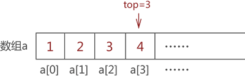

# 第三章 栈

## 栈的概念

栈(stack)是一种线性数据结构, 遵循LIFO(后进先出)原则。栈的两端被称为栈顶和栈底。每当向栈中添加一个元素时, 它能且只能被添加到栈顶, 并且该元素只能从栈顶删除。换句话说, 栈可以定义为一个容器, 可以从称为栈顶的一端进行插入和删除操作。如果比喻的话，那么栈是一个羽毛球桶。

## 栈的特点

+ 它被称为栈, 因为它的行为类似于现实世界中的栈、成堆的书,、羽毛球桶等。
+ 它是一种按照某种顺序插入和删除元素的数据结构, 该顺序可以是 LIFO 或 FILO。
+ 栈顶(Top)：允许进行插入、删除操作的一端, 用栈顶指针来指示栈项的位置, 伴随着元素的插人和删除,栈顶指针的位置会发生变化。
+ 栈底(Bottom)：是固定端, 在对栈进行插人和州除的过程中, 栈底的位置固定不变。
+ 栈顶元素：最后入栈的元素或者栈中最上面的元素。

## 栈的操作

既然栈是后进先出的线性表, 那么栈的操作也有自己的特色, 我们把插入操作称为进栈(压栈), 删除操作称为出栈(弹栈)。对于栈来说, 进栈和出栈都在一端进行, 最后入栈的元索将作为栈顶元素, 出栈时将删除栈顶元素。

### 堆栈操作实现

下面是在栈上实现的一些常用操作: 
+ push()：当我们在堆栈中插入一个元素时, 该操作称为压栈。 如果堆栈已满, 则发生溢出情况。
+ pop()：当我们从堆栈中删除一个元素时, 该操作称为弹出操作。 如果堆栈为空意味着堆栈中不存在任何元素, 则此状态称为下溢状态。
+ isEmpty()：判断栈是否为空。
+ isFull()：判断堆栈是否已满。
+ top()：它返回栈顶元素。
+ count()：它返回堆栈中可用元素的总数。

## 直观理解

我们通过一个例子和下图来理解上述概念, 现在有二个桶(桶的一端是固定的, 非常符合栈的特点)有几个球, 我们要把球放到桶里, 桶的口径和球的大小相当, 并有以下过程
|  |
| :-----------------------------------------------: |
|                图2-1 栈的直观理解                 |

这里大家不用计较b和t的具体位置, 只需要看懂出栈和进栈的逻辑即可。

1. 如图(a)所示, 此时栈是空的, b(bottom)和t(top)都在最底下
2. 如图(b)所示, 将灰色的球放入桶中(压栈), 此时 b 不动, t向上移动, 灰色的球成为栈顶元素
3. 如图(c)所示, 将蓝色的球放入桶中(压栈), 此时b不动,t向上移动, 蓝色的球成为栈顶元素
4. 如图(d)所示, 将黑色的球放入桶中(压栈), 此时b不动, t向上移动, 黑色的球成为栈顶元素
5. 如图(e)所示, 将黑色的球从桶中取出(弹栈), 此时b不动, t向下移动, 蓝色的球成为栈顶元素
6. 如图(f)所示,将蓝色的球从桶中取出(弹栈), 此时6不动,t向下移动, 灰色的球成为栈顶元素。从图中可以看到,栈底是固定不变的,栈顶在上下移动, 伴随着进栈和出栈, 栈顶元素也在发生变化

## 栈的进栈和出栈顺序

我们已经理解了栈项、栈底和栈项元素的基本概念, 但是元素进栈的顺序确定的情况下, 出栈的顺序也是不确定的。
给定一个栈, 且有4个元素 A,B,C,D依次进栈,出栈顺序是如何的呢？我们会  

+ push(1), push(2), push(3), push(4), pop(4), pop(3), pop(2), pop(1): 进栈顺序ABCD, 出栈顺序是 DCBA。  
+ push(1), pop(1), push(2), pop(2), push(3), pop(3), push (4) , pop(4) :  进栈顺序ABCD ABCD, 出栈顺序是 ABCD。  
+ push(1), push(2), pop(2) , pop(1), push (3) , pop(3), push (4) , pop (1) ;  进栈顺序ABCD ABCD, 出栈顺序是 BACD.  
+ push(1), push(2), push(3) , pop(3) , pop (2) , pop(1), push (4) , pop(4) ;  进栈顺序ABCD ABCD, 出栈顺序是 CBAD。  

从上面的进栈和出栈的顺序情形可以看出, 虽然进栈顺序是一定的,但是出栈顺序不确定, 因为在进栈后, 可以随时做出栈操作, 那么问题就来了, 给定n个元素, 出栈的顺序一共有多少种呢？
答案: 给定n个元素。出栈的顺序的够形满足卡特兰数。请记住。

```
卡特兰数  
 令h(0)=1,h(1)=1，catalan数满足递推式。
 h(n)= h(0)*h(n-1)+h(1)*h(n-2) + ... + h(n-1)h(0) (n>=2)。
```

## 栈的进栈和出栈规范

进栈操作涉及的步骤如下: 
1. 在向堆栈中插入元素之前, 我们检查堆栈是否已满。
2. 如果我们尝试将元素插入堆栈, 并且堆栈已满, 则会发生溢出情况。 
3. 当我们初始化一个栈时, 我们将top的值设置为-1来设置为栈为空
4. 当新元素入栈时, 首先top的值自增, 即top=top+1, 元素会被放到新的top位置。元素将被插入, 直到我们达到堆栈的最大大小。

出栈操作涉及的步骤如下:   

1. 在从栈中删除元素之前, 我们检查栈是否为空出。
2. 如果我们尝试从空堆栈中删除元素, 则会发生下溢情况。
3. 如果栈不为空, 我们先访问栈顶指向的元素一旦执行pop操作, top就减1, 即top=top-1。

## 栈的顺序结构

### 顺序栈的定义

栈是操作受限的线性表,采用顺序结构存储的栈称为顺序栈,用一维数组来存储。
动态顺序栈可以根据需要增大栈的存储空间,但实现稍为复杂;静态顺序栈实现简单, 但不能根据需要增大栈的存储空间。

### 动态顺序栈

采用动态一维数组来存储的栈称为动态顺序栈。所谓动态, 是指栈的大小可以根据需要来增加空间(不够了,还可以再追加空间)。
用bottom 表示栈底指针, 栈底是固定不变的;用top(称为栈顶指针)指示当前栈项位置。

### 静态顺序栈

采用静态-维数组来存储的栈称为静态顺序栈。所谓静态, 是指栈的大小是固定的。
栈底是固定不变的,用一个整型变量 top(称为栈顶指针)来指示当前栈项位置, 栈顶随着进栈和退栈操作而变化。

### 顺序栈结构模拟

如果你仔细观察顺序表（底层实现是数组）和栈结构就会发现，它们存储数据的方式高度相似，只不过栈对数据的存取过程有特殊的限制，而顺序表没有。

例如，我们先使用顺序表（a 数组）存储 `{1,2,3,4}`，存储状态如图3-7所示：

|  |  |
| :-----------------------------------------------: | :---------------------------------------------: |
|            图3-7 顺序表存储 {1,2,3,4}             |           图3-8 顺序表存储 {1,2,3,4}            |

同样，使用栈存储结构存储 `{1,2,3,4}`，其存储状态如图3-8所示

通过图3-7和图3-8的对比不难看出，使用顺序表模拟栈结构很简单，只需要将数据从 a 数组下标为 0 的位置依次存储即可。从数组下标为 0 的模拟栈存储数据是常用的方法，从其他数组下标处存储数据也完全可以，这里只是为了方便初学者理解。  

了解了顺序表模拟栈存储数据后，接下来看如何模拟栈中元素出栈的操作。由于栈对存储元素出栈的次序有"先进后出"的要求，如果想将图1-2中存储的元素 1 从栈中取出，需先将元素 4、元素 3 和元素 2 依次从栈中取出。

这里给出使用顺序表模拟栈存储结构常用的实现思路，即在顺序表中设定一个实时指向栈顶元素的变量（一般命名为 top），top 初始值为 -1，表示栈中没有存储任何数据元素，及栈是「空栈」。一旦有数据元素进栈，则 top 就做 +1 操作；反之，如果数据元素出栈, top 就做 -1 操作。

### 顺序栈元素入栈

比如，还是模拟栈存储 `{1,2,3,4}` 的过程。最初，栈是「空栈」，即数组是空的，top 值为初始值 -1，如下图所示：


首先向栈中添加元素 1，我们默认数组下标为 0 一端表示栈底，因此，元素 1 被存储在数组 a[1] 处，同时 top 值 +1，如下图所示：


|||
|:-:|:-:|


采用以上的方式，依次存储元素 2、3 和 4，最终，top 值变为 3。


### 出栈模拟

其实，top 变量的设置对模拟数据的 "入栈" 操作没有实际的帮助，它是为实现数据的 "出栈" 操作做准备的。

比如，将图中的元素 2 出栈，则需要先将元素 4 和元素 3 依次出栈。需要注意的是，当有数据出栈时，要将 top 做 -1 操作。因此，元素 4 和元素 3 出栈的过程分别如a) 和 b) 所示：


注意，数组中元素的消失仅是为了方便初学者学习，其实，这里只需要对 top 值做 -1 操作即可，因为 top 值本身就表示栈的栈顶位置，因此 top-1 就等同于栈顶元素出栈。并且后期向栈中添加元素时，新元素会存储在类似元素 4 这样的旧元素位置上，将旧元素覆盖。

元素 4 和元素 3 全部出栈后，元素 2 才能出栈。因此，使用顺序表模拟数据出栈操作的 C 语言实现代码为：

```c
//数据元素出栈
int pop(int * a,int top){    
	if (top==-1) {        
		printf("空栈");        
		return -1;    
	}    
	printf("弹栈元素：%d\n",a[top]);    
	top--;    
	return top;
}
```

代码中的 if 语句是为了防止用户做 "栈中已无数据却还要数据出栈" 的错误操作。代码中，关于对栈中元素出栈操作的实现，只需要 top 值 -1 即可。

### 栈的链式结构

#### 链栈的定义

栈的链式存储结构称为链式, 是运算受限的单链表。其插人和删除操作只能在表头的位置上进行, 栈顶指针 top 就是链表的头指针, 头指针指向头结点。下图所示为栈的链式存储表示形式。链栈的实现思路同顺序栈类似，顺序栈是将数顺序表（数组）的一端作为栈底，另一端为栈顶；链栈也如此，通常我们将链表的头部作为栈顶，尾部作为栈底，如下图所示：


结合栈的后进先出的特征, 链栈其实是“头出头插”的单链表, 即入栈时是头插法, 将新的结点插人到头结点的后面;出栈时是头出法, 将头结点后的结点删除。

#### 链式结构的结点定义

链栈的结点类型说明如下: 

```c
typedef struct Stack Node{
    ElemType data;
    struct Stack_Node next:
}Stack_Node:
```


将链表头部作为栈顶的一端，可以避免在实现数据 「入栈」 和 「出栈」 操作时做大量遍历链表的耗时操作。

链表的头部作为栈顶，意味着：

- 在实现数据「入栈」操作时，需要将数据从链表的头部插入
- 在实现数据「出栈」操作时，需要删除链表头部的首元节点

因此，链栈实际上就是一个只能采用头插法插入或删除数据的链表。

## 链栈元素入栈

例如，将元素 1、2、3、4 依次入栈，等价于将各元素采用头插法依次添加到链表中，每个数据元素的添加过程如图 2 所示：


## 栈的应用

### 符号平衡

堆栈用于平衡符号。例如, 我们有以下内容:

```c
{((([])))}，[])，[[(]])}
```
正如我们所知, 每个程序都有左大括号和右大括号中括号小括号哦, 当左括号出现时, 我们将左括号压入堆栈, 当右括号出现时, 我们将对应的左括号从堆栈中弹出。因此, 净值为零。如果任何符号留在堆栈中, 则表示程序中出现了某种语法错误。

### 字符串反转

堆栈也用于反转字符串。 例如, 我们想要反转一个「JavaTpoint」字符串, 那么我们可以借助堆栈来实现。首先, 我们将字符串的所有字符压入堆栈, 直到到达空字符。推完所有字符后, 我们开始一个一个地取出字符, 直到到达栈底。

### UNDO/REDO

也可用于执行UNDO/REDO操作。 例如, 我们有一个编辑器, 我们在其中编写'a', 然后是'b', 然后是'c'； 因此, 在编辑器中编写的文本是 abc。 所以, 一共有三种状态, a, ab, abc, 存储在一个栈中。 将有两个堆栈, 其中一个堆栈显示 UNDO 状态, 而

### 中缀表达式转化为后缀表达式

#### 有表达式
$A - B + C *（ D / E - F ）+ G  $ 
在运算过程中，首先创建一个 「运算符栈」。

　　1. 从左往右扫描，在扫描到操作数时，将此操作数加入后缀表达式。
　　2. 扫描到运算符时，将栈内的所有 优先级大于或等于该运算符的运算符 弹出，弹出的运算符加入后缀表达式，扫描到的运算符压入栈中。
　　3. 如果扫描到  「（ 」 ，将其压入栈中，并在运算时将其视为栈底（即运算 「（ 」之后的所有操作都在遇到 「（ 」 时截止）。直到遇到 「 ）」时，将栈内运算符依次弹出，直到弹出 「（ 」为止。
　　4. 在处理完所有字符之后，将栈内运算符依次弹出，并加入运算符。
运算过程：

该式最后转换结果为： $A B - C D E / F - * + G +$

|步数|过程|后缀表达式	|栈内情况（右侧为栈顶）|
|:-:|:-:|:-:|:-:|
|1|扫描到 “ A ”，加入后缀表达式|	A|	空|
|2|扫描到 “ - ”，压入栈内|	A|	-|
|3|扫描到 “ B ”，加入后缀表达式	|A B	|-|
|4|扫描到 “ + ”，弹出 “ - ” 加入后缀表达式，将 “ + ” 压入栈内| A B |- +|
|5| 扫描到 “ C ”，加入后缀表达式 |A B - C|+|
|6	|扫描到 “ * ”， 压入栈内|A B - C|+ *|
|7| 扫描到 “（ ”，压入栈内 |A B - C|+ * (|
|8|扫描到 “ D”，加入后缀表达式|	A B - C D |+ *（|
|9|扫描到 “ / ”，压入栈内| A B - C D |\+ *（  /|
|10| 扫描到 “ E ”，加入后缀表达式 |A B - C D E|\+ *（  /|
|11|扫描到 “ - ”，弹出 “ / ” 加入后缀表达式，将 “ - ” 压入栈内| A B - C D E / |\+ *（  -|
|12|扫描到 “ F ”，加入后缀表达式| A B - C D E / F |+  *（    -|
|13|扫描到 “ ）”，依次弹出栈内运算符，直到弹出 “（ ” 时。将弹出的运算符加入后缀表达式|A B - C D E / F|-	+  *|
|14|扫描到 “ + ”，弹出 “ * ”、“ + ” 加入后缀表达式，将 “ + ” 压入栈内 |A B - C D E / F-|* + +|
|15|扫描到 “ G ”，加入后缀表达式| A B - C D E / F - * + G |+|
|16|处理完成所有字符，依次弹出栈内运算符	|A B - C D E / F - * + G +	|空|


## 习题

### 选择

1. 为解决计算机主机与打印机之间速度不匹配问题，通常设置一个打印数据缓冲区，主机将要 输出的数据依次写入该缓冲区，而打印机则依次从该缓冲区中取出数据。该缓冲区的逻辑结 构应该是(  )。

   A.  栈        B. 队列       C.  树       D.  图

   

2. 设栈S 和队列Q 的初始状态均为空，元素a,b,c,d,e,f,g     依次进入栈 S。若每个元素出栈后 立即进入队列Q,  且7个元素出队的顺序是b,d,c,f,e,a,g,     则栈S 的容量至少是(   )。 

   A.1                 B.2                  C.3                  D.4

   

3. 若元素a,b,c,d,e,f    依次进栈，允许进栈、退栈操作交替进行，但不允许连续三次进行退栈操作，则不可能得到的出栈序列是(  )。

   A.d,c,e,b,f,a          B.c,b,d,a,e,f       C.b,c,a,e,f,d      D.a,f,e,d,c,b

   

4. 某队列允许在其两端进行入队操作，但仅允许在一端进行出队操作。若元素 a,b,c,d,e依次入此队列后再进行出队操作，则不可能得到的出队序列是

   A.b,a,c,d,e            B.d,b,a,c,e            C.d,b,c,a,e            D.e,c,b,a,d

   

5. 元素a,b,c,d,e   依次进入初始为空的栈中，若元素进栈后可停留、可出栈，直到所有元素都 出栈，则在所有可能的出栈序列中，以元素d 开头的序列个数是(  )。

   A.3                 B.4                  C.5                  D.6

   

6. 已知循环队列存储在一维数组 A[0.n-1] 中，且队列非空时 front 和 rear 分别指向队头元素和 队尾元素。若初始时队列为空，且要求第1个进入队列的元素存储在A[0]处，则初始时 front 和rear 的值分别是(  )。 

   A.0,0               B.0,n-1              C.n- 1,0               D.n-1,n-1

   

7. 已知操作符包括+,一，*', Y, (和)。将中缀表达式 a+b-a*((c+dYe-)+g 转换为等价的 后缀表达式 ab+acd+elf*-g+时，用栈来存放暂时还不能确定运算次序的操作符。若栈初始 时为空，则转换过程中同时保存在栈中的操作符的最大个数是(  )。

   A.5              B.7                 C.8                  D.11

   

8. 一个栈的入栈序列为1,2,3,…,n,  其出栈序列是Pi,P₂,P₃,…,Pn 。  若 p₂=3,  则p₃ 可能取值的个数是(  )。

   A.n-3                B.n-2                C.n-1                D. 无法确定

   

9. 假设栈初始为空，将中缀表达式a/b+(c*d-e*f)g  转换为等价的后缀表达式的过程中，当扫描到f 时，栈中的元素依次是(  )。

   A.+(*-             B.+(-*               C./+(*-*               D./+-*

   

10. 循环队列存放在一维数组A[0.M-1] 中 ，end1 指向队头元素， end2 指向队尾元素的后一个位置。假设队列两端均可进行入队和出队操作，队列中最多能容纳M-1  个元素，初始时为空。下列判断队空和队满的条件中，正确的是(  )。

    A. 队空： end1==end2;               队满：end1=(end2+1)mod M

    B. 队空： end1=end2;                队满：end2=(end1+1)mod(M-1)

    C. 队空： end2=(end1+1)mod   M;    队满：end1=(end2+1)mod M

    D. 队空： end1=(end2+1)mod   M;     队满：end2=(end1+1)mod(M-1)

    

11. 已知程序如下：

```c
int s(int i){ 
	return(n<=0)?0:s(n-1)+n;         
}
void main()
{  cout<<s(1);    }
```
   程序运行时使用栈来保存调用过程的信息，自栈底到栈顶保存的信息依次对应的是(   )。

A.main)->S(1)->S(0)                      B.S(0)->S(1)->main()

C.main)->S(0)->S(1)                       D.S(1)->S(0)->main()

12. 栈的特点是(  ①  ),队列的特点是(  ②  ),栈和队列都是(  ③  )。若进栈序列为 1,2,3,4,则(  ④  )不可能是一个出栈序列(不一定全部进栈后再出栈);若进队列的 序列为1,2,3,4,则( ⑤ )是一个出队列序列。

    ①,②:A.   先进先出  B.  后进先出     C. 进优于出     D. 出优于进

    ③:A . 顺序存储的线性结构        B. 链式存储的线性结构

    C. 限制存取点的线性结构       D.  限制存取点的非线性结构

    ④,⑤:A.3,2,1,4      B.3,2,4,1              C.4,2,3,1

    D.4,3,2,1     E.1,2,3,4             F.1,3,2,4

    

13. 一个栈的输入序列为1,2,3,…,n,  若输出序列的第一个元素是n,  输出第i(1≤i≤n)   个元素是(  )。

    A. 不确定     B.n-i                 C.i                  D.n-i+1

    

14. 设栈的输入序列为1,2,3,…,n;  输出序列为P₁,P₂,…,Pn;    若 P₁=n,  则 当n≥i≥1 时， p₁ 为 (   );若存在k>1 使p=n,   则 当 >k 时，p₁ 为 (  )。

    A.p=n-i+1          B.p; 不确定      C.p=n-(i-k)

    

15. 中缀表达式 (A+B)*(C-D)/(E-F*G)   的后缀表达式是(   )。
    A. $A+B*C-D/E-F*G  $                                           B.$AB+CD-*EFG*-/$
    C. $AB+C*D-E/F-G*$                                          D.$ABCDEFG+*/*$

    

16. 某表达式的前缀形式为：$+-*^ABCD/E/F+GH$它的中缀形式为()。

    A.$AB*C-D+E/F/G+H  $                					B. $A^B *(C-D)+(E/F)/G+H          $            

    C$AB*C-D+E/(F/(G+H))  $                                    		D.$AB*(C-D)+E/(F/(G+H))$


17. 表达式$a*(b+c)-d$的后缀表达式是(  )。

    $A.abcd*+-                    B.abc+*d-                      C.abc*+d-                      D.-+*abcd$

    

18. 与中缀表达式$a*b+c/d-e$等价的前缀表达式是(  )。
    $A.-+*ab/cde                 B.*+/-abcde                   C.abcde*+/-                    D.+*ab-/cde$

    

19. 利用栈求表达式的值时，设立操作数栈 OPND,  设 OPND  只有两个存储单元，在下列表达式中，不发生上溢的是(  )。
    $ A.A-B*(C-D)$               $B.(A-B)*C-D$                  $C.(A-B*C)-D $            $ D.(A-B)*(C-D)$

    

20. 有六个元素6,5,4,3,2,1 的顺序进栈，问下列哪一个不是合法的出栈序列?(  )

    A.543612           B.453126             C.346521             D.234156

    

21. 设栈的输入序列是1,2,3,4,则(  )不可能是其出栈序列。

    A.1,2,4,3           B.2,1,3,4             C.1,4,3,2             D.4,3,1,2		E.3,2,1,4


22. 四个元素1,2,3,4依次进栈，出栈次序不可能出现(  )种情况。

    A.1,2,3,4           B.4,1,3,2             C.1,4,3,2              D.4,3,2,1

    

23. 如进栈序列1,2,3,4,5。可能得到的出栈序列为(  )。

    A.1,2,5,3,4          B.3,1,2,5.4            C.3,2,5,4,1            D.1,4,2,3,5	E.  都不可能

    

24. 一个栈的入栈序列为A,B,C,D,E,  则栈的不可能出栈序列是(   )。

    A.ABCDE          BEDCBA           C;DECBA            D.DCEAB

    

25. 设 n 个元素进栈序列是1,2,3,…,n,  其输出序列是pl,p2,p3,…,pn,     若 p1=3,  则 p2的值为 (   )。

    A. 一定是2     B. 一定是1      C. 不可能是1    D. 以上都不对

    

26. 某堆栈的输入序列为a,b,c,d,    下面的四个序列中，不可能是它的输出序列的是(  )。

    A.a,c,b,d            B.b,c,d,a              C.c,d,b,a              D.d,c,a,b

    

27. (多选)若已知一个栈的入栈序列是1,2,3,4,其出栈序列为p1,P2,P3,P4,    则 p2,p4  可能为(   )。

    A.2 、4             B.2 、1              C.4 、3               D.3 、4

    

28. 输入序列为ABC, 可以变为CBA 时，经过的栈操作为(  )。

    A.push,pop,push,pop,push,pop               B.push,push,push,pop,pop,pop

    C.push,push,pop,pop,push,pop              D.push,pop,push,push,pop,pop


29. 依次读入数据元素序列{a,b,c,d,e,f,g}    进栈，每进一个元素，机器可要求下一个元素进栈 或弹栈，如此进行，则栈空时弹出的元素构成的序列是以下哪些序列? (   )。

    A.{d,e,c,f,b,g,a}                           B.{f,e,g,d,a,c,b}

    C.{e,f,d,g,b,c,a}                           D.{c,d,b,e,f;a,g}

    

30. 4个圆盘的 Hanoi 塔，总的移动次数为(  )。

    A.7                 B.-8                  C.15         D.16


32. 和顺序栈相比，链栈有一个比较明显的优势是(  )。
     A. 通常不会出现栈满的情况       B. 通常不会出现栈空的情况

    C. 插入操作更容易实现         D.  删除操作更容易实现

    

33. 若一个栈以向量 V[1..n]存储，初始栈顶指针top为 n+1, 则下面x 进栈的正确操作是(   )。

    A.top=top+1;    Vtop]=x                   B.V[top]=x;   top=top+1

    C.top=top-1;    V[top]=x                   D.V[top]=x;   top=top-1


34. 若栈采用顺序存储方式存储，现两栈共享空间 V[1.m],top[1  代表第i 个栈 (i=1,2)   栈顶，栈1的底在 V[1], 栈2的底在 V[m], 则栈满的条件是(  )。

    A.|top[2]-top[1]|=0  B.top[1]+1=top[2]  C.top[1]+top[2]=m     D.top[1]=top[2\]
    
    

35. 栈在 (  )中应用。

    A. 递归调用     B.  子程序调用    C. 表达式求值    D.A,B,C

    

36. 向一个栈顶指针为 h 的带头结点的链栈中插入指针 s 所指的结点时，应执行(  )。

    A.h->next=s;                             B.s->next=h;

    C.s->next=h;h->next=s;                     D.s->next=h->next;h->next=s; 

    

37. 一个递归算法必须包括(  )。
    A. 递归部分              B.  终止条件和递归部分

    C. 迭代部分              D. 终止条件和迭代部分

## 参考答案

| 1.B  | 2.C    | 3.D   | 4.C   | 5.B   | 6.B   | 7.A  | 8.C   | 9.B   | 10.A |
| ---- | ------ | ----- | ----- | ----- | ----- | ---- | ----- | ----- | ---- |
| 11.A | 12.1B  | 12.2A | 12.3C | 12.4C | 12.5F | 13.D | 14.1A | 14.2B | 15.B |
| 16.C | 17.B   | 18.A  | 19.B  | 20.C  | 21.D  | 22.B | 23.C  | 24.D  | 25.C |
| 26.D | 27.ABD | 28.B  | 29.AD | 30.C  | 31.C  | 32.A | 33.C  | 34.B  | 35.D |
| 36.D |        |       |       |       |       |      |       |       |      |
|      |        |       |       |       |       |      |       |       |      |
|      |        |       |       |       |       |      |       |       |      |
