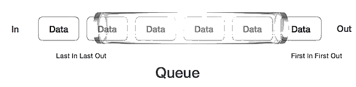
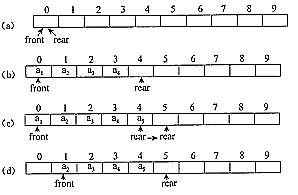
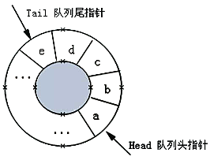
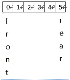
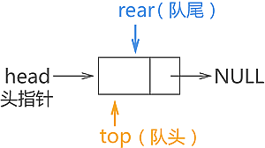
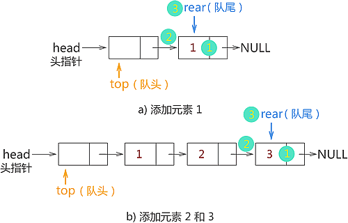
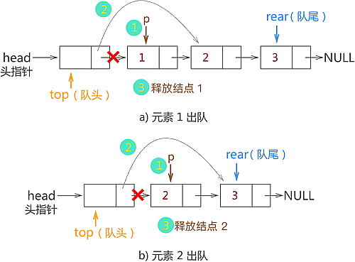

# 队列

## 队列的定义

队列是一种抽象的数据结构, 有点类似于栈。与栈不同, 队列的两端都是开放的。 一端始终用于插入数据(入队), 另一端用于移除数据(出队)。 队列遵循先进先出的方法, 即先存储的数据项将首先被访问。

事实上, 生活中有很多这样的例子, 如大家排队购物、排队等公交、排队等电梯、排队买饭等, 都是先排
队的人先离开队列。

## 队列示例

队列的真实示例可以是单车道单行道, 车辆先进入, 先离开。


队列表示: 正如我们现在所了解的那样, 在队列中, 我们出于不同的原因访问两端。 下面给出的下图试图将队列表示解释为数据结构



与堆栈一样, 队列也可以使用数组、链表、指针和结构来实现。

## 队列的基本概念

队列(Queue)：一种先进先出(First In First Out , FIFO)的线性表, 即只允许在表的一端进行插人,而在另一端进行删除。所以, 队列也是一种运算受限的线性表.

## 队列的基本操作和性质

队列的性质：先进先出。为了实现先进先出, 我们要设置两个指针：第一个是队首,即允许进行删除的一端, 一般用firont 表示;第二个是队尾, 即允许进行插人的一端, 一般用 rear 表示。

### 队列有两种最基木的操作

+ 出队: 也就是删除队首元素。

+ 入队: 也就是在队尾插人新元素。

在空队列中依次加入元素a1, a2, ……, a之n后, a1是队首元素, an 是队尾元素。出队就a1-an的顺序出队, 人队需要在an后依次插人元素。

## 队列的功能

+ enqueue() − 添加(存储)一个项目到队列中。
+ dequeue() − 从队列中删除(访问)一个项目。
+ peek() - 获取队列前面的元素而不删除它。
+ isfull() - 检查队列是否已满。
+ isempty() - 检查队列是否为空。

## 顺序队列

以列可以用顺序结构和链式结构进行存储, 我们首先看顺序结构, 利用一组连线的存储单元(一维数组)依次存放从队首到队尾的各个元素,称为顺序队列。队列和顺序栈类似, 也有动态和静态之分．我们接下来要学习的是静态顺序队列。大家知道, 队列有队首和队尾,所以顺序队列中要定义队首和队尾。

### 顺序队列的初始化

为了方便说明, 在下图中,数组的大小设置为10,也就是下标是0~9,元素是$ a_1、a_2 、a_3 、a_4 、a_5、a_6、a_7、a_8 、a_9 $ 

  

+ 顺序队列初始化时, 队列是空的, 数组的下标是0-9此时 front 和rear均指向下标为0的位置, 如图(a)所示。

  当队列不空时, front 指向队首元素, rear 指向队尾元素的下一个空位置, 如图 b)所示。队列中有4个元素 $a1、a2、a3、a4$, 此时 front 指向队首元素 a1,rear 指向队尾元素$a_4$的下一个空位置。

+ 入队操作。先放入元素, 再rear++。(C)所示, 先将$a_5$放入到下标为4的位置, 也就是Queue_array[rear], rear从4->5。
+ 出队操作。先出元素, 再front++。如图 c所示, 此时front 是0, 先取出下标为 front 的元素, 也就是 Queve_ array[front], 再front++, front 变为1。此时, 细心的小伙伴会发现, 在图d中, 元素出队了, 后面的元素没有往前补缺, 而我们平时排队中, 如果前面的人离开了, 后面的人就会自动往前移动。这是怎么回事呢？这里的存储结构是顺序结构, 如果依次将后续的元素向前移动, 那么这个操作的复杂度就太高了, 得不偿失。于是, 元素出队了,front 指针向后移动, 而不是将后续的元素向前移动, 毕竟front 向后移动只需要加1就可以了。
+ 队列空的条件。我们在前面挖了一个坑(front 指向队首元素,rear指向队尾元素的下一个空位置), 在讲解队列为空之前, 我们先看几个队列空的例子。如图(a)、(b)、(C)所示, 可以看到, 当front == rear时, 表示队列为空。如因(d)所示, front 指向队首元素日, rear 指向队尾元素 as。如果依次把 a1、a2、a3、a4出队列, 那么front 和rear将同时指向4, 如图(e)所示, 此时 front ==rear, 而队列中还有元素, 这就和front一—rear 表示队列为空无法区分了。因此设置 front 指向队首元素,rear 指向队尾元素的下一个空位置, 当 front == rear时,表示队列为空。

### 顺序队列的编码

#### 定义队列的基本结构

```c
typedef struct {
	ElemType data[Maxsize]; //用静态数组存放队列元素
	int front, rear; //队头指针与队尾指针
}SqQueue;
```
#### 初始化队列

```c
void InitQueue(SqQueue& Q)
{//初试时，队头、队尾指针指向0
	Q.front = Q.rear = 0;
}
```

#### 判断队列空

如果队列首指针等于尾指针，那么该队列没有元素

```c
Status QueueEmpty(SqQueue Q)
{
	if (Q.rear == Q.front)
		return true;
	else
		return false;
}
```
#### 入队

```c
Status EnQueue(SqQueue& Q, ElemType x)
{
	if (Q.rear == Maxsize) //会存在假上溢
		return false;//队满则报错
	Q.data[Q.rear] = x; //将x插入队尾
	Q.rear++;
	return true;
}
```
#### 出队

```c
Status DeQueue(SqQueue& Q, ElemType& x)
{
	if (Q.front == Q.rear)
		return false; //队空则报错
	x = Q.data[Q.front]; //将队头元素赋给x
	Q.front++;
	return true;
}
```

## 循环队列

为充分利用向量空间, 克服"假溢出"现象的方法是：将向量空间想象为一个首尾相接的圆环, 并称这种向量为循环向量。存储在其中的队列称为循环队列(Circular Queue)。循环队列是把顺序队列首尾相连, 把存储队列元素的表从逻辑上看成一个环, 成为循环队列。

如图:  




## 循环队列的特点和操作

循环队列就是将队列存储空间的最后一个位置绕到第一个位置, 形成逻辑上的环状空间, 供队列循环使用。在循环队列结构中, 当存储空间的最后一个位置已被使用而再要进入队运算时, 只需要存储空间的第一个位置空闲, 便可将元素加入到第一个位置, 即将存储空间的第一个位置作为队尾。循环队列可以更简单防止伪溢出的发生, 但队列大小是固定的。 

在循环队列中, 当队列为空时, 有front=rear, 而当所有队列空间全占满时, 也有front=rear。为了区别这两种情况, 规定循环队列最多只能有MaxSize-1个队列元素, 当循环队列中只剩下一个空存储单元时, 队列就已经满了。因此, 队列判空的条件是front=rear, 而队列判满的条件是front=(rear+1)%MaxSize。

## 循环队列的要点
循环队列即是逻辑结构也是存储结构, 只能由数组实现, 不能用链表实现。

### 循环队列条件处理

循环队列中, 由于入队时尾指针向前追赶头指针, 出队时头指针向前追赶尾指针, 造成队空和队满时头尾指针均相等。因此, 无法通过条件front==rear来判别队列是「空」还是「满」。
解决这个问题的方法至少有两种：  
1. 另设一布尔变量以区别队列的空和满；
3. 另一种方式就是数据结构常用的： 队满时：(rear+1)%n==front, n为队列长度(所用数组大小), 由于rear, front均为所用空间的指针, 循环只是逻辑上的循环, 所以需要求余运算。如图1所示情况, 队已满, 但是rear(5)+1=6！=front(0), 对空间长度求余, 作用就在此6%6=0=front(0)。



类型定义采用环状模型来实现队列,各数据成员的意义如下：
+ front指定队首位置, 删除一个元素就将front顺时针移动一位
+ rear指向元素要插入的位置, 插入一个元素就将rear顺时针移动一位
+ count存放队列中元素的个数, 当count等于MaxQSize时, 不可再向队列中插入元素


## 循环队列的编码
### 定义数据类型

```c
// 队列的顺序存储结构(循环队列)
#define MAX_QSIZE 5 // 最大队列长度+1
typedef struct {
    int *base; // 初始化的动态分配存储空间
    int front; // 头指针, 若队列不空, 指向队列头元素
    int rear; // 尾指针, 若队列不空, 指向队列尾元素的下一个位置
} SqQueue;
```
### 初始化
```c
// 构造一个空队列Q
SqQueue* Q_Init() {
    SqQueue *Q = (SqQueue*)malloc(sizeof(SqQueue));
    // 存储分配失败
    if (!Q){
        exit(OVERFLOW);
    }
    Q->base = (int *)malloc(MAX_QSIZE * sizeof(int));
    // 存储分配失败
    if (!Q->base){
        exit(OVERFLOW);
    }
    Q->front = Q->rear = 0;
    return Q;
}
```
### 清空队列
```c
// 将Q清为空队列
void Q_Clear(SqQueue *Q) {
    Q->front = Q->rear = 0;
}
```
### 获取队列元素个数
```c
// 返回Q的元素个数, 即队列的长度
int Q_Length(SqQueue Q) {
    return (Q.rear - Q.front + MAX_QSIZE) % MAX_QSIZE;
}
```
### 获取队列头元素
```c
// 若队列不空, 则用e返回Q的队头元素, 并返回OK；否则返回ERROR
int Q_GetHead(SqQueue Q, int &e) {
    if (Q.front == Q.rear) // 队列空
        return -1;
    e = Q.base[Q.front];
    return 1;
}
```
### 打印队列中的内容
```c
// 打印队列中的内容
void Q_Print(SqQueue Q) {
    int p = Q.front;
    while (Q.rear != p) {
        cout << Q.base[p] << endl;
        p = (p + 1) % MAX_QSIZE;
    }
}
```
### 插入新的元素在队尾
```c
// 插入元素e为Q的新的队尾元素
int Q_Put(SqQueue *Q, int e) {
    if ((Q->rear + 1) % MAX_QSIZE == Q->front) // 队列满
        return -1;
    Q->base[Q->rear] = e;
    Q->rear = (Q->rear + 1) % MAX_QSIZE;
    return 1;
}
 
```
### 弹出元素
```c
// 若队列不空, 则删除Q的队头元素, 用e返回其值, 并返回1；否则返回-1
int Q_Poll(SqQueue *Q, int &e) {
    if (Q->front == Q->rear) // 队列空
        return -1;
    e = Q->base[Q->front];
    Q->front = (Q->front + 1) % MAX_QSIZE;
    return 1;
}
```


## 双端队列
是一种具有队列和栈的性质的数据结构。双端队列中的元素可以从两端弹出, 其限定插入和删除操作在表的两端进行。
双端队列是限定插入和删除操作在表的两端进行的线性表。这两端分别称做端点1和端点2。也可像栈一样, 可以用一个铁道转轨网络来比喻双端队列。在实际使用中, 还可以有输出受限的双端队列(即一个端点允许插入和删除, 另一个端点只允许插入的双端队列)和输入受限的双端队列(即一个端点允许插入和删除, 另一个端点只允许删除的双端队列)。而如果限定双端队列从某个端点插入的元素只能从该端点删除, 则该双端队列就蜕变为两个栈底相邻的栈了。

### 双端队列优缺点

尽管双端队列看起来似乎比栈和队列更灵活, 但实际上在应用程序中远不及栈和队列有用。因为我们在用某些数据结构的时候，首先想起来的永远是比较经典，有个性的数据结构，而不是万金油。所以啊，太过于圆滑反而会失去自我。                      


## 链式队列

简称「链队列」，即使用链表实现的队列存储结构。

链式队列的实现思想同顺序队列类似，只需创建两个指针（命名为 top 和 rear）分别指向链表中队列的队头元素和队尾元素，如下图所示:

|  |
| :--------------------------------------------: |
|           图 4-11 链式队列的初始状态           |

图 4-11所示为链式队列的初始状态，此时队列中没有存储任何数据元素，因此 top 和 rear 指针都同时指向头节点。

在创建链式队列时，强烈建议初学者创建一个带有头节点的链表，这样实现链式队列会更简单。

由此，我们可以编写出创建链式队列的 C 语言实现代码为:

```c
//链表中的节点结构
typedef struct QNode{    
	int data;    
  struct QNode * next;}QNode;
//创建链式队列的函数
QNode * initQueue(){    
//创建一个头节点    
QNode * queue=(QNode*)malloc(sizeof(QNode));    
  //对头节点进行初始化    
  queue->next=NULL;    
  return queue;
}
```

## 链式队列数据入队

链队队列中，当有新的数据元素入队，只需进行以下 3 步操作：

1. 将该数据元素用节点包裹，例如新节点名称为 elem；
2. 与 rear 指针指向的节点建立逻辑关系，即执行 rear->next=elem；
3. 最后移动 rear 指针指向该新节点，即 rear=elem；

由此，新节点就入队成功了。

例如，在图 1 的基础上，我们依次将 `{1,2,3}` 依次入队，各个数据元素入队的过程如图 2 所示:



 {1,2,3} 入链式队列

数据元素入链式队列的 C 语言实现代码为：

```c
QNode* enQueue(QNode * rear,int data){    
//1、用节点包裹入队元素    
	QNode * enElem=(QNode*)malloc(sizeof(QNode));    
  enElem->data=data;    enElem->next=NULL;    
  //2、新节点与rear节点建立逻辑关系    
  rear->next=enElem;    
  //3、rear指向新节点    
  rear=enElem;    
  //返回新的rear，为后续新元素入队做准备    
  return rear;
}
```

## 链式队列数据出队

当链式队列中，有数据元素需要出队时，按照 「先进先出」的原则，只需将存储该数据的节点以及它之前入队的元素节点按照原则依次出队即可。这里，我们先学习如何将队头元素出队。

链式队列中队头元素出队，需要做以下 3 步操作：

1. 通过 top 指针直接找到队头节点，创建一个新指针 p 指向此即将出队的节点；
2. 将 p 节点（即要出队的队头节点）从链表中摘除；
3. 释放节点 p，回收其所占的内存空间；

例如，在图b) 的基础上，我们将元素 1 和 2 出队，则操作过程如图 4-3 所示：

|  |
| :-------------------------------------------------: |
|            图 4-3 链式队列中数据元素出队            |

链式队列中队头元素出队的 C 语言实现代码为：

```c
void DeQueue(QNode * top,QNode * rear){    
	if (top->next==NULL) {        
		printf("队列为空");        
		return ;    
	}    
// 1、    
	QNode * p=top->next;    
	printf("%d",p->data);    
	top->next=p->next;    
	if (rear==p) {       
		rear=top;    
	}    
	free(p);
}
```

注意，将队头元素做出队操作时，需提前判断队列中是否还有元素，如果没有，要提示用户无法做出队操作，保证程序的健壮性。

## 总结

通过学习链式队列最基本的数据入队和出队操作，我们可以就实际问题，对以上代码做适当的修改。

前面在学习顺序队列时，由于顺序表的局限性，我们在顺序队列中实现数据入队和出队的基础上，又对实现代码做了改进，令其能够充分利用数组中的空间。链式队列就不需要考虑空间利用的问题，因为链式队列本身就是实时申请空间。因此，这可以算作是链式队列相比顺序队列的一个优势。

这里给出链式队列入队和出队的完整 C 语言代码为：

```c
#include <stdio.h>
#include <stdlib.h>
typedef struct QNode{    
	int data;    
	struct QNode * next;}QNode;QNode * initQueue()
	{     
		QNode * queue=(QNode*)malloc(sizeof(QNode));    
		queue->next=NULL;    
		return queue;
	}
	QNode* enQueue(QNode * rear,int data)
	{    
			QNode * enElem=(QNode*)malloc(sizeof(QNode));    
			enElem->data=data;    
			enElem->next=NULL;    //使用尾插法向链队列中添加数据元素    
			rear->next=enElem;    
    rear=enElem;    
    return rear;}QNode* 
 DeQueue(QNode * top,QNode * rear){    
    if (top->next==NULL) {        
      printf("\n队列为空");        
      return rear;    
    }    
    QNode * p=top->next;    
    printf("%d ",p->data);    
    top->next=p->next;    
 if (rear==p) {        
   rear=top;    }    free(p);    
    return rear;
  }
int main() {    
    QNode * queue,*top,*rear;    
  queue=top=rear=initQueue(); //创建头结点     
                            //向链队列中添加结点，使用尾插法添加的同时，队尾指针需要指向链表的最后一个元素    
  rear=enQueue(rear, 1);    
  rear=enQueue(rear, 2);    
  rear=enQueue(rear, 3);    
  rear=enQueue(rear, 4);    //入队完成，所有数据元素开始出队列    
  rear=DeQueue(top, rear);    
  rear=DeQueue(top, rear);    
  rear=DeQueue(top, rear);    
  rear=DeQueue(top, rear);    
  rear=DeQueue(top, rear);    
  return 0;
}
```


## 队列的典型应用
1. 排队、打印服务
2. 树的层次遍历
3. 图的广度优先遍历
4. 优先队列


### 优先队列

普通的队列是一种先进先出的数据结构，元素在队列尾追加，而从队列头删除。在优先队列中，元素被赋予优先级。当访问元素时，具有最高优先级的元素最先删除。优先队列具有最高级先出 （first in, largest out）的行为特征。通常采用堆数据结构来实现。例如普通二叉堆，配对堆等。

