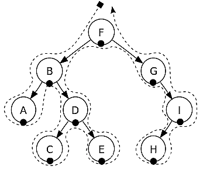
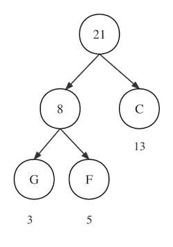
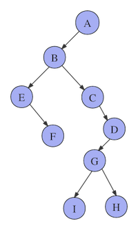

# 树和二叉树

## 树的概念

树是一种非常通用且功能强大的数据结构，类似于真实的树。是由n(n≥0)个有限节点组成一个具有层次关系的集合。把它叫做「树」是因为它看起来像一棵倒挂的树，也就是说它是根朝上，而叶朝下的。

## 树的规范

通常，我们可以指定一棵树由节点（也称为顶点）和具有树状结构的边（也称为线，或者边，为了强调有向性，称为弧）所组成。
用图形表示的树通常是最容易的，一个简单的示例如下图5-1所示： 


## 树的特点

+ 每个节点有零个或多个子节点
+ 没有父节点的节点称为根节点
+ 每一个非根节点有且只有一个父节点
+ 除了根节点外，每个子节点可以分为多个不相交的子树
+ 我们通常将把节点保存的数据称为它的值
+ 没有子节点的节点被称作为叶节点
+ 路径是从一个节点到另一个节点的一系列连接边。 
+ 对于每个节点，都有一条将它与根连接起来的唯一路径。
+ 树的节点的深度或级别由该路径的长度给出
+ 该节点拥有子节点的数量是节点的度
+  一棵树中，最大的节点的度称为树的度
+ 树的深度：从根节点开始（其深度为0）自顶向下逐层累加的。

  树的高度：从叶子节点开始（其高度为0）自底向上逐层累加的。54的高度是2，根节点23的高度是3。

## 看图说话

+ 树必须始终有一个根节点。在上图中，8就是根节点。
+ 通过分支连接到给定节点的「向下」是该节点的子节点。节点 8 的子节点是节点 3 和 11。反之，节点连接到上一层的给定节点, 是它的父节点。 例如, 节点 11 是节点 9（以及节点 14）的父节点。 
+ 具有相同父节点的节点被称为兄弟姐妹——根据定义，兄弟姐妹总是处于同一层次。
+ 如果第一个节点是第二个节点是的孩子的孩子。那么的第一个节点是第二个节点的后代。相反，第二个节点是第一个节点的祖先。
+ 标记1、7、10、12、15、19的节点为叶子节点，他们没有孩子。
+ 根节点的级别为 0，其子节点的级别为 1，依此类推。 a的最大长度树中的路径也称为树的高度。 总有一条最大长度的路径
+ 从根到叶。 树的大小由它包含的节点数决定。 我们通常应假定每棵树都是有限的。
+ 的树的高度为 3，大小为 11。仅由一个节点组成的树有+高度为 0，大小为 1。显然，空树的大小为 0 并且已定义（虽然很方便有点人为地）有 −1 的高度。

## 二叉树

二叉树是由节点组成的树数据结构，每个节点最多有两个子节点，称为左子节点和右子节点。 树从称为根的单个节点开始。

树中的每个节点包含以下内容：

+ 数据，指向左孩子的指针，指向右孩子的指针（在叶节点的情况下，指向左右子节点的指针指向空）。 

  

注意：没有特定的方式来排列二叉树中的数据。

## 二叉树的数学性质

* 二叉树的第i层上至多有 $ 2^{i-1} $（i≥1）个节点 
* 深度为h的二叉树中至多含有 $2^h-1 $个节点  。
* 若在任意一棵二叉树中，有$n_0$个叶子节点，有$n_2$个度为2的节点，则必有$n_0=n_2+1$, 这个性质可以推广。

* 具有n个节点的满二叉树深为 $ log_2n+1 $

* 若对一棵有n个节点的完全二叉树进行顺序编号（1≤i≤n），那么，对于编号为i（i≥1）的节点： 当i=1时，该节点为根，它无双亲节点 。
    当i>1时，该节点的双亲节点的编号为i/2
    若2i≤n，则有编号为2i的左节点，否则没有左节点 
    若2i+1≤n，则有编号为2i+1的右节点，否则没有右节点 
### 部分二叉树的主要性质说明

性质1：在二叉树的第i层上至多有$ 2^{i-1} $（i≥1）个节点   这个性质很好记忆，观察一下下图：


 + 第一层是根结点，只有一个，所以 $2^1-1=2^0=1$。
 + 第二层有两个，$2^{2-1}=2^1=2$。
 + 第三层有四个，$2^{3-1}=2^2=4$。
 + 第四层有八个，$2^{4-1}=2^3=8$。
 + 通过数据归纳法的论证，可以很容易得出在二叉树的第i层上至多有$2^{i-1}$个结点（i≥1）的结论。

性质2：深度为h的二叉树中至多含有 $2^h-1 $个节点，深度为k意思就是有k层的二叉树，我们先来看看简单的。

+ 如果有一层，至多$1=2^1-1$个结点。
+ 如果有二层，至多$1+2=3=2^2-1$个结点。
+ 如果有三层，至多$1+2+4=7=2^3-1$个结点。
+ 通过数据归纳法的论证，得出，如果有h层，此二叉树至多有$2^h-1$个结点。

 性质3：对任何一棵二叉树T，如果其终端结点数为$n_0$，度为2的结点数为$n_2$, 那么$n_2+1=n_0$,

终端结点数其实就是叶子结点数，而一棵二叉树，除了叶子结点外，剩下的就是度为1或2的结点数了，我们设n1为度是1的结点数。则树T结点总数$n=n_0+n_1+n_2$。

比如下图 5-4的例子，结点总数为10，它是由A、B、C、D等度为2结点，F、G、H、I、J等度为0的叶子结点和E这个度为1的结点组成。总和为4+1+5=10。


### 二叉树的两项全等

从一个方面讲，二叉树中除了根节点每个节点都被一条边吊着。同时每个非叶子节点都会放出边，根据这两个边的相等。我们假设：

有n个节点，其中度为1的为数量为$n_1$，度为0的数量为$n_0$，度为2的数量为$n_2$，

那么 $n_0+n_1+n_2-1$为边的数量，因为只有根节点没被吊着（1）

同时 $n_11+n_22$也是边的数量（2）

另(1)=(2)那么可以推导出$ n_0 = n_ 2+1$

  

## 二叉树常用操作

### 插入

元素可以以任何顺序插入到二叉树中。 第一个插入操作创建根节点。 随后的每次插入都会迭代地在树的每一层搜索一个空位置。


找到空的左或右孩子后，将插入新元素。 按照惯例，插入总是从左子节点开始。

### 删除

也可以从二叉树中删除一个元素。 由于元素之间没有特定的顺序，删除特定节点后，它会被最右边的元素替换。

让我们看一个示例，以更好地了解删除过程的工作原理。


## 二叉树的高度

二叉树的高度是二叉树结点层次的最大值，也就是其左右子树的最大高度+1。当树为空时，高度为0；否则为其左右子树最大高度+1。二叉树是递归定义的，其结点有左右子树之分，逻辑上二叉树有五种基本形态。完全二叉树的特点是叶子结点只可能出现在层序最大的两层上，并且某个结点的左分支下子孙的最大层序与右分支下子孙的最大层序相等或大1。下面的二叉树高度为3。


## 二叉树的遍历「掌握」

树的遍历也叫树的搜索。树遍历是访问树中存在的每个节点的过程。是指按照某种规则对树的节点进行一遍不重复的访问，遍历树的四种方法：

+ 中序遍历
+ 后序遍历
+ 前序遍历
+ 层次遍历

### 先序遍历

树的前序遍历指的是对树按照根、左、右的规律进行访问。
流程如下:
1. 访问当前节点(这里通常是输出节点的值)
2. 如果有左孩子, 跳转到1, 将左孩子视为当前节点, 无则向下执行
3. 如果有右孩子, 跳转到1, 将右孩子视为当前节点, 无则向下执行
4. 返回跳转的上一层, 恢复当前节点为跳转之前的节点。如果为根节点, 那么结束, 否则, 继续执行

如图: 
> 记住是根、左、右而不是根、右、左


遍历结果为：F, B, A, D, C, E, G, I, H

递归代码实现（对于先根、中根、后根遍历的递归实现非常的相似，只是改变输出数组语句的位置）

```c++
	//存储遍历结果的数组
	vector<int> v;
	//前序遍历函数
    vector<int> preorderTraversal(TreeNode root) {
        if(root==nullptr) return v;
        visit(root->val); //访问
        preorderTraversal(root->left);
        preorderTraversal(root->right);
        return v;
    }
```

### 中序遍历

树的中序遍历指的是对树按照左、根、右的规律进行访问。

流程如下:
1. 如果有左孩子, 跳转到1, 将左孩子视为当前节点, 无则向下执行
2. 访问当前节点(这里通常是输出节点的值)
3. 如果有右孩子, 跳转到1, 将右孩子视为当前节点, 无则向下执行
4. 返回跳转的上一层, 恢复当前节点为跳转之前的节点。如果为根节点, 那么结束, 否则, 继续执行

如图:

 

遍历结果为：A, B, C, D, E, F, G, H, I

```c++
	//存储遍历结果的数组
	vector<int>v;
    //中序遍历函数
    vector<int> inorderTraversal(TreeNode root) {
        if(root==nullptr) return v;
        inorderTraversal(root->left);
        visit(root->val);  //访问
        inorderTraversal(root->right);
        return v;
    }
```

### 后序遍历

树的后序遍历指的是对树按照左、右、根的规律进行访问。

1. 如果有左孩子, 跳转到1, 将左孩子视为当前节点, 无则向下执行
2. 如果有右孩子, 跳转到1, 将右孩子视为当前节点, 无则向下执行
3. 访问当前节点(这里通常是输出节点的值)
4. 返回跳转的上一层, 恢复当前节点为跳转之前的节点。如果为根节点, 那么结束, 否则, 继续执行

遍历结果为：A, C, E, D, B, H, I, G, F.
```c++
	//存储结果数组
 	vector<int> v;
 	//后序遍历函数
    vector<int> postorderTraversal(TreeNode root) {
        if(root == nullptr) return v;
        postorderTraversal(root->left);
        postorderTraversal(root->right);
        visit(root->val); //访问
        return v;
    }
```

### 层序遍历

规则是若树为空，则空操作返回，否则从树的第一层，也就是根结点开始访问，从上而下逐层遍历，在同一层中，按从左到右的顺序对结点逐个访问。如下图所示，遍历的顺序为：ABCDEFGHI。


#### 迭代代码

层序遍历需要借助队列这种容器实现

（我们把每一层放在一个数组中，最后将它们再放入一个总的数组中）
```c++
  vector<vector<int> > levelOrder(TreeNode root) {
     vector<vector<int>> v;
     if(root == NULL) return v;  //特判
     queue<TreeNode> q;  //队列
     TreeNode temp = NULL;
     q.push(root);
     while(!q.empty()) //队列为空跳出循环
     {
         vector<int> ans; //存放每一层的数字
         int n = q.size(); //每一层的个数
         for (int i=0; i<n; i++)
         {
             temp = q.front();
             q.pop();
             ans.emplace_back(temp->val);
             if(temp->left != NULL) q.push(temp->left);
             if(temp->right != NULL) q.push(temp->right);
         }
         v.emplace_back(ans);
     }
     return v;
 }
```

## 完全二叉树和满二叉树

### 满二叉树

除最后一层无任何子节点外，每一层上的所有结点都有两个子结点的二叉树。

教材定义：一个二叉树，如果每一个层的结点数都达到最大值，则这个二叉树就是满二叉树。也就是说，如果一个二叉树的深度为K，且结点总数是$ 2^k -1$ ，则它就是满二叉树。(一棵满二叉树的每一个结点要么是叶子结点，要么它有两个子结点，但是反过来不成立，因为完全二叉树也满足这个要求，但不是满二叉树)。

### 完全二叉树

一棵深度为k的有n个结点的二叉树，对树中的结点按从上至下、从左到右的顺序进行编号，如果编号为i（1≤i≤n）的结点与满二叉树]中编号为i的结点在二叉树中的位置相同，则这棵二叉树称为完全二叉树。

1. 具有n个结点的完全二叉树的深度$ [log_2n]+1 $, []向下取整

2. 如果对一棵有n个[结点]的完全二叉树的结点按层序编号, 则对任一结点i (1≤i≤n) 有

- 如果i=1, 则结点i是二叉树的根, 无双亲;如果i>1, 则其双亲parent (i) 是结点[i/2]
- 如果2i>n, 则结点i无左孩子, 否则其左孩子lchild (i) 是结点2i; 
- 如果2i+1>n, 则结点i无右孩子, 否则其右孩子rchild (i) 是结点2i+1

## 线索二叉树

### 二叉树为什么要线索化

我们现在倡导节约型社会，一切都应该以节约为本。但当我们创建二叉树时我们会发现其中一共有两个指针域，有的指针域指向的结构为空，这也就浪费了很多空间。所以为了不去浪费这些空间我们采取了一个措施。就是利用那些空地址，存放指向结点在某种遍历次序之下的前驱和后继结点的地址。就好像GPS导航仪一样，它可以告诉我们下一站是哪里，我们是从那里来的。我们把这种指向前驱和后继的指针成为线索，加上线索的二叉链表称为线索链表，相应的二叉树就成为线索二叉树。

我们将对二叉树以某种次序遍历使其变为线索二叉树的过程称为线索化。

线程二叉树是一种二叉树数据结构，其中二叉树中空的左子和右子指针被替换为线索，这些线程直接将节点链接到它们有序的前驱或后继，从而提供一种无需遍历树的方法 使用递归或堆栈。

当空间的要求很高的时候，线程二叉树会很有用，因为它们可以消除遍历过程中对堆栈的需求。 但是，与标准二叉树相比，它们的实现可能更复杂。

### 线索二叉树结点结构

如果只是在原二叉树的基础上利用空结点，那么就存在着这么一个问题：我们如何知道某一结点的lchild是指向他的左孩子还是指向前驱结点？rchild是指向右孩子还是后继结点？显然我们要对他的指向增设标志来加以区分。

因此，我们在每一个结点都增设两个标志域LTag和RTag，它们只存放0或1的布尔型变量，占用的空间很小。于是结点的结构如图所示。
|Lchild|Ltag|data|Rtag|Rchild|
|:-:|:-:|:-:|:-:|:-:|
|左孩子/前驱|左孩子还是前驱? |数据 |右孩子还是后继?|右孩子/后继||

### 线索二叉树规则

如果该节点真正的左/右孩子不存在
- 左孩子指向当前遍历模式前驱节点
- 右孩子指向当前遍历模式后继节点

+ 如果节点有左孩子，那么Lchild依然指向他的左孩子，否则指向遍历序列中他的前驱节点。  
+ 如果节点有右孩子，那么Rchild依然指向他的左孩子，否则指向遍历序列中他的后继节点。

Ltag和Rtag的定义如下:
+ Ltag : 等于0时，Lchild域指示节点的左孩子;等于1时，Lchild指示节点的遍历前驱。
+ Rtag : 等于0时，Rchild域指示节点的左孩子;等于1时，Rchild指示节点的遍历后继。

一些小概念
       线索：指向前驱和后继节点的指针。
       线索化：将空指针改为线索的过程。

### 三种二叉树线索化实例图

有一个二叉树如下图所示


那么我们线索话之后的结果为

|  |  |
| :----------------------------------------------------------: | :----------------------------------------------------------: |
|                          先序线索化                          |                          中序线索化                          |

|  |
| :----------------------------------------------------------: |
|                          后序线索化                          |


### 优势

- 它消除了堆栈的使用，因为它执行线性遍历，因此节省内存。
- 无需显式使用父指针即可找到父节点
- 线程树通过有序方式向前和向后遍历节点
- 节点包含指向有序前驱和后继的指针
- 对于给定的节点，我们可以很容易地找到有序的前驱和后继。 因此，搜索要容易得多。
- 在线程二叉树中，不存在 NULL 指针。 因此避免了占用 NULL 链接的内存浪费。
- 线程指向后继节点和前导节点。 这使得我们可以快速获取任何节点的前驱和后继节点。
- 遍历树时不需要堆栈，因为使用线程链接我们可以到达之前访问过的节点。

## 哈夫曼树

### 前缀编码

前缀编码是指对字符集进行编码时，要求字符集中任一字符的编码都不是其它字符的编码的前缀，例如：设有abcd需要编码表示（其中，a=0、b=10、c=110、d=11),则110的前缀表示的可以是c或者是d跟a，出现这种情况是因为d的前缀11与c的前缀110有重合部分，这个是关键。

哈夫曼树为了实现前缀编码。

### 什么是哈夫曼树

给定N个权值作为N个叶子结点，构造一棵二叉树，若该树的带权路径长度达到最小，称这样的二叉树为最优二叉树，也称为哈夫曼树(Huffman Tree)。哈夫曼树是带权路径长度最短的树，权值较大的结点离根较近。

### 哈夫曼树的目的

实现前缀编码，同时找出存放一串字符所需的最少的二进制编码

### 哈夫曼树构造方法

首先统计出每种字符出现的频率！也可以是概率，权值，占比，权重，比重。例如：
| 字符 | B    | C    | E    | F    | G    |
| ---- | ---- | ---- | ---- | ---- | ---- |
| 频率 | 45   | 13   | 14   | 5    | 3    |

第一步：找出字符中最小的两个，小的在左边，大的在右边，组成二叉树。在频率表中删除此次找到的两个数，并加入此次最小两个数的频率和如图5-16所示。F和G最小, 分别是3和5，因此如图，从字符串频率计数中删除F与G，并返回G与F的和8给频率表。

|.png)||
|:-:|:-:|
|图5-16|图5-17|

新的频率表为

| 字符 | B    | C    | E    | FG   |
| ---- | ---- | ---- | ---- | ---- |
| 频率 | 45   | 13   | 14   | 8    |

接下来我们比较45, 13,14, 8这些值，最小的是[FG]： 8与C：13，因此，我们连接这两个节点，在上面构建一个新的根节点，根节点的权值是这两个节点的和，因此如图，并返回[FGC]: 21的给频率表。

重复第一步，新的频率表为
|字符|B|E|FGC|
|----|:-:|:-:|:-:|
|频率|45|14|21|

找到两个最小的分别是FGC:21和E:14，我们连接这两个节点，在上面构建一个新的根节点，根节点的权值是这两个节点的和因此如图5-18，并返回[FGCE]: 35的给频率表。

新的频率表为

| 字符 | B    | FGCE |
| ---- | ---- | ---- |
| 频率 | 45   | 35   |

找到两个最小的分别是FGCE:35和B:45，我们连接这两个节点，在上面构建一个新的根节点，根节点的权值是这两个节点的和因此如图5-19，并返回[FGCEB]: 80的给频率表。

|||
|:-:|:-:|
|图5-18|图5-19|

现在我们已经完成了哈夫曼树的实现, 进行编码部分, 假设每棵树的左孩子代表0，右孩子代表1, 从树根到叶子节点的路径即位二进制前缀树编码。

最终每个 字符 的 二进制编码 为（从根节点 数到对应的叶子节点，路径上的值拼接起来就是叶子节点字母的应该的编码）

| 字符 | B |  C        | E    | F     | G     |
| ---- | ---- | ----  | ---- | ----- | ----- |
| 编码 | 1 | 001 | 01 | 0001 |0000|

那么当我想传送 BCG时，编码为 1 001 0000

### 特点

在二叉哈夫曼树中没有度为1的节点。

#### 推广

m叉哈夫曼树只有度为0和m的节点。

### 一些相关计算

1. 结点的带权路径长度：树的根结点到该结点的路径长度和该结点权重的乘积
2. 树的带权路径长度(WPL)：在一棵树中，所有叶子结点的带权路径长度之和，被称为树的带权路径长度，也被简称为WPL。

#### 计算树的带权路径长度

1. 画出哈夫曼树
2. WPL所有叶结点的权值之和或所有非叶节点权值的和。

## 二叉搜索树

二叉搜索树 (BST)，也称为有序或排序二叉树，是一种有根二叉树数据结构，其中每个内部节点的键都大于相应节点左子树中的所有键并小于其左子树中的键 右子树。 二叉搜索树的操作时间复杂度与树的高度成正比。
|||
|:-:|:-:|
|||


在上图中，我们可以观察到根节点为40，左子树的所有节点都小于根节点，右子树的所有节点都大于根节点。

同样，我们可以看到根节点的左孩子大于它的左孩子，小于它的右孩子。 所以，它也满足二叉搜索树的性质。 因此，我们可以说上图中的树是一棵二叉搜索树。

假设如果我们将上述树中节点 35 的值更改为 55，请检查树是否为二叉搜索树。

在上面的树中，根节点的值为 40，大于它的左孩子 30 但小于 30 的右孩子，即 55。所以，上面的树不满足二叉搜索树的性质。 因此，上面的树不是二叉搜索树。

### 二叉搜索树平均查找长度

如图所示的二叉排序树

|  |         |
| :----------------------------------------------------------: | :-----: |
|                           图 5-20                            | 图 5-21 |


如图 5-20查找成功的平均查找长度为：$ \sum （本层高度*本层元素个数）/节点总数 =(1*1+2*2+3*3+3*4)*9 $

如图 5-21 查找不成功的平均查找长度：$ \sum （本层高度本层补上的叶子个数）/补上的叶子总数=(2*1+3*3+4*6)/10 $

## 平衡二叉树

### AVL树

有了经典的二叉搜索树做铺垫，我们就可以正式开始讲解由它衍生出的几种改进的二叉搜索树结构。

首先是AVL树，也就是我们常说的平衡二叉树。从名字就可以看出，AVL树是一种高度平衡的二叉搜索树，即任意节点的左子树和右子树高度之差都不超过1。那么我们为什么要让一棵二叉搜索树尽量平衡呢？我们假设现在有一组输入数据[8,7,6,5,4]，按照先前的插入逻辑，就会形成如下结构的二叉树。


这棵树的高度和它的元素个数是一致的，因为二叉搜索树各种操作所消耗的时间与其高度密切相关，因此这棵树所形成的的结构显然不是我们想看到的。

那么如何减小树的高度呢？答案是尽量让这棵树左右平衡。这里就要引入平衡因子的概念：二叉树上节点的左子树深度减去右子树深度的值称为平衡因子。

那么根据平衡二叉树的定义，平衡二叉树上的所有节点的平衡因子只可能是-1、0、1，否则就不是平衡二叉树。

### 平衡因子

这个节点的平衡因子: 此节点往下左子树深度- 右子树深度=平衡因子

#### AVL树的实现原理

当一棵二叉搜索树进行增加或删除操作时，就有可能产生不平衡的情况。我们要做的就是在出现不平衡的状况时及时进行调整，让整棵树恢复平衡。而用于调整的手段，就是左旋和右旋操作。

首先我们需要明确，在什么时候、如何进行左旋或右旋操作，这就需要分情况讨论：

+ 情况一：LL
    
  上图中所示的三种不平衡的情况，都是根节点的左孩子的左孩子（LL）所造成，即因为LL本身或LL身上挂载了其他节点，造成了根节点的不平衡。这种情况下我们只需要对根节点进行一次右旋操作，即可恢复平衡。
  调整后如下图：
  
  在进行LL调整后：
  原本的根节点和根节点的左孩子节点的平衡因子会归零；
  原LL节点的平衡因子不会发生改变。
+ 情况二：RR 
  
  与LL相反，以上三种不平衡的情况都是根节点的右孩子的右孩子（RR)所造成，即因为RR本身或RR身上挂载了其他节点，造成了根节点的不平衡。这种情况下我们只需要对根节点进行一次左旋操作，即可恢复平衡。调整后如下图：
  
  在进行RR调整后：
  原本的根节点和根节点的右孩子节点的平衡因子会归零；
  原RR节点的平衡因子不会发生改变。
+ 情况三：LR
  
  这种不平衡的情况是根节点的左孩子的右孩子（LR)所造成，即因为LR本身或LR身上挂载了其他节点，造成了根节点不平衡。 
  与前两种情况不同的是，上图所示的三种情况无法通过单次的左旋或右旋操作使其达到平衡。以第一种情况为例，假如我们直接对根节点进行右旋操作，会发现3节点成为了4、6节点的父节点，这显然不符合二叉搜索树的规则。 究其原因，是因为根节点的平衡因子与根节点的左孩子的平衡因子符号不相同导致。那么我们只需要先将符号统一，再进行整体上的旋转操作即可。 做法是先将左子树进行左旋，再对整体进行右旋，调整过程如下：  
  
  在进行LR调整后：
  原LR节点的平衡因子都会归零；
  如果原LR节点平衡因子为-1，则调整后的原L节点平衡因子为1，否则为0；
  如果原LR节点平衡因子为1，则调整后的原根节点平衡因子为-1，否则为0；
+ 情况四：RL
    
  这种不平衡的情况是根节点的右孩子的左孩子（RL)所造成，即因为RL本身或RL身上挂载了其他节点，造成了根节点不平衡。  这种情况的调整方法与情况三相对，这里不再赘述，调整过程如下：
  
  在进行RL调整后：
  原RL节点的平衡因子都会归零；
  如果原RL节点平衡因子为1，则调整后的原R节点平衡因子为-1，否则为0；
  如果原RL节点平衡因子为-1，则调整后的原根节点平衡因子为1，否则为0；

### 红黑树


### 线段树「了解」

假设有编号从1到n的n个点，每个点都存了一些信息，用[L,R]表示下标从L到R的这些点。
线段树的用处就是，对编号连续的一些点进行修改或者统计操作，修改和统计的复杂度都是O(log2(n)).

线段树的原理，就是，将[1,n]分解成若干特定的子区间(数量不超过4n),然后，将每个区间[L,R]都分解为
少量特定的子区间，通过对这些少量子区间的修改或者统计，来实现快速对[L,R]的修改或者统计。

由此看出，用线段树统计的东西，必须符合区间加法，否则，不可能通过分成的子区间来得到[L,R]的统计结果。

符合区间加法的例子：

+ 数字之和：总数字之和 = 左区间数字之和 + 右区间数字之和
+ 最大公因数(GCD)：总GCD = gcd( 左区间GCD , 右区间GCD );
+ 最大值：总最大值=max(左区间最大值，右区间最大值)

不符合区间加法的例子：
+ 众数：只知道左右区间的众数，没法求总区间的众数
  01序列的最长连续零——只知道左右区间的最长连续零，没法知道总的最长连续零

一个问题，只要能化成对一些连续点的修改和统计问题，基本就可以用线段树来解决了，由于点的信息可以千变万化，所以线段树是一种非常灵活的数据结构，可以做的题的类型特别多，只要会转化。线段树当然是可以维护线段信息的，因为线段信息也是可以转换成用点来表达的（每个点代表一条线段）。

### 线段树原理

线段树本质上是维护下标为1,2,..,n的n个按顺序排列的数的信息，所以，其实是“点树”，是维护n的点的信息，至于每个点的数据的含义可以有很多，在对线段操作的线段树中，每个点代表一条线段，在用线段树维护数列信息的时候，每个点代表一个数，但本质上都是每个点代表一个数。以下，在讨论线段树的时候，区间[L,R]指的是下标从L到R的这(R-L+1)个数，而不是指一条连续的线段。只是有时候这些数代表实际上一条线段的统计结果而已。

线段树是将每个区间[L,R]分解成[L,M]和[M+1,R] (其中M=(L+R)/2 这里的除法是整数除法，即对结果下取整)直到 L==R 为止。 
开始时是区间[1,n] ,通过递归来逐步分解，假设根的高度为1的话，树的最大高度为（n>1）。线段树对于每个n的分解是唯一的， 所以n相同的线段树结构相同，这也是实现可持久化线段树的基础。
下图展示了区间[1,13]的分解过程：


上图中，每个区间都是一个节点，每个节点存自己对应的区间的统计信息。

## 二叉树的存储结构

### 顺序存储结构

二叉树的顺序存储结构是指用一组地址连续的存储单元依次自上而下，自左至右存储完全完全二叉树上的结点元素，即将完全二叉树上编号为i的结点元素存储在一个一维数组下标为i-1的分量中。

依据二叉树的性质，完全二叉树和满二叉树采用顺序存储结构比较合适，树中结点的序号可以唯一的反映结点之间的逻辑关系，这样既能最大可能地节省存储空间，又能利用数组元素的下标值确定结点在二叉树中的位置，以及结点之间的关系。

但是对于一般的二叉树，为了让数组下标能反映二叉树中结点之间的逻辑关系，只能添加一些并不存在的空结点，让其每个结点与完全二叉树上的结点相对照，再存储到一维数组的相应分量中。然而，在最坏的情况下，一个高度为h且只有h个结点的单支树却需要占据近$2^h-1$个存储单元。这其中，0代表没有元素，但是由于我们按层存储，所以需要使用0来占位。

 

| 1    | 2    | 3    | 0    | 4    | 0    | 5    | 0    | 0    | 6    | 0    |
| ---- | ---- | ---- | ---- | ---- | ---- | ---- | ---- | ---- | ---- | ---- |

采用顺序存储结构的时候，建议从数组下标为1开始存储树种的结点，若从数组下标0开始存储，不满足以下情况，即当结点A存储在下标为i=0的位置时，无法根据确定其左孩子为2i和其右孩子为(2i+1)。

### 链式存储结构

由于顺序存储的空间利用率较低，因此二叉树一般都采用链式存储结构，用链表结点来存储二叉树的每个结点。在二叉树中，结点结构通常包括若干数据域和若干指针域，二叉树表至少包含3个域：数据域data，左指针域lchild，右指针域。

|   Lchild     | data      |   Rchild    |
| :---------:  | :--: | :---------: |
| 左孩子 |     数据  | 右孩子 |


|  |
| -------------------------------------- |


二叉树的链式存储结构代码

## 配对堆

配对堆是一种实现简单、均摊复杂度优越的堆数据结构，由Michael Fredman、罗伯特·塞奇威克于1986年发明。配对堆是一种多叉树，并且可以被认为是一种简化的斐波那契堆。对于实现例如普林姆最小生成树算法等算法，配对堆是一个更优的选择，


## 树和二叉树的转换

### 树和二叉树的转换的方法

左孩子右兄弟转化法

将树的节点的孩子挂在生成的二叉树的左子节点，将树的节点的兄弟挂在生成的二叉树的右子节点

根据树转换为二叉树的秘籍，可以把任何一棵树转换为二叉树，如下图所示。

|||
|:-:|:-:|
|转换之前|转换之后|


- A有3个孩子B、C、D，其长子B作为A的左孩子，三兄弟B、C、D在右斜线上。
- B有两个孩子E、F，其长子E作为B的左孩子，两兄弟E、F在右斜线上。
- D有两个孩子G、H，其长子G作为D的左孩子，两兄弟G、H在右斜线上。
- G有1个孩子I，其长子I作为G的左孩子。

那么怎么将二叉树还原为树呢？仍然根据树转换二叉树的秘籍，反操作即可，如下图所示。


- B是A的左孩子，说明B是A的长子，B、C、D在右斜线上，说明B、C、D是兄弟，它们的父亲都是A。
- E是B的左孩子，说明E是B的长子，E、F在右斜线上，说明E、F是兄弟，它们的父亲都是B。
- G是D的左孩子，说明G是D的长子，G、H在右斜线上，说明G、H是兄弟，它们的父亲都是D。
- I是G的左孩子，说明I是G的长子。

### 森林和二叉树的转换

森林是由m（m≥0）棵不相交的树组成的集合。可以把森林中的每棵树的树根都看作兄弟，因此三棵树的树根B、C、D是兄弟，兄弟关系在右斜线上，其他的转换和树转二叉树一样，将长子当作左孩子，将兄弟关系向右斜。或者把森林中的每一棵树都转换成二叉树，然后把每棵树的根节点都连接在右斜线上即可。


同理，二叉树也可以被还原为森林，如下图所示。B、C、D在右斜线上，说明它们是兄弟，将其断开，那么B和其子孙是第1棵二叉树；C是第2棵二叉树，那么D和其子孙是第3棵二叉树。


总结：由于在普通的树中，每个节点的子树个数不同，存储和运算都比较困难，因此在实际应用中可以将树或森林转换为二叉树，然后进行存储和运算。二者存在唯一的对应关系，因此不影响其结果。

### 森林和二叉树的遍历关系

+ 树的前序遍历，对应二叉树的前序遍历。
+ 树的后序遍历，对应二叉树的中序遍历。
+ 树的层次遍历，对应二叉树的后序遍历。
+ 森林的前序遍历，对应二叉树的前序遍历。
+ 森林的中序遍历，对应二叉树的中序遍历。


## 二叉树的括号表示
### 表示规则
+ 若树T为空树，则其括号表示为空

+ 若树T只包含一个结点，则其括号表示即为该结点本身

+ 若树T由根结点A和它的m棵子树T1,T2,...,Tm构成，则其括号表示为：A(T1的括号表示，T2的括号表示,... ,Tm的括号表示)

其中，子树的括号表示同样应该遵循以上规则

### 举例


## 习题

### 选择


1. 给定二叉树如下图所示。设N 代表二叉树的根， L 代表根结点的左子树，R 代表根结点的右 子树。若遍历后的结点序列为3,1,7,5,6,2, 4,则其遍历方式是(  )。

   ```mermaid
   graph TB
   1((1))
   1 -->2
   1 -->3
   2 -->4
   2 -->5
   5-->6
   5-->7
   ```
    A.LRN            B.NRL           C.RLN            D.RNL

2. 已知一棵完全二叉树的第6层(设根是第1层)有8个叶结点，则该完全二叉树的结点个数 最多是(  )。

   A.39        B.52       C.111      D.119

3. 将森林转换为对应的二叉树，若在二叉树中，结点u 是结点v 的父结点的父结点，则在原来 的森林中， u 和 v 可能具有的关系是(  )。

   I. 父子关系     Ⅱ.兄弟关系      Ⅲ.u的父结点与v 的父结点是兄弟关系

   A. 只有Ⅱ      B.I   和Ⅱ      C.I  和Ⅲ      D.I 、Ⅱ   和Ⅲ


5. 在一棵度为4的树T 中，若有20个度为4的结点，10个度为3的结点，1个度为2的结点， 10个度为1的结点，则树T的叶结点个数是(  )。 

   A.41         B.82        C.113        D.122

6. 对 n(n≥2)个权值均不相同的字符构造哈夫曼树。下列关于该哈夫曼树的叙述中，错误的是(   )。 

   A. 该树一定是一棵完全二叉树

   B. 树中一定没有度为1 的结点

   C. 树中两个权值最小的结点一定是兄弟结点

   D. 树中任一非叶结点的权值一定不小于下一层任一结点的权值

7. 若一棵完全二叉树有768个结点，则该二叉树中叶结点的个数是(  )。

    A.257       B.258        C.384      D.385

8. 若一棵二叉树的前序遍历序列和后序遍历序列分别是1,2,3,4和4,3,2,1,则该二叉树的中 序遍历序列不会是(  )。 

   A.1,2,3,4            B.2,3,4,1             C.3,2,4,1             D.4,3,2,1

9. 已知一棵有2011个结点的树，其叶结点个数为116,该树对应的二叉树中无右孩子的结点个 数 是 (  )。 

   A.115       B.116        C.1895        D.1896

10. 若一棵二叉树的前序遍历序列为a,e,b,d,c,    后序遍历序列为b,c,d,e,a,    则根结点的孩子结 点 (  )。

    A. 只有e             B. 有e、b          C.有e、c    D. 无法确定

11. 已知三叉树T 中6个叶结点的权分别是2,3,4,5,6,7,T的带权(外部)路径长度最小是 (  ) 。

     A.27         B.46        C.54       D.56

12. 若 X 是后序线索二叉树中的叶结点，且X 存在左兄弟结点Y,则X 的右线索指向的是(   )。

     A.X 的父结点              B. 以 Y为根的子树的最左下结点

     C.X 的左兄弟结点Y                      D. 以 Y为根的子树的最右下结点

13. 若对如下的二叉树进行中序线索化，则结点x 的左、右线索指向的结点分别是(   )。

     ```mermaid
     graph TB
     a((a))
     b((b))
     c((c))
     d((d))
     e((e))
     x((x))
     a --> b
     a -->c
     b --> d
     b --> x
     d-->NULL
     d-->e
     ```

    A.c,c               B.c,a     C.d,e           D.b,a

14. 将森林F 转换为对应的二叉树T,F  中叶结点的个数等于(  )。

    A.T 中叶结点的个数           B.T 中度为1的结点个数

    C.T 中左孩子指针为空的结点个数     D.T 中右孩子指针为空的结点个数

15. 5个字符有如下4种编码方案，不是前缀编码的是(  )。

    A.01,0000,0001,001,1         B.011,000,001,010,1

    C.000,001,010,011,100         D.0,100,110,1110,1100

16. 先序序列为a,b,c,d   的不同二叉树的个数是(  )。

    A.13       B.14         C.15         D.16

17. 下列选项给出的是从根分别到达两个叶结点路径上的权值序列，能属于同一棵哈夫曼树的是 (   )。 

    A.24,10,5    和 2 4 , 1 0 , 7        B.24,10,5    和24,12,7

    C.24,10,10    和24,14,11       D.24,10,5    和24,14,6

18. 树是一种逻辑关系，表示数据元素之间存在的关系为(  )。

    A. 集合关系    B. 一对一关系    C. 一对多关系    D. 多对多关系 

19. 下列判断中，(  )是正确的。

    A. 二叉树就是度为2的树         B. 二叉树中不存在度大于2的结点

    C. 二叉树是有序树           D. 二叉树的每个结点的度都为2

20. 有关二叉树下列说法正确的是(  )。

    A. 二叉树的度为2           B. 一棵二叉树的度可以小于2

    C. 二叉树中至少有一个结点的度为2    D. 二叉树中任何一个结点的度都为2

21. 在下述结论中，正确的是(  )。

    ①只有一个结点的二叉树的度为0;

    ②二叉树的度为2;

    ③二叉树的左右子树可任意交换；

    ④深度为K 的完全二叉树的结点个数小于或等于深度相同的满二叉树。

    A.①②③     B.②③④       C.②④        D.①④

22. 设有一表示算术表达式的二叉树(见下图),它所表示的算术表达式是(  )。

    A.$A*B+C/(D*E)+(F-G) $                   B.$(A*B+C)/(D*E)+(F-G)$

    C.$(A*B+C/(DE+(F-G))   $                D.$A*B+C/D*E+F-G$

 

23. 已知一算术表达式的中缀表达式为a-(b+cld)*e,   其后缀形式为(   )。

A.$-a+bcld $         B.$-a+bcdle $         C.$-+abc/de$          D.$abcd/+e*-$

24. 已知一算术表达式的中缀表达式为$a-(b+c/d)*e$,   其后缀形式为(   )。
     A.$-a+b*c/d$      B.$-a+b*cd/e* $      
     C.$-+abc/*de$     D.$abcd/+e*$

25. 每个结点的度或者为0或者为2 的二叉树称为正则二叉树。n  个结点的正则二叉树中有(   )叶子。

    A.「log₂n]          B.  $(n-1)/2$           C.「log₂(n+1)]        D.   $(n+1)/2$  

26. 设树T 的度为4,其中度为1,2,3和4的结点个数分别为4,2,1,1,则T 中的叶子数为(  )。

    A.5                 B.6                  C.7                  D.8
    
    

| 1.D  | 2.C  | 3.B  | 4.D  | 5.B  | 6.A  | 7.C  | 8.C  | 9.D  | 10.A |
| ---- | ---- | ---- | ---- | ---- | ---- | ---- | ---- | ---- | ---- |
| 11.B | 12.A | 13.D | 14.C | 15.D | 16.C | 17.D | 18.C | 19.B | 20.B |
| 21.D | 22.C | 23.D | 24.B | 25.D | 26.D |      |      |      |      |
|      |      |      |      |      |      |      |      |      |      |
|      |      |      |      |      |      |      |      |      |      |
