# 图

## 什么是图

图数据结构是具有数据的节点并连接到其他节点的节点的集合。

让我们试着通过一个例子来理解这一点。在抖音上，用户和用户之间的关注关系可以用图这种数据结构表示。每个用户可能有若干个关注，若干个被关注，或者没有关注或被关注。如果把关注的逻辑作为边，用户作为顶点，就可以成为一张图，这张图包含顶点和边。

更准确地说，图是一种数据结构 (V, E)，它包含顶点集合 V ，边 E 的集合，表示为有序的顶点对 (u,v)就是u到v的边，例如若
$$
V = {0, 1, 2, 3}
$$

$$
E = {(0,1), (0,2), (0,3), (1,2)}
$$

$$
G = (V, E)
$$

那么上面描述的图形如下:

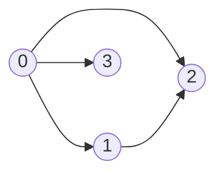
```mermaid
graph LR
1((1))
0((0))
2((2))
3((3))
0-->1
0-->2
0-->3
1-->2
```

其中(0,1)则代表`0->1`的边等等。

## 图的性质

+ 邻接：如果有一条边连接另一个顶点，则称一个顶点与另一个顶点相邻。 顶点 2 和 3 不相邻，因为它们之间没有边。
+ 路径：允许您从顶点 A 到顶点 B 的边序列称为路径。 0-1、1-2 和 0-2 是从顶点 0 到顶点 2 的路径。
+ 邻居（Neighbors）：与节点 Vi 连接的节点集合。
+ 有向图：其中边 (u,v) 并不一定意味着也有边 (v, u) 的图。 这种图中的边用箭头表示，以显示边的方向。
+ 无向图：其中边 (u,v) 一定意味着也有边 (v, u) 的图。 这种图中的边用直线表示，以显示没有方向的边。
+ 中心性（Centrality）：度量节点的重要性，有度中心性、特征向量中心性、Katz中心性、中介中心性。
+ 行走（Walk）：开始于节点 u，结束于节点 v 的所有可能的序列（Node-Edge-...-Node）。

+ 足迹（Trial）：没有重复边的行走。

+ 路径（Path）：没有重复节点的行走。

+ 测地路径（geodesic path）是指两个节点之间的最短路径。

+ 最短路径（Shortest Path）：两节点间长度最短的路径，可能会超过一条。

+ 直径（Diameter）：各节点之间的最短路径长度中的最大值。

+ 子图（Subgraph）：由图中部分节点以及这些节点间的边组成的图。

+  连通：在无向图中，若从顶点u到顶点v有路径，则称u和v是连通的。

## 图的分类

+ 有很少边或弧(如$ e<n log_2n $, e 指边数,n指顶点数）的图称为稀疏图，反之称为稠密图。

+ 有向无环图: 如果一个有向图无法从某个顶点出发经过若干条边回到该点，则这个图是一个**有向无环图**（DAG图）

+ 如果图中边集为空，则称该图为零图。

+ 如果无向图中任何一对顶点之间都有一条边相连，则这个无向图被称为完全图。类似地，如果有向图中任何一对顶点u,u之间都有两条有向边(u, v),(v, u)相连，则称这个有向图为有向完全图。

+ 对于一个无向图，如果以任意一个点为起点，在图上沿着边走都可以到达其他所有点（有向图必须沿有向边的方向），那么这个图就是连通图。显然完全图一定是连通图。

+ 如果一个有向图G，对于其中任意两个顶点v,u，都存在从v到u以及从u到v的有向路径，则称G为强连通图。而在一个不是强连通图的有向图G中，若其中两个顶点u、v在两个方向上都存在有向路径，则称u和v强连通。

+ 强连通图：有向图中，若任意两个顶点 Vi 和 Vj，满⾜从 Vi 到 Vj 以及从 Vj 到 Vi 都连通，也就是都含有⾄少⼀条通路，则称此有向图为强连通图。

+ 连通图（Connected Graph）：只包含一个连通分量，即其自身，那么该图是一个连通图。

+ 连通分量（Connected Component）：无向图的极大连通子图称为的连通分量。任何连通图的连通分量只有一个，即是其自身，非连通的无向图有多个连通分量。

+ 极大连通子图: 若⽆向图不是连通图，但图中存储***某个⼦图符合连通图的性质***，则称该⼦图为***连通分量***。
  由***图中部分顶点和边***构成的图为该图的⼀个⼦图，但这⾥的⼦图指的是**图中"最⼤"的连通⼦图**（也称"极⼤连通⼦图"）。若无向图为非连通图，则图中各个极大连通子图称为此图的连通分量。

## 图的数学特性

+ 具有n个顶点的无向连通图的边最少为n-1
+ 具有n条边的无向图，度为2n
+ 具有n条边的有向图，入度和出度的和为2n
+ 在有向图中，有一个很明显的性质就是，入度等于出度。

## 图的存储方式

### 邻接矩阵「掌握」

邻接矩阵可以用来存储有向图和无向图。

图的邻接矩阵存储方式是用两个数组来表示图。一个一维数组存储图中顶点信息，一个二维数组（称为邻接矩阵）存储图中的边或弧的信息。设图中有n个顶点，则邻接矩阵是一个的方阵，定义为

无向图举例:

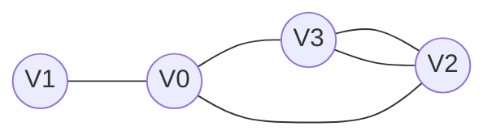
```mermaid
graph LR
V0((V0))
V2((V2))
V3((V3))
V1((V1))
V0---V3
V1---V0
V3---V2
V2---V3
V2---V0
```

这个图的邻接阵如下，注意：无向图的邻接矩阵是实对称矩阵，是可以对角化的。

|顶点数组|V0|V1|V2|V3|
|----|----|----|----|----|

|邻接矩阵|V0|V1|V2|V3|
|----|----|----|----|----|
|V0|0|1|1|1|
|V1|1|0|0|0|
|V2|1|0|0|1|
|V3|1|0|1|0|

设置两个数组，顶点数组，边数组，1表示到的边存在，0表示到的边不存在。

有向图实例： 

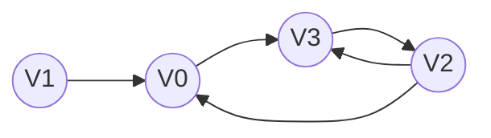
```mermaid
graph LR
V0((V0))
V2((V2))
V3((V3))
V1((V1))
V0-->V3
V1-->V0
V3-->V2
V2-->V3
V2-->V0
```
这个图的邻接阵如下，注意：有向图的邻接矩阵一般是非对称矩阵

|顶点数组|V0|V1|V2|V3|
|----|----|----|----|----|

|邻接矩阵|V0|V1|V2|V3|
|----|----|----|----|----|
|V0|0|0|0|1|
|V1|1|0|0|0|
|V2|1|0|0|1|
|V3|0|0|1|0|


设置两个数组，顶点数组，边数组，1表示到有弧，0表示到没有弧。

在有向图中有入度和出度的概念，第i个顶点的入度为第i列各数的和。顶点的出度为第i行各数之和。

#### 网图

每条边上带有权的图叫做网，假设该图有n个顶点，则邻接矩阵是一个的方阵，定义为

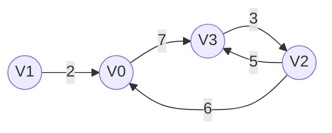
```mermaid
graph LR
V0((V0))
V2((V2))
V3((V3))
V1((V1))
V0--7-->V3
V1--2-->V0
V3--3-->V2
V2--5-->V3
V2--6-->V0
```
这个图的邻接阵如下，注意：有向图的邻接矩阵一般是非/对称矩阵， 这里的非0数字是权值。这里的表示$ (v_i,v_j) <v_i,v_j>$上的权值，根据此定义，我们可作出网的邻接矩阵。

|顶点数组|V0|V1|V2|V3|
|----|----|----|----|----|

||V0|V1|V2|V3|
|----|----|----|----|----|
|V0|0|0|0|7|
|V1|2|0|0|0|
|V2|6|0|0|5|
|V3|0|0|3|0|

### 邻接矩阵的代码实现
图的邻接矩阵存储结构如下：
```c
typedef char VertexType;  // 顶点类型
typedef int EdgeType;  // 边上的权值类型
#define MAXVEX 100  // 最大顶点数
#define INFINITY 65535 // 无穷用65535代替
typedef struct{
    VertexType vexs[MAXVEX];  // 顶点表
    EdgeType arc[MAXVEX][MAXVEX];  // 邻接矩阵，边表
    int numNodes,numEdges;  // 图中当前的顶点数和边数
}MGraph;
```
无向网图的创建：

```c
/* 建立无向网图的邻接矩阵表示 */
void CreateMGraph(MGraph *G)
{
  int i,j,k,w;
  printf("输入顶点数和边数:\n");
  scanf("%d,%d",&G->numNodes,&G->numEdges); /* 输入顶点数和边数 */
  for(i = 0;i <G->numNodes;i++) /* 读入顶点信息,建立顶点表 */
    scanf(&G->vexs[i]);
  for(i = 0;i <G->numNodes;i++)
    for(j = 0;j <G->numNodes;j++)
      G->arc[i][j]=GRAPH_INFINITY;  /* 邻接矩阵初始化 */
  for(k = 0;k <G->numEdges;k++) /* 读入numEdges条边，建立邻接矩阵 */
  {
    printf("输入边(vi,vj)上的下标i，下标j和权w:\n");
    scanf("%d,%d,%d",&i,&j,&w); /* 输入边(vi,vj)上的权w */
    G->arc[i][j]=w; 
    G->arc[j][i]= G->arc[i][j]; /* 因为是无向图，矩阵对称 */
  }
}
```

### 邻接表「掌握」

由于邻接矩阵对于边数相对顶点较少的图是存在对存储空间的极大浪费。我们可以对边或弧使用链式存储的方式来避免空间浪费的问题。将数组与链表相结合的存储方法称作邻接表。邻接表(Adjacency List)是图的一种链式存储结构。在邻接表中,对图中每个顶点建立一个单链表,第i个单链表中的结点表示依附于顶点vi的边(对有向图是以顶点vi为尾的弧)，即该顶点的出向对应的点。

邻接表的处理方法：

图中顶点用一个一维数组存储。对于顶点数组中，每个数据元素还需要存储指向第一个邻接表的指针，以便于查找该顶点的边信息。
图中每个顶点的所有邻接点构成一个线性表，由于邻接点的个数不定，所以用单链表存储，无向图称为顶点的边表，有向图则称为顶点作为弧尾的出边表。


对于带权值的网图，可以再边表结点定义中再增加一个​​weight​​的数据域，存储权值信息，如图所示。

#### 邻接表代码实现

图的邻接表存储结构如下：
```c
typedef char VertexType;  // 顶点类型
typedef int EdgeType;  // 边上的权值类型

typedef struct EdgeNode /* 边表结点  */
{
  int adjvex;    /* 邻接点域,存储该顶点对应的下标 */
  EdgeType info;    /* 用于存储权值,对于非网图可以不需要 */
  struct EdgeNode *next; /* 链域,指向下一个邻接点 */
}EdgeNode;
```

```c
typedef struct VertexNode /* 顶点表结点 */
{
  VertexType data; /* 顶点域,存储顶点信息 */
  EdgeNode *firstedge;/* 边表头指针 */
}VertexNode, AdjList[MAXVEX];

typedef struct
{
  AdjList adjList; 
  int numNodes,numEdges; /* 图中当前顶点数和边数 */
}GraphAdjList;
```
无向图的邻接表创建代码
```c
/* 建立图的邻接表结构 */
void  CreateALGraph(GraphAdjList *G)
{
  int i,j,k;
  EdgeNode *e;
  printf("输入顶点数和边数:\n");
  scanf("%d,%d",&G->numNodes,&G->numEdges); /* 输入顶点数和边数 */
  for(i = 0;i < G->numNodes;i++) /* 读入顶点信息,建立顶点表 */
  {
    scanf(&G->adjList[i].data);  /* 输入顶点信息 */
    G->adjList[i].firstedge=NULL;  /* 将边表置为空表 */
  }
  for(k = 0;k < G->numEdges;k++)/* 建立边表 */
  {
    printf("输入边(vi,vj)上的顶点序号:\n");
    scanf("%d,%d",&i,&j); /* 输入边(vi,vj)上的顶点序号 */
    e=(EdgeNode *)malloc(sizeof(EdgeNode)); /* 向内存申请空间,生成边表结点 */
    e->adjvex=j;          /* 邻接序号为j */                         
    e->next=G->adjList[i].firstedge;  /* 将e的指针指向当前顶点上指向的结点 */
    G->adjList[i].firstedge=e;    /* 将当前顶点的指针指向e */               
    
    e=(EdgeNode *)malloc(sizeof(EdgeNode)); /* 向内存申请空间,生成边表结点 */
    e->adjvex=i;          /* 邻接序号为i */                         
    e->next=G->adjList[j].firstedge;  /* 将e的指针指向当前顶点上指向的结点 */
    G->adjList[j].firstedge=e;    /* 将当前顶点的指针指向e */               
  }
}

```
#### 邻接表的例子

我们可以用两组数据对图进行表示。一组是图的顶点，一组是图的边。


$$
G1 = (V1, \{ A1\})\\
V1 = \{v1, v2, v3, v4\}   \\
A1 = \{<v1, v2>, <v1, v3>, <v3, v4>, <v4, v1>\}   \\
G2 = (V2, \{ E2 \})\\
V2 = \{v1, v2, v3, v4, v5\}\\
E2 = \{(v1, v2), (v1, v4), (v2, v3), (v2, v5), (v3, v4), (v3, v5)\}
$$
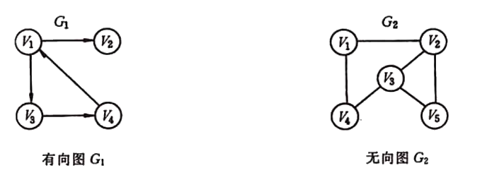
再谈邻接矩阵
以二维数组表示有n个顶点的图时，需存放n个顶点信息和n2个弧信息的存储量。下图分别是G1和G2的邻接矩阵。

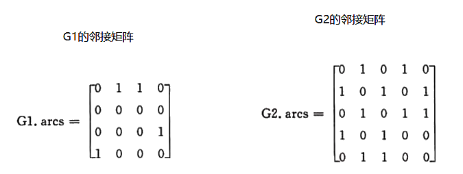

无向图的邻接表

todo 这里少一张图

有向图的邻接表和逆邻接表，逆邻接表即关于入度的邻接表表。


|  |  |
| :----------------------------------------------------------: | :----------------------------------------------------------: |
|                          G1的临接表                          |                         G2的逆邻接表                         |


### 十字链表「熟悉」

十字链表存储有向图（网）的方式与邻接表有一些相同，都以图（网）中各顶点为首元节点建立多条链表，同时为了便于管理，还将所有链表的首元节点存储到同一数组（或链表）中。

其中，建立个各个链表中用于存储顶点的首元节点结构如所示：

|  |
| :------------------------------------------------------: |
|               十字链表中首元节点结构示意图               |

从图6-27可以看出，首元节点中有一个数据域和两个指针域（分别用 firstin 和 firstout 表示）：

- firstin 指针用于连接以当前顶点为弧头的其他顶点构成的链表；
- firstout 指针用于连接以当前顶点为弧尾的其他顶点构成的链表；
- data 用于存储该顶点中的数据；

由此可以看出，十字链表实质上就是为每个顶点建立两个链表，分别存储以该顶点为弧头的所有顶点和以该顶点为弧尾的所有顶点。

注意，存储图的十字链表中，各链表中首元节点与其他节点的结构并不相同，图 1 所示仅是十字链表中首元节点的结构，链表中其他普通节点的结构如图 6-28 所示：


|  |
| :--------------------------------------------------------: |
|               十字链表中普通节点的结构示意图               |

从图 6-28 中可以看出，十字链表中普通节点的存储分为 5 部分内容，它们各自的作用是：

- tailvex 用于存储以首元节点为弧尾的顶点位于数组中的位置下标
- headvex 用于存储以首元节点为弧头的顶点位于数组中的位置下标
- hlink 指针：用于链接下一个存储以首元节点为弧头的顶点的节点
- tlink 指针：用于链接下一个存储以首元节点为弧尾的顶点的节点
- info 指针：用于存储与该顶点相关的信息，例如量顶点之间的权值

比如说，用十字链表存储图6-29 a) 中的有向图，存储状态如图 6-29 b) 所示：


|  |
| :---------------------------------------------------: |
|               十字链表存储有向图示意图                |

拿上图中的顶点 V1 来说，通过构建好的十字链表得知，以该顶点为弧头的顶点只有存储在数组中第 3 位置的 V4（因此该顶点的入度为 1），而以该顶点为弧尾的顶点有两个，分别为存储数组第 1 位置的 V2 和第 2 位置的 V3（因此该顶点的出度为 2）。

对于图 6-29 各个链表中节点来说，由于表示的都是该顶点的出度或者入度，因此没有先后次序之分。

### 邻接多重表「熟悉」

前面讲过，无向图的存储可以使用邻接表，但在实际使用时，如果想对图中某顶点进行实操（修改或删除），由于邻接表中存储该顶点的节点有两个，因此需要操作两个节点。

为了提高在无向图中操作顶点的效率，本节学习一种新的适用于存储无向图的方法——邻接多重表。

> 注意，邻接多重表仅适用于存储无向图或无向网。

邻接多重表存储无向图的方式，可看作是邻接表和十字链表的结合。同邻接表和十字链表存储图的方法相同，都是独自为图中各顶点建立一张链表，存储各顶点的节点作为各链表的首元节点，同时为了便于管理将各个首元节点存储到一个数组中。各首元节点结构如图 1 所示：


|  |  |
| :----------------------------------------------------------: | :--------------------------------------------------: |
|            图6-30邻接多重表各首元节点的结构示意图            |           图6-31 邻接多重表中其他节点结构            |

- data：存储此顶点的数据；
- firstedge：指针域，用于指向同该顶点有直接关联的存储其他顶点的节点。

从图 6-30 可以看到，邻接多重表采用与邻接表相同的首元节点结构。但各链表中其他节点的结构与十字链表中相同，如图 2 所示：

- mark：标志域，用于标记此节点是否被操作过，例如在对图中顶点做遍历操作时，为了防止多次操作同一节点，mark 域为 0 表示还未被遍历；mark 为 1 表示该节点已被遍历；
- ivex 和 jvex：数据域，分别存储图中各边两端的顶点所在数组中的位置下标；
- ilink：指针域，指向下一个存储与 ivex 有直接关联顶点的节点；
- jlink：指针域，指向下一个存储与 jvex 有直接关联顶点的节点；
- info：指针域，用于存储与该顶点有关的其他信息，比如无向网中各边的权；

综合以上信息，如果我们想使用邻接多重表存储图 3a) 中的无向图，则与之对应的邻接多重表如图 3b) 所示：


|  |
| :----------------------------------------------------------: |
|              图 6-33 无向图及其对应的邻接多重表              |

从图 3 中，可直接找到与各顶点有直接关联的其他顶点。比如说，与顶点 V1 有关联的顶点为存储在数组下标 1 处的 V2 和数组下标 3 处的 V4，而与顶点 V2 有关联的顶点有 3 个，分别是 V1、V3 和 V5。

## 哈密顿图「了解」

哈密顿通路（回路）与哈密顿图 （Hamilton图） 通过图G的每个结点一次，且仅一次的通路（回路），就是哈密顿通路（回路）。存在哈密顿回路的图就是哈密顿图。

图论数学家奥勒在1960年给出了一个图是哈密尔顿图的充分条件：对于顶点个数大于2的图，如果图中任意两点度的和大于或等于顶点总数，那这个图一定是哈密顿图。闭合的哈密顿路径称作哈密顿圈，含有图中所有顶点的路径称作哈密顿路径。 

## 最大流和最小割「开拓视野」

请自行搜索

## AOE网

AOE 网是在 AOV 网的基础上，其中每一个边都具有各自的权值，是一个有向无环网。其中权值表示活动持续的时间。

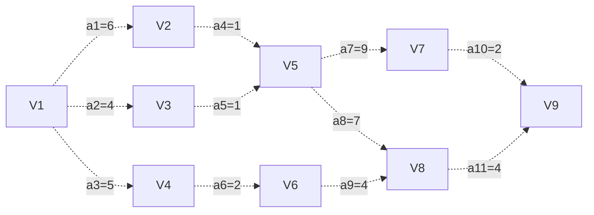
```mermaid
graph LR
V1-.a1=6.->V2
V2-.a4=1.->V5
V1-.a2=4.->V3
V1-.a3=5.->V4
V4-.a6=2.->V6
V7-.a10=2.->V9
V5-.a7=9.->V7
V6-.a9=4.->V8
V5-.a8=7.->V8
V3-.a5=1.->V5
V8-.a11=4.->V9
```


如上图所示就是一个 AOE 网，例如 a1=6 表示完成 a1 活动完成需要 6 天；AOE 网中每个顶点表示在它之前的活动已经完成，可以开始后边的活动，例如 V5 表示 a4 和 a5 活动已经完成，a7 和 a8 可以开始。

使用 AOE 网可以帮助解决这样的问题：如果将 AOE 网看做整个项目，那么完成整个项目至少需要多少时间？

解决这个问题的关键在于从 AOE 网中找到一条从起始点到结束点长度最长的路径，这样就能保证所有的活动在结束之前都能完成。
起始点是入度为 0 的点，称为「源点」；结束点是出度为 0 的点，称为「汇点」。这条最长的路径，被称为「关键路径」。

为了求出一个给定 AOE 网的关键路径，需要知道以下 4 个统计数据：
* 对于 AOE 网中的顶点有两个时间：最早发生时间（用 Ve(j) 表示）和最晚发生时间（用 Vl(j) 表示）；
* 对于边来说，也有两个时间：最早开始时间（用 e(i) 表示）和最晚开始时间（ l(i) 表示）。

+ Ve(j)：对于 AOE 网中的任意一个顶点来说，从源点到该点的最长路径代表着该顶点的最早发生时间，通常用 Ve(j) 表示。

> 例如，图中从 V1 到 V5 有两条路径，V1 作为源点开始后，a1 和 a2 同时开始活动，但由于 a1 和 a2 活动的时间长度不同，最终 V1-V3-V5 的这条路径率先完成。但是并不是说 V5 之后的活动就可以开始，而是需要等待 V1-V2-V5 这条路径也完成之后才能开始。所以对于 V5 来讲，Ve(5) = 7。

+ Vl(j)：表示在不推迟整个工期的前提下，事件 Vk 允许的最晚发生时间。

> 例如，图 中，在得知整个工期完成的时间是 18 天的前提下，V7 最晚要在第 16 天的时候开始，因为 a10 活动至少需要 2 天时间才能完成，如果在 V7 事件在推迟，就会拖延整个工期。所以，对于 V7 来说，它的 Vl(7)=16。

+ e(i)：表示活动 ai 的最早开始时间，如果活动 ai 是由弧 <Vk,Vj> 表示的，那么活动 ai 的最早开始的时间就等于时间 Vk 的最早发生时间，也就是说：e[i] = ve[k]。
> e(i)很好理解，拿图中 a4 来说，如果 a4 想要开始活动，那么首先前提就是 V2 事件开始。所以 e[4]=ve[2]。

+ l(i)：表示活动 ai 的最晚开始时间，如果活动 ai 是由弧 <Vk,Vj> 表示，ai 的最晚开始时间的设定要保证 Vj 的最晚发生时间不拖后。所以，$l[i]=Vl[j]-len<Vk,Vj>$。

在得知以上四种统计数据后，就可以直接求得 AOE 网中关键路径上的所有的关键活动，方法是：对于所有的边来说，如果它的最早开始时间等于最晚开始时间，称这条边所代表的活动为关键活动。由关键活动构成的路径为关键路径。
### AOE网求关键路径实现过程

对图中的 AOE 图求关键路径，首先完成 Ve(j)、Vl(j)、e(i)、l(i) 4 种统计信息的准备工作。

+ Ve(j)，求出从源点到各顶点的最长路径长度为（长度最大的）

+ Vl(j)，求出各顶点的最晚发生时间（从后往前推，多种情况下选择最小的）

+ e(i)，求出各边中ai活动的最早开始时间：

+ l(i),求各边中ai活动的最晚开始时间（多种情况下，选择最小的）

通过对比 l(i) 和 e(i) ，其中 a1 、 a4 、 a7 、 a8 、 a10 、 a11 的值都各自相同，所以，在图中的 AOE 网中有两条关键路径：

对图中的 AOE 图求关键路径，首先完成 Ve(j)、Vl(j)、e(i)、l(i) 4 种统计信息的准备工作。

Ve(j)，求出从源点到各顶点的最长路径长度为（长度最大的）：

|       | V1   | V2   | V3   | V4   | V5   | V6   | V7   | V8   | V9   |
| ----- | ---- | ---- | ---- | ---- | ---- | ---- | ---- | ---- | ---- |
| Ve(j) | 0    | 8    | 4    | 5    | 7    | 7    | 16   | 14   | 18   |
| Vl(j) | 0    | 6    | 6    | 8    | 7    | 10   | 16   | 14   | 18   |

e(i)，求出各边中ai活动的最早开始时间和l(i),求各边中ai活动的最晚开始时间（多种情况下，选择最小的)

|  | a1   | a2   | a3   | a4   | a5   | a6   | a7   | a8   | a9   |a10|a11|
| ---- | ---- | ---- | ---- | ---- | ---- | ---- | ---- | ---- | ---- |----| ----|
| e(i) | 0    | 0    | 0    | 6    | 4    | 5   | 7    | 7   | 7 |16|14|
| l(i) | 0    | 2   | 3  | 6   | 6   | 8   | 7  | 7   | 10 |16|14|


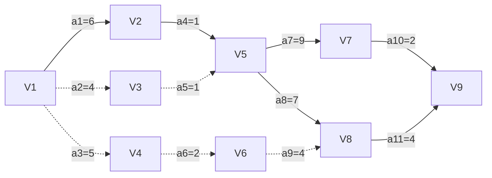
```mermaid
graph LR
V1--a1=6-->V2
V2--a4=1-->V5
V1-.a2=4.->V3
V1-.a3=5.->V4
V4-.a6=2.->V6
V7--a10=2-->V9
V5--a7=9-->V7
V6-.a9=4.->V8
V5--a8=7-->V8
V3-.a5=1.->V5
V8--a11=4-->V9
```

## 拓扑排序

对一个有向无环图(Directed Acyclic Graph简称DAG)G进行拓扑排序，是将G中所有顶点排成一个线性序列，使得图中任意一对顶点u和v，若边<u,v>∈E(G)，则u在线性序列中出现在v之前。通常，这样的线性序列称为满足拓扑次序(Topological Order)的序列，简称拓扑序列。简单的说，由某个集合上的一个[偏序]得到该集合上的一个[全序]，这个操作称之为拓扑排序。

一个较大的工程往往被划分成许多子工程，我们把这些子工程称作**活动**(activity)。在整个[工程]中，有些子工程(活动)必须在其它有关子工程完成之后才能开始，也就是说，一个子工程的开始是以它的所有前序子工程的结束为先决条件的，但有些子工程没有先决条件，可以安排在任何时间开始。为了形象地反映出整个工程中各个子工程(活动)之间的先后关系，可用一个有向图来表示，图中的顶点代表活动(子工程)，图中的有向边代表活动的先后关系，即有向边的起点的活动是终点活动的前序活动，只有当起点活动完成之后，其终点活动才能进行。通常，我们把这种顶点表示活动、边表示活动间先后关系的有向图称做**顶点活动网**(Activity On Vertex network)，简称**AOV**网。

例如，假定一个计算机专业的学生必须完成下表所列出的全部课程。在这里，课程代表活动，学习一门课程就表示进行一项活动，学习每门课程的先决条件是学完它的全部先修课程。如学习《数据结构》课程就必须安排在学完它的两门先修课程《离散数学》和《算法语言》之后。学习《高等数学》课程则可以随时安排，因为它是基础课程，没有先修课。若用AOV网来表示这种课程安排的先后关系，则如图3-5所示。图中的每个顶点代表一门课程，每条有向边代表起点对应的课程是终点对应课程的先修课。从图中可以清楚地看出各课程之间的先修和后续的关系。如课程C5的先修课为C2，后续课程为C4和C6。

| 课程代号 | 课程名称     | 先修课程 |
| :------- | ------------ | -------- |
| C1       | 高等数学     | 无       |
| C2       | 程序设计基础 | 无       |
| C3       | 离散数学     | C1,C2    |
| C4       | 数据结构     | C3,C5    |
| C5       | 算法语言     | C2       |
| C6       | 编译技术     | C4.C5    |
| C7       | 操作系统     | C4,C9    |
| C8       | 普通物理     | C1       |
| C9       | 计算机原理   | C8       |

如果使用图进行表示即AOV网：

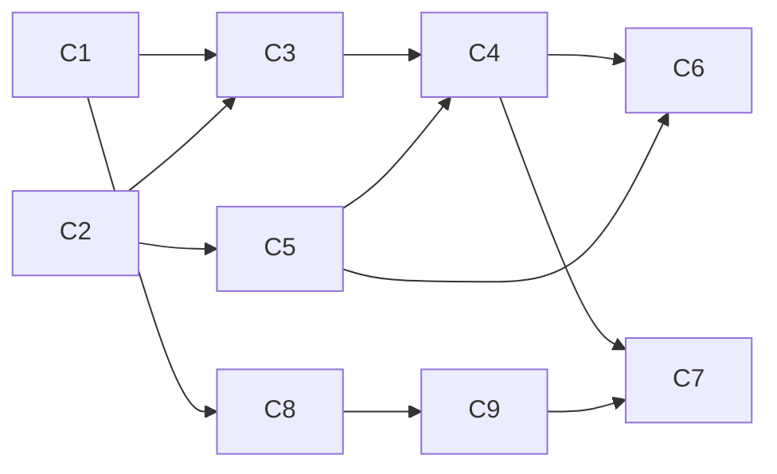
```mermaid
graph LR
C1-->C3
C2-->C3
C3-->C4
C5-->C4
C4-->C6
C5-->C6
C2-->C5
C4-->C7
C9-->C7
C8-->C9
C1-->C8
```

该AOV网的一个拓扑排序可以是：1, 2, 3, 5, 8, 9, 4, 6, 7

## 最小生成树

### 什么是最小生成树

在给定一张无向图，如果在它的子图中，任意两个顶点都是互相连通，并且是一个树结构，那么这棵树叫做生成树。当连接顶点之间的图有权重时，权重之和最小的树结构为最小生成树！

在实际中，这种算法的应用非常广泛，比如我们需要在n个城市铺设电缆，则需要n-1条通信线路，那么我们如何铺设可以使得电缆最短呢？最小生成树就是为了解决这个问题而诞生的！

假设，我们有如下的连通网:

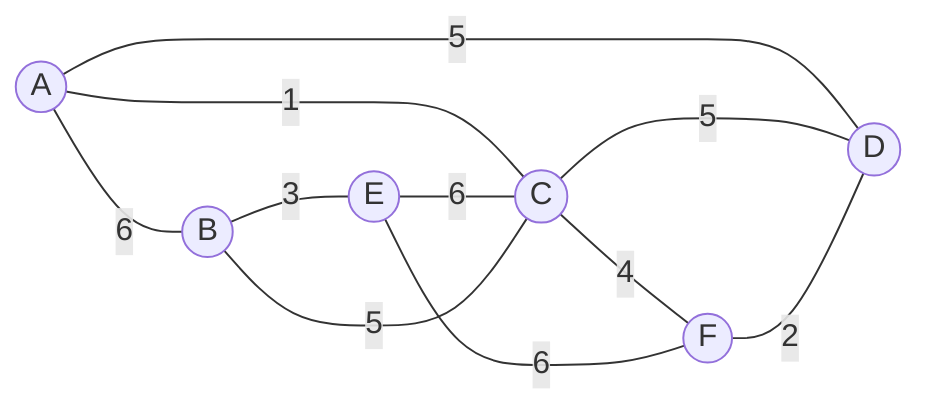
```mermaid
graph LR
A((A))
B((B))
C((C))
D((D))
E((E))
F((F))
A--6---B
A--5---D
A--1---C
C--5---D
F--2---D
C--4---F
E--6---F
C--5---B
B--3---E
E--6---C
```

### Kruskal算法（克鲁斯卡算法）

Kruskal算法是一种贪心算法，我们将图中的每个边按照权重大小进行排序，每次从边集中取出权重最小且两个顶点都不在同一个集合的边加入生成树中！注意：如果这两个顶点都在同一集合内，说明已经通过其他边相连，因此如果将这个边添加到生成树中，那么就会形成环！这样反复做，直到所有的节点都连接成功！

##### 时间复杂度

该算法与边有关，与判断环路相关的函数时间复杂度为$O(log_2e)$ ，对e条边的总体时间复杂度为$O(elog_2e)$

##### 具体实现

1. 对所有节点遍历建立并查集（重点应用），按照边的权重建立最小堆（重点），取出最小堆堆顶数据，并判断两端节点是否在同一集合；
2. 如不在，则将这两个节点添加到同一集合，接着将边加入生成边，如在，则不进行操作，为无效边；
3. 重复上面的操作，直到所有的边都检查完。


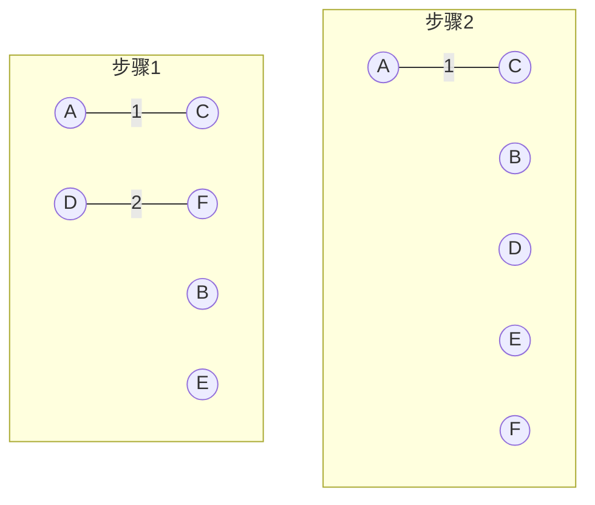
```mermaid
graph TB
subgraph 步骤2
	A((A))
	B((B))
	C((C))
	A--1---C
	D((D))
	E((E))
	F((F))
end
subgraph 步骤1 
	A1((A))
	B1((B))
	C1((C))
	A1--1---C1
	D1--2---F1
	D1((D))
	E1((E))
	F1((F))
end

```

首先我们选择组小的边AC，并且保证AC不在同一颗树上，然后合并AC。接下来我们选择最小的边DF，保证DF不在同一颗树上，合并DF

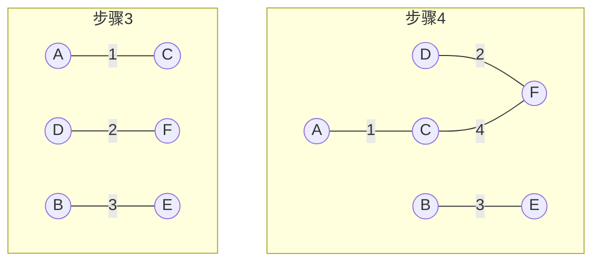
```mermaid
graph TB
subgraph 步骤4
	A1((A))
	B1((B))
	C1((C))
	A1--1---C1
	D1--2---F1
	B1--3---E1
	C1--4---F1
	D1((D))
	E1((E))
	F1((F))
end


subgraph 步骤3
	A((A))
	B((B))
	C((C))
	A--1---C
	D--2---F
	B--3---E
	D((D))
	E((E))
	F((F))
end


```

重复上面的步骤, 我们选择最小的边BE，并且保证BE不在同一颗树上，然后合并BE。接下来我们选择最小的边CF，保证CF不在同一颗树上，合并CF

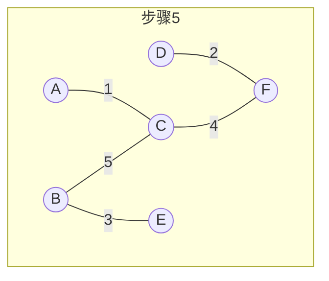
```mermaid
graph TB
subgraph 步骤5
	A1((A))
	B1((B))
	C1((C))
	A1--1---C1
	D1--2---F1
	B1--3---E1
	C1--4---F1
	B1--5---C1
	D1((D))
	E1((E))
	F1((F))
end
```

最终，我们选择最小的边BC，并且保证BC不在同一颗树上，然后合并CB，现在所有节点都在树上，生成完成。

```c++
std::vector<Node*> list;
for(auto ite: graph.nodes){
    list.push_back(ite.second);
}
UnionFindSet unionFind(list);   // 建立并查集
std::priority_queue<Edge, vector<Edge>, decltype(cmp)> smallQueue(cmp); //建立最小堆
for(auto edge: graph.edges){
    smallQueue.push(*edge);
}
// 构造选中的输出边集
std::unordered_set<Edge, EdgeHash, EdgeEqual> result;
while(!smallQueue.empty()){
    Edge edge = smallQueue.top();

    smallQueue.pop();
    if(!unionFind.isSameSet(edge.from, edge.to)){  
	// 判断是否为一个环，如果一个边的两端节点为一个集合，那么必为一个闭合环
        result.insert(edge);
        unionFind.Union(edge.from, edge.to);
    }
}
return result;
}
```

简单理解Kruskal算法

一直选最小边，不要形成回路。

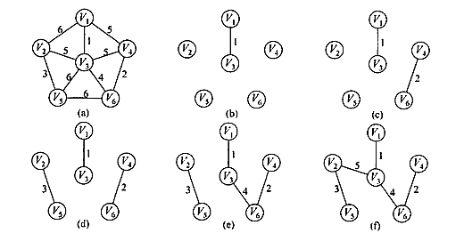

适合顶点多的图。

### Prim算法

Prim算法是另一种贪心算法，和Kuskral算法的贪心策略不同，Kuskral算法主要对边进行操作，而Prim算法则是对节点进行操作，每次遍历添加一个点，这时候我们就不需要使用并查集了。具体步骤为


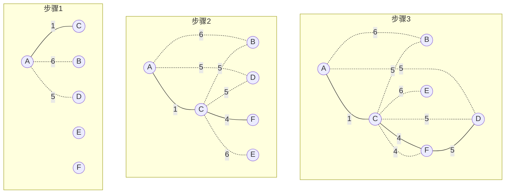
```mermaid
graph TB
subgraph 步骤3
	A2((A))
	B2((B))
	C2((C))
	A2--1---C2
	A2-.6.-B2
	A2-.5.-D2
	C2--4---F2
	C2-.5.-B2
	C2-.4.-F2
	C2-.5.-D2
	F2--5---D2
	C2-.6.-E2
	D2((D))
	E2((E))
	F2((F))
end


subgraph 步骤2
	A1((A))
	B1((B))
	C1((C))
	A1--1---C1
	A1-.6.-B1
	A1-.5.-D1
	C1--4---F1
	C1-.5.-B1
	C1-.6.-E1
	C1-.5.-D1
	D1((D))
	E1((E))
	F1((F))
end

subgraph 步骤1
	A((A))
	B((B))
	C((C))
	A--1---C
	A-.6.-B
	A-.5.-D
	D((D))
	E((E))
	F((F))
end

```

首先，我们发现，A可以直接到到达B、C、D，最短的是A-C: 1，接下来C加入了组织，C可以直接到B，D, F，E当然还有A，但是此时A已经在生成树中，不考虑。我们现在比较A-B，A-D，C-B，C-D, C-F,C-E最小的是C-F:4。接下来F加入了组织，F可以直接到E，D, 我们现在比较A-B，A-D，C-B，C-D, F-E, F-D最小的是F-D:5

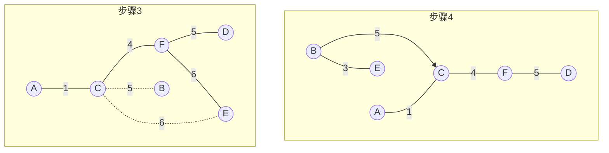
```mermaid
graph TB

subgraph 步骤4
	A1((A))
	B1((B))
	C1((C))
	B1--5--->C1
	D1((D))
	E1((E))
	F1((F))
	A1--1---C1
	C1--4---F1
	F1--5---D1
	B1--3---E1
end
subgraph 步骤3
	A2((A))
	B2((B))
	C2((C))
	A2--1---C2
	C2--4---F2
	C2-.5.-B2
	F2--5---D2
	F2--6---E2
	C2-.6.-E2
	D2((D))
	E2((E))
	F2((F))
end

```

重复上述过程。D加入了组织，D直接连接节点都在树中， 我们现在比较A-B，C-B，C-D, F-E，C-E最小的是C-B:5，B加入后多了路径B-E比较F-E，C-E，B-E子最小的是B-E:3加入后，生成完成。

简单理解

选最小边，选完当成一个整体，再选最小的边，依次递推。

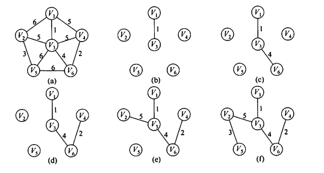

适合边稠密的图。

## 最短路径算法

首先需要对最短路径问题进行一些说明，图的类型既可以是有向图也可以是无向图，为了统一，之后统一使用有向图来进行解释。接下来也对于该问题中的一些定义进行区分：

+ 路径长度：一条路径上所经过的边的数目

+ 带权路径长度：路径上所经过边的权值之和

+ 最短路径：带权路径长度值最小的那条路径

### Dijkstra算法

Dijkstra算法是一种较为经典的最短路径求解算法，它的整体思路和前面的Prim算法非常相似，但是又有一些不同之处。接下来首先对Dijkstra算法的整体流程进行一个大致的了解

#### 时间复杂度

$O(n^2)$

#### Dijkstra算法的基本思想

1. 设置两点顶点的集合U和T，集合U中存放已找到最短路径的顶点，集合T 中存放当前还未找到的最短路径的顶点.
2. 初始状态时，集合U中只包含源点，设为v0。
3. 然后从集合T 中选择到源点v0路径长度最短的顶点u加入到集合U中
4. 集合U中每加入一个新的顶点u都要修改源点带集合T 中剩余项点的当前最短路径值，**集合T 中各项点的新的当前最短路径长度值，为 原来的当前最短路径长度值 与 从源点过顶点u到达该顶点的带权路径长度 中的较小者**。
5. 回到3，此过程不断重复，直到集合T中的顶点全部加入到集合U中为止。

#### 例如

|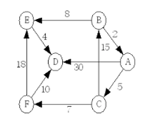|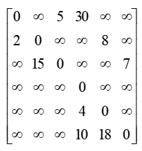|
|:-:|:-:|
|图6-17|图6-18|


|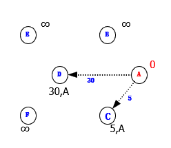|  | |
|:-:|:-:|:-:|
|图6-19|图6-20|图6-21|


|  |  |  |
| :----------------------------------------------------------: | :----------------------------------------------------------: | :----------------------------------------------------------: |
|                            图6-22                            |                            图6-23                            |                            图6-24                            |

上述例子中，有图中圆圈中的字母代表节点的信息，圆圈上面的内容代表源点到其最短距离以及前驱节点，前驱节点用于后续重现最短路径。

这里主要是使用到了一个简单的定理，**如果起点v0到目标点u之间的某一条路径是最短路径，那么在该路径上面，任何一个点u到的路径都是u'到v的最短路径。

那么这里在记录最短路径的信息时，如果需要重现路径中的顶点，那么只需要对于每一个结点设置一个前驱结点即可。

接下来继续查看一个例子，这里使用表格的形式来对整个算法流程进行分析。其中，第一行是final，第二行是路径长度，第3行是经过的路径。

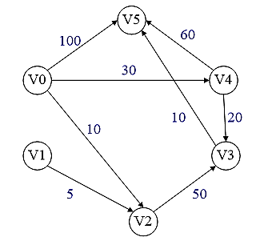

| 终点 | 1    | 2    | 3    | 4    | 5    |
| ---- | ---- | ---- | ---- | ---- | ---- |
| $V_1$ | 0 <br>$+∞$<br> | 0 <br/>$+∞$<br/> | 0 <br/>$+∞$<br/> | 0 <br/>$+∞$<br/> | 0 <br/>$+∞$<br/> |
| $V_2$ | 0 <br/>10<br/>{$v_0, v_1$} | 1 |  |  |  |
| $V_3$ | 0 <br/>$+∞$<br/> | 0 <br/>60<br/>{$v_0, v_2, v_3$} | 0 <br/>50<br/>{$v_0, v_4, v_3$} | 1 |      |
| $V_4$ | 0 <br/>30<br/>{$v_0, v_2, v_3$} | 0 <br/>60<br/>{$v_0, v_2, v_3$} | 1 |      |      |
| $V_5$ | 0 <br/>100<br/>{$v_0, v_2$} | 0 <br/>100<br/>{$v_0, v_5$} | 0 <br/>90<br/>{$v_0, v_4, v_5$} | 0 <br/>60<br/>{$v_0, v_4, v_3,v_5$ } |      |
|  ||||||

 在具体实现路径重现的时候，主要是借助前驱数组和栈来进行实现，具体代码如下所示。在对该算法有了一定的理解之后，接下来就是考虑如何使用代码来实现它。由于该算法和Prim算法十分相近，所以在实现部分和Prim算法的实现部分基本一致，除了多了一个前驱数组，在初始化时，依旧是根据起点和邻接矩阵来对所有的距离进行初始化。对于源点到T中点的最短距离，也是借助一个访问数组visit和距离数组dis来进行保存，visit[i]=false代表第i个点在集合T中。之后在每次循环中，找出距离最短的，然后将其加入到集合U中。最后就是最关键的一步，也就是根据新加入的点来更新到T中剩余点的最短距离，这一步和Prim算法中的判断条件不同，需要注意。

### Floyd算法「了解」

#### 什么是floyd

Floyd算法又称为插点法，是一种利用动态规划的思想寻找给定的加权图中多源点之间最短路径的算法。在一个加权图中，如果想找到各个顶点之间的最短路径，可以考虑使用弗洛伊德算法。弗洛伊德算法既适用于无向加权图，也适用于有向加权图。使用弗洛伊德算法查找最短路径时，只允许环路的权值为负数，其它路径的权值必须为非负数，否则算法执行过程会出错。

#### 时间复杂度

$O(n^3)$

####  算法思想

- 动态规划

- 算法考虑每对顶点最短路径上的中间顶点

- $d_{ij}^k$等于从第i个顶点到第j个顶点之间所有路径中最短的长度，并且路径中每一个中间顶点的编号不大于k

- 递推关系

  $$d_{ij}^k=min\{d_{ij}^{k-1},d_{ik}^{k-1}+d_{jk}^{k-1}\} $$

  $$d_{ij}^{0}=w_{ij}$$

#### 适用范围

任意两点间的最短路径。
#### 缺点

不适合计算大量数据。

#### 算法演示

如下图所示，演示使用弗洛伊德算法求解每一对顶点之间的最短路径。

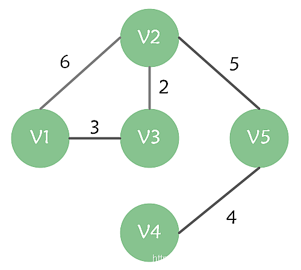

1. 在没有中转点的情况下，各个顶点之间的最短路径距离，用一个二维数组 dis 表示，如下图所示。

   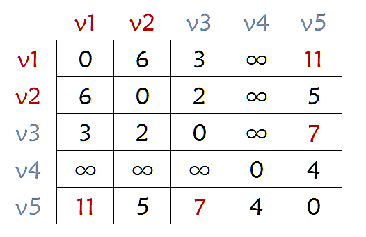


2. 假设 v1 作为中转点，则各个顶点之间的最短路径距离理论上将会被更新。然而由于 v2 经中转点 v1 到 v3 的距离大于 v2 直接到 v3 的距离（即 dis[v2][v1] + dis[v1][v3] > dis[v2][v3]），因此本次最短路径距离并未真正发生变化。

3. 再假设 v1，v2 作为中转点。此时 v5 可以经 v2 访问到 v1 和 v3，在没有中转的情况下，v5 到 v1 和 v3 的最短距离都是无穷大，因此各个顶点之间的最短路径距离将会被更新。

   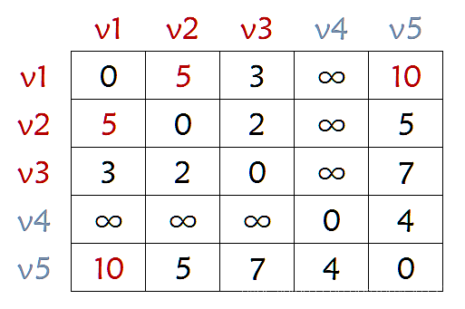

   再假设 v1，v2，v3 作为中转点。此时 v1 经 v3 访问 v2 的距离小于直接访问 v2 的距离（即 dis[v1][v3] + dis[v3][v2] < dis[v1][v2])，因此 v1 到 v2 的最短距离将会被更新；同时由于 v1 需经 v2 中转访问 v5，因此 v1 到 v5 的最短距离也要同步更新。

   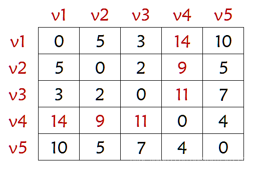

   再假设 v1，v2，v3，v4 作为中转点。由于 v4 是一个孤立的中转点因此，因此各个顶点之间的最短路径并未发生真正变化。

   再假设 v1，v2，v3，v4，v5 作为中转点。由于 v2 经 v5 中转可达 v4 且距离小于 dis[v2][v4]，因此 v2 到 v4 的最短路径将会更新，且 v1，v3 到 v4 的最短路径也会随之更新。

   至此，所有的点都作为了中转点，算法执行完毕。此时 dis 数组中存放的就是各个顶点之间的最短路径距离。


代码实现
```c
for(int k=1;k<=n;k++){
	for(int i=1;i<=n;i++)
		for(int j=1;j<=n;j++)
			dis[i][j] = min(dis[i][j],dis[i][k]+dis[k][j]);
```

## 图的遍历

### 深度优先搜索法
深度优先遍历（Depth_First_Search），也有称为深度优先搜索，简称为DFS。

深度优先搜索法是树的先根遍历的推广，它的基本思想是：从图G的某个顶点v0出发，访问v0，然后选择一个与v0相邻且没被访问过的顶点vi访问，再从vi出发选择一个与vi相邻且未被访问的顶点vj进行访问，依次继续。如果当前被访问过的顶点的所有邻接顶点都已被访问，则退回到已被访问的顶点序列中最后一个拥有未被访问的相邻顶点的顶点w，从w出发按同样的方法向前遍历，直到图中所有顶点都被访问。

为了更好的理解深度优先遍历，我们来做一个游戏。

```mermaid
graph LR

```

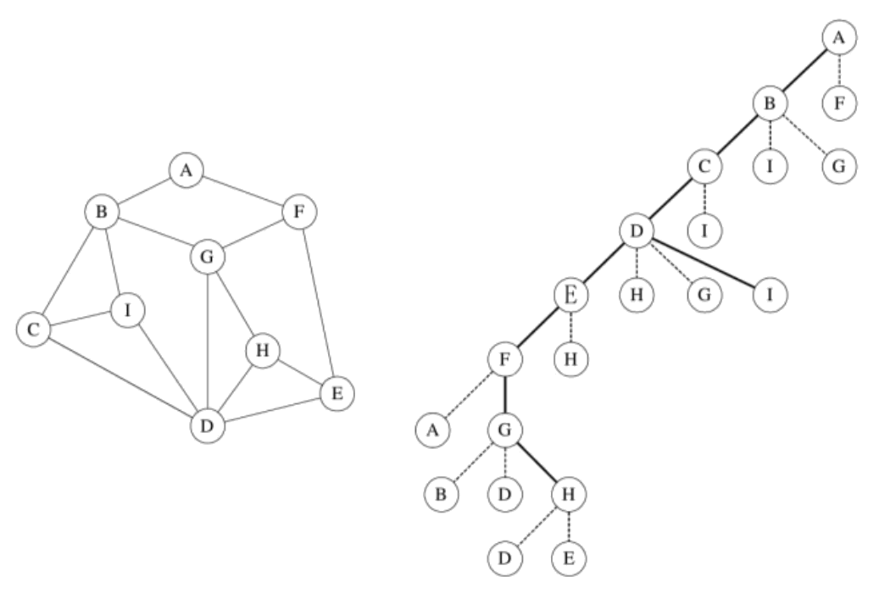 

首先从顶点A开始，做上表示走过的记号后，面前有两条路，通向B和F，我们给自己定一个原则，在没有碰到重复顶点的情况下，始终是向右手边走，于是走到了B顶点。整个行路过程，可参看上图的右图。此时发现有三条分支，分别通向顶点C、I、G，右手通行原则，使得我们走到了C顶点。就这样，我们一直顺着右手通道走，一直走到F顶点。当我们依然选择右手通道走过去后，发现走回到顶点A了，因为在这里做了记号表示已经走过。此时我们退回到顶点F，走向从右数的第二条通道，到了G顶点，它有三条通道，发现B和D都已经是走过的，于是走到H，当我们面对通向H的两条通道D和E时，会发现都已经走过了。

此时我们是否已经遍历了所有顶点呢？没有。可能还有很多分支的顶点我们没有走到，所以我们按原路返回。在顶点H处，再无通道没走过，返回到G，也无未走过通道，返回到F，没有通道，返回到E，有一条通道通往H的通道，验证后也是走过的，再返回到顶点D，此时还有三条道未走过，一条条来，H走过了，G走过了，I，哦，这是一个新顶点，没有标记，赶快记下来。继续返回，直到返回顶点A，确认你已经完成遍历任务，找到了所有的9个顶点。

深度优先遍历其实就是一个递归的过程，如果再敏感一些，会发现其实转换成如上图的右图后，就像是一棵树的前序遍历，没错，它就是。它从图中某个顶点v出发，访问此顶点，然后从v的未被访问的邻接点出发深度优先遍历图，直至图中所有和v有路径相通的顶点都被访问到。

### 广度优先搜索法

广度优先遍历（Breadth_First_Search），又称为广度优先搜索，简称BFS。

图的广度优先搜索是树的按层次遍历的推广，它的基本思想是：首先访问初始点vi，并将其标记为已访问过，接着访问vi的所有未被访问过的邻接点vi1,vi2,…, vi t，并均标记已访问过，然后再按照vi1,vi2,…, vi t的次序，访问每一个顶点的所有未被访问过的邻接点，并均标记为已访问过，依次类推，直到图中所有和初始点vi有路径相通的顶点都被访问过为止。

如果说图的深度优先遍历类似树的前序遍历，那么图的广度优先遍历就类似于树的层序遍历了。我们将下图的第一幅图稍微变形，变形原则是顶点A放置在最上第一层，让与它有边的顶点B、F为第二层，再让与B和F有边的顶点C、I、G、E为第三层，再将这四个顶点有边的D、H放在第四层，如下图的第二幅图所示。此时在视觉上感觉图的形状发生了变化，其实顶点和边的关系还是完全相同的。

 

 ## 习题


1. 下列关于无向连通图特性的叙述中，正确的是(  )。

I.  所有顶点的度之和为偶数

Ⅱ.边数大于顶点个数减1

Ⅲ.至少有一个顶点的度为1

A. 只有I            B.  只有Ⅱ      C.I   和Ⅱ      D.I   和Ⅲ

2. 若无向图G=(V,E)中含有7个顶点，要保证图G 在任何情况下都是连通的，则需要的边数最 少 是 (  )。

   A.6                 B.15      C.16        D.21

3. 对下图进行拓扑排序，可以得到不同拓扑序列的个数是(  )。【2010年全国试题8(2分)】

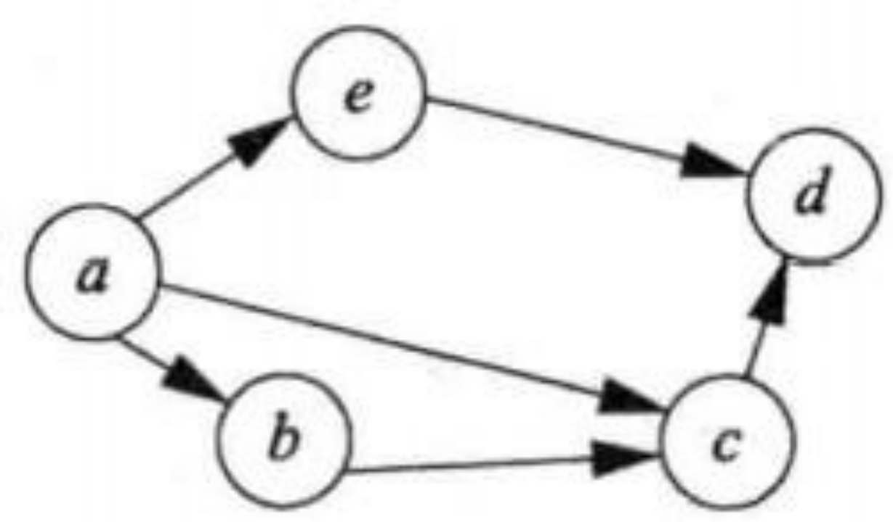 

**A.4**                  B.3               C.2                  D.1

4. 下列关于图的叙述中，正确的是(  )。【2011年全国试题8(2分)】

I. 回路是简单路径

Ⅱ.存储稀疏图，用邻接矩阵比邻接表更省空间

Ⅲ.若有向图中存在拓扑序列，则该图不存在回路

A.  仅Ⅱ      B. 仅 I 、Ⅱ            C.  仅Ⅲ        D.  仅 I 、Ⅲ

5. 对 有n 个 结 点 、e 条边且使用邻接表存储的有向图进行广度优先遍历，其算法时间复杂 度 是 (  )。

A.O(n)               B.O(e)               C.O(n+e)             D.O(n×e)

6. 若用邻接矩阵存储有向图，矩阵中主对角线以下的元素均为零，则关于该图拓扑序列的结论 是 (  )。

A. 存在，且唯一             B.  存在，且不唯一

C. 存在，可能不唯一           D.  无法确定是否存在

7. 对如下有向带权图，若采用迪杰斯特拉(Dijkstra)  算法求从源点a 到其他各顶点的最短路径， 则得到的第一条最短路径的目标顶点是 b, 第二条最短路径的目标顶点是 c, 后续得到的其 余各最短路径的目标顶点依次是(  )。

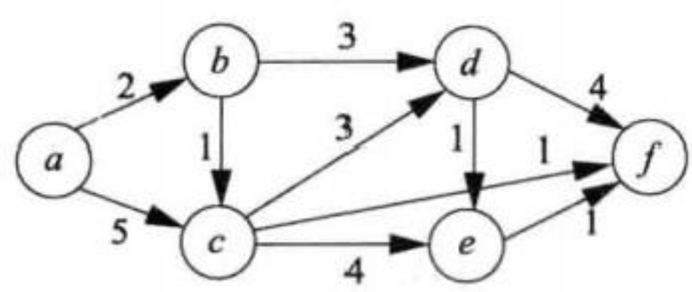 

A.d,e,f            B.e,d,f              C.f,d,e         D. f,e,d

8. 下列关于最小生成树的叙述中，正确的是(  )。

I. 最小生成树的代价唯一

II. 所有权值最小的边一定会出现在所有的最小生成树中

Ⅲ.使用普里姆 (Prim) 算法从不同顶点开始得到的最小生成树一定相同

IV. 使用普里姆算法和克鲁斯卡尔 (Kruskal)  算法得到的最小生成树总不相同

A. 仅I          B. 仅Ⅱ       C. 仅 I 、Ⅲ           D. 仅Ⅱ、IV

9. 设图的邻接矩阵A如下所示。各顶点的度依次是(  )。

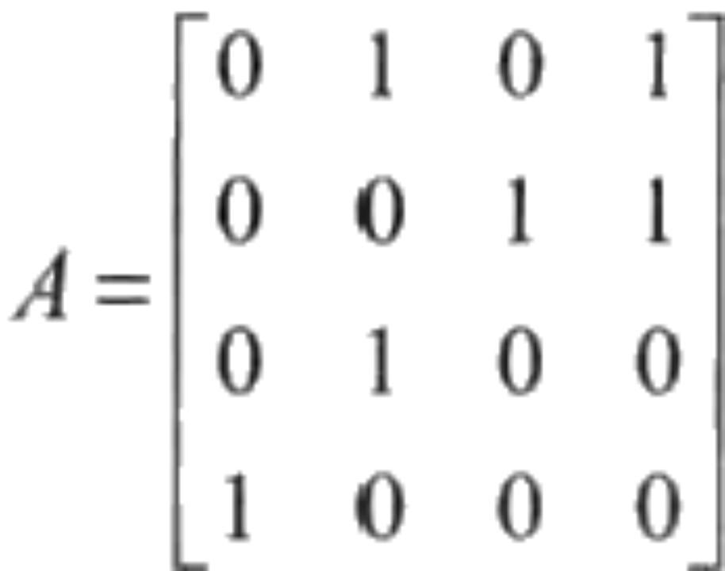 

A.1,2,1,2            B.2,2,1,1             C.3,4,2,3             D.4,4,2,2

10.若对如下无向图进行遍历，则下列选项中，不是广度优先遍历序列的是(  )。

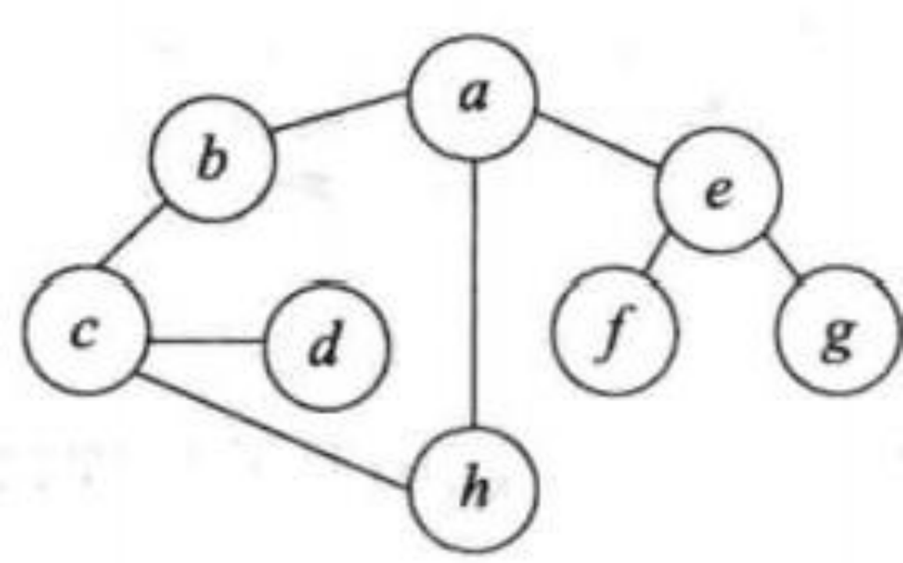 

A.h,c,a,b,d,e,g,f          B.e,a,f,g,b,h,c,d   C.d.b,c,a,h,e,f,g                   D.a,b,c,d,h,e,f,g

11. 下面AOE 网表示一项包含8个活动的工程。通过同时加快若干活动的进度可以缩短整个工程的 工期。下列选项中，加快其进度就可以缩短工程工期的是(  )。
 

A.c和e    B.d  和(        C.f和d           D.f和h

12. 对如下所示的有向图进行拓扑排序，得到的拓扑序列可能是(  )。

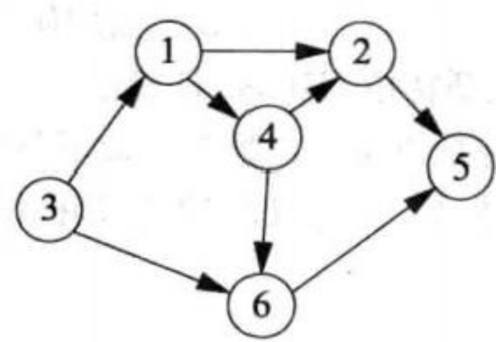 


A.3,1,2,4,5,6         B.3,1,2,4,6,5           C.3,1,4,2,5,6          D.3,1,4,2,6,5

13. 设有向图G=(V,E),  顶点集 V={Vo,V₁,V₂,V₃},  边集E={<vo,v>,<vo,vz>,<vo,v₃>,<vj,v₃>},

若从顶点 V₀ 开始对图进行深度优先遍历，则可能得到的不同遍历序列个数是(   )。

A.2               B.3                C.4                D.5

14. 求下面带权图的最小(代价)生成树时，可能是克鲁斯卡尔(Kruskal)  算法第二次选中但不 是普里姆 (Prim)  算法(从V₄开始)第2次选中的边是(  )。
A.(V₁,V₃)            B.(Vi,V₄)            C.(V₂,V₃)             **D.(V₃,V₄)**

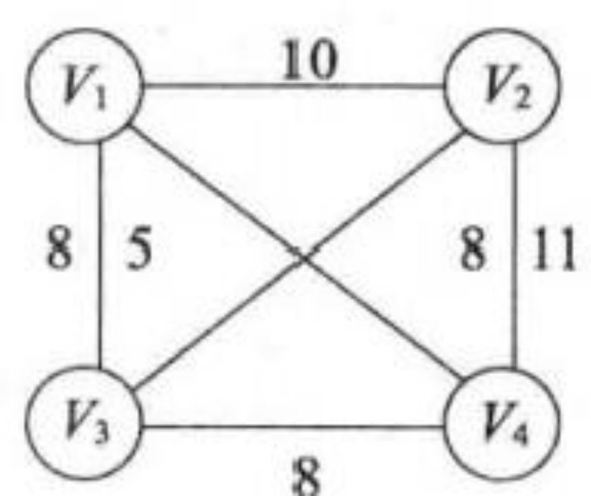 

15.以下图的叙述中，正确的是(  )。
A.  图与树的区别在于图的边数大于或等于顶点数

B. 假设有图G=(V,{E}), 顶点集VCV,ECE,    则 V和{E}构成G的子图 
C. 无向图的连通分量指无向图中的极大连通子图

D. 图的遍历就是从图中某一顶点出发访遍图中其余顶点

16. 图中有关路径的定义是(  )。

A. 由顶点和相邻顶点序偶构成的边所形成的序列

B. 由不同顶点所形成的序列

C.  由不同边所形成的序列

D. 上述定义都不是

17. 设无向图的顶点个数为n,  则该图最多有(  )条边。

A.n-1                **B.n(n-1)/2**             C.n(n+1)/2            D.0  E.n²

18. 具有n 个顶点的有向完全图有(  )条边。

**A.n(n-1)/2**          B.n(n-1)           C.n(n+1)/2            D.n(n+1)

19. 一 个n 个顶点的连通无向图，其边的个数至少为(  )。

A.n-1             B.n                C.n+1              D.nlogn

20. 要连通具有n 个顶点的有向图，至少需要(  )条边。

A.n-1            B.n                  C.n+1              D.2n

21. 设有向图G 是有10个顶点的强连通图，则G 至少有(  )条边。

A.45       B.90         C.10       D.9

22. 具有6个顶点的无向图，当有(   )条边时能确保是一个连通图。

A.8              B.9                C.10       D.11

23.n 个结点的完全有向图含有边的数目(  )。

**A.n\*n**              B.n(n+1)             C.n/2               D.n*(n-1)

24. 一个有n 个结点的图，最少有(  )个连通分量，最多有(   )个连通分量。
A.0              B.1                C.n-1             D.n

25. 在一个无向图中，所有顶点的度数之和等于所有边数(   )倍，在一个有向图中，所 有顶点的入度之和等于所有顶点出度之和的(   )倍。

A.1/2              B.2                C.1                D.4

26. 一个有向图，共有n 条弧，则所有顶点的度的总和为(  )。【华南理工大学2006 一、9

(2分)】

**A.2****n**             B.n                C.n-1              D.n/2

27. 对于一个具有 n 个顶点的无向图，若采用邻接矩阵表示，则该矩阵的大小为(  )。【中

南大学2005 一、5(2分)】

A.(n-1)²        B.n²            C.n-1           D.n

28. 用有向无环图描述表达式(A+B)*((A+B)/A), 至少需要顶点的数目为(   )。【中山大学

1999 一、14】

**A.5**               B.6                C.8                D.9

29. 无向网(加权图)的邻接矩阵是(  )矩阵。【华中科技大学2006 一、8(2分)】

A. 下三角     B. 上三角     C. 稀疏      D. 对称

30.设有两个无向图G=(V,E),G'=(V,E'),如果G 是G 的生成树，则下列说法不正确的是(  )。

【北京交通大学2006 一、5(2分)】

A.G'是G 的子图             B.G'是G 的连通分量

C.G'是G 的无环子图          D.G 是 G 的极小连通子图，且 V=V

31.用邻接表存储图所用的空间大小(  )。【北京交通大学2004 一、7(2分)】

A. 与图的顶点数和边数都有关      B. 只与图的边数有关

C. 只与图的顶点数有关          D.  与边数的平方有关

32.对邻接表的叙述中，(  )是正确的。【华南理工大学2006 一、10(2分)】 A. 无向图的邻接表中，第i个顶点的度为第i个链表中结点数的二倍

B. 邻接表比邻接矩阵的操作更简单

C. 邻接矩阵比邻接表的操作更简便

D. 求有向图结点的度，必须遍历整个邻接表

33. 在有向图的邻接表存储结构中，顶点v 在链表中出现的次数是(   )。【北京理工大学2006

五、10(1分)2004一 、7(1分)】

A. 顶点v 的度            B. 顶点v 的出度

C. 顶点v 的入度            D.  依附于顶点v 的边数

34.n 个顶点的无向图的邻接表最多有(  )个表结点。【华中科技大学2006一、9(2分)】

A.n²           **B.n(n-1)**             C.n(n+1)            D.n(n-1)/2

35. 图 G 是 n 个顶点的无向完全图，则下列说法正确的有：(  )。【电子科技大学2003 一、

6(20/8分)】


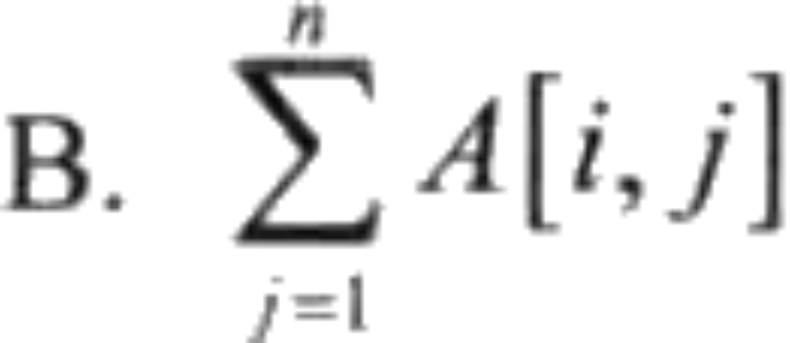 

A.G  的邻接多重表需要n(n-1)  个边结点和n 个顶点结点

B.G  的连通分量个数最少

C.G 为连通图

D.G 所有顶点的度的总和为n(n-1)

36. 下列表述中，错误的说法是(  )。
A.n  个结点的树的各结点度数之和为n-1

B.n  个顶点的无向图最多有n*(n-1)     条边

C.  用邻接矩阵存储图时所需存储空间的大小与图的顶点数有关，而与边数无关 D. 哈希表中冲突的可能性大小与装填因子有关

37. 以下图的叙述中，正确的是(  )。

A. 强联通有向图的任何顶点到其他所有顶点都有弧

B.  任意图顶点的入度等于出度

C.  有向完全图一定是强联通有向图

D. 有向图的边集的子集和顶点集的子集可构成原有向图的子图

38. 下列哪一种图的邻接矩阵是对称矩阵? (   )【北方交通大学2001 一 、11(2分)】

A. 有向图     B. 无向图       C.AOV 网      D.AOE  网

 

| 1.A  | 2.C  | 3.B  | 4.C   | 5.C   | 6.C   | 7.C    | 8.A  | 9.C  | 10.D |
| ---- | ---- | ---- | ----- | ----- | ----- | ------ | ---- | ---- | ---- |
| 11.C | 12.D | 13.D | 14.C  | 15.C  | 16.A  | 17.B   | 18.B | 19.A | 20.B |
| 21 C | 22.D | 23.D | 24.1B | 24.2D | 25.1B | 25.2C  | 26.A | 27.B | 28.A |
| 29.D | 30.B | 31.A | 32.D  | 33.C  | 34.B  | 35.BCD | 36.B | 37.C | 38.B |
