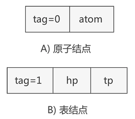
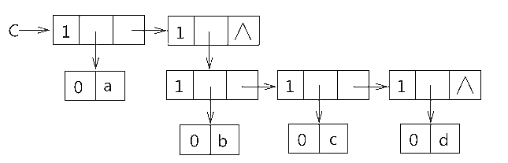

# 广义表

## 广义表定义

广义表(Lists，又称列表)是一种非连续性的数据结构，是线性表的一种推广。即广义表中放松对表元素的原子限制，容许它们具有其自身结构。它被广泛的应用于人工智能等领域的表处理语言LISP语言中。在LISP语言中，广义表是一种最基本的数据结构，就连LISP 语言的程序也表示为一系列的广义表。

## 广义表的原子和子表

通常，广义表中存储的单个元素称为 "原子"，而存储的广义表称为 "子表"。

例如创建一个广义表 LS = (1,(1,2,3))，我们可以这样解释此广义表的构成：广义表 LS 存储了一个原子 1 和子表 (1,2,3)。

以下是广义表存储数据的一些常用形式：
* A = ()：A 表示一个广义表，只不过表是空的。
* B = (e)：广义表 B 中只有一个原子 e。
* C = (a,(b,c,d)) ：广义表 C 中有两个元素，原子 a 和子表 (b,c,d)。
* D = (A,B,C)：广义表 D 中存有 3 个子表，分别是A、B和C。这种表示方式等同于 D = ((),(e),(b,c,d)) 。
* E = (a,E)：广义表 E 中有两个元素，原子 a 和它本身。这是一个递归广义表，等同于：E = (a,(a,(a,…)))。

注意，A = () 和 A = (()) 是不一样的。前者是空表，而后者是包含一个子表的广义表，只不过这个子表是空表。
### 广义表的表头和表尾
当广义表不是空表时，称第一个数据（原子或子表）为「表头」，剩下的数据构成的新广义表为「表尾」。

强调一下，除非广义表为空表，否则广义表一定具有表头和表尾，且广义表的表尾一定是一个广义表。表头可能是广义表，也有可能是元素。，而其表尾必定是子表。

例如在广义表中 LS=(1,(1,2,3),5) 中，表头为原子 1，表尾为子表 (1,2,3) 和原子 5 构成的广义表，即 ((1,2,3),5)。

注：任何一个非空广义表的表头是表中第一个元素，它可以是原子，也可以是子表，**表尾不是最后一个元素，而是一个子表**

head(C)=a， tail(C)=((b,c,d))
	head(D)=A=()， tail(D)=(B,C)=((e),(a,(b,c,d)))

由于tail(D)是非空表，可继续分解得到：

head(tail(L))=(e)， tail(tail(L))=(b,c,d)


## 广义表的存储结构
由于广义表中既可存储原子（不可再分的数据元素），也可以存储子表，因此很难使用顺序存储结构表示，通常情况下广义表结构采用链表实现。

> 使用顺序表实现广义表结构，不仅需要操作 n 维数组（例如 (1,(2,(3,4))) 就需要使用三维数组存储），还会造成存储空间的浪费。

使用链表存储广义表，首先需要确定链表中节点的结构。由于广义表中可同时存储原子和子表两种形式的数据，因此链表节点的结构也有两种，如下图所示：


  

如上图所示，表示原子的节点由两部分构成，分别是 tag 标记位和原子的值，表示子表的节点由三部分构成，分别是 tag 标记位、hp 指针和 tp 指针。

tag 标记位用于区分此节点是原子还是子表，通常原子的 tag 值为 0，子表的 tag 值为 1。子表节点中的 hp 指针用于连接本子表中存储的原子或子表，tp 指针用于连接广义表中下一个原子或子表。

因此，广义表中两种节点的 C 语言表示代码为：
```c
typedef struct GLNode(
    int tag;//标志域
    union(
        char atom;//原子结点的值域
        struct(
            struct GLNode * hp,*tp;
        )ptr;//子表结点的指针域，hp指向表头；tp指向表尾
    )subNode;
)*Glist;
```

这里用到了 union 共用体，因为同一时间此节点不是原子节点就是子表节点，当表示原子节点时，就使用 atom 变量；反之则使用 ptr 结构体。

例如，广义表 (a,(b,c,d)) 是由一个原子 a 和子表 (b,c,d) 构成，而子表 (b,c,d) 又是由原子 b、c 和 d 构成，用链表存储该广义表如下图所示: 
  

可以看到，存储原子 a、b、c、d 时都是用子表包裹着表示的，因为原子 a 和子表 (b,c,d) 在广义表中同属一级，而原子 b、c、d 也同属一级。

## 习题

### 选择题

1. 数组A[0.5,0..6]  的每个元素占5个字节，将其按列优先次序存储在起始地址为1000的内存 单元中，则元素A[5,5]的地址是(   )。
    A.1175            B.1180             C.1205             D.1210

2. 设7行6列的数组a 以列序为主序顺序存储，基地址为1024,每个元素占2个存储单元，第 4行第5列的元素(假定无第0行第0列)的存储地址是(   )。
    A.1068             B.1086             C.1084             D.1066

3. 若6行5列的数组以列序为主序顺序存储，基地址为1000,每个元素占2个存储单元，则第 3 行第4列的元素(假定无第0行第0列)的地址是(   )。
    A.1040                                B.1042
    C.1026                                D. 备选答案A,B,C 都不对

4. 二维数组 A的元素都是6个字符组成的串，行下标i 的范围从0到8,列下标j 的范围从1 到10。从供选择的答案中选出应填入下关于数组存储叙述中(   )内的正确答案。
(1)存放A 至少需要(  )个字节；
(2)A  的第8列和第5行共占(  )个字节；
(3)若A按行存放，元素A[8,5]  的起始地址与A 按列存放时的元素()的起始地址一致。 供选择的答案
(1)A.90                           B.180               C.240           D.270         E.540
(2)A.108           B.114              C.54               D.60          E.150
(3)A.A[8,5]                   B.A[3,10]                      C.A[5,8]                        D.A[0,9]

5. 设二维数组A[1...m,l...n]      (即m 行 n 列)按行存储在数组 $B[1..m*n]$中，则二维数组元素A[i, j]在一维数组B 中的下标为(   )。
A. $(i-1)*n+j $                  B.$(i-1)*n+j-1$                C.$i*(j-1) $                       D.$j*m+i-1$
6. 将一个 A[1.100,1..100]的三对角矩阵，按行优先存入一维数组 B[1..298]中，A 中元素 Aoas (即该元素下标 i=66,j=65),     在B 数组中的位置K 为  (   )。
A.198              B.195              C.197
7. 数组通常具有的两种基本操作是(   )。
A. 查找和修改       B.  查找和索引      C. 索引和修改      D. 建立和删除
8. 对矩阵压缩存储是为了(   )。
A. 方便运算         B. 方便储存        C. 提高运算速度     D. 减少储存空间
9. 稀疏矩阵一般的压缩存储方法有(   )。
    A. 三元组和二维数组                   B. 散列和十字链表
    C. 三元组和散列                         D.  三元组和十字链表


10. 稀疏矩阵一般的压缩存储方法有两种，即(    )。
      A. 二维数组和三维数组                  B.  三元组和散列
      C.  三元组和十字链表                    D. 散列和十字链表

11. 稀疏矩阵的三元组存储方法(   )。 

    A. 实现转置运算很简单，只需将每个三元组的行标和列标交换

    B. 是一种链式存储方法

    C. 矩阵的非零元个数和位置在操作过程中变化不大时较有效

    D. 比十字链表法更高效

12. 在稀疏矩阵的快速转置算法中，num[col]表示源矩阵M 中 (   )。
      A. 第col行中非零元的个数              B. 第col行中零元的个数
      C. 第col列中非零元的个数              D. 第col列中零元的个数

13. 设有一个n 行 n 列的对称矩阵A,  将其下三角部分按行存放在一个一维数组 B 中 ，A[O][0] 存放于B[0]中，那第i 行的对角元素A[i][i]存放于B 中 (    )处。
    A.$(i+3)*i/2 $                 B.$(i+1)*i/2$                    C.$(2n-i+1)*i/2$               D.$(2n-i-1)*i/2$

14. 14.若对 n 阶对称矩阵A 以行序为主序方式将其下三角形的元素(包括主对角线上所有元素)  依次存放于一维数组B[1..(n(n+1))/2]   中，则在B 中确定a;(i<j)的位置k的关系为(   )。 
    A.$i*(i-1)/2+j$                B.$j*(j-1)/2+i$                 C.$i*(i+1)/2+j$                 D.$j*(j+1)/2+i$

15. 设A 是 $n*n$的对称矩阵，将A 的对角线及对角线上方的元素以列为主的次序存放在一维数组 $B[1...n(n+1)/2]$中，对上述任一元素$a[i,j]$(1≤i,j≤n, 且 i≤j)    在B 中的位置为(    )。

    A.$i(i-1)/2+j$                  B.$j(j-1)/2+i$                   C.$j(j-1)/2+i-1$                D.$i(i-1)/2+j- 1$

16. 对 n 阶对称矩阵作压缩存储时，需要表长为(   )的顺序表。
    A.n/2                            B.n²/2                   C.n(n+1)/2                    D.n(n-1)/2

17. 有一个100*90的稀疏矩阵，非0元素有10个，设每个整型数占2字节，则用三元组表示 该矩阵时，所需的字节数是(   )。
    A.60              B.66               C.18000           D.33

18. 数组 A[0..4,-1..-3,5..7] 中含有元素的个数(   )。

     A.55              B.45               C.36               D.16

19. 用数组r 存储静态链表，结点的 next 域指向后继，工作指针j 指向链中结点，使j沿链移动 的操作为(   )。

    A.j=r[j].next               B.j=j+1                            C.j=j->next                      D.j=r[j]->next

20. 一个非空广义表的表尾(   )。
    A. 不能是子表      B.  只能是子表       C.  只能是原子       D.  是原子或子表

21. 广义表(((a)),((b,(c)),(d,(e,f))),O)  的深度是(    )。
    A.2                          B.3                            C.4                            D.5

22. 广义表(a,((b,(c,d,(e,f))),g))  的深度为(    )。
    A.3                                B.4                                  C.5                                  D.6

23. 广义表((a,b),c,(d,(e)) 的表尾是(    )。
    A.(d,(e))                       B.((d,(e)))                       C.e                             D.(c,(d,(e)))

24. 已知广义表((),(a),(b,c,(d),((d,)))), 则以下说法正确的是(    )。
    A.  表长为3,表头为空表，表尾为(a),(b,c,(d),((d,f)))
    B. 表长为3,表头为空表，表尾为(b,c,(d),((d,f)))
    C. 表长为4,表头为空表，表尾为((d,f))
    D. 表长为3,表头为(O),  表尾为 (a),(b,c,(d),((d,f))))

25. 已知广义表 LS=((a,b,c),(d,e,)),   运用head 和 tail 函数取出LS中原子e 的运算是(    )。
    A.head(tail(LS))                                                   B.tail(head(LS))
    C.head(tail(head(tail(LS)))                                  D.head(tail(tail(head(LS))

26. 广义表A=(a,b,(c,d),(e,(f,g))), 则下面式子 Head(Tail(Head(Tail(Tail(A))) 的值为(    )。
    A.(g)                             B.(d)                                C.c                             D.d

27. 设广义表L=(a,b,O),    则 GetTail(GetTail(L))的结果是(    )。
    A.(O)                            B.)                                   C.(b,O)                            D.  都不是
    
28. 广义表A=(a,b,c,(d,(e,f))),  则下面式子 Head(Tail(Tail(Tail(A)))  的值为(    )。 (Head  与Tail 分别是取表头和表尾的函数。)
    A.(d,(e,f))                     B.d                                  C.f                        D.(e,f)

29. 某字符串满足： concat(head(s),head(tail(tail(s))))="ac",(head,tail的定义同广义表),则s=(    )。
    A.aabc                           B.acba                              C.accc                         D.acac
    
30. 广义表 (a,(b,c),d,e)的表头为(    )。
    A.a                                B.a,(b,c)                          C.(a,(b,c))                       D.(a)

31. 已知 Head(Tail([Head(S),Head(Tail(Tail(S))JD)=[a], 广义表S 满足上式，则S 为 (   )(其 中，方括号表示广义表，圆括号表示函数，如[a,b   表示由a,b   构成的广义表，而 HeadO表
    示取广义表的头部)。
    A.[[a,b],b,a]            B.[[b,a],[a],[b]]         C.[[a],[a,b],[b]]
    D.[b,[a],[a,b]]         E.[[a],[b],[b,a]]         F.[[b],[b,a],[a]]

32. 广义表(())的表头是(   ),表尾是(   )。

    A.()                               B.NIL                              C.(())                              D.((()))


33. 将线性表的数据元素进行扩充，允许是带结构的线性表的是(   )。
    A.  串              B.  树               C. 广义表           D.  栈
34. 下面说法不正确的是(    )。
    A. 广义表的表头总是一个广义表          B. 广义表的表尾总是一个广义表
    C. 广义表难以用顺序存储结构            D. 广义表可以是一个多层次的结构
35. 下面说法不正确的是(    )。

    A. 广义表的表尾总是一个广义表          B. 广义表难以用顺序存储结构
    C.  广义表的表头总是一个广义表          D. 广义表可以是一个递归结构

### 判断

1. 数组不适合作为任何二叉树的存储结构。（ ）
2. 从逻辑结构上看，n 维数组的每个元素均属于 n 个向量。（ ）
3. 稀疏矩阵压缩存储后，会失去随机存取功能。（ ）
4. 数组是同类型值的集合。（ ）
5. 数组可看成线性结构的一种推广，因此与线性表一样，可以对它进行插入，删除等操作。（ ）
6. 一个稀疏矩阵$A[m*n]$采用三元组形式表示，若把三元组中有关行下标与列下标的值互换，并把 m 和 n 的值互换，则就完成了 $A[m*n]$的转置运算。（ ）
7. 二维以上的数组其实是一种特殊的广义表。（ ）
8. 广义表的取表尾运算，其结果通常是个表，但有时也可是个单元素值。（ ）
9. 若一个广义表的表头为空表，则此广义表亦为空表。（ ）
10. 广义表中的元素或者是一个不可分割的原子，或者是一个非空的广义表。（ ）
11. 所谓取广义表的表尾就是返回广义表中最后一个元素。（ ）12. 广义表的同级元素（直属于同一个表中的各元素）具有线性关系。（ ）
12. 对长度为无穷大的广义表，由于存储空间的限制，不能在计算机中实现。（ ）
13. 一个广义表可以为其它广义表所共享。（ ）

## 答案

### 选择
| 1.A  | 2.B  | 3.A  | 4.1E  | 4.2A  | 4.3B | 5.B  | 6.B  | 7.A  | 8.D  |
| ---- | ---- | ---- | ----- | ----- | ---- | ---- | ---- | ---- | ---- |
| 9.D  | 10.C | 11.C | 12.C  | 13.A  | 14.B | 15.B | 16.C | 17.B | 18.B |
| 19.A | 20.B | 21.C | 22.C  | 23.D  | 24.A | 25.C | 26.D | 27.A | 28.A |
| 29.C | 30.A | 31.F | 32.1A | 32.2A | 33.C | 34.A | 35.C |      |      |

### 判断
1. × 2.√ 3.× 4.× 5.× 6. × 7.√ 8.× 9.× 10.× 11.× 12.√ 13.√14.√


