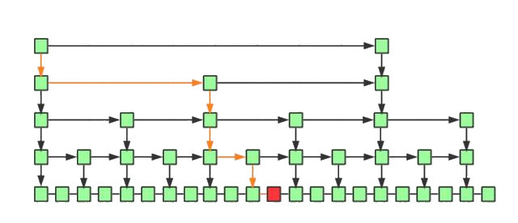

# 查找

## 什么是查找

查找是寻找一个元素处于所在容器的位置的过程。

显然，要搜索的信息必须首先以某种方式表示。为了简化问题，让我们假设我们想要搜索的是整数集合。
首先，让我们考虑：

1. 最明显和最简单的表示。
2. 使用该表示进行处理的两种潜在算法。

正如我们已经注意到的，数组是表示数字（或字符串等）集合的最简单的可能方式之一，因此我们将使用它来存储被查找信息。稍后我们将研究更复杂的数据结构，这些结构可以使存储和搜索效率更高。

例如，假设我们希望搜索的整数集是 {1,4,17,3,90,79,4,6,81}。我们可以将它们写在数组 a 中：
```
a = [1, 4, 17, 3, 90, 79, 4, 6, 81]
```
如果我们想知道`17`在这个数组中的什么位置，答案是`2`，即该元素的索引。如果我们问91在哪里? 答案还找不到的。  
我们能够用一个数字代表想要找到的位置, 找不到的我们用-1来表示。

## 查找算法

### 线性搜索

线性查找又称顺序查找，是一种最简单的查找方法，它的基本思想是从第一个记录开始，逐个比较记录的关键字，直到和给定的值相等，则查找成功；若比较结果与文件中n个记录的关键字都不等，则查找失败。

### 折半查找

人们总是需要考虑是否有可能改进一种性能特定算法，例如我们刚刚创建的算法。 在最坏的情况下，搜索一个大小为 n 的数组需要 n 个步骤。 平均而言，它需要 n/2 步。 对于大量数据集合，例如互联网上的所有网页，这在实践中是不可接受的。 因此，我们应该尝试更有效的算法。

这里我们将考虑最简单的一种: 我们仍然用数组表示集合，但现在我们按升序枚举元素。 因此，我们不使用之前的数组 [1, 4, 17, 3, 90, 79, 4, 6, 81]，而是使用与 [1, 3, 4, 4, 6, 17, 79, 81, 90] 具有相同的项目，但按升序排列。 然后我们可以使用一种改进的算法，其类似伪代码形式是：

```
// 这假设我们有一个大小为 n 的排序数组 a 和一个键 x。
// 使用整数 left 和 right（初始设置为 0 和 n-1）和 mid。
如果左边小于右边，
	将 mid 设置为 (left+right)/2 的整数部分，并且
如果 x 大于 a[mid]，
	那么 left = middle + 1
	否则 right = middle - 1
如果 a[left] 等于 x，
	那么 终止并且返回 left
	否则终止返回-1。
```

```c
/* data */
int a = [1,3,4,4,6,17,79,81,90];
Int n = 9;
int x = 79；
/* program */
int left = 0，right = n-1，midd；
while（left<righ）{
	mid = ( left + right ) / 2;
		if ( x > a[mid] ) 
      left = mid+1;
		else right = mid-1；
}
if ( a[left] == x ) 
  return left；
else 
  return -1；
```

该算法的工作原理是将数组重复分成两段，一段从左边开始到 mid，另一个从 mid + 1 到 right，其中 mid 是从中间的位置从左到右，其中，最初，左 t 和右是最左边和最右边的位置阵列。 因为数组是排序的，所以很容易看出每一对段中的哪一个已搜索的项目 x 在中，然后可以将搜索限制在该段中。 而且，因为子数组的大小从左到右的位置在每次迭代时减半。

对于 while 循环，我们只需要在平均或最坏情况下执行$ log_2 n$ 步。 看到这个在🌰中，运行时行为比早期的线性搜索算法有了很大的改进，请注意 log1000000 大约为 20，因此对于大小为 1000000 的数组只有 20在二进制搜索算法的最坏情况下需要迭代，而 1000000 是在线性搜索算法的最坏情况下需要。

值得考虑的是我们两种算法的链表版本是否可行，或者提供任何优势。 很明显，我们可以通过链接执行线性搜索以与数组基本相同的方式列出，返回相关指针而不是比一个索引。 将二分查找转换为链表形式是有问题的，因为有不是将链表分成两段的有效方法。 看来我们基于数组方法是迄今为止我们可以用我们研究过的数据结构做的最好的方法。 

### 折半查找算法示例

对静态查找表`{5,13,19,21,37,56,64,75,80,88,92}`采用折半查找算法查找关键字为 21 的过程为：

|  |
| :------------------------------: |
|      图 9-1 折半查找的过程       |


如上图 9-1所示，指针 low 和 high 分别指向查找表的第一个关键字和最后一个关键字，指针 mid 指向处于 low 和 high 指针中间位置的关键字。在查找的过程中每次都同 mid 指向的关键字进行比较，由于整个表中的数据是有序的，因此在比较之后就可以知道要查找的关键字的大致位置。

例如在查找关键字 21 时，首先同 56 作比较，由于`21 < 56`，而且这个查找表是按照升序进行排序的，所以可以判定如果静态查找表中有 21 这个关键字，就一定存在于 low 和 mid 指向的区域中间。

因此，再次遍历时需要更新 high 指针和 mid 指针的位置，令 high 指针移动到 mid 指针的左侧一个位置上，同时令 mid 重新指向 low 指针和 high 指针的中间位置。如图 9-2 所示：


|  |
| :------------------------------: |
|      图 9-2 折半查找的过程       |


同样，用 21 同 mid 指针指向的 19 作比较，`19 < 21`，所以可以判定 21 如果存在，肯定处于 mid 和 high 指向的区域中。所以令 low 指向 mid 右侧一个位置上，同时更新 mid 的位置。

||
|:-:|
|图 9-3 折半查找的过程|


当第三次做判断时，发现 mid 就是关键字 21 ，查找结束。

## 分块查找

分块查找是折半查找和顺序查找的一种改进方法，分块查找由于只要求索引表是有序的，对块内节点没有排序要求，因此特别适合于节点动态变化的情况。

折半查找虽然具有很好的性能，但其前提条件时线性表顺序存储而且按照关键码排序，这一前提条件在结点树很大且表元素动态变化时是难以满足的。而顺序查找可以解决表元素动态变化的要求，但查找效率很低。如果既要保持对线性表的查找具有较快的速度，又要能够满足表元素动态变化的要求，则可采用分块查找的方法。

分块查找的速度虽然不如折半查找算法，但比顺序查找算法快得多，同时又不需要对全部节点进行排序。当节点很多且块数很大时，对索引表可以采用折半查找，这样能够进一步提高查找的速度。

分块查找由于只要求索引表是有序的，对块内节点没有排序要求，因此特别适合于节点动态变化的情况。当增加或减少节以及节点的关键码改变时，只需将该节点调整到所在的块即可。在空间复杂性上，分块查找的主要代价是增加了一个辅助数组。

需要注意的是，当节点变化很频繁时，可能会导致块与块之间的节点数相差很大，没写快具有很多节点，而另一些块则可能只有很少节点，这将会导致查找效率的下降。

### 方法描述

分块查找要求把一个大的线性表分解成若干块，每块中的节点可以任意存放，但块与块之间必须排序。假设是按关键码值非递减的，那么这种块与块之间必须满足已排序要求，实际上就是对于任意的i，第i块中的所有节点的关键码值都必须小于第i+1块中的所有节点的关键码值。此外，还要建立一个索引表，把每块中的最大关键码值作为索引表的关键码值，按块的顺序存放到一个辅助数组中，显然这个辅助数组是按关键码值非递减排序的。查找时，首先在索引表中进行查找，确定要找的节点所在的块。由于索引表是排序的，因此，对索引表的查找可以采用顺序查找或折半查找；然后，在相应的块中采用顺序查找，即可找到对应的节点。

分块查找在现实生活中也很常用。例如，一个学校有很多个班级，每个班级有几十个学生。给定一个学生的学号，要求查找这个学生的相关资料。显然，每个班级的学生档案是分开存放的，没有任何两个班级的学生的学号是交叉重叠的，那么最好的查找方法实现确定这个学生所在的班级，然后再在这个学生所在班级的学生档案中查找这个学生的资料。上述查找学生资料的过程，实际上就是一个典型的分块查找。

### 分块查找的基本思想

+ 将查找表分为若干子块，要求所有这些块分块有序，即后一块中所有元素的关键码均大于前一块中所有元素的关键码（块间有序）；而每个块内的元素可以是无序的（块内无序）。
+ 另外要为这些块建立一个索引表。索引表中的每个元素均含有各块的最大关键字max_key以及该块在数据表中的起始位置（也就是各块中第一个元素的地址）。

分块查找的例子：


分块查找的过程分为两步：

在索引表中确定待查记录所在的块。由于块间有序，即索引表中的元素是有序的，故可以采用折半查找或顺序查找索引表；
在块内顺序查找该待查记录。由于块内无序，故只能采用顺序查找。
### 分块查找的平均查找长度
分块查找的平均查找长度为索引查找和块内查找的平均长度之和。

设长度为n的查找表均匀地分为b块，每块有s个记录，在概率相等的情况下，如果对索引表进行顺序查找，则

$$
ASL=\frac{(b+1)}{2}+\frac{(S+1)}{2}
$$

$$
s=\sqrt{n},ASL_{min}=\sqrt{n}+1
$$

## B-树

传统二叉搜索树的局限性可能令人沮丧。B树是一种多才多艺的数据结构，可以轻松处理大量数据。当涉及到存储和搜索大量数时，传统的二进制搜索树由于性能差和内存使用率高而变得不切实际。B树，也称为B树或平衡树，是一种专门为克服这些限制而设计的自平衡树。

与传统的二进制搜索树不同，B树的特点是它们可以在单个节点中存储大量的key，这就是为什么它们也被称为“大key”树。B树中的每个节点都可以包含多个键，这使得树具有更大的分支因子，从而具有更浅的高度。这种较浅的高度会减少磁盘I/O，从而加快搜索和插入操作。B树特别适合于具有缓慢、庞大数据访问的存储系统，如硬盘驱动器、闪存和CD-ROM。

在B-树中查找给定关键字的方法是，首先把根结点取来，在根结点所包含的关键字K1,…,Kn查找给定的关键字（可用顺序查找或二分查找法），若找到等于给定值的关键字，则查找成功；否则，一定可以确定要查找的关键字在Ki与Ki+1之间，Pi为指向子树根节点的指针，此时取指针Pi所指的结点继续查找，直至找到，或指针Pi为空时查找失败。

B树通过确保每个节点都有最小数量的键来保持平衡，因此树总是平衡的。这种平衡保证了插入、删除和搜索等操作的时间复杂性始终为O（logn），而与树的初始形状无关。

### B-树的时间复杂性

|  No  | Algorithm | Time Complexity |
| :--: | :-------: | :-------------: |
|  1.  |  Search   |   $O(log_2n)$   |
|  2.  |  Insert   |   $O(log_2n)$   |
|  3.  |  Delete   |   $O(log_2n)$   |

### B-树的例子


我们可以在上图中看到，所有的叶节点都在同一级别，所有的非叶节点都没有空子树，并且其关键字比其子节点的数量少一个。

### B树的特征

**一棵m阶的B 树 (m叉树)的特性如下**

1. 根节点至少有两个孩子 。
2. 每个非根节点至少有「M/2（上取整）个孩子，至多有M个孩子。
3. 每个**叶子节点** 至少有 M/2-1（上取整）个关键字，至多有 M-1 个关键字。并以升序排列。（注：叶子节点是没有孩子）
4. key[i] 和 key[i+1] 之间的孩子节点的值介于 key[i] 和 key[i+1] 之间。
5. 所有的叶子节点都在同一层。

### B树中的遍历

遍历也类似于二叉树的有序遍历。我们从最左边的子项开始，递归地打印最左边的个子项，然后对其余的子项和键重复相同的过程。最后，递归地打印最右边的子项。

### B树中的搜索操作

搜索类似于二进制搜索树中的搜索。让要搜索的key为k。

- 从根开始，递归向下遍历。

- 对于每个访问的非叶节点，

- 如果节点有key，我们只需返回该节点。

- 否则，我们向下递归到节点的相应子节点（位于第一个较大键之前的子节点）。

- 如果我们到达一个叶节点，但在叶节点中找不到k，那么返回NULL。

搜索B-树类似于搜索二叉树。该算法与递归算法相似。在每个级别上，搜索都被优化，就好像键值不在父级的范围内，而键在另一个分支中一样。由于这些值限制了搜索，它们也被称为限制值或分离值。如果我们到达一个叶节点，但没有找到所需的键，那么它将显示NULL。


### 在B-树中搜索元素的算法


 

 


例如有M阶B树

B-tree，即B树，而不要读成B减树，它是一种多路搜索树（**并不是二叉的**）：

+ 定义任意非叶子结点最多只有M个儿子，M-1个关键字。且M>2
+ 根结点的儿子数为[2, M]
+ 每个非根结点存放至少$⌈\frac{M}{2}⌉-1$和至多M-1个关键字（至少2个关键字）
+ 非叶子结点的关键字：K[1], K[2], …, K[M-1]；且K[i] < K[i+1]
+ 非叶子结点的指针：P[1], P[2], …, P[M]；其中P[1]指向关键字小于K[1]的子树，P[M]指向关键字大于K[M-1]的子树，其它P[i]指向关键字属于(K[i-1], K[i])的子树
+ 一个非叶节点的子节点数等于其中的关键字数加上1
+ 节点的所有键都按递增顺序排序。两个键k1和k2之间的子键包含从k1到k2范围内的所有键。
+ B树从根开始生长和收缩，这与二进制搜索树不同。二进制搜索树向下生长，也从向下收缩。
+ 与其他平衡的二进制搜索树一样，搜索、插入和删除的时间复杂度为O（logn）。
+ B树中节点的插入仅发生在叶节点处。

#### B-树的搜索

从根结点开始，对结点内的关键字（有序）序列进行二分查找，如果命中则结束，否则进入查询关键字所属范围的儿子结点；重复，直到所对应的儿子指针为空，或已经是叶子结点；

#### B-树的特性

+ 关键字集合分布在整颗树中；
+ 任何一个关键字出现且只出现在一个结点中；
+ 搜索有可能在非叶子结点结束；
+ 其搜索性能等价于在关键字全集内做一次二分查找；
+ 自动层次控制；

　　由于限制了除根结点以外的非叶子结点，至少含有M/2个儿子，确保了结点的至少利用率，其最低搜索性能为：$O(log_2N)$

　　**所以B-树的性能总是等价于二分查找（与M值无关），也就没有B树平衡的问题**；

由于M/2的限制，在插入结点时，**如果结点已满，需要将结点分裂为两个各占M/2的结点；删除结点时，需将两个不足M/2的兄弟结点合并；**

## 跳表(skiplist)

跳表全称为跳跃列表，它允许快速查询，插入和删除一个有序连续元素的数据链表。跳跃列表的平均查找和插入时间复杂度都是O(logn)。快速查询是通过维护一个多层次的链表，且每一层链表中的元素是前一层链表元素的子集（见右边的示意图）。一开始时，算法在最稀疏的层次进行搜索，直至需要查找的元素在该层两个相邻的元素中间。这时，算法将跳转到下一个层次，重复刚才的搜索，直到找到需要查找的元素为止。


一张跳跃列表的示意图。每个带有箭头的框表示一个指针, 而每行是一个稀疏子序列的链表；底部的编号框（黄色）表示有序的数据序列。查找从顶部最稀疏的子序列向下进行, 直至需要查找的元素在该层两个相邻的元素中间。

### 跳表的演化过程

对于单链表来说，即使数据是已经排好序的，想要查询其中的一个数据，只能从头开始遍历链表，这样效率很低，时间复杂度很高，是 O(n)。 那我们有没有什么办法来提高查询的效率呢？我们可以为链表建立一个“索引”，这样查找起来就会更快，如下图所示，我们在原始链表的基础上，每两个结点提取一个结点建立索引，我们把抽取出来的结点叫作**索引层**或者**索引**，down 表示指向原始链表节点的指针。


现在如果我们想查找一个数据，比如说 15，我们首先在索引层遍历，当我们遍历到索引层中值为 14 的结点时，我们发现下一个结点的值为 17，所以我们要找的 15 肯定在这两个结点之间。这时我们就通过 14 结点的 down 指针，回到原始链表，然后继续遍历，这个时候我们只需要再遍历两个结点，就能找到我们想要的数据。好我们从头看一下，整个过程我们一共遍历了 7 个结点就找到我们想要的值，如果没有建立索引层，而是用原始链表的话，我们需要遍历 10 个节点。

通过这个例子我们可以看出来，通过建立一个索引层，我们查找一个基点需要遍历的次数变少了，也就是查询的效率提高了。

那么如果我们给索引层再加一层索引呢？遍历的节点会不会更少呢，效率会不会更高呢？我们试试就知道了。


现在我们再来查找 15，我们从第二级索引开始，最后找到 15，一共遍历了 6 个节点，果然效率更高。

当然，因为我们举的这个例子数据量很小，所以效率提升的不是特别明显，如果数据量非常大的时候，我们多建立几层索引，效率提升的将会非常的明显，感兴趣的可以自己试一下，这里我们就不举例子了。

这种通过对链表加多级索引的结构，就是跳表了。

### 跳表具体有多快

通过上边的例子我们知道，跳表的查询效率比链表高，那具体高多少呢？下面我们一起来看一下。

衡量一个算法的效率我们可以用时间复杂度，这里我们也用时间复杂度来比较一下链表和跳表。前面我们已经讲过了，链表的查询的时间复杂度为 O(n)，那跳表的呢？

如果一个链表有 n 个结点，如果每两个结点抽取出一个结点建立索引的话，那么第一级索引的节点数大约就是 n/2，第二级索引的结点数大约为 n/4，以此类推第 m 级索引的节点数大约为 n/(2^m)。

假如一共有 m 级索引，第 m 级的节点数为两个，通过上边我们找到的规律，那么得出 n/(2^m)=2，从而求得 m=log(n)-1。如果加上原始链表，那么整个跳表的高度就是 log(n)。我们在查询跳表的时候，如果每一层都需要遍历 k 个结点，那么最终的时间复杂度就为 $O(klog_2n)$。

那这个 k 值为多少呢，按照我们每两个结点提取一个基点建立索引的情况，我们每一级最多需要遍历两个个结点，所以 k=2。为什么每一层最多遍历两个节点呢？

因为我们是每两个结点提取一个结点建立索引，最高一级索引只有两个结点，然后下一层索引比上一层索引两个结点之间增加了一个结点，也就是上一层索引两结点的中值，看到这里是不是想起来我们前边讲过的二分查找，每次我们只需要判断要找的值在不在当前结点和下一个节点之间即可。




如上图所示，我们要查询红色结点，我们查询的路线即黄线表示出的路径查询，每一级最多遍历两个节点即可。

所以跳表的查询任意数据的时间复杂度为 O(2*log(n))，前边的常数 2 可以忽略，为 O(log(n))。


### 跳表是用空间来换时间

跳表的效率比链表高了，但是跳表需要额外存储多级索引，所以需要的更多的内存空间。

跳表的空间复杂度分析并不难，如果一个链表有 n 个结点，如果每两个结点抽取出一个结点建立索引的话，那么第一级索引的节点数大约就是 n/2，第二级索引的结点数大约为 n/4，以此类推第 m 级索引的节点数大约为 n/(2^m)，我们可以看出来这是一个等比数列。

这几级索引的结点总和就是 n/2+n/4+n/8…+8+4+2=n-2，所以跳表的空间复杂度为 o(n)。

那么我们有没有办法减少索引所占的内存空间呢？可以的，我们可以每三个结点抽取一个索引，或者没五个结点抽取一个索引。这样索引节点的数量减少了，所占的空间也就少了。

### 跳表的插入和删除

我们想要为跳表插入或者删除数据，我们首先需要找到插入或者删除的位置，然后执行插入或删除操作，前边我们已经知道了，跳表的查询的时间复杂度为 O(logn），因为找到位置之后插入和删除的时间复杂度很低，为 O(1)，所以最终插入和删除的时间复杂度也为 O(longn)。

我么通过图看一下插入的过程。


删除操作的话，如果这个结点在索引中也有出现，我们除了要删除原始链表中的结点，还要删除索引中的。因为单链表中的删除操作需要拿到要删除节点的前驱结点，然后通过指针操作完成删除。所以在查找要删除的结点的时候，一定要获取前驱结点。当然，如果我们用的是双向链表，就不需要考虑这个问题了。

如果我们不停的向跳表中插入元素，就可能会造成两个索引点之间的结点过多的情况。结点过多的话，我们建立索引的优势也就没有了。所以我们需要维护索引与原始链表的大小平衡，也就是节点增多了，索引也相应增加，避免出现两个索引之间结点过多的情况，查找效率降低。

跳表是通过一个随机函数来维护这个平衡的，当我们向跳表中插入数据的的时候，我们可以选择同时把这个数据插入到索引里，那我们插入到哪一级的索引呢，这就需要随机函数，来决定我们插入到哪一级的索引中。

这样可以很有效的防止跳表退化，而造成效率变低。

## 并查集(Union-Find Set)

### 什么是并查集

正如它的名字一样，并查集（Union-Find）就是用来对集合进行 合并（Union） 与 查询（Find） 操作的一种数据结构。

+ 合并 就是将两个不相交的集合合并成一个集合。
+ 查询 就是查询两个元素是否属于同一集合。

### 并查集的优越性

对于如下图所示的两个集合，如果我们要判断H和A是否在同一个集合中，我们需要遍历A所在的集合，并逐一判断当前节点是否是H节点，直到最后遍历完整个圆形集合，才能判断出H节点不在这个集合中。

同样的，如果我们需要合并两个集合，就需要遍历整个矩形的集合，将里面的节点一个一个加入到矩形集合中。两者都是 O (N) 的复杂度。


同样的，如果我们需要合并两个集合，就需要遍历整个矩形的集合，将里面的节点一个一个加入到圆形集合中。两者都是O(N) 的复杂度。但倘若我们在生成集合的时候，就人为地将集合中的元素之间创建某种关联，使它们具有共同的头结点，那么查询和合并的操作将会省时很多。

就拿刚刚的两个集合举例，在创建集合的过程中，为节点之间创建「联系」，形成如下图的结构：


可以发现，最终生成的这个结构其实就是一个树形结构

这也就意味着一个集合中的所有节点都可以找到同一个头结点。此时合并和查询操作将变得异常简单：

+ 查询：只需要判断两个元素是否具有相同的头结点。
+ 合并：只需要将一个集合的头结点挂到另一个集合的头结点下即可。

可以发现，上述两个操作的时间复杂度都与“获取头结点”这一过程，也就是树的高度有关。因此，假如生成的树只有有限高度的话，合并和查询的操作都是 O(1) 的时间复杂度。

但是话又说回来，假如生成的树的高度与集合元素个数相同，那合并和查询操作的时间复杂度就和遍历的方式差不多。


在上图所示的最差情况下，合并和查询的时间复杂度都是 O (N)。

因此，如何减少树的高度直接决定着并查集的性能如何。那么如何尽量减少树的高度呢？

### 并查集的优化

#### 按秩合并

在最原始的状态下，每个点自己就是一个集合，它们的指针都指向自己。就像是一片草原上的几个原始部落，一开始他们之间毫无瓜葛，各自为政，自己就是自己的主人。


但这片草原一共就这么大点，随着某几个部落逐渐繁荣兴盛，他们的地盘也愈发显得局促，因此他们开始互相征战，吞并其他的部落形成更大的部落。在战争中落败的一方就认另一方作为首领。


经过几轮兼并，现在草原上只剩下两个规模比较大的部落，此时两个部落继续进行战争，圆形方凭借自身庞大的兵力轻松取胜，将矩形方纳入麾下，并形成如下的组织结构：


组织上离最高首领最远的B、F两个部落如果想要向A传达信息，只需要经过自己的上司D或E一个节点就可以。但战争往往不总是尽如人意，矩形方偏偏就凭借战士们顽强的意志，拿下了这场战争的胜利，将圆形方吞并。此时就会形成如下的组织结构：


这时就出现问题了，距离最高首领最远的B如果想要向E传达消息，就需要经过D、A两个上司，这样的效率显然不如之前一种组织结构。我们的并查集也是如此，当两棵深度不同的树进行合并时，往往将深度较小的树挂载到深度较大的树下，因为这样形成的树深度更小，在寻找头结点时也就有更高的效率。在执行合并操作时，将更小的树连接到更大的树上，这样的优化方式就称为「按秩合并」。

#### 路径压缩

随着部落日渐壮大，组织结构也越来越复杂，最底层的部落如果要向最高首领传递信息，需要经过好几个中间部落。此时我们的最高首领觉得自己的统治地位受到了威胁，因为中间经过的节点越多，自己对底层部落的控制力就越弱。所以他要想办法将底层部落的控制权全都收归自己所有。


但首领并不知道自己麾下到底有多少部落，所以他颁布了一条法令：有任何部落要跟他汇报信息，都要带上他的上司一起来，他的上司也要带上他上司的上司。并且以后他们都直接向最高首领进行汇报，不用再经过其他节点。

此时上图中的部落G想要向A汇报信息，沿途会经过E、B、D，最后到达A


按照规定，从今往后，G、E、B、D都直接向A汇报，无需再经过其他节点。


此时，树的高度就减小了很多，效率也会大大提升。在执行查找的过程中，扁平化树的结构，这样的优化方式称为「路径压缩」。在并查集中同时使用上面的这两种优化方法，会将查找与合并的平均时间复杂度降低到常数水平（渐进最优算法）。

## 哈希表（散列表）（重点）

### 哈希表的构建

在初中的数学课本中学习过函数的相关知识，给定一个 x，通过一个数学公式，只需要将 x 的值带入公式就可以求出一个新的值 y。

哈希表的建立同函数类似，把函数中的 x 用查找记录时使用的关键字来代替，然后将关键字的值带入一个精心设计的公式中，就可以求出一个值，用这个值来表示记录存储的哈希地址。即：

数据的哈希地址=f(关键字的值)

> 哈希地址只是表示在查找表中的存储位置，而不是实际的物理存储位置。f(x）是一个函数，通过这个函数可以快速求出该关键字对应的的数据的哈希地址，称之为“哈希函数”。

散列技术是在记录的存储位置和它的关键字之间建立一个确定的对应关系f，使得每个关键字***\*key对应一个存储位置f（key）\****。查找时，根据这个确定的对应关系找到给***定值key的映射f（key），若查找集合中存在这个记录，则必定在f（key）的位置上。

这里我们把这种对应关系f称为***散列函数，又称为*哈希（Hash）函数。按这个思想，采用散列技术将记录存储在一块连续的存储空间中，这块连续存储空间称为散列表或哈希表（Hash table）。那么关键字对应的记录存储位置我们称为散列地址。

例如，这里有一个电话簿（查找表），电话簿中有 4 个人的联系方式：

| 姓名 | 张3         | 李四        | 王7         | 赵114514    |
| ---- | ----------- | ----------- | ----------- | ----------- |
| 电话 | 13912345678 | 15823457890 | 13409872338 | 13805834722 |

假如想查找李四的电话号码，对于一般的查找方式最先想到的是从头遍历，一一比较。而如果将电话簿构建成一张哈希表，可以直接通过名字“李四”直接找到电话号码在表中的位置。

在构建哈希表时，最重要的是哈希函数的设计。例如设计电话簿案例中的哈希函数为：每个名字的姓的首字母的 ASCII 值即为对应的电话号码的存储位置。这时会发现，张3和赵114514两个关键字的姓的首字母都是 Z ，最终求出的电话号码的存储位置相同，这种现象称为冲突。在设计哈希函数时，要尽量地避免冲突现象的发生。

> 对于哈希表而言，冲突只能尽可能地少，无法完全避免。

### 哈希函数的构造

#### 构造要求

1. 计算简单

   你说设计一个算法可以保证所有的关键字都不会产生冲突，但是这个算法需要很复杂的计算，会耗费很多时间，这对于需要频繁地查找来说，就会大大降低查找的效率了。因此散列函数的计算时间不应该超过其他查找技术与关键字比较的时间。

2. 散列地址分布均匀

   我们刚才也提到冲突带来的问题，最好的办法就是尽量让散列地址均匀地分布在存储空间中，这样可以保证存储空间的有效利用，并减少为处理冲突而耗费的时间。

常用的哈希函数的构造方法有 6 种：直接定址法、数字分析法、平方取中法、折叠法、除留余数法和随机数法。

+ 直接定址法

其哈希函数为一次函数，即以下两种形式：

$H（key）= key $ 或者 $H（key）=a * key + b$

其中 H（key）表示关键字为 key 对应的哈希地址，a 和 b 都为常数。例如有一个从 1 岁到 100 岁的人口数字统计表，如表所示：

| 地址 | 01   | 02   | 03   | ...  | 25   | 26   | 27   | ...  |
| ---- | ---- | ---- | ---- | ---- | ---- | ---- | ---- | :--: |
| 年龄 | 1    | 2    | 3    | ...  | 25   | 26   | 27   | ...  |
| 人数 | 3000 | 2000 | 5000 | ...  | 1050 | 2050 | 3300 | ...  |

假设其哈希函数为第一种形式，其关键字的值表示最终的存储位置。若需要查找年龄为 25 岁的人口数量，将年龄 25 带入哈希函数中，直接求得其对应的哈希地址为 25（求得的哈希地址表示该记录的位置在查找表的第 25 位）。

数字分析法:如果关键字由多位字符或者数字组成，就可以考虑抽取其中的 2 位或者多位作为该关键字对应的哈希地址，在取法上尽量选择变化较多的位，避免冲突发生。

例如表中列举的是一部分关键字，每个关键字都是有 8 位十进制数组成：


通过分析关键字的构成，很明显可以看到关键字的第 1 位和第 2 位都是固定不变的，而第 3 位不是数字 3 就是 4，最后一位只可能取 2、7 和 5，只有中间的 4 位其取值近似随机，所以为了避免冲突，可以从 4 位中任意选取 2 位作为其哈希地址。

平方取中法是对关键字做平方操作，取中间得几位作为哈希地址。此方法也是比较常用的构造哈希函数的方法。

例如关键字序列为`{421，423，436}`，对各个关键字进行平方后的结果为`{177241，178929，190096}`，则可以取中间的两位`{72，89，00}`作为其哈希地址。

折叠法是将关键字分割成位数相同的几部分（最后一部分的位数可以不同），然后取这几部分的叠加和（舍去进位）作为哈希地址。此方法适合关键字位数较多的情况。

例如，在图书馆中图书都是以一个 10 位的十进制数字为关键字进行编号的，若对其查找表建立哈希表时，就可以使用折叠法。

若某书的编号为：0-442-20586-4，分割方式如图 1 中所示，在对其进行折叠时有两种方式：一种是移位折叠，另一种是间界折叠：

- 移位折叠是将分割后的每一小部分，按照其最低位进行对齐，然后相加，如图 （a）；
- 间界折叠是从一端向另一端沿分割线来回折叠，如图（b）。


+ 除留余数法

  此方法为最常用的构造散列函数方法。对于散列表长为m的散列函数公式为：f(key)=key mod p(p≤m)mod是取模（求余数）的意思。
  
  很显然，本方法的关键就在于选择合适的p，p如果选得不好，就可能会容易产生同义词。
  
  例如下表，我们对于有12个记录的关键字构造散列表时，就用了f(key)=key mod 12的方法。比如29 mod 12=5，所以它存储在下标为5的位置。
  
  | 下标   | 0    | 1    | 2    | 3    | 4    | 5    | 6    | 7    | 8    | 9    | 10   | 11   |
  | ------ | ---- | ---- | ---- | ---- | ---- | ---- | ---- | ---- | ---- | ---- | ---- | ---- |
  | 关键字 | 12   | 25   | 38   | 15   | 16   | 29   | 78   | 67   | 56   | 21   | 22   | 47   |
  
  不过这也是存在冲突的可能的，因为12=2×6=3×4。如果关键字中有像18(3×6)、30(5×6)、42(7×6)等数字，它们的余数都为6，这就和78所对应的下标位置冲突了。
  
  甚至极端一些，对于下表的关键字，如果我们让p为12的话，就可能出现下面的情况，所有的关键字都得到了0这个地址数。
  
  | 下标   | 0    | 0    | 0    | 0    | 0    | 0    | 0    | 0    | 0    | 0    | 0    | 0    |
  | ------ | ---- | ---- | ---- | ---- | ---- | ---- | ---- | ---- | ---- | ---- | ---- | ---- |
  | 关键字 | 12   | 24   | 36   | 48   | 60   | 72   | 84   | 96   | 108  | 120  | 132  | 144  |
  
  我们不选用p=12来做除留余数法，而选用p=11，如下表所示。
  
  此就只有12和144有冲突，相对来说，就要好很多。
  
  | 下标   | 1    | 2    | 3    | 4    | 5    | 6    | 7    | 8    | 9    | 10   | 0    | 1    |
  | ------ | ---- | ---- | ---- | ---- | ---- | ---- | ---- | ---- | ---- | ---- | ---- | ---- |
  | 关键字 | 12   | 24   | 36   | 48   | 60   | 72   | 84   | 96   | 108  | 120  | 132  | 144  |
  
  因此根据前辈们的经验，若散列表表长为m，通常p为小于或等于表长（最好接近m）的最小质数或不包含小于20质因子的合数。

> 在此方法中，对于 p 的取值非常重要，由经验得知 p 可以为不大于 m 的质数或者不包含小于 20 的质因数的合数。

+ 折叠法

  折叠法是将关键字从左到右分割成位数相等的几部分（注意最后一部分位数不够时可以短些），然后将这几部分叠加求和，并按散列表表长，取后几位作为散列地址。比如我们的关键字是9876543210，散列表表长为三位，我们将它分为四组，987|654|321|0，然后将它们叠加求和987+654+321+0=1962，再求后3位得到散列地址为962。有时可能这还不能够保证分布均匀，从一端向另一端来回折叠后对齐相加。比如我们将987和321反转，再与654和0相加，变成789+654+123+0=1566，此时散列地址为566。折叠法事先不需要知道关键字的分布，适合关键字位数较多的情况。


+ 随机数法

  选择一个随机数，取关键字的随机函数值为它的散列地址。也就是`f(key)=random(key)`。这里random是随机函数。当关键字的长度不等时，采用这个方法构造散列函数是比较合适的。有同学问，那如果关键字是字符串如何处理？其实无论是英文字符，还是中文字符，也包括各种各样的符号，它们都可以转化为某种数字来对待，比如ASCII码或者Unicode码等，因此也就可以使用上面的这些方法。总之，现实中，应该视不同的情况采用不同的散列函数。我们只能给出一些考虑的因素来提供参考： 

  1.计算散列地址所需的时间。 

  2.关键字的长度。 

  3.散列表的大小。 
  
  4.关键字的分布情况。 
  
  5.记录查找的频率。综合这些因素，才能决策选择哪种散列函数更合适。
  
+ 平方取中法

  这个方法计算很简单，假设关键字是1234，那么它的平方就是1522756，再抽取中间的3位就是227，用做散列地址。再比如关键字是4321，那么它的平方就是18671041，抽取中间的3位就可以是671，也可以是710，用做散列地址。平方取中法比较适合于不知道关键字的分布，而位数又不是很大的情况。

注意：这里的随机函数其实是伪随机函数，随机函数是即使每次给定的 key 相同，但是 H（key）都是不同；而伪随机函数正好相反，每个 key 都对应的是固定的 H（key）。

如此多的构建哈希函数的方法，在选择的时候，需要根据实际的查找表的情况采取适当的方法。通常考虑的因素有以下几方面：

- 关键字的长度。如果长度不等，就选用随机数法。如果关键字位数较多，就选用折叠法或者数字分析法；反之如果位数较短，可以考虑平方取中法；
- 哈希表的大小。如果大小已知，可以选用除留余数法；
- 关键字的分布情况；
- 查找表的查找频率；
- 计算哈希函数所需的时间（包括硬件指令的因素）

### 处理冲突的方法

对于哈希表的建立，需要选取合适的哈希函数，但是对于无法避免的冲突，需要采取适当的措施去处理。

通常用的处理冲突的方法有以下几种：

- 开放定址法 

  H（key）=（H（key）+ d）MOD m（其中 m 为哈希表的表长，d 为一个增量） 当得出的哈希地址产生冲突时，选取以下 3 种方法中的一种获取 d 的值，然后继续计算，直到计算出的哈希地址不在冲突为止，这 3 种方法为：
  
  - 线性探测法：d=1，2，3，…，m-1
  - 二次探测法：d=$1^2$，-$1^2$，$+2^2$，-$2^2$，+$3^2$，…
  - 伪随机数探测法：d=伪随机数

  例如，在长度为 11 的哈希表中已填写好 17、60 和 29 这 3 个数据（如图 2（a） 所示），其中采用的哈希函数为：H（key）=key MOD 11，现有第 4 个数据 38 ，当通过哈希函数求得的哈希地址为 5，与 60 冲突，则分别采用以上 3 种方式求得插入位置如图 9-21（b）所示：
  
|  |
| :----------------------------------------------------------: |
|                            图9-21                            |

  注释：在线性探测法中，当遇到冲突时，从发生冲突位置起，每次 +1，向右探测，直到有空闲的位置为止；二次探测法中，从发生冲突的位置起，按照 +$1^2$，$-1^2$，$+2^2$，…如此探测，直到有空闲的位置；伪随机探测，每次加上一个随机数，直到探测到空闲位置结束。


- 再散列函数法
  
  我们继续用买房子来举例，如果你看房时的选择标准总是以市中心、交通便利、价格适中为指标，这样的房子凤毛麟角，基本上当你看到时，都已经被人买去了。
  
  我们不妨换一种思维，选择市郊的房子，交通尽管要差一些，但价格便宜很多，也许房子还可以买得大一些、质量好一些，并且由于更换了选房的想法，很快就找到了你需要的房子了。
  
  对于我们的散列表来说，我们事先准备多个散列函数。
  
  $$
  f_i(key)=RH_i(key)(i=1,2,...,k)
  $$
  
  这里RHi就是不同的散列函数，你可以把我们前面说的什么除留余数、折叠、平方取中全部用上。每当发生散列地址冲突时，就换一个散列函数计算，相信总会有一个可以把冲突解决掉。这种方法能够使得关键字不产生聚集，当然，相应地也增加了计算的时间。
  
- 链地址法

  将具有相同哈希地址的元素（或记录）存储在同一个线性链表中。 链地址法是一种更加常用的哈希冲突解决方法。相比于开放地址法，链地址法更加简单。 假设哈希函数产生的哈希地址区间为 [0, m - 1]，哈希表的表长为 m。则可以将哈希表定义为一个有 m 个头节点组成的链表指针数组 T。

  这样在插入关键字的时候，只需要通过哈希函数 Hash(key) 计算出对应的哈希地址 i，然后将其以链表节点的形式插入到以 T[i] 为头节点的单链表中。在链表中插入位置可以在表头或表尾，也可以在中间。如果每次插入位置为表头，则插入操作的时间复杂度为 O(1)。

  而在在查询关键字的时候，只需要通过哈希函数 Hash(key) 计算出对应的哈希地址 i，然后将对应位置上的链表整个扫描一遍，比较链表中每个链节点的键值与查询的键值是否一致。查询操作的时间复杂度跟链表的长度 k 成正比，也就是 O(k)。对于哈希地址比较均匀的哈希函数来说，理论上讲，k= n//m，其中 n 为关键字的个数，m 为哈希表的表长。

  将所有产生冲突的关键字所对应的数据全部存储在同一个线性链表中。例如有一组关键字为`{19,14,23,01,68,20,84,27,55,11,10,79}`，其哈希函数为：$ H(key)=key MOD 13$，使用链地址法所构建的哈希表图所示： 

  
  
  

- 开放定址法

  开放定址法就是一旦发生了冲突，就去寻找下一个空的散列地址，只要散列表足够大，空的散列地址总能找到，并将记录存入。

  它的公式是：$f_i(key)=(f(key)+di)MOD m(di=1,2,3,......,m-1)$

  包括

  + 线性探测法：$F(i) = 1, 2, 3, …, m - 1$
  + 二次探测法：$F(i) = 1^2, -1^2, 2^2, -2^2, …, n^2(n ≤ m / 2)$
  + 伪随机数序列：$F(i) = 伪随机数序列$

  比如说，我们的关键字集合为{12,67,56,16,25,37,22,29,15,47,48,34}，表长为12。我们用散列函数f(key)=key mod 12。当计算前5个数{12,67,56,16,25}时，都是没有冲突的散列地址，直接存入，如下表所示：

  | 下标   | 0    | 1    | 2    | 3    | 4    | 5    | 6    | 7    | 8    | 9    | 10   | 11   |
  | ------ | ---- | ---- | ---- | ---- | ---- | ---- | ---- | ---- | ---- | ---- | ---- | ---- |
  | 关键字 | 12   | 25   |      |      | 16   |      |      | 67   | 56   |      |      |      |

  计算key=37时，发现f(37)=1，此时就与25所在的位置冲突。于是我们应用上面的公式f(37)=(f(37)+1)mod 12=2。于是将37存入下标为2的位置。这其实就是房子被人买了于是买下一间的作法，如下表所示。

  | 下标   | 0    | 1    | 2    | 3    | 4    | 5    | 6    | 7    | 8    | 9    | 10   | 11   |
  | ------ | ---- | ---- | ---- | ---- | ---- | ---- | ---- | ---- | ---- | ---- | ---- | ---- |
  | 关键字 | 12   | 25   | 37   |      | 16   |      |      | 67   | 56   |      | 22   |      |

  下来22,29,15,47都没有冲突，正常的存入，如下表所示。

  | 下标   | 0    | 1    | 2    | 3    | 4    | 5    | 6    | 7    | 8    | 9    | 10   | 11   |
  | ------ | ---- | ---- | ---- | ---- | ---- | ---- | ---- | ---- | ---- | ---- | ---- | ---- |
  | 关键字 | 12   | 25   | 37   | 15   | 16   | 29   |      | 67   | 56   |      | 22   | 47   |

  到了key=48，我们计算得到f(48)=0，与12所在的0位置冲突了，不要紧，我们f(48)=(f(48)+1)mod 12=1，此时又与25所在的位置冲突。于是f(48)=(f(48)+2)mod 12=2，还是冲突……一直到f(48)=(f(48)+6)mod 12=6时，才有空位，机不可失，赶快存入，如下表所示。

  | 下标   | 0    | 1    | 2    | 3    | 4    | 5    | 6    | 7    | 8    | 9    | 10   | 11   |
  | ------ | ---- | ---- | ---- | ---- | ---- | ---- | ---- | ---- | ---- | ---- | ---- | ---- |
  | 关键字 | 12   | 25   | 37   | 15   | 16   | 29   | 48   | 67   | 56   |      | 22   | 47   |

  我们把这种解决冲突的开放定址法称为线性探测法。

  从这个例子我们也看到，我们在解决冲突的时候，还会碰到如48和37这种本来都不是同义词却需要争夺一个地址的情况，我们称这种现象为堆积。很显然，堆积的出现，使得我们需要不断处理冲突，无论是存入还是查找效率都会大大降低。

  总之，开放定址法只要在散列表未填满时，总是能找到不发生冲突的地址，是我们常用的解决冲突的办法。

- 公共溢出区法

  这个方法其实就更加好理解，你不是冲突吗？好吧，凡是冲突的都跟我走，我给你们这些冲突找个地儿待着。这就如同孤儿院收留所有无家可归的孩子一样，我们为所有冲突的关键字建立了一个公共的溢出区来存放。

  就前面的例子而言，我们共有三个关键字{37,48,34}与之前的关键字位置有冲突，那么就将它们存储到溢出表中，如下图所示。

  | 基本表 | 12   | 25   | ^    | 15   | 16   | 29   | ^    | 67   | 57   | ^^   | 22   | 47   |
  | ------ | ---- | ---- | ---- | ---- | ---- | ---- | ---- | ---- | ---- | ---- | ---- | ---- |
  | 溢出表 | 37   | 48   | 34   | ^    | ^    | ^    | ^    | ^    | ^    | ^    | ^    | ^    |
  | 索引   | 0    | 1    | 2    | 3    | 4    | 5    | 6    | 7    | 8    | 9    | 10   | 11   |

  在查找时，对给定值通过散列函数计算出散列地址后，先与基本表的相应位置进行比对，如果相等，则查找成功；如果不相等，则到溢出表去进行顺序查找。如果相对于基本表而言，有冲突的数据很少的情况下，公共溢出区的结构对查找性能来说还是非常高的。
  

### 哈希表ASL计算方法

假设查找成功的

|关键字序列|（7、8、30、11、18、9、14）|
|:-:|:-:|
|散列函数| $H(Key) = (key * 3) MOD 7$|
|装载因子| 0.7|
|处理冲突|线性探测再散列法|

因为现在的数据是7个，填充因子是0.7。所以数组大小=7/0.7=10，即写出来的散列表大小为10，下标从0~9。 

1. 第一个元素7，带入散列函数，计算得0。 

2. 第二个元素8，带入散列函数，计算得3。 

3. 第三个元素30，带入散列函数，计算得6。 

4. 第四个元素11，带入散列函数，计算得5。 

5. 第五个元素18，带入散列函数，计算得5；此时和11冲突，使用线性探测法，得7。 

6. 第六个元素9，带入散列函数，计算得6；此时和30冲突，使用线性探测法，得8。 

7. 第七个元素14，带入散列函数，计算得0；此时和7冲突，使用线性探测法，得1。 

   所以**散列表**：

| 地址    | 0    | 1    | 2    | 3    | 4    | 5    | 6    | 7    | 8    | 9    |
| ------- | ---- | ---- | ---- | ---- | ---- | ---- | ---- | ---- | ---- | ---- |
| **key** | 7    | 14   |      | 8    |      | 11   | 30   | 18   | 9    |      |

所以查找成功的计算： 

1. 如果查找7，则需要查找1次。 

2. 如果查找8，则需要查找1次。 

3. 如果查找30，则需要查找1次。 

4. 如果查找11，则需要查找1次。 

5. 如果查找18，则需要查找3次：第一次查找地址5，第二次查找地址6，第三次查找地址7，查找成功。 

6. 如果查找9，则需要查找3次：第一次查找地址6，第二次查找地址7，第三次查找地址8，查找成功。 

7. 如果查找地址14，则需要查找2次：第一次查找地址0，第二次查找地址1，查找成功。 

   所以，**ASL=(1+2+1+1+1+3+3)/ 7=12/7**

------

**查找不成功的ASL计算方法：**

> 鉴于网络上有各种版本，本人认为此种计算方法比较合理。验证实例可以参考2010年的计算机408考研真题的第一道计算大题和答案。

1. 定义什么叫查找不成功
   举个例子来说吧。在已知上面散列表的基础上，如果要查找**key为4**的关键字。根据散列函数可以计算Hash(key)=Hash(4)=5。此时在地址为5的地方取出那个数字，发现key=11，不等于4。这就说明在装填的时候会发生冲突。根据冲突处理方法，会继续检测地址为6的值，发现key=30，依然不等。这个时候到了**地址为6**，但是**依然没有找到**。那么就说明根本就没有key=4这个关键字，**说明本次查找不成功。**注意：为什么到地址6？因为散列函数中有 mod7 ，对应的地址为0\~6，即0\~6查找失败的查找次数。 
   
   再举一个例子。查找**key为0**的关键字，根据散列函数可以计算Hash(key)=Hash(0)=0。此时在地址为0的地方取出那个数字，发现key=7，不等于0。这就说明在装填的时候会发生冲突。根据冲突处理方法，会继续检测地址为1的值，发现key=14，依然不等。这个时候到了**地址为3，发现为空**，**依然没有找到**。所以停止查找，**本次查找不成功。**因为如果key=0这个关键字存在的话，依照冲突处理函数，就一定能找到它。总不能丢了吧。

2. 根据第一点定义的不成功，依次推下去
   查找地址为0的值所需要的次数为3， 
   查找地址为1的值所需要的次数为2， 
   查找地址为2的值所需要的次数为1， 
   查找地址为3的值所需要的次数为2， 
   查找地址为4的值所需要的次数为1， 
   查找地址为5的值所需要的次数为5， 
   查找地址为6的值所需要的次数为4。 
3. 计算
   查找不成功ASL=（3+2+1+2+1+5+4）/ 7=18/ 7

## 配对堆（了解）

配对**堆**是一种实现相对简单、实际分摊性能优良的堆。配对堆是堆有序的多路树结构，并且可以被认为是简化的斐波那契堆。[它们被认为是实现Prim 的 MST 算法]等算法的「稳健选择」 ，并支持以下操作（假设是最小堆）：

- *find-min*：简单地返回堆的顶部元素。
- *meld*：比较两个根元素，较小的仍然是结果的根，较大的元素及其子树作为该根的子树附加。
- *insert*：为插入的元素创建一个新堆，并*合并*到原始堆中。
- *decrease-key*（可选）：删除以要减少的键为根的子树，用较小的键替换该键，然后将结果*合并*回堆中。
- *delete-min*：删除根并重复*合并*其子树，直到剩下一棵树。采用各种合并策略。

配对堆的时间复杂度分析最初是受到splay 树的启发。*每个delete-min 的* 摊销时间为*O* (log *n* )，操作*find-min*、*meld*和*insert在O*(1)摊销时间内运行。

### 配对堆的操作

#### FIND-MIN

简单地返回该堆堆顶即可。

#### MERGE

首先合并空堆将返回另一个堆，否则我们返回新堆的根。假设我们要把Heap1和Heap2这两个堆合并起来。那么我们需要比较一下$root_{Heap1}$和$root_{Heap2}$的权值，不妨设$root_{Heap1}$的权值大于$root_{Heap2}$的权值。这样我们只需要把新的根节点设置为为$root_{Heap2}$让$root_{Heap1}$成为$root_{Heap2}$的子节点。


#### INSERT

假设我们要向堆Heap中加入一个权值为Val的节点。
其实很简单，我们只要新建一个只含有这个节点的堆Heap1，然后把它和Heap合并起来就可以了，即使用**MERGE**操作。


#### DECREASE-KEY
这是一个堆中非常常用的操作，尤其对于Dijkstra最短路算法极为有用，这样我们可以避免重复加入一个节点带来的内存和时间开销，而直接更改对应节点具有的距离键值。假设我们要把堆中节点u的权值减少Δ，注意，Δ≥0。首先，若u是当前堆的堆顶，我们直接修改权值即可，堆不会有其他任何变化。否则，我们将以u为根的堆（设为$Heap_u$）从原堆中提出，更改它的权值，并用MERGE操作把它和原来的堆合并。当然这里有一个注意点就是，我们把$Heap_u$提出时，并不直接从其父节点$Fa_u$的$Son$集合中删除节点u，而是仅将$Fa_u$设为NULL，表示它是当前堆的根节点。至于对Fau的影响，我们暂不考虑，等到后面的操作再去涉及，以达到均衡复杂度的目的。

#### DELETE-MIN

这是整个配对堆中最为重要也最为奇妙的操作。

删除根节点root后，我们可以直接把所有儿子一个一个合并，但是很明显，这样的复杂度是O(n)的，非常暴力。我们当然有更好的方法。标准方法是：首先将子堆从左到右、一对一对地合并（这就是它叫这个名字的原因），然后再从右到左合并该堆。这样子复杂度就是$O(log_2n)$的。当然，由于前面的DECREASE-KEY操作，root可能存在一些「假」的子节点，由于我们需要知道这些子节点并将它们合并，那我们只需要在扫描时判断一下Fason是否为root即可。

### 复杂度分析

- find-min : $O(1)$
- merge : $O(1)$
- insert : $O(1)$
- delete-min : $O(logn)$

## 拓展知识点

### 2-3树

2-3树每一个节点都具有2个孩子（也称为2结点）或3个孩子（也称为3结点）。

一个2结点包含一个元素和两个孩子（或没有孩子），与二叉排序树类似，左子树包含元素小于该元素，右子树包含元素大于该元素。2结点要么有2个孩子，要么没有孩子。

一个3结点包含一大一小两个元素和三个孩子（或没有孩子），一个3结点要么有3个孩子，要么没孩子。如果3结点右孩子，左子树包含小于较小元素的元素，右子树包含大于较大元素的元素，中间子树包含介于两元素之间的元素。
2-3树的所有叶子结点都在同一层次。

问：2-3-4树

2-3-4树是2-3树的扩展概念，包括了一个4结点，4结点包含小中大三个元素和4个孩子（或没有孩子），4结点有孩子的话，左子树小于最小的元素，第二子树大于最小元素小于中间元素，第三子树大于中间元素小于最大元素，右子树大于最大元素。


### B+树
在B树结构中，如果要遍历B树，假设每个结点属于硬盘的不同页面，往返于每个结点之间意味着在硬盘的不同页面之间进行多次访问。

问：当中序遍历所有结点时，需要从页面2->页面1->页面3->页面1->页面4->页面5
		这样来回在硬盘的不停页面之间检索，时间性能低。
		为了解决元素的遍历问题，在原有的B树结构基础上，加上新的元素组织形式，形成B+树。

B+树应文件系统所需而出的一种B树变形树。在B树中，每一个元素在该树中只会出现一次，可能在叶子结点，也可能在分支节点。在B+树中，出现在分支节点中的元素会被当作在该分支结点位置的中序后继者（叶子结点）中再次列出。每一个叶子结点都会保存一个指向后一叶子结点的指针。

问：一棵m阶的B+树和m阶的B树的差异在于：

​	有n棵子树的结点中包含有n个关键字（包含双亲的一个关键字）

​	叶子结点包含所有的关键字信息，以及指向包含关键字记录的指针，叶子结点本身根据关键字的大小从小到大进行顺序链接

​	所有的分支节点是索引，结点中仅包含其子树中的最大（或最小）关键字 ，不会存关键字记录的指针，所有的数据地址必须到叶子节点才能获取到，因此每次数据查询次数一样


## 习题
### 选择

1. 当采用分块查找时，数据的组织方式为(   ) 。

   A. 数据分成若干块，每块内数据有序

   B. 数据分成若干块，每块内数据不必有序，但块间必须有序，每块内最大（或最小）的数据组成索引块

   C. 数据分成若干块，每块内数据有序，每块内最大（或最小）的数据组成索引块

   D. 数据分成若干块，每块（除最后一块外）中数据个数需相同

3. 在下图所示的平衡二叉树中，插入关键字48后得到一棵新平衡二叉树。在新平衡二叉树中，关 键字37所在结点的左、右子结点中保存的关键字分别是(    )。
   A.13、48        B.24、48         C.24、53          D.24、90

4. 已知一个长度为16 的顺序表 L, 其元素按关键字有序排列。若采用折半查找法查找一个 L 中不存在的元素，则关键字的比较次数最多是(    )。
    A.4                                 B.5                                  C.6                                  D.7

5. 对于下列关键字序列，不可能构成某二叉排序树中一条查找路径的序列是(    )。
    A.95,22,91,24,94,71                      B.92,20,91,34,88,35
    C.21,89,77,29,36,38                      D.12,25,71,68,33,24

6. 为提高散列 (Hash)   表的查找效率，可以采取的正确措施是(    )。 
    I.  增大装填(载)因子
    Ⅱ.设计冲突(碰撞)少的散列函数
    Ⅲ.处理冲突(碰撞)时避免产生聚集(堆积)现象
    A. 仅I                        B. 仅Ⅱ             C. 仅 I 、Ⅱ                      D.  仅Ⅱ、Ⅲ

7. 若平衡二叉树的高度为6,且所有非叶结点的平衡因子均为1,则该平衡二叉树的结点 总 数 为 (    )。
    A.12                B.20               C.32              D.33


8. 设有一棵3阶B 树，如下图所示。删除关键字78得到一棵新B 树，其最右叶结点所含的关 键字是(    )。

   A.60               B.60,62            C.62,65            D.65

9. 若将关键字1,2,3,4,5,6,7依次插入到初始为空的平衡二叉树 T中，则T中平衡因子为0的 分支结点的个数是(    )。
    A.0                            B.1                                  C.2                            D.3

10. 在任意一棵非空二叉排序树 T1中，删除某结点v 之后形成二叉排序树 T2,  再将 v 插入 T2形成二叉排序树 T3。下列关于T1 与 T3的叙述中，正确的是(    )。
    I.  若 v 是 T1的叶结点，则 T1与 T3不同
    Ⅱ .若 v 是 T1的叶结点，则T1与 T3相同
    Ⅲ.若 v 不是T1 的叶结点，则T1与 T3不同
    IV.若 v 不是T1的叶结点，则 T1与 T3相同
    A.  仅 I 、Ⅲ                 B. 仅I 、IV                 C. 仅Ⅱ、Ⅲ         D.  仅Ⅱ、IV

11. 在 一棵高度为2的5阶 B 树中，所含关键字的个数最少是(    )。
      A.5                                B.7                                  C.8                                   D.14

12. 用哈希(散列)方法处理冲突(碰撞)时可能出现堆积(聚集)现象。下列选项中，会受堆积现象直接影响的是(   )。
     A. 存储效率        B. 散列函数          C.  装填(装载)因子     D.平均查找长度

13. 在一棵具有15个关键字的4阶B 树中，含关键字的结点数最多是(    )。
     A.5                                B.6                                  C.10                                 D.15

14. 现在有一棵无重复关键字的平衡二叉树(AVL 树),对其进行中序遍历可得到一个降序序列。 下列关于该平衡二叉树的叙述中，正确的是(   )。
     A. 根结点的度一定为2                        B.  树中最小元素一定是叶结点
     C. 最后插入的元素一定是叶结点        D. 树中最大元素一定是无左子树

15. 下列选项中，不能构成折半查找中关键字比较序列的是(   )。
     A.500,200,450,180                     B.500,450,200,180
     C.180,500,200,450                     D.180,200,500,450

16. 若查找每个记录的概率均等，则在具有n  个记录的连续顺序文件中采用顺序查找法查找一 个记录，其平均查找长度ASL 为 (   )。
     A.(n-1)/2                      B.n/2                               C.(n+1)/2                        D.n

17. 对于顺序查找，假定查找成功与不成功的可能性相同，对每个记录的查找概率也相同，此 时顺序查找的平均查找长度为(   )。
     A.0.5(n+1)                   B.0.25(n+1)                    C.0.5(n-1)                       D.0.75(n+1)

18. 在一个有N 个元素的有序单链表中查找具有给定关键字的结点，平均情况下的时间复杂性 为 (   )。
     A.O(1)                           B.O(N)                            C.O(N²)                        D.O(MogN)

19. 将两个各有n 个元素的有序表归并成一个有序表，其最多的比较次数是：(   )。
     A.2n                             B.n                                  C.2n- 1

20. 查找n 个元素的有序表时，最有效的查找方法是(   )。
     A. 顺序查找       B. 分块查找         C.  二分查找         D.  二叉排序树

21. 对线性表进行二分查找时，要求线性表必须(   )。
     A. 以顺序方式存储                      B. 以顺序方式存储，且数据元素有序
     C. 以链接方式存储                      D.  以链接方式存储，且数据元素有序

22. 当在一个有序的顺序存储表上查找一个数据时，即可用折半查找，也可用顺序查找，但前者比后者的查找速度(   )。
     A. 必定快                                     B.不一定
     C. 在大部分情况下要快              D. 取决于表递增还是递减

23. 请指出在顺序有序表(2、5、7、10、14、15、18、23、35、41、52)中，用折半查找法查找关键字14需做的比较次数为(   )。
     A.2                          B.3                                  C.4                                  D.5

24. 折半查找有序表(5,8,10,22,36,50,53,88),若查找元素70,则需依次与表中元素(关键字 ) (   )进行比较，查找结果是“失败”。
     A.36,53           B.22,50,53,88      C.36,53,88         D.22,53,88

25. 具有12个关键字的有序表，折半查找的平均查找长度为(   )。
     A.3.1                            B.4                                  C.2.5                               D.5

26. 对一个长度为50 的有序表进行折半查找，最多比较(   )次就能查找出结果。
     A.6                               B.7                                  C.8                                  D.9

27. 折半查找有序表(2,10,25,35,40,65,70,75,81,82,88,100),若查找元素75,需要依次与 表中元素(   )进行比较。
     A.65,82,75        B.70,82,75         C.65,81,75         D.65,81,70,75

28. 折半查找的时间复杂度为(   )。
     A.O(n²)                    B.O(n)                             C.O(nlogn)                      D.O(logn)

29. 设有一组记录的关键字为{19，14，23，1，68，20，84，27，55，11，10，79}，用链地址法构造散列表，函数为 H（key）=key MOD 13,地址为 1 的链中有(.   )个记录。

     A．1 	B. 2 	C. 3 	D. 4

30. 关于杂凑查找说法不正确的有几个(   )。 

     （1）采用链地址法解决冲突时，查找一个元素的时间是相同的
     （2）采用链地址法解决冲突时，若插入规定总是在链首，则插入任一个元素的时间是相同的
     （3）用链地址法解决冲突易引起聚集现象
     （4）再哈希法不易产生聚集

     A. 1 	B. 2 		C. 3 		D. 4

31. 哈希查找中 k 个关键字具有同一哈希值，若用线性探测法将这 k 个关键字对应的记录存入哈希表中，至少要进行( )次探测。

     A． k 	B. k+1 	C. k(k+1)/2 	D.1+k(k+1)/2

32. 散列函数有一个共同的性质，即函数值应当以( )取其值域的每个值。
    A. 最大概率 B. 最小概率 C. 平均概率 D. 同等概率

33. 散列表的地址区间为 0-17,散列函数为 H(K)=K mod 17。采用线性探测法处理冲突，并将关键字序列26，25，72，38，8，18，59 依次存储到散列表中。元素 59 存放在散列表中的地址是（ ）。存放元素 59 需要搜索的次数是（   ）。

     A． 8 	B. 9	C. 10 	D. 11	 

     A． 2	B. 3	C. 4	D. 5

34. 将 10 个元素散列到 100000 个单元的哈希表中，则（  ）产生冲突。

    A. 一定会.    B. 一定不会      C. 仍可能会

### 判断题
1. 在散列检索中，“比较”操作一般也是不可避免的。（  ）
2. Hash 函数越复杂越好，因为这样随机性好，冲突概率小。（  ）
3. 哈希函数的选取平方取中法最好。（  ）
4. Hash 表的平均查找长度与处理冲突的方法无关。（  ）
5. 负载因子 (装填因子)是散列表的一个重要参数，它反映散列表的装满程度。（  ）
6. Hash 表的平均查找长度不随表中结点数目的增加而增加，而与装填因子有关。（  ）
7. 哈希表的结点中只包含数据元素自身的信息，不包含任何指针。（   ）
8. 若 Hash 表的装填因子小于 1，则可避免碰撞的产生。（  ）
9. 用向量和单链表表示的有序表均可使用折半查找方法来提高查找速度。（  ）
10. 在索引顺序表中，实现分块查找，在等概率查找情况下，其平均查找长度不仅与表中元素个数有关，而且与每块中元素个数有关。（  ）
11. 顺序查找法适用于存储结构为顺序或链接存储的线性表。（   ）
12. 就平均查找长度而言，分块查找最小，折半查找次之，顺序查找最大。（   ）
13. 对无序表用二分法查找比顺序查找快。（   ）
14. 对大小均为 n 的有序表和无序表分别进行顺序查找，在等概率查找的情况下，查找成功时的平均查找长度是相同的，而对于查找失败，它们的平均查找长度是不同的。（   ）
15. 完全二叉树肯定是平衡二叉树。（   ）
16. 对一棵二叉排序树按前序方法遍历得出的结点序列是从小到大的序列。（   ）
17. N 个结点的二叉排序树有多种，其中树高最小的二叉排序树是较好的。（   ）
18. 在任意一棵非空二叉排序树中，删除某结点后又将其插入，则所得二排序叉树与原二排序叉树相同。（   ）
19. B 树中所有结点的平衡因子都为零。（   ）
20. 在 m 阶 B-树中每个结点上至少有个关键字，最多有 m 个关键字。（   ）
21. 虽然信息项序列的顺序不一样，但依次生成的二叉排序树却是一样的。（   ）
22. 二叉排序树删除一个结点后，仍是二叉排序树。（   ）
23. B+树既能索引查找也能顺序查找。（   ）

## 答案

### 选择
| 1.B  | 2.D  | 3.C   | 4.B  | 5.A  | 6.B  | 7.B  | 8.D   | 9.D  | 10.C |
| ---- | ---- | ----- | ---- | ---- | ---- | ---- | ----- | ---- | ---- |
| 11.A | 12.D | 13.D  | 14.D | 15.A | 16.C | 17.D | 18.B. | 19.C | 20.C |
| 21.B | 22.C | 23.C  | 24.B | 25.A | 26.A | 27.C | 28.D  | 29.D | 30.B |
| 31.C | 32.D | 33.DC | 34.C |      |      |      |       |      |      |
|      |      |       |      |      |      |      |       |      |      |
### 判断

1．√ 2．× 3.× 4．× 5．√ 6. √ 7．× 8．× 9．× 10.√ 11.√ 12．×13．× 14.√ × 16． × 17.√ 18. × 19.√ 20.× 21．× 22．√ 23．√


