# 你，为什么要考研?

> ——致每一位为了梦想的考研人

习近平总书记告诫我们年轻人，幸福是奋斗出来的，一定要多读书，学好本领。读书一直都是一条稳定的、打破阶层阻滞的道路，也能给人树立目标感。

对于应届生的你，目前的就业形势对学历要求越来越高，高学历相对找到高待遇工作的几率就大一些。近一两年，在普通的二本学校，一个班的学生，超过一半读研。不是因为不想工作，而是找不到合适的工作。在宣讲会、校招会以及双选会上，简历递出去后就石沉大海。既然无法被选择，只能延迟就业——读研就是一个比较好的选择。所以应届生考研，一定要清楚的是:「现在考研是为了国家的富强，为了民族的振兴，为了人民的幸福，为了自己的未来。」

作为非应届生的你，为什么要考研? 在职人员考研，更多的是要考虑现实问题，而考研是改变现状最具性价比的方法。通过读研究生，可以提高自己的能力， 重新定义自己的能力天花板; 也许有人会说，读研期间自己的薪资收入降低，而且还要背负很多压力。这些不可否认也是现实的问题，但是如果你将读研期间降低的收入视作一种投资，一种直接作用于自身的投资，你会发现这样的投资会是绝无仅有的高效投资:

1. 带来的增长是恒久的，开拓眼界，丰富知识技能，并且在研究生的学习生涯中，会非常锻炼你的思维。
2. 构造更高层次的交际圈，你将拥有更好的关系网络作为你未来升职乃至创业的筹码。
3. 在薪资和晋升方面，研究生相比于本科生可以有更多和更广的职业选择权，在薪资水平上也会更有话语权一些。

无论如何，提升学历都是一种不坏的选择，至少是一个能带来你未来稳定增长的选择。如果你有一个更好的选择，例如家族企业、考公考编等，那你可以放弃，但是如果没有的话，这不失为一个行稳致远的选择。

# 书籍资料课程保密协议书

书籍资料课程保密协议书 本协议所涵保密信息是指:

1. 本专业课资料书籍，在撰写编写印刷发布过程中，读者获得的 与书籍有关或因合作产生的任何商业、技术、设计或其他性质的资料， 无论以何种形式或何种载体，无论在披露时是否以口头、图像或以书 面方式表明其具有保密性。

2. 为保证各位读者及支持我们的学弟学妹们的知识产权服务，特撰写此协议。本书资料内容仅用于与内部交流学习的用途或目的，并予以妥善保存，所有由学长学姐通过任何形式发送学弟学妹们的资料内容，相关知识产权，课程资料，题库讲义或者技术信息等，未经学长学姐许可，不得擅自发给其他任何第三方，或者对外进行宣传公开发布，保证每一位同学购买的资料具有严格的知识产权效益，确保支持我们的同学能够享受到最优质的专业课服务内容!

3. 所有知识产权产品均属上岸考研社 Co., LTD（下面简称：考研社）所有，未经考研社书面许可， 任何人不得在任何报纸杂志、产品宣传册、网络上使用产品的相关资 料进行公开披露，更不得以任何方式将该产品盗版给任何第三方，任何人员违反本协议的任何条款，均应承担违约责任赔偿标准，双方自行协商或以受害方实际遭受的损失为准，不低于人民币 5000 元。因本协议而引起的纠纷，如果协商解决不成，任何一方均有权向个人所在地人民法院提起诉讼。

   考研社保留所有权利。

    2023年2月10日

# Copyright

Confidentiality Agreement for Books, Materials and Courses Confidential information covered by this agreement refers to:

1. In the process of writing, writing and publishing this professional course information book, any commercial, technical, design or other material related to the book or produced by the reader, no matter in what form or carrier, no matter in Whether the disclosure was made orally, graphically or in writing to indicate confidentiality.

2. This agreement is hereby written to ensure the intellectual property services of readers and fellow students who support us. The content of the materials in this book is only used for the purpose or purpose of internal communication and learning, and shall be properly preserved. All the materials, related intellectual property rights, course materials, question bank handouts or technology sent by the seniors and sisters to the students in any form Information, etc., shall not be distributed to any other third parties without the permission of seniors and sisters, or publicized and released to the outside world, to ensure that the materials 3 purchased by each student have strict intellectual property benefits, and to ensure that students who support us can enjoy The highest quality professional course service content!

3. All intellectual property products are owned by the Kaoyan Co., LTD(hereinafter referred to as: the Kaoyan association). Without the written permission of the Kaoyan association, no one is allowed to publicly disclose the relevant information of the product in any newspapers, magazines, product brochures, or on the Internet. The product shall not be pirated to any third party in any way. Anyone who violates any clause of this agreement shall bear the liability for breach of contract. Yuan. If the disputes arising from this agreement cannot be resolved through negotiation, either party has the right to file a lawsuit in the people's court where the individual is located.

​        All rights reserved.
​               02/20/2023


# 数据结构考研经验

「数据结构」是计算机、软件工程专业考研时，最经常考的科目之一，也是很多同学头疼的科目。算法+数据结构=程序    
我们不仅仅在考研中要掌握它，而且在ACM等比赛，以及软件开发，算法设计等等，都会用到它。

## 前驱知识

首先，学习数据结构需要有一定的计算机语言基础。比如C语言，C++等等。没有语言基础的同学会很吃力。并且，很多例子、题目，甚至结构都是用编程语言表达的，部分考试题目也会要求你用伪代码或者某种语言编程作答。所以如果对于跨考生，尤其是对计算机/软件工程专业并没有了解过的跨考生，务必要提前学一门编程语言。建议学C语言。因为C语言是数据结构的基础。只有学会C语言的链表、递归，才能继续学习数据结构。C语言的主要知识点有变量、基本运算、选择结构、循环结构、数组、函数、指针、结构体。从「变量」到「循环结构」是基础中的基础，「数组」到「结构体」是c语言的重难点，这些务必要熟练掌握。C语言最重要的两个知识点是:链表和递归。只有学会了链表，数据结构中的线性结构才学得会，而线性结构又是其他数据结构(树形结构、图形结构)的基础。递归是一种机制，函数直接或间接调用自身的机制。这个在数据结构中的树和图将大量使用。这两个是C语言的难点，但是大家务必吃透!这两个知识点掌握好了，才能进入下一部分的学习。

## 如何做好复习

复习数据结构我用的上岸考研社的数据结构书，还有历年的真题。

暑假开始基础阶段的复习，数据结构分两遍进行复习，第一遍，先把上岸考研社的数据结构书的书和重点笔记过一遍，做好笔记，将概念全弄懂，并完成课后练习题册里的选择题，而KMP，弗洛伊德算法等比较难的部分可以先跳过。第二遍加深对概念的理解，并完成课后练习题中的选择题和大题。最后再攻克最难的部分—KMP，弗洛伊德算法等。

9月份开始提升阶段，本阶段侧重于课后习题， 特别是在真题上出过的大题考点。先看一遍书，把笔记依然做好，然后边看边做题，书全看完之后，开始做学长学姐给的模拟题，模拟题太多了根本做不完，完全不需要自己去找资料，专业课掌握知识点非常重要！之后把书里面的题经典目从头到尾再做一遍，不会费太多时间，这么做可以加强掌握度，记得把不熟练的题目或者是不会的做笔记并且标注知识点！

快11月份的时候，开始最后的冲刺阶段，学习班早就已经准备好了历年真题，疯狂刷题，疯狂查缺补漏。侧重真题快速再刷三遍真题。他们也会在网上找一些专业课题目来做，做的越多越好，笔记也要跟上做，因为这本笔记就是你整个知识点和难点的归纳。另外在这个阶段，要注意代码的总结。想要专业课拿高分，我觉得最主要的还是多写代码，不能急于求成。可以把一些难题或套路题整理起来(类似二叉树的非递归后序遍历这种)，考前背一背(背的是代码的整体逻辑和一些容易忽略的细节，切忌死记硬背)。用一个笔记本把这些关键的代码记下来加深理解，比如DFS、BFS、树的递归遍历以及非递归遍历等。如果大家对专业课的学习感觉有难度，也可以找学长学姐们学点经验，可以提升些学习效率。

最后想说，建议大家做好全年规划，有取有舍，调整心态。一旦选择了远方，就只顾风雨兼程。考研是一次难忘的路程，未来的一年你可能会焦虑，会彷徨，但记住你今天的选择，不忘初心，坚持到底！！

 

# 

# 目录
第1章 综述
  1.1 基础概念
  1.2 数据的逻辑结构
  1.3 数据的物理结构
  1.4 算法的评价以及复杂度
  1.5 概念速背「408同学无需掌握」
  1.6 习题
  1.7 答案
第2章 线性表
  2.1 什么是线性表
  2.2 线性表的基本特点
  2.3 线性表的主要存储结构
  2.4 概念速背
  2.5 习题
第3章 第三章 栈
  3.1 栈的概念
  3.2 栈的特点
  3.3 栈的操作
  3.4 直观理解
  3.5 栈的进栈和出栈顺序
  3.6 栈的进栈和出栈规范
  3.7 栈的顺序结构
  3.8 链栈元素入栈
  3.9 栈的应用
  3.10 习题
  3.11 参考答案
第4章 队列
  4.1 队列的定义
  4.2 队列示例
  4.3 队列的基本概念
  4.4 队列的基本操作和性质
  4.5 队列的功能
  4.6 顺序队列
  4.7 循环队列
  4.8 循环队列的特点和操作
  4.9 循环队列的要点
  4.10 循环队列的编码
  4.11 双端队列
  4.12 链式队列
  4.13 链式队列数据入队
  4.14 链式队列数据出队
  4.15 总结
  4.16 队列的典型应用
第5章 树和二叉树
  5.1 树的概念
  5.2 树的规范
  5.3 树的特点
  5.4 看图说话
  5.5 二叉树
  5.6 二叉树的数学性质
  5.7 二叉树常用操作
  5.8 二叉树的高度
  5.9 二叉树的遍历「掌握」
  5.10 完全二叉树和满二叉树
  5.11 线索二叉树
  5.12 哈夫曼树
  5.13 二叉搜索树
  5.14 平衡二叉树
  5.15 二叉树的存储结构
  5.16 配对堆
  5.17 树和二叉树的转换
  5.18 前缀树「了解」
  5.19 二叉树的括号表示
  5.20 习题
第6章 图
  6.1 什么是图
  6.2 图的性质
  6.3 图的分类
  6.4 图的数学特性
  6.5 图的存储方式
  6.6 哈密顿图「了解」
  6.7 最大流和最小割「开拓视野」
  6.8 AOE网
  6.9 拓扑排序
  6.10 最小生成树
  6.11 最短路径算法
  6.12 图的遍历
第7章 广义表
  7.1 广义表定义
  7.2 广义表的原子和子表
  7.3 广义表的存储结构
  7.4 串的定义
  7.5 什么是子串
  7.6 基本操作
  7.7 串的存储结构
  7.8 字符串的模式匹配算法
  7.9 习题
  7.10 答案
第8章 查找
  8.1 什么是查找
  8.2 查找算法
  8.3 分块查找
  8.4 B-树
  8.5 跳表(skiplist)
  8.6 并查集(Union-Find Set)
  8.7 哈希表（散列表）（重点）
  8.8 配对堆（了解）
  8.9 拓展知识点
第9章 排序
  9.1 什么是排序
  9.2 排序算法
  9.3 评价标准
  9.4 排序的策略
  9.5 冒泡排序(bubble sort)
  9.6 插入排序(insertion sorting)
  9.7 选择排序(selection sort)
  9.8 快速排序(Fast Sort)
  9.9 归并排序(merge sort)
  9.10 堆排序(heap sort)
  9.11 希尔排序(Shell sort)
  9.12 基数排序(Radix Sort)
  9.13 外部排序
  9.14 败者树实现内部归并
  9.15 拓展速背
第10章 一些常见的算法
  10.1 贪心算法
  10.2 分治算法
  10.3 回溯算法
# 第1章 综述

## 1.1 基础概念

数据(Data): 对客观事物的符号表示, 在计算机科学中指所有能输入到计算机中并被计算机程序并被计算机程序处理的符号的总称。是一个大的概念。例如, 学生管理系统中的学生姓名, 年龄是数据, 管理系统本身也是数据。

数据元素(Data Element): 是数据的基本单位, 在计算机程序中通常作为一个整体进行考虑和处理。数据元素可由若干个数据项(Data Item)组成。

数据项(Data Item): 数据项是对客观事物某一方面特性的数据描述。

数据元素之间的关系: 可以是元素之间代表某种含义的自然关系, 也可以是为方便处理问题而人为定。这种自然或人为定义的「关系」称为数据元素之间的逻辑关系, 相应的结构称为逻辑结构。

数据结构(Data Structure): 指相互之间具有(或存在)一种或多种特定关系的数据元素的集合。

抽象数据类型(Abstract Data Type, ADT): 指一个数学模型及定义在该模型上的一组操作。ADT的定义仅是一组逻辑特性描述, 与其在计算机内部如何表示和存储实现无关。因此, 不论ADT的内部结构如何变化, 只要其数学特性不变, 都不影响其外部使用。ADT的形式化定义是三元组: 
```
ADT = (D,S,P)
```
其中, D是数据对象, S是D上的关系集, P是对D的基本操作集。

例如: 一个由字符组成的队列ABC, 那么这里面的数据对象就是每个字符A, B, C, 关系则为前驱和后继A的后继是B, B的后继是C等, 操作集则为可以在C后面进入新的字符, 或者A移出队列等。

## 1.2 数据的逻辑结构

数据元素之间的逻辑结构有4种基本类型

### 1.2.1 集合结构

结构中的数据元素除了「同属于一个集合」的关系, 没有其他关系。也就是说, 它们属于一个「组织」, 如下图所示:  


### 1.2.2 线性结构

结构中的数据元素之间存在一对一的关系, 并且除了首尾的数据元素之外, 都有前驱和后继节点, 如下图所示:   


### 1.2.3 树形结构

结构中的数据元素之间存在一对多的层次关系。例如, 一个大学, 党委书记是领导班子的班长, 负责领导党委副书记、组织部长、宣传部长等；组织部长领导干部处主任等。如下图所示: 


### 1.2.4  图状结构或网状结构

结构中的数据元素之间存在多对多的关系。例如, 北京和上海是我国重要的交通枢纽, 可以连通全国各大城市, 城市之间的连通关系构成图状结构, 如下图所示:  


## 1.3 数据的物理结构

数据结构要在计算机中处理, 就必须存储到计算机中。物理结构是逻辑结构在计算机内存中的存储形式。就如同两个人在一起, 虽然身处异地, 但是这两个人仍然是情侣, 二者是情侣是逻辑结构, 彼此所处的地理位置就是物理结构。

在目前的计算机中, 指令和数据都是以二进制的形式存放在内存中的。在设计时, 物理结构必须包括数据元素的存储和元素之间的关系的表示, 并且物理结构体现逻辑结构的逻辑关系。比如和两个情侣有彼此的手机号码的小卡片。因此, 根据逻辑结构在计算机中的表示和实现方式的不同, 物理结构可以分为以下4种。

### 1.3.1  顺序存储结构

把数据元素存放在地址连续的存储单元里, 其数据间的逻辑关系和物理关系是一致的。顺序存储结构具有以下特点。

1. 占用一大片连续内存空间, 通过物理位置关系直接反映逻辑关系。
2. 不需要额外空间存储逻辑关系, 空间利用率高。
3. 可顺序访问, 支持随机访问。
4. 往往通过数组实现。
5. 数据元素的插入和删除操作通过移动元素完成。

如图1-1: 

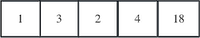


> 什么是随机访问？  
随机访问是在O(1)的时间复杂度内随意访问该数据结构中的任意一个节点, 假设该数据结构有10个节点, 你可以随意访问第1个到第10个节点。比如说磁带, 如果你想听某个歌曲, 必须要转到先目标处的位置, 才能播放, 这就不叫随机访问

### 1.3.2 链式存储结构

把数据元素存放在任意的存储单元里, 也就是说, 这些存储单元可以是连续的, 也可以是不连续的。所以, 数据元素的存储位置并不能反映逻辑关系, 因此需要用指针存放数据元素的地址, 通过地址(指针)就可以, 找到相关联数据元素的位置。
链式存储结构具有以下特点:  

1. 不要求占用连续内存空间, 逻辑连续, 物理可不连续, 通过指针反映逻辑关系。
2. 不仅要存储数据, 还要存储数据之间的关系(指针), 故总空间需求较大, 存储密度低。
3. 只可顺序访问, 不支持随机访问, 也就是说, 必须沿着指针的
4. 数据元素的插入和删除操作通过修改指针完成

如图:   


### 1.3.3 索引存储结构

除了建立存储结点信息, 还建立附加的索引表来标识结点的地址。索引表由若干索引项组成。索引存储结构是用结点的索引号来确定结点存储地址的。

索引存储结构的优点是检索速度快；缺点是增加了附加的索引表, 会占用较多的存储空间。在数据表中, 就是用索引表来进行存储与检索的。其特点如下。

1. 不要求占用连续内存空间；逻辑连续, 物理可不连续；通过索引表记录逻辑关系。
2. 不仅要存储数据, 还需要额外存储空间, 通过索引表存储逻辑关系, 故总空间需求较大, 存储密度低。
3. 可顺序访问, 支持随机访问, 数据元素的插入和删除操作通过修改索引表中相关数据元素的存储'
4. 需要额外操作时间对索引表进行维护。

如图: 


### 1.3.4 散列存储结构

将数据元素的存储位置与关键码之间建立确定对应关系的查找技术。散列法存储的基本思想是由结点的关键码值决定结点的存储地址。散列存储结构具有以下特点。  
1. 物理位置通过哈希函数计算得到。
2. 逻辑不连续, 物理可不连续。
3. 可顺序访问, 由于存在冲突, 仅支持部分随机访问。

如图1-3
||
|:-:|
|图1-3|

### 1.3.5 要点提示

#### 索引存储和散列存储的区别

根据地址就可以找到对应的关键字。可以理解成一个黄页, 你根据一个人的名字, 就可以找到他的电话。所以索引存储又被称为直接寻址。数组就是一个常见的索引存储结构, 可以通过下标来直接访问, 下标(也就是关键字和地址相关)。

「散列存储」名字中的「散列」就是常听到的 `hash` (哈希值),  `hash`  是通过一种算法来运算出来的, 比如 MD5。在这种存储格式下, 地址会通过 `hash` 算法来运算成一个相同长度的  `hash` 值, 然后存放这个  `hash`  值, 而不是直接存放地址。在访问关键字的时候会通过运算解码 `hash` 值, 然后再访问。这个时候, 节点的存储地址和关键字是有某种映射关系的。

#### 二者区别

二者区别可以说就是多了一个  `hash`  函数运算的过程。但是为什么要多这一步操作, 而且还会「浪费」计算机的性能呢？

是为了是节省空间。

因为计算机的存储空间是有限的, 如果不考虑存储空间的限制, 那么可以创建一个字典, 为每个可能的关键字保留一个位置, 然后通过索引直接寻址。但是在一些情况下, 实际存储的关键字数目往往比可能的关键字数目要少很多很多, 就造成了巨大的空间浪费。如果这时候使用散列存储来替代索引存储。例如散列表使用一个长度与实际存储的关键字数目成比例的数组来存储, 访问的时候将哈希值转换成对应的下标。
散列技术还有一个好处就是有优异的平均情况性能, 而且在关键字集合是静态的时候, 散列技术也可以提供出色的最坏性能。
在时间复杂度上, 完全散列(perfect `hash`ing)和基本的字典操作所需的都是O(1)的时间, 也就是说, 并没有太大时间上的区别。

对于考试里会出现相关题目, 只要记得散列存储结构的存储地址和关键字存在某种映射关系即可。

## 1.4 算法的评价以及复杂度

### 1.4.1 什么是算法

算法(Algorithm): 求解问题的一系列计算或者操作。是对特定问题求解方法(步骤)的一种描述。例如, 考研, 那么考研就是问题, 而查信息、买资料、备考就是解决考研这个问题的步骤。事实上, 大家在生活中, 处处都在用算法解决问题。  

算法评价: 回到大家考研的例子, 有的小伙伴备考过程中, 效率很高；有的小伙伴复习效率比较低, 那么为了能够成功上岸, 我们必须对复习过程(解决问题的过程)进行评估。同样地, 大家知道, 设计的算法有好有坏, 所以设计的算法必须要有一些评价指标。这些指标包括正确性、可读性和健壮性。但是考试中关心的是衡量算法性能的指标: 时间复杂性, 空间复杂性。

### 1.4.2 什么是算法的复杂度

#### 算法的时间复杂度

时间复杂度: 算法执行时间需通过依据该算法编制的程序在计算机上运行时消耗的时间来度量。

时间复杂度的表示方式: 算法中基本操作重复执行的次数是问题规模n的某个函数f(n),其时间量度记作T(n)=O(f(n)),称为算法的渐近时间复杂度, 简称时间复杂度。一般地, 常用最深层循环内的语句中原操作的执行频度(重复执行的次数)来表示。

时间复杂性分为, 最好时间复杂性、最坏时间复杂性、平均时间复杂性。这里面最有用的指标是最坏时间复杂性, 它标识了一个算法执行的最差效率, 要是它是能接受的, 那么这个算法的执行效率就不用担心了。

时间复杂度是随输入规模变化而变化的一个值, 是一个函数关系, 所以时间复杂度的计算其实就是推导出当前算法和输入规模之间的这个关系函数。这个关系函数可以是根据算法的具体步骤一步步相加最后推到出来的详细的一个函数表达式, 但是其实我们知道时间复杂度函数一定是一个自变量为输入规模n的单调递增的一元函数。这种单调递增函数当自变量趋近于无穷大(即+∞)时, 函数表达式里的常数项和阶数不是最高的项对变化来说是可以忽略不记的, 所以我们用渐进复杂度就可以表示当输入规模趋于无穷大时候的时间复杂度。

「O」的定义（了解）: 若f(n)是正整数n的一个函数, 则O(f(n))表示存在M大于等于0, 使得当n大于等于n时, $|O(f(n))|≤M|f(n)|$,通俗的说, 就是f(n)当n趋近于$+∞$时的同阶无穷大。

表示时间复杂度的阶有以下几种: 
+ $O(1)$:常量时间阶
+ $O(n)$:线性时间阶
+ $O(log_2n)$:对数时间阶
+ $O(nlog_2n)$:线性对数时间阶
以下6种计算算法时间复杂度的多项式是最常用的, 其关系为

$$
O(1)<0(log_2n)<O(n)<O(nlog_2n)<O(n^2)<O(n^3)<O(e^n)
$$
指数时间的关系为
$$
O(2^m)<O(n!)<O(n)
$$
常数级、对数级、线性级、多项式级是能接受的范围。指数级、阶乘级是灾难性的。

在考研中, 时间复杂度的计算主要包括循环、递归等形式, 具体类型有常量阶、对数阶、线性阶、线性对数阶、幂函数阶。

#### 算法的空间复杂度

空间复杂度(Space Complexity)是对一个算法在运行过程中临时占用存储空间大小的量度，记做S(n)=O(f(n))。比如直接插入排序的时间复杂度是O($n^2$),空间复杂度是O(1) 。而一般的递归算法就要有O(n)的空间复杂度了，因为每次递归都要存储返回信息。一个算法的优劣主要从算法的执行时间和所需要占用的存储空间两个方面衡量。

分析一个算法所占用的存储空间要从各方面综合考虑。如对于递归算法来说，一般都比较简短，算法本身所占用的存储空间较少，但运行时需要一个附加堆栈，从而占用较多的临时工作单元;若写成非递归算法，一般可能比较长，算法本身占用的存储空间较多，但运行时将可能需要较少的存储单元。

### 1.4.3 拓展知识点[了解]

#### 渐进上界即「O」

渐进上界, 即当前算法在输入规模趋近于+∞时, 时间复杂度不会超过的一个函数值。用大O表示, 这种表示是抽象的、简介的、只保留重点因素的, 一般我们说算法复杂度说的就是大O表示的渐进时间复杂度的上界。

#### 渐进上界的另一种数学定义

设f和g是定义为自然数集N上的函数, 若存在正数c和n0, 使得对一切n大于等于n0有: 
$$
0≤f(n)≤cg(n)
$$
成立, 则称f(n)的渐进上界是g(n), 记作: 
$$
f(n)=O(g(n))
$$
#### 渐进下界「Ω(n)」
即当前算法在输入规模趋近于 $+∞ $时, 前算法运行时间的下限, 采用大Ω符号来表示。

#### 渐进下界的数学定义

设f和g是定义为自然数集N上的函数, 若存在正数c和n0, 使得对一切n大于等于n0有: 
$$
0≤cg(n)≤f(n)
$$

成立, 则称f(n)的渐进下界是Ω(n), 记作: 
$$
f(n)=Ω(g(n))
$$

#### 渐进紧确界「θ(g(n))」

用于界定函数的渐进上界和渐进下界。当f(n)= θ(g(n))的时候，代表着g(n)为f(n)的渐进紧确界。而θ渐进描述符在所有的渐进描述符中是最严格的一个，因为它既描述了函数的上界，有描述了函数的下界。

$ f(n)= θ(c.g(n)) $ 的数学定义: 存在正常数 $ c1、c2、n、n0当n>n0 $时，对于任意的f(n)对符合$ c1.g(n)<= f(n)<= c2.g(n)$, $ c1.g(n)、c2.g(n)$ 都是渐进函数。  

根据大O，大Ω，大θ的定义得到一个定理：

当且仅当函数$ f(n)= O(g(n)) $和$ f(n)=Ω(g(n))$ 时则$f(n)= θ(g(n))$成立。

## 1.5 概念速背「408同学无需掌握」

什么是数据结构？  
简单地说, 数据结构是以某种特定的布局方式存储数据的容器,是相互之间存在一种或多种特定关系的数据元素的集合。

数据的组织形式？  
数据元素之间存在的一种或多种特定关系。

数据的数据类型？  
A 原子类型∶是不可以再分解的基本类型, 包括整型、实型、字符型等。  
B 结构类型∶由若干个类型组合而成, 是可以再分解的。例如, 整型数组是由若干整型数据组成的。

算法的概念  
算法是特定问题求解步骤的描述, 在计算机中表现为指令的有限序列, 算法是独立存在的一种解决问题的方法和思想。对于算法而言, 语言并不重要, 重要的是思想。

算法和数据结构区别是什么?  
数据结构只是静态的描述了数据元素之间的关系, 高效的程序需要在数据结构的基础上设计和选择算法。
算法是为了解决实际问题而设计的。
数据结构是算法需要处理的问题载体。
数据结构与算法相辅相成。

算法的特性    
算法具有五个基本的特性: 输入、输出、有穷性、确定性和可行性  
输入输出: 算法具有零个或多个输入、至少有一个或多个输出。  
有穷性: 指算法在执行有限的步骤之后, 自动结束而不会出现无限循环, 并且每一个步骤在可接受的时间内完成。  
确定性: 算法的每一步骤都有确定的含义, 不会出现二义性。  
可行性: 算法的每一步都必须是可行的, 也就是说, 每一步都能通过执行有限次数完成。

数据结构分类   
按照视点的不同, 我们把数据结构分为逻辑结构和物理结构。
逻辑结构: 集合结构、线性结构、树形结构、图形结构
物理结构: 是指数据的逻辑结构在计算机中的存储形式, 共分为两种: 顺序存储和链式存储。

## 1.6 习题

### 1.6.1 选择

1. 设 n 是描述问题规模的非负整数，下面程序片段的时间复杂度是(  )。
```c
x=2;
while(x<n/2)
	x=2*x;
```
   A.O(log₂n)            B.O(n)               C.O(nlog₂n)           D.O(n²)

2. 求整数n(n≥0)    阶乘的算法如下，其时间复杂度是(  )。
```c
int  fact(int  n)
	{
	if(n<=1)
		return  1;
		return  n*fact(n-1);  
	 }
```
   A.O(log₂n)            B.O(n)               C.O(nlog₂n)           D.O(n²)


3. 已知两个长度分别为m 和 n 的升序链表，若将它们合并为一个长度为m+n 的降序链表，则 最坏情况下的时间复杂度是(  )。

   A.O(n)               B.O(m×n)             C.O(min(m,n))        D.O(max(m,n))


4. 下列程序段的时间复杂度是(   )。【2014年全国试题1(2分)】
```
count=0;
for(k=1;k<=n;k*=2)
	for(j=1;j<=n;j++)   
 		count++;
```

A.O(log₂n)           B.O(n)                C.O(nlog₂n)          D.O(n²)

 

5. 在数据结构中，数据的最小单位是(  )。

   A. 数据元素     B. 字节       C.  数据项      D.  结点

 

6. 在数据结构中，数据的基本单位是(  )。

   A. 数据项      B. 数据类型     C.  数据元素     D.  数据变量

 

7. 数据对象是指(  )。

   A.  描述客观事物且由计算机处理的数值、字符等符号的总称

   B. 数据的基本单位

   C.  性质相同的数据元素的集合

   D. 相互之间存在一种或多种特定关系的数据元素的集合

 

8. 以下说法正确的是(  )。

   A.  数据元素是数据的最小单位

   B. 数据项是数据的基本单位

   C. 数据结构是带有结构的数据元素的集合

   D.  数据结构是带有结构的各数据项集合

 

9. 数据结构研究的内容涉及(  )。

   A. 数据如何组织             	B. 数据如何存储

   C. 数据的运算如何实现          D. 算法用什么语言来描述


10. 在定义 ADT 时，除数据对象和数据关系外，还需说明(  )。

    A. 数据元素    B. 算法       C. 基本操作     D. 数据项


11. 在数据结构中，从逻辑上可以将之分为(  )。

    A.  动态结构和静态结构		B.  紧凑结构和非紧凑结构

    C. 内部结构和外部结构 		D. 线性结构和非线性结构


12. 从逻辑上可以把数据结构分为(  )两大类。

    A. 动态结构、静态结构         B. 顺序结构、链式结构

    C. 线性结构、非线性结构        D.  初等结构、构造型结构


13. 数据结构中数据元素之间的逻辑关系被称为(  )。

    A. 数据的存储结构            B. 数据的基本操作

    C. 程序的算法              D. 数据的逻辑结构


14. 以下与数据的存储结构无关的术语是(  )。

    A. 循环队列    B. 链表       C. 哈希表      D.  栈


15. 以下数据结构中，哪一个是线性结构? (   )

    A. 广义表     B. 二叉树      C. 稀疏矩阵     D.  串


16. 以下哪个数据结构不是多型数据类型? (   )

    A. 栈       B. 广义表      C. 有向图      D.  字符串


17. 以下数据结构中，(  )是非线性数据结构

    A.  树        B. 字符串      C.  队        D.  栈

18. 下列数据中，(  )是非线性数据结构。

    A. 栈       B. 队列       C.  完全二叉树    D. 堆


19. 连续存储设计时，存储单元的地址(  )。

    A.  一定连续              B. 一定不连续

    C. 不一定连续              D. 部分连续，部分不连续


20. 以下属于逻辑结构的是(  )。

    A. 顺序表     B. 哈希表      C. 有序表      D. 单链表


21. 算法的计算量的大小称为计算的(  )。

    A. 效率      B. 复杂性      C. 现实性      D.  难度 


22. 算法的时间复杂度取决于(  )。

    A. 问题的规模   B.  待处理数据的初态           C.A 和 B


23. 计算机算法指的是(1),它必须具备(2)这三个特性。

    (1)A.   计算方法   B. 排序方法     C.  解决问题的步骤序列   D. 调度方法

    (2)A.   可执行性、可移植性、可扩充性   B.  可执行性、确定性、有穷性

    C. 确定性、有穷性、稳定性     D.  易读性、稳定性、安全性


24. 一个算法应该是(  )。

    A. 程序                 B. 问题求解步骤的描述

    C. 要满足五个基本特性         D.A和C


25. 下面说法错误的是(  )。

    (1)算法原地工作的含义是指不需要任何额外的辅助空间

    (2)在相同的规模n 下，复杂度O(n)的算法在时间上总是优于复杂度 O(2")的算法 (3)所谓时间复杂度是指最坏情况下，估算算法执行时间的一个上界

    (4)同一个算法，实现语言的级别越高，执行效率就越低

    A.(1)               B.(1),(2)            C.(1), (4)   D.(3)

    

26. 计算算法的时间复杂度是属于一种(  )。

    A. 事前统计的方法            B. 事前分析估算的方法

    C. 事后统计的方法            D. 事后分析估算的方法


27. 可以用(  )定义一个完整的数据结构。

    A. 数据元素    B. 数据对象     C. 数据关系     D. 抽象数据类型


28. 当输入非法错误时， 一个“好”的算法会进行适当处理，而不会产生难以理解的输出结果。这称为算法的(  )。

    A. 可读性     B. 健壮性      C. 正确性      D. 有穷性


29. 算法分析的目的是(   )。

    A. 找出数据结构的合理性         B. 研究算法中的输入和输出的关系

    C. 分析算法的效率以求改进        D. 分析算法的易懂性和文档性


30. 设计一个“好”的算法应考虑达到的目标是(  )。

     A.可行的     B. 健壮的      C. 无二义性     D. 可读性好的

     

31. 数据元素之间的关系称为(  )。

     A. 操作       B. 结构       C. 数据对象     D.  数据集合

     

32. (多选)一个算法具有(  )等特点。

     A. 有0个或多个输入量         B. 健壮性

     C.  正确性               D. 可行

     ### 应用题

33. 数据存储结构包括哪几种类型?数据逻辑结构包括哪几种类型?

34. 数据元素之间的关系在计算机中有几种表示方法?各有什么特点? 

35. 数据类型和抽象数据类型是如何定义的?二者有何相同和不同之处?抽象数据类型的主要 特点是什么?使用抽象数据类型的主要好处是什么?

36. 回答问題(每题2分)。
     (1)在数据结构课程中，数据的逻辑结构、数据的存储结构及数据的运算之间存在着怎样的关系?
     (2)若逻辑结构相同但存储结构不同，则为不同的数据结构。这样的说法对吗?举例说明之。
     (3)在给定的逻辑结构及其存储表示上可以定义不同的运算集合，从而得到不同的数据结构。这样的说法对吗?举例说明之。
     (4)评价各种不同数据结构的标准是什么?

37. 评价一个好的算法，你是从哪几方面来考虑的? 【中山大学1998 三、1(5分)】

38. 解释和比较以下各组概念。
     (1)算法的时间复杂性。【河海大学1998 一 、2(3分)】
     (2)算法。【吉林工业大学1999 一 、1(2分)】
     (3)频度。【吉林工业大学1999 一 、2(2分)】

39. 根据数据元素之间的逻辑关系， 一般有哪几类基本的数据结构? 

40. 对于一个数据结构， 一般包括哪三个方面的讨论? 

41. 当你为解决某一问題而选择数据结构时，应从哪些方面考虑? 【西安电子科技大学2000】 11. 若将数据结构定义为一个二元组 (D,R),    说明符号D 、R 应分别表示什么? 

42. 数据结构与数据类型有什么区别?

43. 算法的五个重要特征是什么? 

44. 一个算法所需时间由下述递归方程表示，试求出该算法的时间复杂性的级别(或阶)。(以 大O 形式表示。)
      

其中：n 是问题的规模，为简单起见，设n 是2的整数幂。【上海交通大学1996 四(8分)】 
15. 下面程序段的时间复杂度是什么?

    for(i=0;i<n;i++)

    for(j=0;,j<m;j++)a[i][j]=0;

16. 运算是数据结构的一个重要方面。试举一例，说明两个数据结构的逻辑结构和存储方式完 全相同，只是对于运算的定义不同。因而两个结构具有显著不同的特性，是两个不同的结 构。
17. 在编制管理通讯录的程序时，什么样的数据结构合适?为什么?
18. 试举一例，说明对相同的逻辑结构，同一种运算在不同的存储方式下实现，其运算效率不 同。
19. 有实现同一功能的两个算法A1 和 A2,  其中A1的时间复杂度为T=O(2"),A2   的时间复杂 度为T2=0(n²),  仅就时间复杂度而言，请具体分析这两个算法哪一个好。

## 1.7 答案

| 1.A   | 2.B  | 3.D   | 4.C   | 5.C  | 6.C  | 7.C  | 8.C  | 9.A BC | 10.C |
| ----- | ---- | ----- | ----- | ---- | ---- | ---- | ---- | ------ | ---- |
| 11.D  | 12.C | 13.D  | 14.D  | 15.D | 16.D | 17.A | 18.C | 19.A   | 20.C |
| 21.B  | 22.C | 23.1C | 23.2B | 24.B | 25.A | 26.B | 27.D | 28.B   | 29.C |
| 30.BD | 31.B | 32.AD |       |      |      |      |      |        |      |

1. 存储结构包括顺序存储、链式存储、索引存储和散列存储。逻辑结构包括线性结构和非线性 结构。更细分也可以说，逻辑结构包括集合、线性结构、树形结构和图形(网状)结构。
2. 四种表示方法。
  1. 顺序存储方式。数据元素顺序存放，每个存储结点只含一个元素。存储位置反映数据元 素间的逻辑关系。存储密度大，但有些操作(如插入、删除)效率较差。
  2. 链式存储方式。每个存储结点除包含数据元素信息外还包含一组(至少一个)指针。指 针反映数据元素间的逻辑关系。这种方式不要求存储空间连续，便于动态操作(如插入 删除等),但存储空间开销大(用于指针),另外不能折半查找等。
  3. 索引存储方式。除数据元素存储在一地址连续的存储空间外，尚需建立一个索引表，索引表的索引项指示存储结点的存储位置(下标)或存储区间端点(下标，非稠密索引), 兼有静态和动态特性。
  4. 散列存储方式。利用散列函数和解决冲突的方法，将关键字散列在连续的有限的地址空 间内，并将散列函数的值解释成关键字所在元素的存储地址。其特点是存取速度快，只 能按关键字随机存取，不能顺序存取，也不能折半存取。

4. “数据类型”是程序设计语言中的一个概念，它是一个值的集合和操作的集合，如 C 语言中 的整型、实型、字符型等。整型值(对具体机器都应有整数范围)的操作有加、减、乘、除、 求余等。实际上，数据类型是厂家提供给用户的已实现了的数据结构。

“抽象数据类型”(ADT)  指一个数学模型及定义在该模型上的一组操作。“抽象”的意义在 于数据类型的数学抽象特性。抽象数据类型的定义仅取决于它的逻辑特性，而与其在计算机 内部如何表示和实现无关。无论其内部结构如何变化，只要它的数学特性不变就不影响它的 外部使用。抽象数据类型和数据类型实质上是一个概念，但是抽象数据类型的范围更广，它 已不再局限于机器已定义和实现的数据类型，还包括用户在设计软件系统时自行定义的数据 类型。使用抽象数据类型定义的软件模块含定义、表示和实现三部分，封装在一起，对用户 透明(提供接口),而不必了解实现细节。抽象数据类型的出现使程序设计不再是“艺术”, 而是向“科学”迈进了一步。

5.(1)数据的逻辑结构反映数据元素之间的逻辑关系(即数据元素之间的关联方式或“邻接关 系”),数据的存储结构是数据结构在计算机中的表示，包括数据元素的表示及其关系的 表示。数据的运算是对数据定义的一组操作，运算是定义在逻辑结构上的，和存储结构无关，而运算的实现则依赖于存储结构。

(2)逻辑结构相同但存储结构不同，可以是不同的数据结构。例如，线性表的逻辑结构属于线性结构，采用顺序存储结构为顺序表，而采用链式存储结构称为线性链表。

(3)栈和队列的逻辑结构相同，其存储表示也可相同(顺序存储和链式存储),但由于其运算集合不同而成为不同的数据结构。

(4)数据结构的评价非常复杂，可以考虑两个方面： 一是所选数据结构是否准确、完整地刻画了问题的基本特征；二是是否容易实现(如对数据分解是否恰当；逻辑结构的选择是 否适合于运算的功能，是否有利于运算的实现；基本运算的选择是否恰当)。

6. 评价好的算法有四个方面。 一是算法的正确性；二是算法的易读性；三是算法的健壮性；四 是算法的时空效率。

7. (1)算法的时间复杂性是算法输入规模的函数。算法的输入规模或问题的规模是作为该算法 输入的数据所含数据元素的数目，或与此数目有关的其他参数。有时考虑算法在最坏情 况下的时间复杂度或平均时间复杂度。
(2)算法是对特定问题求解步骤的描述，是指令的有限序列，其中每一条指令表示一个或多个操作。算法具有五个重要特性：有穷性、确定性、可行性、输入和输出。
(3)频度。在分析算法时间复杂度时，有时需要估算基本操作的原操作，它是执行次数最多

的一个操作，该操作重复执行的次数称为频度。

8. 集合、线性结构、树形结构、图形或网状结构。
9. 逻辑结构、存储结构、操作(运算)。
10. 通常考虑算法运行所需要的存储空间量和时间量。后者又涉及四方面：程序运行时所需输 入的数据总量，对源程序进行编译所需时间，计算机执行每条指令所需时间和程序中指令 重复执行的次数。

11. D  是数据对象，是数据元素的有限集合，R 是 D 上数据元素之间关系的有限集合。

12. 「数据结构」这一术语有两种含义， 一是作为一门课程的名称；二是作为一个科学的概念。 作为科学概念，目前尚无公认定义， 一般认为，讨论数据结构要包括三个方面， 一是数据 的逻辑结构，二是数据的存储结构，三是对数据进行的操作(运算)。而数据类型是值的集 合和操作的集合，可以看作是已实现了的数据结构，后者是前者的一种简化情况。

13. 算法的五个重要特征是有穷性、确定性、可行性、零个或多个输入和1至多个输出。
14. O(nlog₂n)

设 n=2^(k≥0),  根据题目所给定义，有：

T(2⁴)=2T(2⁴¹)+2*=2²T(2*²)+2*2*

由此，可得一般递推关系式：

T(2^)=2'T(2^)+i\*2

进而，可得：

T(2^=2^T(2⁰)+k*2⁴=(k+1)2^

即

T(n)=n(log₂n+1)=n(log₂(2n))=O(nlog₂n)

15. O(m\*n)

16. 见上面题5(3)栈和队列的比较。

17. 应从两方面进行讨论：如通讯录较少变动(如城市私人电话号码),主要用于查询，以顺序 存储较方便，既能顺序查找也可随机查找；若通讯录经常有增删操作，用链式存储结构较 为合适，将每个人的情况作为一个元素(即一个结点存放一个人),设姓名作关键字，链表 安排成有序表，这样可提高查询速度。
# 第2章 线性表

## 2.1 什么是线性表

线性表(linear list)是最基本、最简单、也是最常用的一种数据结构。一个线性表是n个具有相同特性的数据元素的有限序列。

线性表中数据元素之间的关系是一对一的关系, 即除了第一个和最后一个数据元素之外, 其它数据元素都是首尾相接的(注意, 这句话只适用大部分线性表, 而不是全部)。比如, 循环链表逻辑层次上也是一种线性表 (存储层次上属于链式存储, 但是把最后一个数据元素的尾指针指向了首位结点)。

使用线性表表示数据的方式可以这样理解, 即「把所有数据用一根线串起来, 再存储到物理空间中」。线性表的标准定义是由n(≥0)个数据元素(结点)组成的有限序列, 用数学表达式来定义线性表：如果线性表表示为数据元素(a1,a2,…,an)组成的有限序列, 那么该序列中的所有结点具有相同的数据类型。

## 2.2 线性表的基本特点

1. 线性表强调元素具有相同的数据类型。
2. 元素的下标表示该元素在线性表中的位置, 但这个位置仅仅表示元素的先后关系, 并不表示元素之间的大小关系。
3. 除了第一个元素和最后一个元素之外, 每个数据元素都有唯一的前驱和后继元素。

## 2.3 线性表的主要存储结构

线性表的存储结构可细分为顺序存储结构和链式存储结构

+ 将数据依次存储在连续的整块物理空间中, 这种存储结构称为顺序存储结构(简称顺序表)。
+ 数据分散的存储在物理空间中, 通过一根线保存着它们之间的逻辑关系, 这种存储结构称为链式存储结构(简称链表)。

### 2.3.1 顺序存储结构

特点：
1. 结点中只有自身的信息域, 没有关联信息域。因此, 顺序存储结构的存储密度大度、存储空间利用率高。
2. 通过计算地址直接访问任何数据元素, 即可以随机访问。
3. 插入和删除操作会引起大量元素的移动。

如图2-1:  
|  |
| :-------------------------: |
|            图2-1            |

### 2.3.2 顺序表的随机存取

我们简单讲了顺序结构在内存中占有连续的地址空间,顺序表具有随机访问能力。例如,有线性表(1, 10, 30, 4, 15, 26, 27), 假设数据元素都是整数(int 类型的数据), 每个整数占有4字节的空间,这个顺序表在内存中的结构如下表所示, 
|数组|1|10|30|4|15|26|27|
|----|----|----|----|----|----|----|----|
|下标|0|1|2|3|4|5|6|
|元素大小|4B|4B|4B|4B|4B|4B|4B|

当把这个顺序表存储在内存中时, 每个数据元素要有一个位置(编号),这个编号成为内存地址(指针)(可以参考C语言基础中关于内存的讲解部分), 逻辑上相邻的数据元素在位置上也相邻, 如数据元素 1和数据元素 10 的地址相差4B。假如给定数据元素 1 在内存中的地址是 100,则数据元素 10 的地址就是104(100+1×4),数据元素 30 的地址是 108(100+2×4), 以此类推后续数据元素的地址。

推广到一般情况, 假设线性表在内存中存储时, 每个元素占用L个存储空问, 则相邻两个元素在内存中的存储地址相差L, 如果已知第一个元素的内存地址, 只要给出位置下标, 就可以利用上述公式计算得出该位置的地址。结合第一讲中的时间复杂度的概念, 不管数据元素在哪个位置, 只要给出下标i.都可以读取或更新该元素的值。这个特点就是随机访问, 记住一点：只要是顺序结构, 都具备这个特点。

### 2.3.3 程序操作

#### 顺序表的查找

查找数据元素在表中的位置, 可以从表头开始一直遍历表中元素。如果找到与要查找元素e相等的元素, 就返回元素在表中的位置, 由于数组下标从0开始, 则元素在表中对应的位置序号值应为对应数组。

查找顺序表中第i个元素的值(按序号查找), 如果找到, 将将该元素值赋给e。查找第i个元素的值时, 首先要判断查找的序号是否合法, 如果合法, 返回第i个元素对应的值。

```c
int GetData(PSeqList L, int i)
{
    if (L->length < 1 || (L->length > LengthList(L)))
    {
        return 0;
    }
    //数据元素的序号从1开始, 数组下表从0开始, 第i个元素对应的数组下标为i-1;
    return L->data[i - 1];
}
```
#### 顺序表的插入
在数据表的第i个位置插入元素, 在顺序表的第i个位置插入元素e, 首先将顺序表第i个位置的元素依次向后移动一个位置, 然后将元素e插入第i个位置, 移动元素要从后往前移动元素, 即：先移动最后一个元素, 在移动倒数第二个元素, 依次类推；插入元素之前要判断插入的位置是否合法, 顺序表是否已满, 在插入元素之后要将表长L->length++;

在顺序表L=(a1, a2, a3 ... an)中的第i(1<i<n)个位置上插入一个新结点e，实现步骤如下。
1. 将线性表中的第i个至第n个结点后移一个位置（需要先从最后一个元素开始移动）。
2. 将结点e插人到结点a-1之后。
3. 线性表长度加1。

例如图2-1中在第二个元素后面加入元素27, 则存储空间变为如图2-2所示

|  |
| :------------------------------: |
|              图2-2               |

```c
int InsList(PSeqList L, int i, DataType e)
{
 
    //判断插入位置是否合法
    if (i < 1 || L->length >(LengthList(L) + 1))
    {
        printf("插入位置不合法!\n");
        return 0;
    }
    //判断顺序表是否已满
    else if (L->length >= ListSize)
    {
        printf("顺序表已满, 不能插入！\n");
        return 0;
    }
    else
    {
        for (k = i; k <= L->length; k--)
        {
            L->data[k + 1] = L->data[k];
        }
        L->data[i - 1] = e;
        L->length++;   //数据表的长度加1
        return 1;
    }
    return 0;
}
```
#### 顺序表的删除

1. 取出删除元素。
2. 从删除元素位置开始遍历到最后一个元素位置, 分别将它们都向前移一个位置。
3. 线性表表长-1。

例如图2-1删除元素4, 则存储空间变为如图2-所示

||
|:-:|
|图2-3|

```c
//初始条件：顺序线性表L已经存在, 1<=i<=ListLength(L)
//操作结果：删除L的第i个元素, 并用e返回其值, L长度-1
Status ListDelete(SqList *L,int i,ElemType e)
{
    int k;
    if(L->length==0)//判断表长是否为空
    {
        return error;
    }
    if(i<1 || i>L->length)//删除位置是否正确
    {
        return error;
    }
 
    *e=L->data[i-1];//返回删除的值
 
    if(i<L->length)
 
    {
        //将要插入位置后的数据元素向前移一位
 
        for(k=i;k<L->length;k++)
        {
            L->data[k-1]=L->data[k];
        }
    }
   
    L->length--;//线性表表长-1
 
    return ok;
}
```

#### 获取顺序表的长度

顺序表的长度就是就顺序表中的元素的个数, 由于在插入和删除操作中都有对数据表的长度进行修改, 所以求表长只需返回length的值即可。

例如图2-1中的线性表，长度为5。

```c
int LengthList(PSeqList L)
{
    if (L == NULL)
    {
        return 0;
    }
    return L->length;
}
```

### 2.3.4 链式存储结构

链表是一种物理存储单位上非连续非顺序的存储结构, 数据元素的逻辑顺序是通过链表中的指针链接次序实现的。

特点:
+ 结点除自身的信息域外, 还有表示关联信息的指针域。因此, 链式存储结构的存储结构小、存储空间利用率低。
+ 在逻辑上相邻的结点在物理上不必相邻, 因此, 不可以随机存取, 只能顺序存取。
+ 插入和删除操作方便灵活, 不必移动结点只需修改结点中的指针域即可。

单链表:线性表的链接存储结构, 用一组任意(不联系, 零散分布) 的存储单元存放线性表的元素.      
单链表是由若干结点构成的, 结点包含数据域和指针域。


### 2.3.5 链表的操作

#### 定义

data: 存储数据元素  
next: 存储指向后继结点的地址 

```c
// 定义节点
typedef struct node
{
    int data;              //数据域
    struct node *next;     //指针域
}Node,*Link;               //定义别名 Node, Link
```
#### 遍历操作

```c
void displayNode(Link head)
{
    Link p = head->next;          //p指向首元结点
    while(p != NULL)
    {
        printf("%d\t",p->data);  //输出数据 
        p = p->next;             //移向下一个结点
    }
}
```
#### 求链表长度

1. p初始化, 累加器count初始化
2. 重复执行下述操作, 直到p为空;
3. 工作指针p后移
4. count++
5. 循环结束，返回累加器count的值

上图中, 链表长度为4, a3指向的NULL并非真实存在

```c
int length(Link head)
{
    int count = 0;
    Link p = head->next;
    while(p != NULL)
    {
        p = p->next;
        count++;
    }
    return count;
}

```

#### 链表查找

操作接口:bool queryNode(Link head, int x);

思路: 依次遍历链表的数据域与要查找的数据进行比较。直到找到为止。当然如果找不到也不能强求，返回`false`就好了

例如：


在这样的链表中，可以通过遍历找到9，但是如果想找到21是不可能的。

```c
bool queryNode(Link head, int x)
{
    Link p = head->next;
    while(p != NULL)
    {
        if(p->data == x) //查找成功
        {
            printf("d",p->data);
            return true;
        }
        p = p->next;   //没有找到,移动结点
    }
    return false;     //查找失败返回false
}
```
#### 链表插入

操作接口:bool insertNode(Link head, int index, int item);

插入到第i个结点, 先找到第i-1个节点, 然后, 让插入结点的指针域指向i-1个结点的指向的指针域, 再修改第i-1结点的指针域, 使其指向插入结点. 注意, 修改指针指向的顺序不要颠倒, 不然会导致找不到第i个结点. 对于边界情况也同样适合.

1. 工作指针p初始化
2. 查找第i-1个结点, 并使该指针p指向该结点
3. 若查找不成功,则返回false
    否则:
    生成一个元素值为x的新结点node
    将新结点插入到p所指向的结点
    返回true

例如在a2后面插入a9


```c
bool insertNode(Link head, int index, int item)
{
	int count=0;
    Link p = head;
    Link node;
    while(p != NULL && count < index-1)   //找到第index前一个结点
    {
        p = p->next;
        count++;
    }
    if(p == NULL)
    {
        return false;                    //没有找到第i-1个结点
    }
    else
    {
        node = (Link)malloc(sizeof(Node));//申请一个结点
        node->data = item;                //结点的数据域
        node->next = p->next;             //修改指针指向关系
        p->next = node;
        return true;
    }
}
```
#### 链表删除节点

操作接口: bool deleteNode(Link head,DateType x);思路:
引入两个指针p,q, p指向要删除的结点, q指向要删除结点的前一个结点

找到要删除的结点, 用free()函数释放该节点, 并修改删除结点两边指针关系情况,
要保证p,q指针一前一后: 在插在过程中, 若发现结点p指向的数据域不等于x, 则p,q指针同时向前移动即可

若在查找过程一直没有找到要删除的结点(链表遍历完毕),则退出循环,返回错误。

例如，上图中删除a2的结果为


### 2.3.6 线性表的其他存储结构

单链表或静态链表每次从头开始访问, 如果想从任意位置开始访问, 那么使用单链表或静态链表就比较难做到。如果想直接找前驱, 那么使用单链表或静态链表也是很难实现的。所以我们使用如下的数据结构
#### 循环单链表

在单链表的基础上, 设计了一种「循环性」单向链表,称为「单向循环链表」。相比于单向链表, 单向循环链表的最大特点是「尾结点的指针域指向头结点『, 可以从任何位置出发访问单链表,如图:  


在考研中, 循环单链表的操作和单链表相同, 只需要记住两个特殊的知识点。

1. 当单链表为空时,head->next == head.
2. 当结点是表尾结点时, p->next == head.
#### 双向链表

双向链表是链表的一种, 是指构成链表的每个结点中设立两个指针域：一个指向其直接前驱的指针域, 另外一个指向后继的指针域。如图: 


#### 双向循环链表

双循环向链表结合了双链表和循环链表的特点，即有两个指针域，又能够循环，所以循环双链表往往是功能最强大的。


### 2.3.7 静态链表

静态链表, 也是线性存储结构的一种, 它兼顾了顺序表和链表的优点于一身, 可以看做是顺序表和链表的升级版。使用静态链表存储数据, 数据全部存储在数组中(和顺序表一样), 但存储位置是随机的, 数据之间"一对一"的逻辑关系通过一个整形变量(称为"游标", 和指针功能类似)维持(和链表类似)。

例如, 使用静态链表存储 {1,2,3} 的过程如下：

创建一个足够大的数组, 假设大小为6, 如图所示：


|||
|:-:|:-:|
|图2-11 空数组|图2-12 静态链表存储数据|

接着, 在将数据存放到数组中时, 给各个数据元素配备一个整形变量, 此变量用于指明各个元素的直接后继元素所在数组中的位置下标, 如图所示：  


通常, 静态链表会将第一个数据元素放到数组下标为 1 的位置(a[1])中。

上图中, 从 a[1] 存储的数据元素 1 开始, 通过存储的游标变量 3, 就可以在 a[3] 中找到元素 1 的直接后继元素 2；同样, 通过元素 a[3] 存储的游标变量 5, 可以在 a[5] 中找到元素 2 的直接后继元素 3, 这样的循环过程直到某元素的游标变量为 0 截止(因为 a[0] 默认不存储数据元素)。

类似这样, 通过 "数组+游标" 的方式存储具有线性关系数据的存储结构就是静态链表。
静态链表中的节点

通过上面的学习我们知道, 静态链表存储数据元素也需要自定义数据类型, 至少需要包含以下 2 部分信息：
+ 数据域：用于存储数据元素的值；
+ 游标：其实就是数组下标, 表示直接后继元素所在数组中的位置；

因此, 静态链表中节点的构成用 C 语言实现为：

```c

typedef struct {
    int data;//数据域
    int cur;//游标
}component;

```

#### 备用链表

上图的静态链表还不够完整, 静态链表中, 除了数据本身通过游标组成的链表外, 还需要有一条连接各个空闲位置的链表, 称为备用链表。

备用链表的作用是回收数组中未使用或之前使用过(目前未使用)的存储空间, 留待后期使用。也就是说, 静态链表使用数组申请的物理空间中, 存有两个链表, 一条连接数据, 另一条连接数组中未使用的空间。通常, 备用链表的表头位于数组下标为 0(a[0]) 的位置, 而数据链表的表头位于数组下标为 1(a[1])的位置。

静态链表中设置备用链表的好处是, 可以清楚地知道数组中是否有空闲位置, 以便数据链表添加新数据时使用。比如, 若静态链表中数组下标为 0 的位置上存有数据, 则证明数组已满。

例如, 使用静态链表存储 {1,2,3}, 假设使用长度为 6 的数组 a, 则存储状态可能如图 3 所示： 

| | |
|:-:|:-:|
|图2-13 备用链表和数据链表|图2-14 未存储数据之前静态链表的状态|

#### 备用链表和数据链表

图 2-13 中, 备用链表上连接的依次是 a[0]、a[2] 和 a[4], 而数据链表上连接的依次是 a[1]、a[3] 和 a[5]。

#### 静态链表的实现

假设使用静态链表(数组长度为 6)存储 {1,2,3}, 则需经历以下几个阶段。

在数据链表未初始化之前, 数组中所有位置都处于空闲状态, 因此都应被链接在备用链表上, 如下图2-16所示：  

当向静态链表中添加数据时, 需提前从备用链表中摘除节点, 以供新数据使用。
备用链表摘除节点最简单的方法是摘除 a[0] 的直接后继节点；同样, 向备用链表中添加空闲节点也是添加作为 a[0] 新的直接后继节点。因为 a[0] 是备用链表的第一个节点, 我们知道它的位置, 操作它的直接后继节点相对容易, 无需遍历备用链表, 耗费的时间复杂度为 O(1)。

因此, 在基础上, 向静态链表中添加元素 1 的过程如图所示：
|| 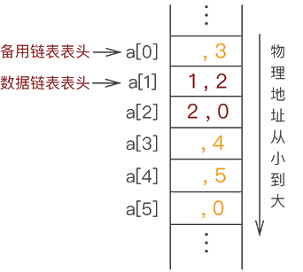 |
|:-:|:-:|
|图2-16. 静态链表中添加元素 1|图2-17 静态链表中继续添加元素 2|

静态链表中继续添加元素 2  ,在图2-17的基础上, 继续添加元素 3

   
由此, 静态链表就创建完成了。

## 2.4 概念速背

线性表基本概念  
线性表是零个或者多个数据元素的有限序列, 数据元素之间是有顺序的, 数据元素个数是有限的, 数据元素的类型必须相同

线性表的性质    
1. a0 为线性表的第一个元素, 只有一个后继。
2. an 为线性表的最后一个元素, 只有一个前驱。
3. 除 a0 和 an 外的其它元素 ai, 既有前驱, 又有后继。
4. 线性表能够逐项访问和顺序存取。

线性表Operation(操作)  
```c
// 初始化, 建立一个空的线性表L。
InitList(*L);
 
// 若线性表为空, 返回true, 否则返回false
ListEmpty(L);
 
// 将线性表清空
ClearList(*L);
 
// 将线性表L中的第i个位置的元素返回给e
GetElem(L, i, *e);
判断线性表是否合法
判断位置是否合法
直接通过数组下标的方式获取元素
 
// 在线性表L中的第i个位置插入新元素e
ListInsert(*L, i, e);
插入元素算法
判断线性表是否合法
判断插入位置是否合法
判断空间是否满足
把最后一个元素到插入位置的元素后移一个位置
将新元素插入
线性表长度加1
 
// 删除线性表L中的第i个位置元素, 并用e返回其值
ListDelete(*L, i, *e);
判断线性表是否合法
判断删除位置是否合法
将元素取出
将删除位置后的元素分别向前移动一个位置
线性表长度减1
 
// 返回线性表L的元素个数
ListLength(L);
 
// 销毁线性表
DestroyList(*L);
 
```
线性表的存储

通常线性表可以采用顺序存储和链式存储。

线性表采用顺序存储的优点和缺点
       优点：
无需为线性表中的逻辑关系增加额外的空间。
可以快速的获取表中合法位置的元素。

缺点：
插入和删除操作需要移动大量元素


为什么要引入线性表的链式存储(单向链表)?  
前面我们写的线性表的顺序存储(动态数组)的案例, 最大的缺点是插入和删除时需要移动大量元素, 这显然需要耗费时间, 能不能想办法解决呢？链表。
链表为了表示每个数据元素与其直接后继元素之间的逻辑关系, 每个元素除了存储本身的信息外, 还需要存储指示其直接后继的信息。


单链表的定义  
线性表的链式存储结构中, 每个节点中只包含一个指针域, 这样的链表叫单链表。通过每个节点的指针域将线性表的数据元素按其逻辑次序链接在一起。


单链表的概念解释  
表头结点
链表中的第一个结点, 包含指向第一个数据元素的指针以及链表自身的一些信息。

数据结点
链表中代表数据元素的结点, 包含指向下一个数据元素的指针和数据元素的信息。

尾结点
链表中的最后一个数据结点, 其下一元素指针为空, 表示无后继。

单链表的相关操作有哪些?
和上面的顺序表操作思路一样, 参考上面的就好了。

单链表的优点和缺点是什么?
优点：
无需一次性指定链表的容量
插入和删除操作无需移动数据元素  
缺点：
除了要存储数据元素本身, 还有要存储数据元素之间的逻辑关系
获取指定数据的元素需要顺序访问之前的元素

问：双向链表的原理
双向链表(double linkedlist)是在单链表的每个结点中, 再设置一个指向其前驱结点的指针域。所以在双向链表中的结点都有两个指针域, 一个指向直接后继, 另一个指向直接前驱。


## 2.5 习题

### 2.5.1 选择

# 第3章 第三章 栈

## 3.1 栈的概念

栈(stack)是一种线性数据结构, 遵循LIFO(后进先出)原则。栈的两端被称为栈顶和栈底。每当向栈中添加一个元素时, 它能且只能被添加到栈顶, 并且该元素只能从栈顶删除。换句话说, 栈可以定义为一个容器, 可以从称为栈顶的一端进行插入和删除操作。如果比喻的话，那么栈是一个羽毛球桶。

## 3.2 栈的特点

+ 它被称为栈, 因为它的行为类似于现实世界中的栈、成堆的书,、羽毛球桶等。
+ 它是一种按照某种顺序插入和删除元素的数据结构, 该顺序可以是 LIFO 或 FILO。
+ 栈顶(Top)：允许进行插入、删除操作的一端, 用栈顶指针来指示栈项的位置, 伴随着元素的插人和删除,栈顶指针的位置会发生变化。
+ 栈底(Bottom)：是固定端, 在对栈进行插人和州除的过程中, 栈底的位置固定不变。
+ 栈顶元素：最后入栈的元素或者栈中最上面的元素。

## 3.3 栈的操作

既然栈是后进先出的线性表, 那么栈的操作也有自己的特色, 我们把插入操作称为进栈(压栈), 删除操作称为出栈(弹栈)。对于栈来说, 进栈和出栈都在一端进行, 最后入栈的元索将作为栈顶元素, 出栈时将删除栈顶元素。

### 3.3.1 堆栈操作实现

下面是在栈上实现的一些常用操作: 
+ push()：当我们在堆栈中插入一个元素时, 该操作称为压栈。 如果堆栈已满, 则发生溢出情况。
+ pop()：当我们从堆栈中删除一个元素时, 该操作称为弹出操作。 如果堆栈为空意味着堆栈中不存在任何元素, 则此状态称为下溢状态。
+ isEmpty()：判断栈是否为空。
+ isFull()：判断堆栈是否已满。
+ top()：它返回栈顶元素。
+ count()：它返回堆栈中可用元素的总数。

## 3.4 直观理解

我们通过一个例子和下图来理解上述概念, 现在有二个桶(桶的一端是固定的, 非常符合栈的特点)有几个球, 我们要把球放到桶里, 桶的口径和球的大小相当, 并有以下过程
| 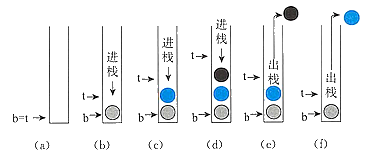 |
| :-----------------------------------------------: |
|                图2-1 栈的直观理解                 |

这里大家不用计较b和t的具体位置, 只需要看懂出栈和进栈的逻辑即可。

1. 如图(a)所示, 此时栈是空的, b(bottom)和t(top)都在最底下
2. 如图(b)所示, 将灰色的球放入桶中(压栈), 此时 b 不动, t向上移动, 灰色的球成为栈顶元素
3. 如图(c)所示, 将蓝色的球放人桶中(压栈), 此时b不动,t向上移动, 蓝色的球成为栈顶元素
4. 如图(d)所示, 将黑色的球放人桶中(压栈), 此时b不动, t向上移动, 黑色的球成为栈顶元素
5. 如图(e)所示,将黑色的球从桶中取出(弹栈), 此时b不动, t向下移动, 蓝色的球成为栈顶元素
6. 如图(f)所示,将蓝色的球从桶中取出(弹栈), 此时6不动,t向下移动, 灰色的球成为栈顶元素。从图中可以看到,栈底是固定不变的,栈顶在上下移动, 伴随着进栈和出栈, 栈顶元素也在发生变化

## 3.5 栈的进栈和出栈顺序

我们已经理解了栈项、栈底和栈项元素的基本概念, 但是元素进栈的顺序确定的情况下, 出栈的顺序也是不确定的。
给定一个栈, 且有4个元素 A,B,C,D依次进栈,出栈顺序是如何的呢？我们会  

+ push(1), push(2), push(3), push(4), pop(4), pop(3), pop(2), pop(1): 进栈顺序ABCD, 出栈顺序是 DCBA。  
+ push(1), pop(1), push(2), pop(2), push(3), pop(3), push (4) , pop(4) :  进栈顺序ABCD ABCD, 出栈顺序是 ABCD。  
+ push(1), push(2), pop(2) , pop(1), push (3) , pop(3), push (4) , pop (1) ;  进栈顺序ABCD ABCD, 出栈顺序是 BACD.  
+ push(1), push(2), push(3) , pop(3) , pop (2) , pop(1), push (4) , pop(4) ;  进栈顺序ABCD ABCD, 出栈顺序是 CBAD。  

从上面的进栈和出栈的顺序情形可以看出, 虽然进栈顺序是一定的,但是出栈顺序不确定, 因为在进栈后, 可以随时做出栈操作, 那么问题就来了, 给定n个元素, 出栈的顺序一共有多少种呢？
答案: 给定n个元素。出栈的顺序的够形满足卡特兰数。请记住。

```
卡特兰数  
 令h(0)=1,h(1)=1，catalan数满足递推式。
 h(n)= h(0)*h(n-1)+h(1)*h(n-2) + ... + h(n-1)h(0) (n>=2)。
```

## 3.6 栈的进栈和出栈规范

进栈操作涉及的步骤如下: 
1. 在向堆栈中插入元素之前, 我们检查堆栈是否已满。
2. 如果我们尝试将元素插入堆栈, 并且堆栈已满, 则会发生溢出情况。 
3. 当我们初始化一个栈时, 我们将top的值设置为-1来设置为栈为空
4. 当新元素入栈时, 首先top的值自增, 即top=top+1, 元素会被放到新的top位置。元素将被插入, 直到我们达到堆栈的最大大小。

出栈操作涉及的步骤如下:   

1. 在从栈中删除元素之前, 我们检查栈是否为空出。
2. 如果我们尝试从空堆栈中删除元素, 则会发生下溢情况。
3. 如果栈不为空, 我们先访问栈顶指向的元素一旦执行pop操作, top就减1, 即top=top-1。

## 3.7 栈的顺序结构

### 3.7.1 顺序栈的定义

栈是操作受限的线性表,采用顺序结构存储的栈称为顺序栈,用一维数组来存储。
动态顺序栈可以根据需要增大栈的存储空间,但实现稍为复杂;静态顺序栈实现简单, 但不能根据需要增大栈的存储空间。

### 3.7.2 动态顺序栈

采用动态一维数组来存储的栈称为动态顺序栈。所谓动态, 是指栈的大小可以根据需要来增加空间(不够了,还可以再追加空间)。
用bottom 表示栈底指针, 栈底是固定不变的;用top(称为栈顶指针)指示当前栈项位置。

### 3.7.3 静态顺序栈

采用静态-维数组来存储的栈称为静态顺序栈。所谓静态, 是指栈的大小是固定的。
栈底是固定不变的,用一个整型变量 top(称为栈顶指针)来指示当前栈项位置, 栈顶随着进栈和退栈操作而变化。

### 3.7.4 顺序栈结构模拟

如果你仔细观察顺序表（底层实现是数组）和栈结构就会发现，它们存储数据的方式高度相似，只不过栈对数据的存取过程有特殊的限制，而顺序表没有。

例如，我们先使用顺序表（a 数组）存储 `{1,2,3,4}`，存储状态如图3-7所示：

| 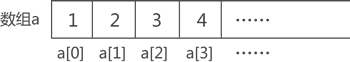 | 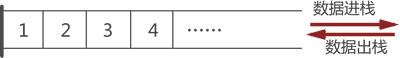 |
| :-----------------------------------------------: | :---------------------------------------------: |
|            图3-7 顺序表存储 {1,2,3,4}             |           图3-8 顺序表存储 {1,2,3,4}            |

同样，使用栈存储结构存储 `{1,2,3,4}`，其存储状态如图3-8所示

通过图3-7和图3-8的对比不难看出，使用顺序表模拟栈结构很简单，只需要将数据从 a 数组下标为 0 的位置依次存储即可。从数组下标为 0 的模拟栈存储数据是常用的方法，从其他数组下标处存储数据也完全可以，这里只是为了方便初学者理解。  

了解了顺序表模拟栈存储数据后，接下来看如何模拟栈中元素出栈的操作。由于栈对存储元素出栈的次序有"先进后出"的要求，如果想将图1-2中存储的元素 1 从栈中取出，需先将元素 4、元素 3 和元素 2 依次从栈中取出。

这里给出使用顺序表模拟栈存储结构常用的实现思路，即在顺序表中设定一个实时指向栈顶元素的变量（一般命名为 top），top 初始值为 -1，表示栈中没有存储任何数据元素，及栈是「空栈」。一旦有数据元素进栈，则 top 就做 +1 操作；反之，如果数据元素出栈, top 就做 -1 操作。

### 3.7.5 顺序栈元素入栈

比如，还是模拟栈存储 `{1,2,3,4}` 的过程。最初，栈是「空栈」，即数组是空的，top 值为初始值 -1，如下图所示：


首先向栈中添加元素 1，我们默认数组下标为 0 一端表示栈底，因此，元素 1 被存储在数组 a[1] 处，同时 top 值 +1，如下图所示：

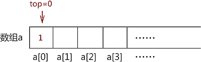


采用以上的方式，依次存储元素 2、3 和 4，最终，top 值变为 3，如图 示：


### 3.7.6 出栈模拟

其实，top 变量的设置对模拟数据的 "入栈" 操作没有实际的帮助，它是为实现数据的 "出栈" 操作做准备的。

比如，将图中的元素 2 出栈，则需要先将元素 4 和元素 3 依次出栈。需要注意的是，当有数据出栈时，要将 top 做 -1 操作。因此，元素 4 和元素 3 出栈的过程分别如a) 和 b) 所示：


注意，数组中元素的消失仅是为了方便初学者学习，其实，这里只需要对 top 值做 -1 操作即可，因为 top 值本身就表示栈的栈顶位置，因此 top-1 就等同于栈顶元素出栈。并且后期向栈中添加元素时，新元素会存储在类似元素 4 这样的旧元素位置上，将旧元素覆盖。

元素 4 和元素 3 全部出栈后，元素 2 才能出栈。因此，使用顺序表模拟数据出栈操作的 C 语言实现代码为：

```c
//数据元素出栈
int pop(int * a,int top){    
	if (top==-1) {        
		printf("空栈");        
		return -1;    
	}    
	printf("弹栈元素：%d\n",a[top]);    
	top--;    
	return top;
}
```

代码中的 if 语句是为了防止用户做 "栈中已无数据却还要数据出栈" 的错误操作。代码中，关于对栈中元素出栈操作的实现，只需要 top 值 -1 即可。

### 3.7.7 栈的链式结构

#### 链栈的定义

栈的链式存储结构称为链式, 是运算受限的单链表。其插人和删除操作只能在表头的位置上进行, 栈顶指针 top 就是链表的头指针, 头指针指向头结点。下图所示为栈的链式存储表示形式。链栈的实现思路同顺序栈类似，顺序栈是将数顺序表（数组）的一端作为栈底，另一端为栈顶；链栈也如此，通常我们将链表的头部作为栈顶，尾部作为栈底，如下图所示：


结合栈的后进先出的特征, 链栈其实是“头出头插”的单链表, 即入栈时是头插法, 将新的结点插人到头结点的后面;出栈时是头出法, 将头结点后的结点删除。

#### 链式结构的结点定义

链栈的结点类型说明如下: 

```c
typedef struct Stack Node{
    ElemType data;
    struct Stack_Node next:
}Stack_Node:
```


将链表头部作为栈顶的一端，可以避免在实现数据 「入栈」 和 「出栈」 操作时做大量遍历链表的耗时操作。

链表的头部作为栈顶，意味着：

- 在实现数据「入栈」操作时，需要将数据从链表的头部插入
- 在实现数据「出栈」操作时，需要删除链表头部的首元节点

因此，链栈实际上就是一个只能采用头插法插入或删除数据的链表。

## 3.8 链栈元素入栈

例如，将元素 1、2、3、4 依次入栈，等价于将各元素采用头插法依次添加到链表中，每个数据元素的添加过程如图 2 所示：


## 3.9 栈的应用

### 3.9.1 符号平衡
堆栈用于平衡符号。例如, 我们有以下内容:

```c
{((([])))}，[])，[[(]])}
```
正如我们所知, 每个程序都有左大括号和右大括号中括号小括号哦, 当左括号出现时, 我们将左括号压入堆栈, 当右括号出现时, 我们将对应的左括号从堆栈中弹出。因此, 净值为零。如果任何符号留在堆栈中, 则表示程序中出现了某种语法错误。

### 3.9.2 字符串反转

堆栈也用于反转字符串。 例如, 我们想要反转一个「JavaTpoint」字符串, 那么我们可以借助堆栈来实现。首先, 我们将字符串的所有字符压入堆栈, 直到到达空字符。推完所有字符后, 我们开始一个一个地取出字符, 直到到达栈底。

### 3.9.3 UNDO/REDO

也可用于执行UNDO/REDO操作。 例如, 我们有一个编辑器, 我们在其中编写'a', 然后是'b', 然后是'c'； 因此, 在编辑器中编写的文本是 abc。 所以, 一共有三种状态, a, ab, abc, 存储在一个栈中。 将有两个堆栈, 其中一个堆栈显示 UNDO 状态, 而

### 3.9.4 中缀表达式转化为后缀表达式

#### 有表达式
A - B + C *（ D / E - F ）+ G   
在运算过程中，首先创建一个 「运算符栈」。
　　1. 从左往右扫描，在扫描到操作数时，将此操作数加入后缀表达式。
　　2. 扫描到运算符时，将栈内的所有 优先级大于或等于该运算符的运算符 弹出，弹出的运算符加入后缀表达式，扫描到的运算符压入栈中。
　　3. 如果扫描到  「（ 」 ，将其压入栈中，并在运算时将其视为栈底（即运算 「（ 」之后的所有操作都在遇到 「（ 」 时截止）。直到遇到 「 ）」时，将栈内运算符依次弹出，直到弹出 「（ 」为止。
　　4. 在处理完所有字符之后，将栈内运算符依次弹出，并加入运算符。
运算过程：

该式最后转换结果为： $A B - C D E / F - * + G +$

|步数|过程|后缀表达式	|栈内情况（右侧为栈顶）|
|:-:|:-:|:-:|:-:|
|1|扫描到 “ A ”，加入后缀表达式|	A|	空|
|2|扫描到 “ - ”，压入栈内|	A|	-|
|3|扫描到 “ B ”，加入后缀表达式	|A B	|-|
|4|扫描到 “ + ”，弹出 “ - ” 加入后缀表达式，将 “ + ” 压入栈内| A B |- +|
|5| 扫描到 “ C ”，加入后缀表达式 |A B - C|+|
|6	|扫描到 “ * ”， 压入栈内|A B - C|+ *|
|7| 扫描到 “（ ”，压入栈内 |A B - C|+ * (|
|8|扫描到 “ D”，加入后缀表达式|	A B - C D |+ *（|
|9|扫描到 “ / ”，压入栈内| A B - C D |\+ *（  /|
|10| 扫描到 “ E ”，加入后缀表达式 |A B - C D E|\+ *（  /|
|11|扫描到 “ - ”，弹出 “ / ” 加入后缀表达式，将 “ - ” 压入栈内| A B - C D E / |\+ *（  -|
|12|扫描到 “ F ”，加入后缀表达式| A B - C D E / F |+  *（    -|
|13|扫描到 “ ）”，依次弹出栈内运算符，直到弹出 “（ ” 时。将弹出的运算符加入后缀表达式|A B - C D E / F|-	+  *|
|14|扫描到 “ + ”，弹出 “ * ”、“ + ” 加入后缀表达式，将 “ + ” 压入栈内 |A B - C D E / F-|* + +|
|15|扫描到 “ G ”，加入后缀表达式| A B - C D E / F - * + G |+|
|16|处理完成所有字符，依次弹出栈内运算符	|A B - C D E / F - * + G +	|空|


## 3.10 习题

### 3.10.1 选择

1. 为解决计算机主机与打印机之间速度不匹配问题，通常设置一个打印数据缓冲区，主机将要 输出的数据依次写入该缓冲区，而打印机则依次从该缓冲区中取出数据。该缓冲区的逻辑结 构应该是(  )。

   A.  栈        B. 队列       C.  树       D.  图

   

2. 设栈S 和队列Q 的初始状态均为空，元素a,b,c,d,e,f,g     依次进入栈 S。若每个元素出栈后 立即进入队列Q,  且7个元素出队的顺序是b,d,c,f,e,a,g,     则栈S 的容量至少是(   )。 

   A.1                 B.2                  C.3                  D.4

   

3. 若元素a,b,c,d,e,f    依次进栈，允许进栈、退栈操作交替进行，但不允许连续三次进行退栈操作，则不可能得到的出栈序列是(  )。

   A.d,c,e,b,f,a          B.c,b,d,a,e,f       C.b,c,a,e,f,d      D.a,f,e,d,c,b

   

4. 某队列允许在其两端进行入队操作，但仅允许在一端进行出队操作。若元素 a,b,c,d,e依次入此队列后再进行出队操作，则不可能得到的出队序列是

   A.b,a,c,d,e            B.d,b,a,c,e            C.d,b,c,a,e            D.e,c,b,a,d

   

5. 元素a,b,c,d,e   依次进入初始为空的栈中，若元素进栈后可停留、可出栈，直到所有元素都 出栈，则在所有可能的出栈序列中，以元素d 开头的序列个数是(  )。

   A.3                 B.4                  C.5                  D.6

   

6. 已知循环队列存储在一维数组 A[0.n-1] 中，且队列非空时 front 和 rear 分别指向队头元素和 队尾元素。若初始时队列为空，且要求第1个进入队列的元素存储在A[0]处，则初始时 front 和rear 的值分别是(  )。 

   A.0,0               B.0,n-1              C.n- 1,0               D.n-1,n-1

   

7. 已知操作符包括+,一，*', Y, (和)。将中缀表达式 a+b-a*((c+dYe-)+g 转换为等价的 后缀表达式 ab+acd+elf*-g+时，用栈来存放暂时还不能确定运算次序的操作符。若栈初始 时为空，则转换过程中同时保存在栈中的操作符的最大个数是(  )。

   A.5              B.7                 C.8                  D.11

   

8. 一个栈的入栈序列为1,2,3,…,n,  其出栈序列是Pi,P₂,P₃,…,Pn 。  若 p₂=3,  则p₃ 可能取值的个数是(  )。

   A.n-3                B.n-2                C.n-1                D. 无法确定

   

9. 假设栈初始为空，将中缀表达式a/b+(c*d-e*f)g  转换为等价的后缀表达式的过程中，当扫描到f 时，栈中的元素依次是(  )。

   A.+(*-             B.+(-*               C./+(*-*               D./+-*

   

10. 循环队列存放在一维数组A[0.M-1] 中 ，end1 指向队头元素， end2 指向队尾元素的后一个位置。假设队列两端均可进行入队和出队操作，队列中最多能容纳M-1  个元素，初始时为空。下列判断队空和队满的条件中，正确的是(  )。【2014年全国试题3(2)分】 

    A. 队空： end1==end2;               队满：end1=(end2+1)mod M

    B. 队空： end1=end2;                队满：end2=(end1+1)mod(M-1)

    C. 队空： end2=(end1+1)mod   M;    队满：end1=(end2+1)mod M

    D. 队空： end1=(end2+1)mod   M;     队满：end2=(end1+1)mod(M-1)

    

11. 已知程序如下：

```c
int s(int i){ 
	return(n<=0)?0:s(n-1)+n;         
}
void main()
{  cout<<s(1);    }
```
   程序运行时使用栈来保存调用过程的信息，自栈底到栈顶保存的信息依次对应的是(   )。

​	A.main)->S(1)->S(0)                      B.S(0)->S(1)->mainO
​		C.main)->S(0)->S(1)                       D.S(1)->S(0)->main()


12. 栈的特点是(  ①  ),队列的特点是(  ②  ),栈和队列都是(  ③  )。若进栈序列为 1,2,3,4,则(  ④  )不可能是一个出栈序列(不一定全部进栈后再出栈);若进队列的 序列为1,2,3,4,则( ⑤ )是一个出队列序列。

    ①,②:A.   先进先出  B.  后进先出     C. 进优于出     D. 出优于进

    ③:A . 顺序存储的线性结构        B. 链式存储的线性结构

    C. 限制存取点的线性结构       D.  限制存取点的非线性结构

    ④,⑤:A.3,2,1,4      B.3,2,4,1              C.4,2,3,1

    D.4,3,2,1     E.1,2,3,4             F.1,3,2,4

    

13. 一个栈的输入序列为1,2,3,…,n,  若输出序列的第一个元素是n,  输出第i(1≤i≤n)   个元素是(  )。

    A. 不确定     B.n-i                 C.i                  D.n-i+1

    

14. 设栈的输入序列为1,2,3,…,n;  输出序列为P₁,P₂,…,Pn;    若 P₁=n,  则 当n≥i≥1 时， p₁ 为 (   );若存在k>1 使p=n,   则 当 >k 时，p₁ 为 (  )。

    A.p=n-i+1          B.p; 不确定      C.p=n-(i-k)

    

15. 中缀表达式 (A+B)*(C-D)/(E-F*G)   的后缀表达式是(   )。
    A. $A+B*C-D/E-F*G  $                                           B.$AB+CD-*EFG*-/$
    C. $AB+C*D-E/F-G*$                                          D.$ABCDEFG+*/*$

    

16.某表达式的前缀形式为：$+-*^ABCD/E/F+GH$它的中缀形式为()。

A.$AB*C-D+E/F/G+H  $                					B. $A^B *(C-D)+(E/F)/G+H          $            

C$AB*C-D+E/(F/(G+H))  $                                    		D.$AB*(C-D)+E/(F/(G+H))$


17. 表达式$a*(b+c)-d$的后缀表达式是(  )。

    A.abcd*+-                    B.abc+*d-                      C.abc*+d-                      D.-+*abcd

    

18. 与中缀表达式$a*b+c/d-e$等价的前缀表达式是(  )。【华中科技大学2006 一、5(2分)】
    A.-+*ab/cde                 B.*+/-abcde                   C.abcde*+/-                    D.+*ab-/cde

    

19. 利用栈求表达式的值时，设立操作数栈 OPND,  设 OPND  只有两个存储单元，在下列表达式中，不发生上溢的是(  )。
      $ A.A-B*(C-D)               B.(A-B)*C-D                  C.(A-B*C)-D                  D.(A-B)*(C-D)$

    

20. 有六个元素6,5,4,3,2,1 的顺序进栈，问下列哪一个不是合法的出栈序列?(  )

    A.543612           B.453126             C.346521             D.234156

    

21. 设栈的输入序列是1,2,3,4,则(  )不可能是其出栈序列。

    A.1,2,4,3           B.2,1,3,4             C.1,4,3,2             D.4,3,1,2		E.3,2,1,4


22. 四个元素1,2,3,4依次进栈，出栈次序不可能出现(  )种情况。

    A.1,2,3,4           B.4,1,3,2             C.1,4,3,2              D.4,3,2,1

    

23. 如进栈序列1,2,3,4,5。可能得到的出栈序列为(  )。

    A.1,2,5,3,4          B.3,1,2,5.4            C.3,2,5,4,1            D.1,4,2,3,5	E.  都不可能

    

24. 一个栈的入栈序列为A,B,C,D,E,  则栈的不可能出栈序列是(   )。

    A.ABCDE          BEDCBA           C;DECBA            D.DCEAB

    

25. 设 n 个元素进栈序列是1,2,3,…,n,  其输出序列是pl,p2,p3,…,pn,     若 p1=3,  则 p2的值为 (   )。

    A. 一定是2     B. 一定是1      C. 不可能是1    D. 以上都不对

    

26. 某堆栈的输入序列为a,b,c,d,    下面的四个序列中，不可能是它的输出序列的是(  )。

    A.a,c,b,d            B.b,c,d,a              C.c,d,b,a              D.d,c,a,b

    

27. (多选)若已知一个栈的入栈序列是1,2,3,4,其出栈序列为pi,P₂,P₃,P₄,    则 p₂,P₄  可能为(   )。

    A.2 、4             B.2 、1              C.4 、3               D.3 、4

    

28. 输入序列为ABC, 可以变为CBA 时，经过的栈操作为(  )。

    A.push,pop,push,pop,push,pop               B.push,push,push,pop,pop,pop

    C.push,push,pop,pop,push,pop              D.push,pop,push,push,pop,pop


29. 依次读入数据元素序列{a,b,c,d,e,f,g}    进栈，每进一个元素，机器可要求下一个元素进栈 或弹栈，如此进行，则栈空时弹出的元素构成的序列是以下哪些序列? (   )。

    A.{d,e,c,f,b,g,a}                           B.{f,e,g,d,a,c,b}

    C.{e,f,d,g,b,c,a}                           D.{c,d,b,e,f;a,g}

30. 4个圆盘的 Hanoi 塔，总的移动次数为(  )。

    A.7                 B.-8                  C.15         D.16


32. 和顺序栈相比，链栈有一个比较明显的优势是(  )。
     A. 通常不会出现栈满的情况       B. 通常不会出现栈空的情况

    C. 插入操作更容易实现         D.  删除操作更容易实现

    

33. 若一个栈以向量 V[1..n]存储，初始栈顶指针top为 n+1, 则下面x 进栈的正确操作是(   )。

A.top=top+1;    Vtop]=x                   B.V[top]=x;   top=top+1

C.top=top-1;    V[top]=x                   D.V[top]=x;   top=top-1


34. 若栈采用顺序存储方式存储，现两栈共享空间 V[1.m],top[1  代表第i 个栈 (i=1,2)   栈顶，

栈1的底在 V[1], 栈2的底在 V[m], 则栈满的条件是(  )。

A.|top[2]-top[1]|=0  B.top[1]+1=top[2]  C.top[1]+top[2]=m     D.top[1]=top[[2\]


35. 栈 在 (  )中应用。

    A. 递归调用     B.  子程序调用    C. 表达式求值    D.A,B,C

    

36. 向一个栈顶指针为 h 的带头结点的链栈中插入指针 s 所指的结点时，应执行(  )。

    A.h->next=s;                             B.s->next=h;

    C.s->next=h;h->next=s;                     D.s->next=h->next;h->next=s; 

    

37. 一个递归算法必须包括(  )。
    A. 递归部分              B.  终止条件和递归部分

    C. 迭代部分              D. 终止条件和迭代部分

## 3.11 参考答案

| 1.B  | 2.C    | 3.D   | 4.C   | 5.B   | 6.B   | 7.A  | 8.C   | 9.B   | 10.A |
| ---- | ------ | ----- | ----- | ----- | ----- | ---- | ----- | ----- | ---- |
| 11.A | 12.1B  | 12.2A | 12.3C | 12.4C | 12.5F | 13.D | 14.1A | 14.2B | 15.B |
| 16.C | 17.B   | 18.A  | 19.B  | 20.C  | 21.D  | 22.B | 23.C  | 24.D  | 25.C |
| 26.D | 27.ABD | 28.B  | 29.AD | 30.C  | 31.C  | 32.A | 33.C  | 34.B  | 35.D |
| 36.D | 37.B   | 38.B  | 39.B  | 40.D  | 41.C  | 42.D | 43.B  | 44.D  | 45.A |
| 46.A | 47.A   | 48.D  | 49.B  | 50.E  | 51.C  | 52.B | 53.C  | 54.A  | 55.A |
| 56.C | 57.A   | 58.D  | 59.B  | 60.A  | 61.B  | 62.A | 63.B  | 64.C  |      |
# 第4章 队列

## 4.1 队列的定义

队列是一种抽象的数据结构, 有点类似于栈。与栈不同, 队列的两端都是开放的。 一端始终用于插入数据(入队), 另一端用于移除数据(出队)。 队列遵循先进先出的方法, 即先存储的数据项将首先被访问。

事实上, 生活中有很多这样的例子, 如大家排队购物、排队等公交、排队等电梯、排队买饭等, 都是先排
队的人先离开队列。

## 4.2 队列示例

队列的真实示例可以是单车道单行道, 车辆先进入, 先离开。


队列表示: 正如我们现在所了解的那样, 在队列中, 我们出于不同的原因访问两端。 下面给出的下图试图将队列表示解释为数据结构


与堆栈一样, 队列也可以使用数组、链表、指针和结构来实现。

## 4.3 队列的基本概念

队列(Queue)：一种先进先出(First In First Out , FIFO)的线性表, 即只允许在表的一端进行插人,而在另一端进行删除。所以, 队列也是一种运算受限的线性表.

## 4.4 队列的基本操作和性质

队列的性质：先进先出。为了实现先进先出, 我们要设置两个指针：第一个是队首,即允许进行删除的一端, 一般用firont 表示;第二个是队尾, 即允许进行插人的一端, 一般用 rear 表示。

### 4.4.1 队列有两种最基木的操作

+ 出队: 也就是删除队首元素。

+ 入队: 也就是在队尾插人新元素。

在空队列中依次加入元素a1, a2, ……, a之n后, a1是队首元素, an 是队尾元素。出队就a1-an的顺序出队, 人队需要在an后依次插人元素。

## 4.5 队列的功能

+ enqueue() − 添加(存储)一个项目到队列中。
+ dequeue() − 从队列中删除(访问)一个项目。
+ peek() - 获取队列前面的元素而不删除它。
+ isfull() - 检查队列是否已满。
+ isempty() - 检查队列是否为空。

## 4.6 顺序队列

以列可以用顺序结构和链式结构进行存储, 我们首先看顺序结构, 利用一组连线的存储单元(一维数组)依次存放从队首到队尾的各个元素,称为顺序队列。队列和顺序栈类似, 也有动态和静态之分．我们接下来要学习的是静态顺序队列。大家知道, 队列有队首和队尾,所以顺序队列中要定义队首和队尾。

### 4.6.1 顺序队列的初始化

为了方便说明, 在下图中,数组的大小设置为10,也就是下标是0~9,元素是$ a_1、a_2 、a_3 、a_4 、a_5、a_6、a_7、a_8 、a_9 $ 

  

+ 顺序队列初始化时, 队列是空的, 数组的下标是0-9此时 front 和rear均指向下标为0的位置, 如图(a)所示。

  当队列不空时, front 指向队首元素, rear 指向队尾元素的下一个空位置, 如图 b)所示。队列中有4个元素 $a1、a2、a3、a4$, 此时 front 指向队首元素 a1,rear 指向队尾元素$a_4$的下一个空位置。

+ 入队操作。先放入元素, 再rear++。(C)所示, 先将$a_5$放入到下标为4的位置, 也就是Queue_array[rear], rear从4->5。
+ 出队操作。先出元素, 再front++。如图 c所示, 此时front 是0, 先取出下标为 front 的元素, 也就是 Queve_ array[front], 再front++, front 变为1。此时, 细心的小伙伴会发现, 在图d中, 元素出队了, 后面的元素没有往前补缺, 而我们平时排队中, 如果前面的人离开了, 后面的人就会自动往前移动。这是怎么回事呢？这里的存储结构是顺序结构, 如果依次将后续的元素向前移动, 那么这个操作的复杂度就太高了, 得不偿失。于是, 元素出队了,front 指针向后移动, 而不是将后续的元素向前移动, 毕竟front 向后移动只需要加1就可以了。
+ 队列空的条件。我们在前面挖了一个坑(front 指向队首元素,rear指向队尾元素的下一个空位置), 在讲解队列为空之前, 我们先看几个队列空的例子。如图(a)、(b)、(C)所示, 可以看到, 当front == rear时, 表示队列为空。如因(d)所示, front 指向队首元素日, rear 指向队尾元素 as。如果依次把 a1、a2、a3、a4出队列, 那么front 和rear将同时指向4, 如图(e)所示, 此时 front ==rear, 而队列中还有元素, 这就和front一—rear 表示队列为空无法区分了。因此设置 front 指向队首元素,rear 指向队尾元素的下一个空位置, 当 front == rear时,表示队列为空。

### 4.6.2 顺序队列的编码

#### 定义队列的基本结构

```c
typedef struct {
	ElemType data[Maxsize]; //用静态数组存放队列元素
	int front, rear; //队头指针与队尾指针
}SqQueue;
```
#### 初始化队列

```c
void InitQueue(SqQueue& Q)
{//初试时，队头、队尾指针指向0
	Q.front = Q.rear = 0;
}
```

#### 判断队列空

如果队列首指针等于尾指针，那么该队列没有元素

```c
Status QueueEmpty(SqQueue Q)
{
	if (Q.rear == Q.front)
		return true;
	else
		return false;
}
```
#### 入队

```c
Status EnQueue(SqQueue& Q, ElemType x)
{
	if (Q.rear == Maxsize) //会存在假上溢
		return false;//队满则报错
	Q.data[Q.rear] = x; //将x插入队尾
	Q.rear++;
	return true;
}
```
#### 出队

```c
Status DeQueue(SqQueue& Q, ElemType& x)
{
	if (Q.front == Q.rear)
		return false; //队空则报错
	x = Q.data[Q.front]; //将队头元素赋给x
	Q.front++;
	return true;
}
```

## 4.7 循环队列

为充分利用向量空间, 克服"假溢出"现象的方法是：将向量空间想象为一个首尾相接的圆环, 并称这种向量为循环向量。存储在其中的队列称为循环队列(Circular Queue)。循环队列是把顺序队列首尾相连, 把存储队列元素的表从逻辑上看成一个环, 成为循环队列。

如图:  

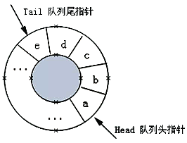


## 4.8 循环队列的特点和操作

循环队列就是将队列存储空间的最后一个位置绕到第一个位置, 形成逻辑上的环状空间, 供队列循环使用。在循环队列结构中, 当存储空间的最后一个位置已被使用而再要进入队运算时, 只需要存储空间的第一个位置空闲, 便可将元素加入到第一个位置, 即将存储空间的第一个位置作为队尾。循环队列可以更简单防止伪溢出的发生, 但队列大小是固定的。 

在循环队列中, 当队列为空时, 有front=rear, 而当所有队列空间全占满时, 也有front=rear。为了区别这两种情况, 规定循环队列最多只能有MaxSize-1个队列元素, 当循环队列中只剩下一个空存储单元时, 队列就已经满了。因此, 队列判空的条件是front=rear, 而队列判满的条件是front=(rear+1)%MaxSize。

## 4.9 循环队列的要点
循环队列即是逻辑结构也是存储结构, 只能由数组实现, 不能用链表实现。

### 4.9.1 循环队列条件处理

循环队列中, 由于入队时尾指针向前追赶头指针, 出队时头指针向前追赶尾指针, 造成队空和队满时头尾指针均相等。因此, 无法通过条件front==rear来判别队列是「空」还是「满」。
解决这个问题的方法至少有两种：  
1. 另设一布尔变量以区别队列的空和满；
3. 另一种方式就是数据结构常用的： 队满时：(rear+1)%n==front, n为队列长度(所用数组大小), 由于rear, front均为所用空间的指针, 循环只是逻辑上的循环, 所以需要求余运算。如图1所示情况, 队已满, 但是rear(5)+1=6！=front(0), 对空间长度求余, 作用就在此6%6=0=front(0)。

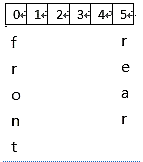

类型定义采用环状模型来实现队列,各数据成员的意义如下：
+ front指定队首位置, 删除一个元素就将front顺时针移动一位
+ rear指向元素要插入的位置, 插入一个元素就将rear顺时针移动一位
+ count存放队列中元素的个数, 当count等于MaxQSize时, 不可再向队列中插入元素


## 4.10 循环队列的编码
### 4.10.1 定义数据类型

```c
// 队列的顺序存储结构(循环队列)
#define MAX_QSIZE 5 // 最大队列长度+1
typedef struct {
    int *base; // 初始化的动态分配存储空间
    int front; // 头指针, 若队列不空, 指向队列头元素
    int rear; // 尾指针, 若队列不空, 指向队列尾元素的下一个位置
} SqQueue;
```
### 4.10.2 初始化
```c
// 构造一个空队列Q
SqQueue* Q_Init() {
    SqQueue *Q = (SqQueue*)malloc(sizeof(SqQueue));
    // 存储分配失败
    if (!Q){
        exit(OVERFLOW);
    }
    Q->base = (int *)malloc(MAX_QSIZE * sizeof(int));
    // 存储分配失败
    if (!Q->base){
        exit(OVERFLOW);
    }
    Q->front = Q->rear = 0;
    return Q;
}
```
### 4.10.3 清空队列
```c
// 将Q清为空队列
void Q_Clear(SqQueue *Q) {
    Q->front = Q->rear = 0;
}
```
### 4.10.4 获取队列元素个数
```c
// 返回Q的元素个数, 即队列的长度
int Q_Length(SqQueue Q) {
    return (Q.rear - Q.front + MAX_QSIZE) % MAX_QSIZE;
}
```
### 4.10.5 获取队列头元素
```c
// 若队列不空, 则用e返回Q的队头元素, 并返回OK；否则返回ERROR
int Q_GetHead(SqQueue Q, int &e) {
    if (Q.front == Q.rear) // 队列空
        return -1;
    e = Q.base[Q.front];
    return 1;
}
```
### 4.10.6 打印队列中的内容
```c
// 打印队列中的内容
void Q_Print(SqQueue Q) {
    int p = Q.front;
    while (Q.rear != p) {
        cout << Q.base[p] << endl;
        p = (p + 1) % MAX_QSIZE;
    }
}
```
### 4.10.7 插入新的元素在队尾
```c
// 插入元素e为Q的新的队尾元素
int Q_Put(SqQueue *Q, int e) {
    if ((Q->rear + 1) % MAX_QSIZE == Q->front) // 队列满
        return -1;
    Q->base[Q->rear] = e;
    Q->rear = (Q->rear + 1) % MAX_QSIZE;
    return 1;
}
 
```
### 4.10.8 弹出元素
```c
// 若队列不空, 则删除Q的队头元素, 用e返回其值, 并返回1；否则返回-1
int Q_Poll(SqQueue *Q, int &e) {
    if (Q->front == Q->rear) // 队列空
        return -1;
    e = Q->base[Q->front];
    Q->front = (Q->front + 1) % MAX_QSIZE;
    return 1;
}
```


## 4.11 双端队列
是一种具有队列和栈的性质的数据结构。双端队列中的元素可以从两端弹出, 其限定插入和删除操作在表的两端进行。
双端队列是限定插入和删除操作在表的两端进行的线性表。这两端分别称做端点1和端点2。也可像栈一样, 可以用一个铁道转轨网络来比喻双端队列。在实际使用中, 还可以有输出受限的双端队列(即一个端点允许插入和删除, 另一个端点只允许插入的双端队列)和输入受限的双端队列(即一个端点允许插入和删除, 另一个端点只允许删除的双端队列)。而如果限定双端队列从某个端点插入的元素只能从该端点删除, 则该双端队列就蜕变为两个栈底相邻的栈了。

### 4.11.1 双端队列优缺点

尽管双端队列看起来似乎比栈和队列更灵活, 但实际上在应用程序中远不及栈和队列有用。因为我们在用某些数据结构的时候，首先想起来的永远是比较经典，有个性的数据结构，而不是万金油。所以啊，太过于圆滑反而会失去自我。                      


## 4.12 链式队列

简称「链队列」，即使用链表实现的队列存储结构。

链式队列的实现思想同顺序队列类似，只需创建两个指针（命名为 top 和 rear）分别指向链表中队列的队头元素和队尾元素，如下图所示:

| 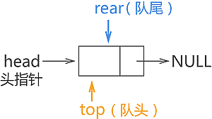 |
| :--------------------------------------------: |
|           图 4-11 链式队列的初始状态           |

图 4-11所示为链式队列的初始状态，此时队列中没有存储任何数据元素，因此 top 和 rear 指针都同时指向头节点。

在创建链式队列时，强烈建议初学者创建一个带有头节点的链表，这样实现链式队列会更简单。

由此，我们可以编写出创建链式队列的 C 语言实现代码为:

```c
//链表中的节点结构
typedef struct QNode{    
	int data;    
  struct QNode * next;}QNode;
//创建链式队列的函数
QNode * initQueue(){    
//创建一个头节点    
QNode * queue=(QNode*)malloc(sizeof(QNode));    
  //对头节点进行初始化    
  queue->next=NULL;    
  return queue;
}
```

## 4.13 链式队列数据入队

链队队列中，当有新的数据元素入队，只需进行以下 3 步操作：

1. 将该数据元素用节点包裹，例如新节点名称为 elem；
2. 与 rear 指针指向的节点建立逻辑关系，即执行 rear->next=elem；
3. 最后移动 rear 指针指向该新节点，即 rear=elem；

由此，新节点就入队成功了。

例如，在图 1 的基础上，我们依次将 `{1,2,3}` 依次入队，各个数据元素入队的过程如图 2 所示:

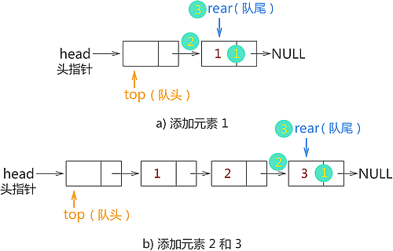

 {1,2,3} 入链式队列

数据元素入链式队列的 C 语言实现代码为：

```c
QNode* enQueue(QNode * rear,int data){    
//1、用节点包裹入队元素    
	QNode * enElem=(QNode*)malloc(sizeof(QNode));    
  enElem->data=data;    enElem->next=NULL;    
  //2、新节点与rear节点建立逻辑关系    
  rear->next=enElem;    
  //3、rear指向新节点    
  rear=enElem;    
  //返回新的rear，为后续新元素入队做准备    
  return rear;
}
```

## 4.14 链式队列数据出队

当链式队列中，有数据元素需要出队时，按照 「先进先出」的原则，只需将存储该数据的节点以及它之前入队的元素节点按照原则依次出队即可。这里，我们先学习如何将队头元素出队。

链式队列中队头元素出队，需要做以下 3 步操作：

1. 通过 top 指针直接找到队头节点，创建一个新指针 p 指向此即将出队的节点；
2. 将 p 节点（即要出队的队头节点）从链表中摘除；
3. 释放节点 p，回收其所占的内存空间；

例如，在图b) 的基础上，我们将元素 1 和 2 出队，则操作过程如图 4-3 所示：

|  |
| :-------------------------------------------------: |
|            图 4-3 链式队列中数据元素出队            |

链式队列中队头元素出队的 C 语言实现代码为：

```c
void DeQueue(QNode * top,QNode * rear){    
	if (top->next==NULL) {        
		printf("队列为空");        
		return ;    
	}    
// 1、    
	QNode * p=top->next;    
	printf("%d",p->data);    
	top->next=p->next;    
	if (rear==p) {       
		rear=top;    
	}    
	free(p);
}
```

注意，将队头元素做出队操作时，需提前判断队列中是否还有元素，如果没有，要提示用户无法做出队操作，保证程序的健壮性。

## 4.15 总结

通过学习链式队列最基本的数据入队和出队操作，我们可以就实际问题，对以上代码做适当的修改。

前面在学习顺序队列时，由于顺序表的局限性，我们在顺序队列中实现数据入队和出队的基础上，又对实现代码做了改进，令其能够充分利用数组中的空间。链式队列就不需要考虑空间利用的问题，因为链式队列本身就是实时申请空间。因此，这可以算作是链式队列相比顺序队列的一个优势。

这里给出链式队列入队和出队的完整 C 语言代码为：

```c
#include <stdio.h>
#include <stdlib.h>
typedef struct QNode{    
	int data;    
	struct QNode * next;}QNode;QNode * initQueue()
	{     
		QNode * queue=(QNode*)malloc(sizeof(QNode));    
		queue->next=NULL;    
		return queue;
	}
	QNode* enQueue(QNode * rear,int data)
	{    
			QNode * enElem=(QNode*)malloc(sizeof(QNode));    
			enElem->data=data;    
			enElem->next=NULL;    //使用尾插法向链队列中添加数据元素    
			rear->next=enElem;    
    rear=enElem;    
    return rear;}QNode* 
 DeQueue(QNode * top,QNode * rear){    
    if (top->next==NULL) {        
      printf("\n队列为空");        
      return rear;    
    }    
    QNode * p=top->next;    
    printf("%d ",p->data);    
    top->next=p->next;    
 if (rear==p) {        
   rear=top;    }    free(p);    
    return rear;
  }
int main() {    
    QNode * queue,*top,*rear;    
  queue=top=rear=initQueue(); //创建头结点     
                            //向链队列中添加结点，使用尾插法添加的同时，队尾指针需要指向链表的最后一个元素    
  rear=enQueue(rear, 1);    
  rear=enQueue(rear, 2);    
  rear=enQueue(rear, 3);    
  rear=enQueue(rear, 4);    //入队完成，所有数据元素开始出队列    
  rear=DeQueue(top, rear);    
  rear=DeQueue(top, rear);    
  rear=DeQueue(top, rear);    
  rear=DeQueue(top, rear);    
  rear=DeQueue(top, rear);    
  return 0;
}
```


## 4.16 队列的典型应用
1. 排队、打印服务
2. 树的层次遍历
3. 图的广度优先遍历
4. 优先队列


### 4.16.1 优先队列

普通的队列是一种先进先出的数据结构，元素在队列尾追加，而从队列头删除。在优先队列中，元素被赋予优先级。当访问元素时，具有最高优先级的元素最先删除。优先队列具有最高级先出 （first in, largest out）的行为特征。通常采用堆数据结构来实现。例如普通二叉堆，配对堆等。

# 第5章 树和二叉树

## 5.1 树的概念

树是一种非常通用且功能强大的数据结构，类似于真实的树。是由n(n≥0)个有限节点组成一个具有层次关系的集合。把它叫做「树」是因为它看起来像一棵倒挂的树，也就是说它是根朝上，而叶朝下的。

## 5.2 树的规范

通常，我们可以指定一棵树由节点（也称为顶点）和具有树状结构的边（也称为线，或者边，为了强调有向性，称为弧）所组成。
用图形表示的树通常是最容易的，一个简单的示例如下图所示： 


## 5.3 树的特点

+ 每个节点有零个或多个子节点
+ 没有父节点的节点称为根节点
+ 每一个非根节点有且只有一个父节点
+ 除了根节点外，每个子节点可以分为多个不相交的子树
+ 我们通常将把节点保存的数据称为它的值
+ 没有子节点的节点被称作为叶节点
+ 路径是从一个节点到另一个节点的一系列连接边。 
+ 对于每个节点，都有一条将它与根连接起来的唯一路径。
+ 树的节点的深度或级别由该路径的长度给出
+ 该节点拥有子节点的数量是节点的度
+  一棵树中，最大的节点的度称为树的度
+ 树的深度：从根节点开始（其深度为0）自顶向下逐层累加的。

  树的高度：从叶子节点开始（其高度为0）自底向上逐层累加的。54的高度是2，根节点23的高度是3。

## 5.4 看图说话

+ 树必须始终有一个根节点。在上图中，8就是根节点。
+ 通过分支连接到给定节点的「向下」是该节点的子节点。节点 8 的子节点是节点 3 和 11。反之，节点连接到上一层的给定节点, 是它的父节点。 例如, 节点 11 是节点 9（以及节点 14）的父节点。 
+ 具有相同父节点的节点被称为兄弟姐妹——根据定义，兄弟姐妹总是处于同一层次。
+ 如果第一个节点是第二个节点是的孩子的孩子。那么的第一个节点是第二个节点的后代。相反，第二个节点是第一个节点的祖先。
+ 标记1、7、10、12、15、19的节点为叶子节点，他们没有孩子。
+ 根节点的级别为 0，其子节点的级别为 1，依此类推。 a的最大长度树中的路径也称为树的高度。 总有一条最大长度的路径
+ 从根到叶。 树的大小由它包含的节点数决定。 我们通常应假定每棵树都是有限的。
+ 的树的高度为 3，大小为 11。仅由一个节点组成的树有+高度为 0，大小为 1。显然，空树的大小为 0 并且已定义（虽然很方便有点人为地）有 −1 的高度。

## 5.5 二叉树

二叉树是由节点组成的树数据结构，每个节点最多有两个子节点，称为左子节点和右子节点。 树从称为根的单个节点开始。

树中的每个节点包含以下内容：

+ 数据

+ 指向左孩子的指针

+ 指向右孩子的指针

+ 在叶节点的情况下，指向左右子节点的指针指向空。 

  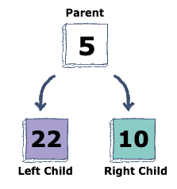

注意：没有特定的方式来排列二叉树中的数据。

## 5.6 二叉树的数学性质

* 二叉树的第i层上至多有 $ 2^{i-1} $（i≥1）个节点 
* 深度为h的二叉树中至多含有 $2^h-1 $个节点  。
* 若在任意一棵二叉树中，有$n_0$个叶子节点，有$n_2$个度为2的节点，则必有$n_0=n_2+1$, 这个性质可以推广。

* 具有n个节点的满二叉树深为 $ log_2n+1 $

* 若对一棵有n个节点的完全二叉树进行顺序编号（1≤i≤n），那么，对于编号为i（i≥1）的节点： 当i=1时，该节点为根，它无双亲节点 。
    当i>1时，该节点的双亲节点的编号为i/2
    若2i≤n，则有编号为2i的左节点，否则没有左节点 
    若2i+1≤n，则有编号为2i+1的右节点，否则没有右节点 
### 5.6.1 部分二叉树的主要性质说明

性质1：在二叉树的第i层上至多有$ 2^{i-1} $（i≥1）个节点   这个性质很好记忆，观察一下下图：


 + 第一层是根结点，只有一个，所以 $2^1-1=2^0=1$。
 + 第二层有两个，$2^{2-1}=2^1=2$。
 + 第三层有四个，$2^{3-1}=2^2=4$。
 + 第四层有八个，$2^{4-1}=2^3=8$。
 + 通过数据归纳法的论证，可以很容易得出在二叉树的第i层上至多有$2^{i-1}$个结点（i≥1）的结论。

性质2：深度为h的二叉树中至多含有 $2^h-1 $个节点，深度为k意思就是有k层的二叉树，我们先来看看简单的。

+ 如果有一层，至多$1=2^1-1$个结点。
+ 如果有二层，至多$1+2=3=2^2-1$个结点。
+ 如果有三层，至多$1+2+4=7=2^3-1$个结点。
+ 通过数据归纳法的论证，得出，如果有h层，此二叉树至多有$2^h-1$个结点。

 性质3：对任何一棵二叉树T，如果其终端结点数为$n_0$，度为2的结点数为$n_2$, 那么$n_2+1=n_0$,

终端结点数其实就是叶子结点数，而一棵二叉树，除了叶子结点外，剩下的就是度为1或2的结点数了，我们设n1为度是1的结点数。则树T结点总数$n=n_0+n_1+n_2$。

比如下图的例子，结点总数为10，它是由A、B、C、D等度为2结点，F、G、H、I、J等度为0的叶子结点和E这个度为1的结点组成。总和为4+1+5=10。


### 5.6.2 二叉树的两项全等

从一个方面讲，二叉树中除了根节点每个节点都被一条边吊着。同时每个非叶子节点都会放出边，根据这两个边的相等。我们假设：

有n个节点，其中度为1的为数量为$n_1$，度为0的数量为$n_0$，度为2的数量为$n_2$，

那么 $n_0+n_1+n_2-1$为边的数量，因为只有根节点没被吊着（1）

同时 $n_11+n_22$也是边的数量（2）

另(1)=(2)那么可以推导出$ n_0 = n_ 2+1$

  

## 5.7 二叉树常用操作

### 5.7.1 插入

元素可以以任何顺序插入到二叉树中。 第一个插入操作创建根节点。 随后的每次插入都会迭代地在树的每一层搜索一个空位置。

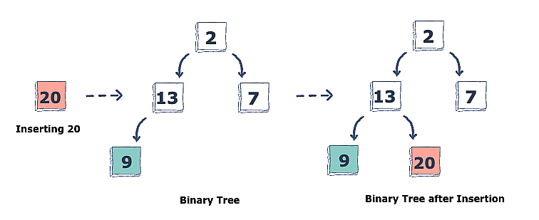

找到空的左或右孩子后，将插入新元素。 按照惯例，插入总是从左子节点开始。

### 5.7.2 删除

也可以从二叉树中删除一个元素。 由于元素之间没有特定的顺序，删除特定节点后，它会被最右边的元素替换。

让我们看一个示例，以更好地了解删除过程的工作原理。

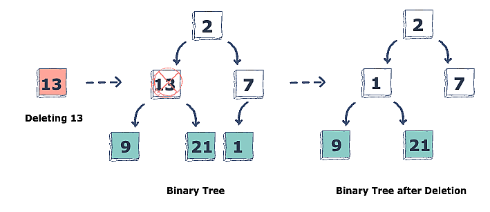


## 5.8 二叉树的高度

二叉树的高度是二叉树结点层次的最大值，也就是其左右子树的最大高度+1。当树为空时，高度为0；否则为其左右子树最大高度+1。二叉树是递归定义的，其结点有左右子树之分，逻辑上二叉树有五种基本形态。完全二叉树的特点是叶子结点只可能出现在层序最大的两层上，并且某个结点的左分支下子孙的最大层序与右分支下子孙的最大层序相等或大1。


上面的二叉树高度为3

## 5.9 二叉树的遍历「掌握」

树的遍历也叫树的搜索。树遍历是访问树中存在的每个节点的过程。是指按照某种规则对树的节点进行一遍不重复的访问，遍历树的四种方法：

+ 中序遍历
+ 后序遍历
+ 前序遍历
+ 层次遍历

### 5.9.1 先序遍历

树的前序遍历指的是对树按照根、左、右的规律进行访问。
流程如下:
1. 访问当前节点(这里通常是输出节点的值)
2. 如果有左孩子, 跳转到1, 将左孩子视为当前节点, 无则向下执行
3. 如果有右孩子, 跳转到1, 将右孩子视为当前节点, 无则向下执行
4. 返回跳转的上一层, 恢复当前节点为跳转之前的节点。如果为根节点, 那么结束, 否则, 继续执行

如图: 
> 记住是根、左、右而不是根、右、左


遍历结果为：F, B, A, D, C, E, G, I, H
2）递归代码实现（对于先根、中根、后根遍历的递归实现非常的相似，只是改变输出数组语句的位置）

```c++
	//存储遍历结果的数组
	vector<int> v;
	//前序遍历函数
    vector<int> preorderTraversal(TreeNode root) {
        if(root==nullptr) return v;
        visit(root->val); //访问
        preorderTraversal(root->left);
        preorderTraversal(root->right);
        return v;
    }
```

### 5.9.2 中序遍历

树的中序遍历指的是对树按照左、根、右的规律进行访问。

流程如下:
1. 如果有左孩子, 跳转到1, 将左孩子视为当前节点, 无则向下执行
2. 访问当前节点(这里通常是输出节点的值)
3. 如果有右孩子, 跳转到1, 将右孩子视为当前节点, 无则向下执行
4. 返回跳转的上一层, 恢复当前节点为跳转之前的节点。如果为根节点, 那么结束, 否则, 继续执行

如图:

 

遍历结果为：A, B, C, D, E, F, G, H, I

```c++
	//存储遍历结果的数组
	vector<int>v;
    //中序遍历函数
    vector<int> inorderTraversal(TreeNode root) {
        if(root==nullptr) return v;
        inorderTraversal(root->left);
        visit(root->val);  //访问
        inorderTraversal(root->right);
        return v;
    }
```

### 5.9.3 后序遍历

树的后序遍历指的是对树按照左、右、根的规律进行访问。

1. 如果有左孩子, 跳转到1, 将左孩子视为当前节点, 无则向下执行
2. 如果有右孩子, 跳转到1, 将右孩子视为当前节点, 无则向下执行
3. 访问当前节点(这里通常是输出节点的值)
4. 返回跳转的上一层, 恢复当前节点为跳转之前的节点。如果为根节点, 那么结束, 否则, 继续执行

遍历结果为：A, C, E, D, B, H, I, G, F.
```c++
	//存储结果数组
 	vector<int> v;
 	//后序遍历函数
    vector<int> postorderTraversal(TreeNode root) {
        if(root == nullptr) return v;
        postorderTraversal(root->left);
        postorderTraversal(root->right);
        visit(root->val); //访问
        return v;
    }
```

### 5.9.4 层序遍历

规则是若树为空，则空操作返回，否则从树的第一层，也就是根结点开始访问，从上而下逐层遍历，在同一层中，按从左到右的顺序对结点逐个访问。如下图所示，遍历的顺序为：ABCDEFGHI。

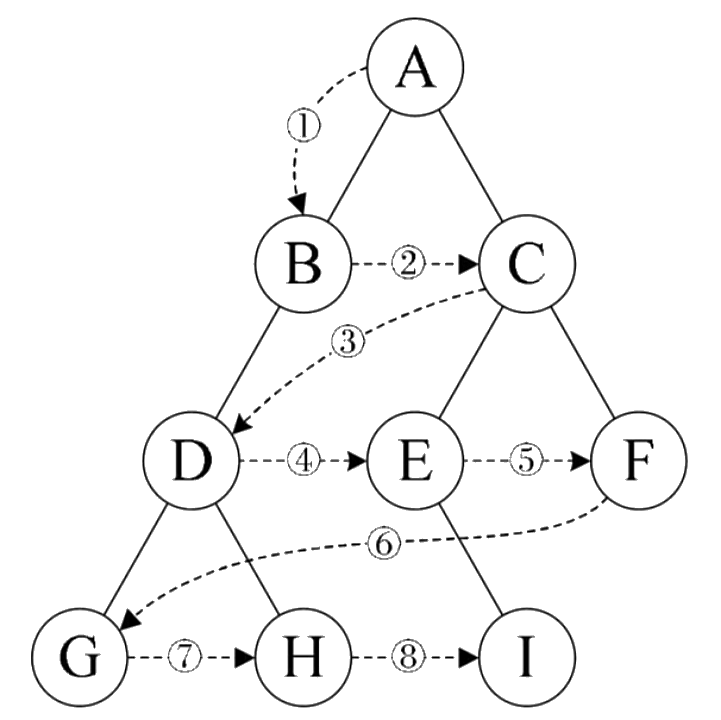


#### 迭代代码

层序遍历需要借助队列这种容器实现

（我们把每一层放在一个数组中，最后将它们再放入一个总的数组中）
```c++
  vector<vector<int> > levelOrder(TreeNode root) {
     vector<vector<int>> v;
     if(root == NULL) return v;  //特判
     queue<TreeNode> q;  //队列
     TreeNode temp = NULL;
     q.push(root);
     while(!q.empty()) //队列为空跳出循环
     {
         vector<int> ans; //存放每一层的数字
         int n = q.size(); //每一层的个数
         for (int i=0; i<n; i++)
         {
             temp = q.front();
             q.pop();
             ans.emplace_back(temp->val);
             if(temp->left != NULL) q.push(temp->left);
             if(temp->right != NULL) q.push(temp->right);
         }
         v.emplace_back(ans);
     }
     return v;
 }
```

## 5.10 完全二叉树和满二叉树

### 5.10.1 满二叉树

除最后一层无任何子节点外，每一层上的所有结点都有两个子结点的二叉树。

教材定义：一个二叉树，如果每一个层的结点数都达到最大值，则这个二叉树就是满二叉树。也就是说，如果一个二叉树的深度为K，且结点总数是$ 2^k -1$ ，则它就是满二叉树。(一棵满二叉树的每一个结点要么是叶子结点，要么它有两个子结点，但是反过来不成立，因为完全二叉树也满足这个要求，但不是满二叉树)。

### 5.10.2 完全二叉树

一棵深度为k的有n个结点的二叉树，对树中的结点按从上至下、从左到右的顺序进行编号，如果编号为i（1≤i≤n）的结点与满二叉树]中编号为i的结点在二叉树中的位置相同，则这棵二叉树称为完全二叉树。

1. 具有n个结点的完全二叉树的深度$ [log_2n]+1 $, []向下取整

2. 如果对一棵有n个[结点]的完全二叉树的结点按层序编号, 则对任一结点i (1≤i≤n) 有

- 如果i=1, 则结点i是二叉树的根, 无双亲;如果i>1, 则其双亲parent (i) 是结点[i/2]
- 如果2i>n, 则结点i无左孩子, 否则其左孩子lchild (i) 是结点2i; 
- 如果2i+1>n, 则结点i无右孩子, 否则其右孩子rchild (i) 是结点2i+1

## 5.11 线索二叉树

### 5.11.1 二叉树为什么要线索化

我们现在倡导节约型社会，一切都应该以节约为本。但当我们创建二叉树时我们会发现其中一共有两个指针域，有的指针域指向的结构为空，这也就浪费了很多空间。所以为了不去浪费这些空间我们采取了一个措施。就是利用那些空地址，存放指向结点在某种遍历次序之下的前驱和后继结点的地址。就好像GPS导航仪一样，它可以告诉我们下一站是哪里，我们是从那里来的。我们把这种指向前驱和后继的指针成为线索，加上线索的二叉链表称为线索链表，相应的二叉树就成为线索二叉树。

我们将对二叉树以某种次序遍历使其变为线索二叉树的过程称为线索化。

线程二叉树是一种二叉树数据结构，其中二叉树中空的左子和右子指针被替换为线索，这些线程直接将节点链接到它们有序的前驱或后继，从而提供一种无需遍历树的方法 使用递归或堆栈。

当空间的要求很高的时候，线程二叉树会很有用，因为它们可以消除遍历过程中对堆栈的需求。 但是，与标准二叉树相比，它们的实现可能更复杂。

### 5.11.2 线索二叉树结点结构

如果只是在原二叉树的基础上利用空结点，那么就存在着这么一个问题：我们如何知道某一结点的lchild是指向他的左孩子还是指向前驱结点？rchild是指向右孩子还是后继结点？显然我们要对他的指向增设标志来加以区分。

因此，我们在每一个结点都增设两个标志域LTag和RTag，它们只存放0或1的布尔型变量，占用的空间很小。于是结点的结构如图所示。
|Lchild|Ltag|data|Rtag|Rchild|
|:-:|:-:|:-:|:-:|:-:|
|左孩子/前驱|左孩子还是前驱? |数据 |右孩子还是后继?|右孩子/后继||

### 5.11.3 线索二叉树规则

如果该节点真正的左/右孩子不存在
- 左孩子指向当前遍历模式前驱节点
- 右孩子指向当前遍历模式后继节点

+ 如果节点有左孩子，那么Lchild依然指向他的左孩子，否则指向遍历序列中他的前驱节点。  
+ 如果节点有右孩子，那么Rchild依然指向他的左孩子，否则指向遍历序列中他的后继节点。

Ltag和Rtag的定义如下:
+ Ltag : 等于0时，Lchild域指示节点的左孩子;等于1时，Lchild指示节点的遍历前驱。
+ Rtag : 等于0时，Rchild域指示节点的左孩子;等于1时，Rchild指示节点的遍历后继。

一些小概念
       线索：指向前驱和后继节点的指针。
       线索化：将空指针改为线索的过程。

### 5.11.4 三种二叉树线索化实例图

有一个二叉树如下图所示


那么我们线索话之后的结果为

|  | 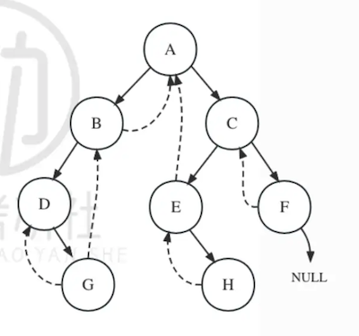 |
| :----------------------------------------------------------: | :----------------------------------------------------------: |
|                          先序线索化                          |                          中序线索化                          |

|  |
| :----------------------------------------------------------: |
|                          后序线索化                          |


### 5.11.5 优势

- 它消除了堆栈的使用，因为它执行线性遍历，因此节省内存。
- 无需显式使用父指针即可找到父节点
- 线程树通过有序方式向前和向后遍历节点
- 节点包含指向有序前驱和后继的指针
- 对于给定的节点，我们可以很容易地找到有序的前驱和后继。 因此，搜索要容易得多。
- 在线程二叉树中，不存在 NULL 指针。 因此避免了占用 NULL 链接的内存浪费。
- 线程指向后继节点和前导节点。 这使得我们可以快速获取任何节点的前驱和后继节点。
- 遍历树时不需要堆栈，因为使用线程链接我们可以到达之前访问过的节点。

## 5.12 哈夫曼树

### 5.12.1 前缀编码

前缀编码是指对字符集进行编码时，要求字符集中任一字符的编码都不是其它字符的编码的前缀，例如：设有abcd需要编码表示（其中，a=0、b=10、c=110、d=11),则110的前缀表示的可以是c或者是d跟a，出现这种情况是因为d的前缀11与c的前缀110有重合部分，这个是关键。

哈夫曼树为了实现前缀编码。

### 5.12.2 什么是哈夫曼树

给定N个权值作为N个叶子结点，构造一棵二叉树，若该树的带权路径长度达到最小，称这样的二叉树为最优二叉树，也称为哈夫曼树(Huffman Tree)。哈夫曼树是带权路径长度最短的树，权值较大的结点离根较近。

### 5.12.3 哈夫曼树的目的

实现前缀编码，同时找出存放一串字符所需的最少的二进制编码

### 5.12.4 哈夫曼树构造方法

首先统计出每种字符出现的频率！也可以是概率，权值，占比，权重，比重。例如：
| 字符 | B    | C    | E    | F    | G    |
| ---- | ---- | ---- | ---- | ---- | ---- |
| 频率 | 45   | 13   | 14   | 5    | 3    |

第一步：找出字符中最小的两个，小的在左边，大的在右边，组成二叉树。在频率表中删除此次找到的两个数，并加入此次最小两个数的频率和如图5-16所示。F和G最小, 分别是3和5，因此如图，从字符串频率计数中删除F与G，并返回G与F的和8给频率表。

|||
|:-:|:-:|
|图5-16|图5-17|

新的频率表为

| 字符 | B    | C    | E    | FG   |
| ---- | ---- | ---- | ---- | ---- |
| 频率 | 45   | 13   | 14   | 8    |

接下来我们比较45, 13,14, 8这些值，最小的是[FG]： 8与C：13，因此，我们连接这两个节点，在上面构建一个新的根节点，根节点的权值是这两个节点的和，因此如图，并返回[FGC]: 21的给频率表。

重复第一步，新的频率表为
|字符|B|E|FGC|
|----|:-:|:-:|:-:|
|频率|45|14|21|

找到两个最小的分别是FGC:21和E:14，我们连接这两个节点，在上面构建一个新的根节点，根节点的权值是这两个节点的和因此如图5-18，并返回[FGCE]: 35的给频率表。

新的频率表为

| 字符 | B    | FGCE |
| ---- | ---- | ---- |
| 频率 | 45   | 35   |

找到两个最小的分别是FGCE:35和B:45，我们连接这两个节点，在上面构建一个新的根节点，根节点的权值是这两个节点的和因此如图5-19，并返回[FGCEB]: 80的给频率表。

|||
|:-:|:-:|
|图5-18|图5-19|

现在我们已经完成了哈夫曼树的实现, 进行编码部分, 假设每棵树的左孩子代表0，右孩子代表1, 从树根到叶子节点的路径即位二进制前缀树编码。

最终每个 字符 的 二进制编码 为（从根节点 数到对应的叶子节点，路径上的值拼接起来就是叶子节点字母的应该的编码）

| 字符 | B |  C        | E    | F     | G     |
| ---- | ---- | ----  | ---- | ----- | ----- |
| 编码 | 1 | 001 | 01 | 0001 |0000|

那么当我想传送 BCG时，编码为 1 001 0000

### 5.12.5 特点

在二叉哈夫曼树中没有度为1的节点。

#### 推广

m叉哈夫曼树只有度为0和m的节点。

### 5.12.6 一些相关计算

1. 结点的带权路径长度：树的根结点到该结点的路径长度和该结点权重的乘积
2. 树的带权路径长度(WPL)：在一棵树中，所有叶子结点的带权路径长度之和，被称为树的带权路径长度，也被简称为WPL。

#### 计算树的带权路径长度

1. 画出哈夫曼树
2. WPL所有叶结点的权值之和或所有非叶节点权值的和。

## 5.13 二叉搜索树

二叉搜索树 (BST)，也称为有序或排序二叉树，是一种有根二叉树数据结构，其中每个内部节点的键都大于相应节点左子树中的所有键并小于其左子树中的键 右子树。 二叉搜索树的操作时间复杂度与树的高度成正比。


在上图中，我们可以观察到根节点为40，左子树的所有节点都小于根节点，右子树的所有节点都大于根节点。

同样，我们可以看到根节点的左孩子大于它的左孩子，小于它的右孩子。 所以，它也满足二叉搜索树的性质。 因此，我们可以说上图中的树是一棵二叉搜索树。

假设如果我们将上述树中节点 35 的值更改为 55，请检查树是否为二叉搜索树。


在上面的树中，根节点的值为 40，大于它的左孩子 30 但小于 30 的右孩子，即 55。所以，上面的树不满足二叉搜索树的性质。 因此，上面的树不是二叉搜索树。

### 5.13.1 二叉搜索树平均查找长度

如图所示的二叉排序树

|  |  |
| :----------------------------------------------------------: | :----------------------------------: |
|                           图 5-20                            |               图 5-21                |

如图 5-20 查找成功的平均查找长度为：$∑$（本层高度\本层元素个数）/节点总数 =（1\1+2\2+3\3+3\4）/9

如图 5-21查找不成功的平均查找长度：$∑$（本层高度本层补上的叶子个数）/补上的叶子总数=（2\1+3\3+4\6）/10

## 5.14 平衡二叉树

### 5.14.1 AVL树

有了经典的二叉搜索树做铺垫，我们就可以正式开始讲解由它衍生出的几种改进的二叉搜索树结构。

首先是AVL树，也就是我们常说的平衡二叉树。从名字就可以看出，AVL树是一种高度平衡的二叉搜索树，即任意节点的左子树和右子树高度之差都不超过1。那么我们为什么要让一棵二叉搜索树尽量平衡呢？我们假设现在有一组输入数据[8,7,6,5,4]，按照先前的插入逻辑，就会形成如下结构的二叉树。


这棵树的高度和它的元素个数是一致的，因为二叉搜索树各种操作所消耗的时间与其高度密切相关，因此这棵树所形成的的结构显然不是我们想看到的。

那么如何减小树的高度呢？答案是尽量让这棵树左右平衡。这里就要引入平衡因子的概念：二叉树上节点的左子树深度减去右子树深度的值称为平衡因子。

那么根据平衡二叉树的定义，平衡二叉树上的所有节点的平衡因子只可能是-1、0、1，否则就不是平衡二叉树。

### 5.14.2 平衡因子

这个节点的平衡因子: 此节点往下左子树深度- 右子树深度=平衡因子

#### AVL树的实现原理

当一棵二叉搜索树进行增加或删除操作时，就有可能产生不平衡的情况。我们要做的就是在出现不平衡的状况时及时进行调整，让整棵树恢复平衡。而用于调整的手段，就是左旋和右旋操作。

首先我们需要明确，在什么时候、如何进行左旋或右旋操作，这就需要分情况讨论：

+ 情况一：LL
  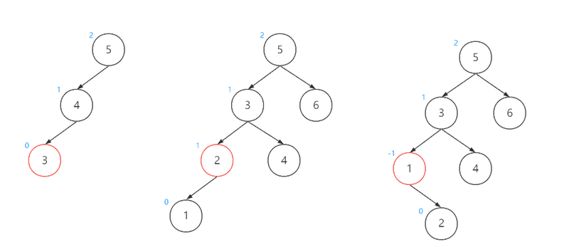  
  上图中所示的三种不平衡的情况，都是根节点的左孩子的左孩子（LL）所造成，即因为LL本身或LL身上挂载了其他节点，造成了根节点的不平衡。这种情况下我们只需要对根节点进行一次右旋操作，即可恢复平衡。
  调整后如下图：
  
  在进行LL调整后：
  原本的根节点和根节点的左孩子节点的平衡因子会归零；
  原LL节点的平衡因子不会发生改变。
+ 情况二：RR 
  
  与LL相反，以上三种不平衡的情况都是根节点的右孩子的右孩子（RR)所造成，即因为RR本身或RR身上挂载了其他节点，造成了根节点的不平衡。这种情况下我们只需要对根节点进行一次左旋操作，即可恢复平衡。调整后如下图：
  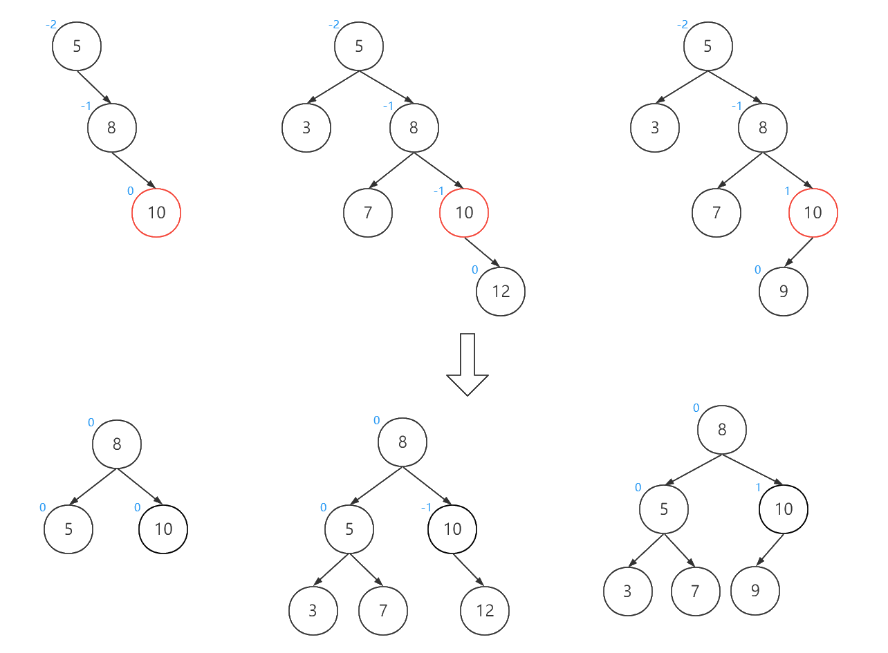
  在进行RR调整后：
  原本的根节点和根节点的右孩子节点的平衡因子会归零；
  原RR节点的平衡因子不会发生改变。
+ 情况三：LR
  
  这种不平衡的情况是根节点的左孩子的右孩子（LR)所造成，即因为LR本身或LR身上挂载了其他节点，造成了根节点不平衡。 
  与前两种情况不同的是，上图所示的三种情况无法通过单次的左旋或右旋操作使其达到平衡。以第一种情况为例，假如我们直接对根节点进行右旋操作，会发现3节点成为了4、6节点的父节点，这显然不符合二叉搜索树的规则。 究其原因，是因为根节点的平衡因子与根节点的左孩子的平衡因子符号不相同导致。那么我们只需要先将符号统一，再进行整体上的旋转操作即可。 做法是先将左子树进行左旋，再对整体进行右旋，调整过程如下：  
  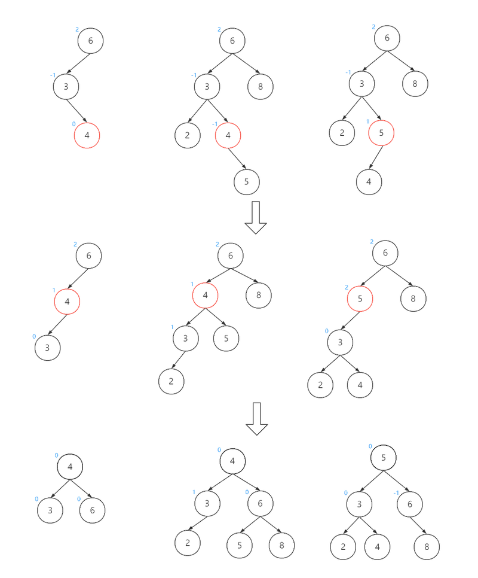
  在进行LR调整后：
  原LR节点的平衡因子都会归零；
  如果原LR节点平衡因子为-1，则调整后的原L节点平衡因子为1，否则为0；
  如果原LR节点平衡因子为1，则调整后的原根节点平衡因子为-1，否则为0；
+ 情况四：RL
  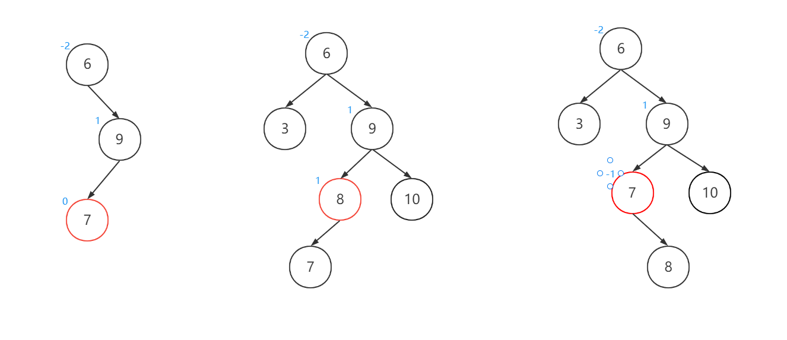  
  这种不平衡的情况是根节点的右孩子的左孩子（RL)所造成，即因为RL本身或RL身上挂载了其他节点，造成了根节点不平衡。  这种情况的调整方法与情况三相对，这里不再赘述，调整过程如下：
  
  在进行RL调整后：
  原RL节点的平衡因子都会归零；
  如果原RL节点平衡因子为1，则调整后的原R节点平衡因子为-1，否则为0；
  如果原RL节点平衡因子为-1，则调整后的原根节点平衡因子为1，否则为0；

### 5.14.3 红黑树


### 5.14.4 线段树「了解」

假设有编号从1到n的n个点，每个点都存了一些信息，用[L,R]表示下标从L到R的这些点。
线段树的用处就是，对编号连续的一些点进行修改或者统计操作，修改和统计的复杂度都是O(log2(n)).

线段树的原理，就是，将[1,n]分解成若干特定的子区间(数量不超过4n),然后，将每个区间[L,R]都分解为
少量特定的子区间，通过对这些少量子区间的修改或者统计，来实现快速对[L,R]的修改或者统计。

由此看出，用线段树统计的东西，必须符合区间加法，否则，不可能通过分成的子区间来得到[L,R]的统计结果。

符合区间加法的例子：

+ 数字之和：总数字之和 = 左区间数字之和 + 右区间数字之和
+ 最大公因数(GCD)：总GCD = gcd( 左区间GCD , 右区间GCD );
+ 最大值：总最大值=max(左区间最大值，右区间最大值)

不符合区间加法的例子：
+ 众数：只知道左右区间的众数，没法求总区间的众数
  01序列的最长连续零——只知道左右区间的最长连续零，没法知道总的最长连续零

一个问题，只要能化成对一些连续点的修改和统计问题，基本就可以用线段树来解决了，由于点的信息可以千变万化，所以线段树是一种非常灵活的数据结构，可以做的题的类型特别多，只要会转化。线段树当然是可以维护线段信息的，因为线段信息也是可以转换成用点来表达的（每个点代表一条线段）。

### 5.14.5 线段树原理

线段树本质上是维护下标为1,2,..,n的n个按顺序排列的数的信息，所以，其实是“点树”，是维护n的点的信息，至于每个点的数据的含义可以有很多，在对线段操作的线段树中，每个点代表一条线段，在用线段树维护数列信息的时候，每个点代表一个数，但本质上都是每个点代表一个数。以下，在讨论线段树的时候，区间[L,R]指的是下标从L到R的这(R-L+1)个数，而不是指一条连续的线段。只是有时候这些数代表实际上一条线段的统计结果而已。

线段树是将每个区间[L,R]分解成[L,M]和[M+1,R] (其中M=(L+R)/2 这里的除法是整数除法，即对结果下取整)直到 L==R 为止。 
开始时是区间[1,n] ,通过递归来逐步分解，假设根的高度为1的话，树的最大高度为（n>1）。线段树对于每个n的分解是唯一的， 所以n相同的线段树结构相同，这也是实现可持久化线段树的基础。
下图展示了区间[1,13]的分解过程：


上图中，每个区间都是一个节点，每个节点存自己对应的区间的统计信息。


## 5.15 二叉树的存储结构

### 5.15.1 顺序存储结构

二叉树的顺序存储结构是指用一组地址连续的存储单元依次自上而下，自左至右存储完全完全二叉树上的结点元素，即将完全二叉树上编号为i的结点元素存储在一个一维数组下标为i-1的分量中。

依据二叉树的性质，完全二叉树和满二叉树采用顺序存储结构比较合适，树中结点的序号可以唯一的反映结点之间的逻辑关系，这样既能最大可能地节省存储空间，又能利用数组元素的下标值确定结点在二叉树中的位置，以及结点之间的关系。

但是对于一般的二叉树，为了让数组下标能反映二叉树中结点之间的逻辑关系，只能添加一些并不存在的空结点，让其每个结点与完全二叉树上的结点相对照，再存储到一维数组的相应分量中。然而，在最坏的情况下，一个高度为h且只有h个结点的单支树却需要占据近$2^h-1$个存储单元。

                                        

采用顺序存储结构的时候，建议从数组下标为1开始存储树种的结点，若从数组下标0开始存储，不满足以下情况，即当结点A存储在下标为i=0的位置时，无法根据确定其左孩子为2i和其右孩子为(2i+1)。

### 5.15.2 链式存储结构

由于顺序存储的空间利用率较低，因此二叉树一般都采用链式存储结构，用链表结点来存储二叉树的每个结点。在二叉树中，结点结构通常包括若干数据域和若干指针域，二叉树表至少包含3个域：数据域data，左指针域lchild，右指针域。

|  |  |
| --------------------------------------------------------- | --------------------------------------------------------- |
|                                                           |                                                           |

二叉树的链式存储结构代码

## 5.16 配对堆

配对堆是一种实现简单、均摊复杂度优越的堆数据结构，由Michael Fredman、罗伯特·塞奇威克于1986年发明。配对堆是一种多叉树，并且可以被认为是一种简化的斐波那契堆。对于实现例如普林姆最小生成树算法等算法，配对堆是一个更优的选择，


## 5.17 树和二叉树的转换

### 5.17.1 树和二叉树的转换的方法

左孩子右兄弟转化法

将树的节点的孩子挂在生成的二叉树的左子节点，将树的节点的兄弟挂在生成的二叉树的右子节点

根据树转换为二叉树的秘籍，可以把任何一棵树转换为二叉树，如下图所示。


- A有3个孩子B、C、D，其长子B作为A的左孩子，三兄弟B、C、D在右斜线上。
- B有两个孩子E、F，其长子E作为B的左孩子，两兄弟E、F在右斜线上。
- D有两个孩子G、H，其长子G作为D的左孩子，两兄弟G、H在右斜线上。
- G有1个孩子I，其长子I作为G的左孩子。

那么怎么将二叉树还原为树呢？仍然根据树转换二叉树的秘籍，反操作即可，如下图所示。

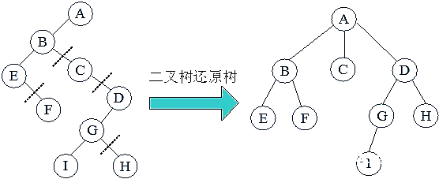

- B是A的左孩子，说明B是A的长子，B、C、D在右斜线上，说明B、C、D是兄弟，它们的父亲都是A。
- E是B的左孩子，说明E是B的长子，E、F在右斜线上，说明E、F是兄弟，它们的父亲都是B。
- G是D的左孩子，说明G是D的长子，G、H在右斜线上，说明G、H是兄弟，它们的父亲都是D。
- I是G的左孩子，说明I是G的长子。

### 5.17.2 森林和二叉树的转换

森林是由m（m≥0）棵不相交的树组成的集合。可以把森林中的每棵树的树根都看作兄弟，因此三棵树的树根B、C、D是兄弟，兄弟关系在右斜线上，其他的转换和树转二叉树一样，将长子当作左孩子，将兄弟关系向右斜。或者把森林中的每一棵树都转换成二叉树，然后把每棵树的根节点都连接在右斜线上即可。


同理，二叉树也可以被还原为森林，如下图所示。B、C、D在右斜线上，说明它们是兄弟，将其断开，那么B和其子孙是第1棵二叉树；C是第2棵二叉树，那么D和其子孙是第3棵二叉树。


总结：由于在普通的树中，每个节点的子树个数不同，存储和运算都比较困难，因此在实际应用中可以将树或森林转换为二叉树，然后进行存储和运算。二者存在唯一的对应关系，因此不影响其结果。

### 5.17.3 森林和二叉树的遍历关系

+ 树的前序遍历，对应二叉树的前序遍历。
+ 树的后序遍历，对应二叉树的中序遍历。
+ 树的层次遍历，对应二叉树的后序遍历。
+ 森林的前序遍历，对应二叉树的前序遍历。
+ 森林的中序遍历，对应二叉树的中序遍历。

## 5.18 前缀树「了解」

前缀树——trie /ˈtraɪ//树，也叫作“单词查找树”、“字典树”。

它属于多叉树结构，典型应用场景是统计、保存大量的字符串，经常被搜索引擎系统用于文本词频统计。它的优点是利用字符串的公共前缀来减少查找时间，最大限度的减少无谓字符串的比较和存储空间。

trie 来自于 retrieval 的中间部分。在wiki百科中，有关于 trie 一词的由来：

Tries were first described by René de la Briandais in 1959.The term trie was coined two years later by Edward Fredkin, who pronounces it /ˈtriː/(as "tree"), after the middle syllable of retrieval.However, other authors pronounce it/ˈtraɪ/(as "try"), in an attempt to distinguish it verbally from "tree".

一、前缀树的逻辑结构
前缀树是一个由“路径”和“节点”组成多叉树结构。由根节点出发，按照存储字符串的每个字符，创建对应字符路径。

由“路径”记载字符串中的字符，由节点记载经过的字符数以及结尾字符结尾数，例如一个简单的记录了"abc"、"abd"、"bcf"、"abcd" 这四个字符串的前缀树如下图所示：


### 5.18.1 前缀树的添加过程

经典的前缀树都是以“路径”（以下简称路）记录字符的，由节点记录统计信息 pass 代表经过的字符个数，end代表有多少个字符串以这条路径结尾。

#### 逻辑过程

  前缀树添加字符串的过程，以 "abc"、"bcd"、"abcd"为例：

1. 首先会有一个初始化的根节点 root :


2、添加 'a' 字符，根节点 pass++ , 由于字符串还没有结束，后面还有 'b'、'c'，end 不变，并在路的另一端创建一个节点（因为两个节点才能形成一条路），并将新节点的 pass++，end 同样不变：

3、添加 'b' 字符，同样创建一个新的节点，来表示 b 的路，并在新节点上 pass++，end不变：

4、添加'c' 字符，创建一个新的节点，表示 c 的路，在新节点上 pass++，此时字符串已经结束，end++：

到此为止，就完成了'abc'字符串的添加，以同样的方法添加 'bcd'、'abcd'，注意，每次添加都要从 root 开始，root 作为前缀树的第一个节点，其 pass 可以表示树中一共存储了多少字符串。前缀树的最大特点就是复用字符，如果从 root 没有可复用的前缀，那么就需要创建新的路径，如果有就需要复用已有路径，并标记经过的字符个数：


## 5.19 二叉树的括号表示
### 5.19.1 表示规则
+ 若树T为空树，则其括号表示为空

+ 若树T只包含一个结点，则其括号表示即为该结点本身

+ 若树T由根结点A和它的m棵子树T1,T2,...,Tm构成，则其括号表示为：A(T1的括号表示，T2的括号表示,... ,Tm的括号表示)

其中，子树的括号表示同样应该遵循以上规则

### 5.19.2 举例


## 5.20 习题

### 5.20.1 选择


1. 给定二叉树如下图所示。设N 代表二叉树的根， L 代表根结点的左子树，R 代表根结点的右 子树。若遍历后的结点序列为3,1,7,5,6,2, 4,则其遍历方式是(  )。

 

A.LRN            B.NRL           C.RLN            D.RNL

2. 已知一棵完全二叉树的第6层(设根是第1层)有8个叶结点，则该完全二叉树的结点个数 最多是(  )。

   A.39        B.52       C.111      D.119

3. 将森林转换为对应的二叉树，若在二叉树中，结点u 是结点v 的父结点的父结点，则在原来 的森林中， u 和 v 可能具有的关系是(  )。

I. 父子关系     Ⅱ.兄弟关系      Ⅲ.u的父结点与v 的父结点是兄弟关系

A. 只有Ⅱ      B.I   和Ⅱ      C.I  和Ⅲ      D.I 、Ⅱ   和Ⅲ


5. 在一棵度为4的树T 中，若有20个度为4的结点，10个度为3的结点，1个度为2的结点， 10个度为1的结点，则树T的叶结点个数是(  )。 

   A.41         B.82        C.113        D.122

6. 对 n(n≥2)个权值均不相同的字符构造哈夫曼树。下列关于该哈夫曼树的叙述中，错误的是(   )。 

   A. 该树一定是一棵完全二叉树

   B. 树中一定没有度为1 的结点

   C. 树中两个权值最小的结点一定是兄弟结点

   D. 树中任一非叶结点的权值一定不小于下一层任一结点的权值

7. 若一棵完全二叉树有768个结点，则该二叉树中叶结点的个数是(  )。

    A.257       B.258        C.384      D.385

8. 若一棵二叉树的前序遍历序列和后序遍历序列分别是1,2,3,4和4,3,2,1,则该二叉树的中 序遍历序列不会是(  )。 

   A.1,2,3,4            B.2,3,4,1             C.3,2,4,1             D.4,3,2,1

9. 已知一棵有2011个结点的树，其叶结点个数为116,该树对应的二叉树中无右孩子的结点个 数 是 (  )。 

   A.115       B.116        C.1895        D.1896

10. 若一棵二叉树的前序遍历序列为a,e,b,d,c,    后序遍历序列为b,c,d,e,a,    则根结点的孩子结 点 (  )。 【2012年全国试题3(2分)

    A. 只有e             B. 有e、b          C.有e、c    D. 无法确定

11. 已知三叉树T 中6个叶结点的权分别是2,3,4,5,6,7,T的带权(外部)路径长度最小是 (  ) 。【

    A.27         B.46        C.54       D.56

12. 若 X 是后序线索二叉树中的叶结点，且X 存在左兄弟结点Y,则X 的右线索指向的是(   )。

    A.X 的父结点              B. 以 Y为根的子树的最左下结点

    C.X 的左兄弟结点Y                      D. 以 Y为根的子树的最右下结点

13. 若对如下的二叉树进行中序线索化，则结点x 的左、右线索指向的结点分别是(   )。

A.c,c               B.c,a                D.b,a

14. 将森林F 转换为对应的二叉树T,F  中叶结点的个数等于(  )。

    A.T 中叶结点的个数           B.T 中度为1的结点个数

    C.T 中左孩子指针为空的结点个数     D.T 中右孩子指针为空的结点个数

15. 5个字符有如下4种编码方案，不是前缀编码的是(  )。

    A.01,0000,0001,001,1         B.011,000,001,010,1

    C.000,001,010,011,100         D.0,100,110,1110,1100

16. 先序序列为a,b,c,d   的不同二叉树的个数是(  )。

    A.13       B.14         C.15         D.16

17. 下列选项给出的是从根分别到达两个叶结点路径上的权值序列，能属于同一棵哈夫曼树的是 (   )。 

    A.24,10,5    和 2 4 , 1 0 , 7        B.24,10,5    和24,12,7

    C.24,10,10    和24,14,11       D.24,10,5    和24,14,6

18. 树是一种逻辑关系，表示数据元素之间存在的关系为(  )。

    A. 集合关系    B. 一对一关系    C. 一对多关系    D. 多对多关系 

19. 下列判断，(  )是正确的。

    A. 二叉树就是度为2的树         B. 二叉树中不存在度大于2的结点

    C. 二叉树是有序树           D. 二叉树的每个结点的度都为2

20. 有关二叉树下列说法正确的是(  )。

    A. 二叉树的度为2           B. 一棵二叉树的度可以小于2

    C. 二叉树中至少有一个结点的度为2    D. 二叉树中任何一个结点的度都为2

21. 在下述结论中，正确的是(  )。

    ①只有一个结点的二叉树的度为0;

    ②二叉树的度为2;

    ③二叉树的左右子树可任意交换；

    ④深度为K 的完全二叉树的结点个数小于或等于深度相同的满二叉树。

    A.①②③     B.②③④       C.②④        D.①④

22. 设有一表示算术表达式的二叉树(见下图),它所表示的算术表达式是(  )。

    A.$A*B+C/(D*E)+(F-G) $                   B.$(A*B+C)/(D*E)+(F-G)$

    C.$(A*B+C/(DE+(F-G))   $                D.$A*B+C/D*E+F-G$

 

23. 已知一算术表达式的中缀表达式为a-(b+cld)*e,   其后缀形式为(   )。【

A.$-a+bcld $         B.$-a+bcdle $         C.$-+abc/de$          D.$abcd/+e*-$

24. 已知一算术表达式的中缀表达式为a-(b+cld)*e,   其后缀形式为(   )。
     A.-a+b**cld      B*.-a+b**cdle*       **C****.-+*****abc****/****de**          **D.abcd/+e\*-**

25. 每个结点的度或者为0或者为2 的二叉树称为正则二叉树。n  个结点的正则二叉树中有(   )叶子。

    A.「log₂n]          B.  $(n-1)/2$           C.「log₂(n+1)]        D.   $(n+1)/2$  

26. 设树T 的度为4,其中度为1,2,3和4的结点个数分别为4,2,1,1,则T 中的叶子数为(  )。

    A.5                 B.6                  C.7                  D.8
    
    

| 1.D  | 2.C  | 3.B  | 4.D  | 5.B  | 6.A  | 7.C  | 8.C  | 9.D  | 10.A |
| ---- | ---- | ---- | ---- | ---- | ---- | ---- | ---- | ---- | ---- |
| 11.B | 12.A | 13.D | 14.C | 15.D | 16.C | 17.D | 18.C | 19.B | 20.B |
| 21.D | 22.C | 23.D | 24.B | 25.D | 26.  |      |      |      |      |
|      |      |      |      |      |      |      |      |      |      |
|      |      |      |      |      |      |      |      |      |      |
# 第6章 图

## 6.1 什么是图

图数据结构是具有数据的节点并连接到其他节点的节点的集合。

让我们试着通过一个例子来理解这一点。在抖音上，用户和用户之间的关注关系可以用图这种数据结构表示。每个用户可能有若干个关注，若干个被关注，或者没有关注或被关注。如果把关注的逻辑作为边，用户作为顶点，就可以成为一张图，这张图包含顶点和边。

更准确地说，图是一种数据结构 (V, E)，它包含顶点集合 V ，边 E 的集合，表示为有序的顶点对 (u,v)就是u到v的边，例如若
$$
V = {0, 1, 2, 3}
$$

$$
E = {(0,1), (0,2), (0,3), (1,2)}
$$

$$
G = (V, E)
$$

那么上面描述的图形如下:


其中(0,1)则代表`0->1`的边等等。

## 6.2 图的性质

+ 邻接：如果有一条边连接另一个顶点，则称一个顶点与另一个顶点相邻。 顶点 2 和 3 不相邻，因为它们之间没有边。
+ 路径：允许您从顶点 A 到顶点 B 的边序列称为路径。 0-1、1-2 和 0-2 是从顶点 0 到顶点 2 的路径。
+ 邻居（Neighbors）：与节点 Vi 连接的节点集合。
+ 有向图：其中边 (u,v) 并不一定意味着也有边 (v, u) 的图。 这种图中的边用箭头表示，以显示边的方向。
+ 无向图：其中边 (u,v) 一定意味着也有边 (v, u) 的图。 这种图中的边用直线表示，以显示没有方向的边。
+ 中心性（Centrality）：度量节点的重要性，有度中心性、特征向量中心性、Katz中心性、中介中心性。
+ 行走（Walk）：开始于节点 u，结束于节点 v 的所有可能的序列（Node-Edge-...-Node）。

+ 足迹（Trial）：没有重复边的行走。

+ 路径（Path）：没有重复节点的行走。

+ 测地路径（geodesic path）是指两个节点之间的最短路径。

+ 最短路径（Shortest Path）：两节点间长度最短的路径，可能会超过一条。

+ 直径（Diameter）：各节点之间的最短路径长度中的最大值。

+ 子图（Subgraph）：由图中部分节点以及这些节点间的边组成的图。

+  连通：在无向图中，若从顶点u到顶点v有路径，则称u和v是连通的。

## 6.3 图的分类

+ 有很少边或弧(如$ e<n log_2n $, e 指边数,n指顶点数）的图称为稀疏图，反之称为稠密图。

+ 有向无环图: 如果一个有向图无法从某个顶点出发经过若干条边回到该点，则这个图是一个**有向无环图**（DAG图）

+ 如果图中边集为空，则称该图为零图。

+ 如果无向图中任何一对顶点之间都有一条边相连，则这个无向图被称为完全图。类似地，如果有向图中任何一对顶点u,u之间都有两条有向边(u, v),(v, u)相连，则称这个有向图为有向完全图。

+ 对于一个无向图，如果以任意一个点为起点，在图上沿着边走都可以到达其他所有点（有向图必须沿有向边的方向），那么这个图就是连通图。显然完全图一定是连通图。

+ 如果一个有向图G，对于其中任意两个顶点v,u，都存在从v到u以及从u到v的有向路径，则称G为强连通图。而在一个不是强连通图的有向图G中，若其中两个顶点u、v在两个方向上都存在有向路径，则称u和v强连通。

+ 强连通图：有向图中，若任意两个顶点 Vi 和 Vj，满⾜从 Vi 到 Vj 以及从 Vj 到 Vi 都连通，也就是都含有⾄少⼀条通路，则称此有向图为强连通图。

+ 连通图（Connected Graph）：只包含一个连通分量，即其自身，那么该图是一个连通图。

+ 连通分量（Connected Component）：无向图的极大连通子图称为的连通分量。任何连通图的连通分量只有一个，即是其自身，非连通的无向图有多个连通分量。

+ 极大连通子图: 若⽆向图不是连通图，但图中存储***某个⼦图符合连通图的性质***，则称该⼦图为***连通分量***。
  由***图中部分顶点和边***构成的图为该图的⼀个⼦图，但这⾥的⼦图指的是**图中"最⼤"的连通⼦图**（也称"极⼤连通⼦图"）。若无向图为非连通图，则图中各个极大连通子图称为此图的连通分量。

## 6.4 图的数学特性

+ 具有n个顶点的无向连通图的边最少为n-1
+ 具有n条边的无向图，度为2n
+ 具有n条边的有向图，入度和出度的和为2n
+ 在有向图中，有一个很明显的性质就是，入度等于出度。

## 6.5 图的存储方式

### 6.5.1 邻接矩阵「掌握」

邻接矩阵可以用来存储有向图和无向图。

图的邻接矩阵存储方式是用两个数组来表示图。一个一维数组存储图中顶点信息，一个二维数组（称为邻接矩阵）存储图中的边或弧的信息。设图中有n个顶点，则邻接矩阵是一个的方阵，定义为

无向图举例:

```mermaid
graph LR
V0((V0))
V2((V2))
V3((V3))
V1((V1))
V0---V3
V1---V0
V3---V2
V2---V3
V2---V0
```

这个图的邻接阵如下，注意：无向图的邻接矩阵是实对称矩阵，是可以对角化的。

|顶点数组|V0|V1|V2|V3|
|----|----|----|----|----|

|邻接矩阵|V0|V1|V2|V3|
|----|----|----|----|----|
|V0|0|1|1|1|
|V1|1|0|0|0|
|V2|1|0|0|1|
|V3|1|0|1|0|

设置两个数组，顶点数组，边数组，1表示到的边存在，0表示到的边不存在。

有向图实例： 

```mermaid
graph LR
V0((V0))
V2((V2))
V3((V3))
V1((V1))
V0-->V3
V1-->V0
V3-->V2
V2-->V3
V2-->V0
```
这个图的邻接阵如下，注意：有向图的邻接矩阵一般是非对称矩阵

|顶点数组|V0|V1|V2|V3|
|----|----|----|----|----|

|邻接矩阵|V0|V1|V2|V3|
|----|----|----|----|----|
|V0|0|0|0|1|
|V1|1|0|0|0|
|V2|1|0|0|1|
|V3|0|0|1|0|


设置两个数组，顶点数组，边数组，1表示到有弧，0表示到没有弧。

在有向图中有入度和出度的概念，第i个顶点的入度为第i列各数的和。顶点的出度为第i行各数之和。

#### 网图

每条边上带有权的图叫做网，假设该图有n个顶点，则邻接矩阵是一个的方阵，定义为

```mermaid
graph LR
V0((V0))
V2((V2))
V3((V3))
V1((V1))
V0--7-->V3
V1--2-->V0
V3--3-->V2
V2--5-->V3
V2--6-->V0
```
这个图的邻接阵如下，注意：有向图的邻接矩阵一般是非/对称矩阵， 这里的非0数字是权值。这里的表示$ (v_i,v_j) <v_i,v_j>$上的权值，根据此定义，我们可作出网的邻接矩阵。

|顶点数组|V0|V1|V2|V3|
|----|----|----|----|----|

||V0|V1|V2|V3|
|----|----|----|----|----|
|V0|0|0|0|7|
|V1|2|0|0|0|
|V2|6|0|0|5|
|V3|0|0|3|0|

### 6.5.2 邻接矩阵的代码实现
图的邻接矩阵存储结构如下：
```c
typedef char VertexType;  // 顶点类型
typedef int EdgeType;  // 边上的权值类型
#define MAXVEX 100  // 最大顶点数
#define INFINITY 65535 // 无穷用65535代替
typedef struct{
    VertexType vexs[MAXVEX];  // 顶点表
    EdgeType arc[MAXVEX][MAXVEX];  // 邻接矩阵，边表
    int numNodes,numEdges;  // 图中当前的顶点数和边数
}MGraph;
```
无向网图的创建：

```c
/* 建立无向网图的邻接矩阵表示 */
void CreateMGraph(MGraph *G)
{
  int i,j,k,w;
  printf("输入顶点数和边数:\n");
  scanf("%d,%d",&G->numNodes,&G->numEdges); /* 输入顶点数和边数 */
  for(i = 0;i <G->numNodes;i++) /* 读入顶点信息,建立顶点表 */
    scanf(&G->vexs[i]);
  for(i = 0;i <G->numNodes;i++)
    for(j = 0;j <G->numNodes;j++)
      G->arc[i][j]=GRAPH_INFINITY;  /* 邻接矩阵初始化 */
  for(k = 0;k <G->numEdges;k++) /* 读入numEdges条边，建立邻接矩阵 */
  {
    printf("输入边(vi,vj)上的下标i，下标j和权w:\n");
    scanf("%d,%d,%d",&i,&j,&w); /* 输入边(vi,vj)上的权w */
    G->arc[i][j]=w; 
    G->arc[j][i]= G->arc[i][j]; /* 因为是无向图，矩阵对称 */
  }
}
```

### 6.5.3 邻接表「掌握」

由于邻接矩阵对于边数相对顶点较少的图是存在对存储空间的极大浪费。我们可以对边或弧使用链式存储的方式来避免空间浪费的问题。将数组与链表相结合的存储方法称作邻接表。邻接表(Adjacency List)是图的一种链式存储结构。在邻接表中,对图中每个顶点建立一个单链表,第i个单链表中的结点表示依附于顶点vi的边(对有向图是以顶点vi为尾的弧)，即该顶点的出向对应的点。

邻接表的处理方法：

图中顶点用一个一维数组存储。对于顶点数组中，每个数据元素还需要存储指向第一个邻接表的指针，以便于查找该顶点的边信息。
图中每个顶点的所有邻接点构成一个线性表，由于邻接点的个数不定，所以用单链表存储，无向图称为顶点的边表，有向图则称为顶点作为弧尾的出边表。


对于带权值的网图，可以再边表结点定义中再增加一个​​weight​​的数据域，存储权值信息，如图所示。

#### 邻接表代码实现

图的邻接表存储结构如下：
```c
typedef char VertexType;  // 顶点类型
typedef int EdgeType;  // 边上的权值类型

typedef struct EdgeNode /* 边表结点  */
{
  int adjvex;    /* 邻接点域,存储该顶点对应的下标 */
  EdgeType info;    /* 用于存储权值,对于非网图可以不需要 */
  struct EdgeNode *next; /* 链域,指向下一个邻接点 */
}EdgeNode;
```

```c
typedef struct VertexNode /* 顶点表结点 */
{
  VertexType data; /* 顶点域,存储顶点信息 */
  EdgeNode *firstedge;/* 边表头指针 */
}VertexNode, AdjList[MAXVEX];

typedef struct
{
  AdjList adjList; 
  int numNodes,numEdges; /* 图中当前顶点数和边数 */
}GraphAdjList;
```
无向图的邻接表创建代码
```c
/* 建立图的邻接表结构 */
void  CreateALGraph(GraphAdjList *G)
{
  int i,j,k;
  EdgeNode *e;
  printf("输入顶点数和边数:\n");
  scanf("%d,%d",&G->numNodes,&G->numEdges); /* 输入顶点数和边数 */
  for(i = 0;i < G->numNodes;i++) /* 读入顶点信息,建立顶点表 */
  {
    scanf(&G->adjList[i].data);  /* 输入顶点信息 */
    G->adjList[i].firstedge=NULL;  /* 将边表置为空表 */
  }
  for(k = 0;k < G->numEdges;k++)/* 建立边表 */
  {
    printf("输入边(vi,vj)上的顶点序号:\n");
    scanf("%d,%d",&i,&j); /* 输入边(vi,vj)上的顶点序号 */
    e=(EdgeNode *)malloc(sizeof(EdgeNode)); /* 向内存申请空间,生成边表结点 */
    e->adjvex=j;          /* 邻接序号为j */                         
    e->next=G->adjList[i].firstedge;  /* 将e的指针指向当前顶点上指向的结点 */
    G->adjList[i].firstedge=e;    /* 将当前顶点的指针指向e */               
    
    e=(EdgeNode *)malloc(sizeof(EdgeNode)); /* 向内存申请空间,生成边表结点 */
    e->adjvex=i;          /* 邻接序号为i */                         
    e->next=G->adjList[j].firstedge;  /* 将e的指针指向当前顶点上指向的结点 */
    G->adjList[j].firstedge=e;    /* 将当前顶点的指针指向e */               
  }
}

```
#### 邻接表的例子

我们可以用两组数据对图进行表示。一组是图的顶点，一组是图的边。


$$
G1 = (V1, \{ A1\})\\
V1 = \{v1, v2, v3, v4\}   \\
A1 = \{<v1, v2>, <v1, v3>, <v3, v4>, <v4, v1>\}   \\
G2 = (V2, \{ E2 \})\\
V2 = \{v1, v2, v3, v4, v5\}\\
E2 = \{(v1, v2), (v1, v4), (v2, v3), (v2, v5), (v3, v4), (v3, v5)\}
$$
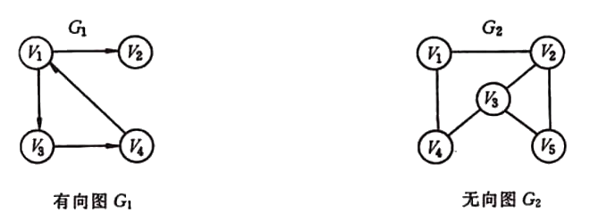
再谈邻接矩阵
以二维数组表示有n个顶点的图时，需存放n个顶点信息和n2个弧信息的存储量。下图分别是G1和G2的邻接矩阵。

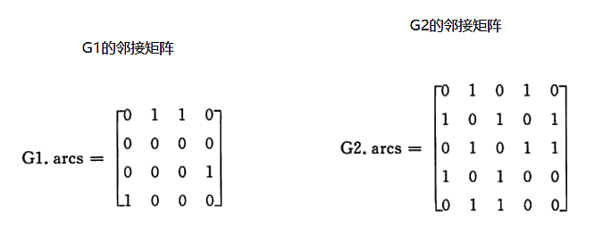

无向图的邻接表

todo 这里少一张图

有向图的邻接表和逆邻接表，逆邻接表即关于入度的邻接表表。


|  |  |
| :----------------------------------------------------------: | :----------------------------------------------------------: |
|                          G1的临接表                          |                         G2的逆邻接表                         |


### 6.5.4 十字链表「熟悉」

十字链表存储有向图（网）的方式与邻接表有一些相同，都以图（网）中各顶点为首元节点建立多条链表，同时为了便于管理，还将所有链表的首元节点存储到同一数组（或链表）中。

其中，建立个各个链表中用于存储顶点的首元节点结构如所示：

|  |
| :------------------------------------------------------: |
|               十字链表中首元节点结构示意图               |

从图6-27可以看出，首元节点中有一个数据域和两个指针域（分别用 firstin 和 firstout 表示）：

- firstin 指针用于连接以当前顶点为弧头的其他顶点构成的链表；
- firstout 指针用于连接以当前顶点为弧尾的其他顶点构成的链表；
- data 用于存储该顶点中的数据；

由此可以看出，十字链表实质上就是为每个顶点建立两个链表，分别存储以该顶点为弧头的所有顶点和以该顶点为弧尾的所有顶点。

注意，存储图的十字链表中，各链表中首元节点与其他节点的结构并不相同，图 1 所示仅是十字链表中首元节点的结构，链表中其他普通节点的结构如图 6-28 所示：


|  |
| :--------------------------------------------------------: |
|               十字链表中普通节点的结构示意图               |

从图 6-28 中可以看出，十字链表中普通节点的存储分为 5 部分内容，它们各自的作用是：

- tailvex 用于存储以首元节点为弧尾的顶点位于数组中的位置下标
- headvex 用于存储以首元节点为弧头的顶点位于数组中的位置下标
- hlink 指针：用于链接下一个存储以首元节点为弧头的顶点的节点
- tlink 指针：用于链接下一个存储以首元节点为弧尾的顶点的节点
- info 指针：用于存储与该顶点相关的信息，例如量顶点之间的权值

比如说，用十字链表存储图6-29 a) 中的有向图，存储状态如图 6-29 b) 所示：


|  |
| :---------------------------------------------------: |
|               十字链表存储有向图示意图                |

拿上图中的顶点 V1 来说，通过构建好的十字链表得知，以该顶点为弧头的顶点只有存储在数组中第 3 位置的 V4（因此该顶点的入度为 1），而以该顶点为弧尾的顶点有两个，分别为存储数组第 1 位置的 V2 和第 2 位置的 V3（因此该顶点的出度为 2）。

对于图 6-29 各个链表中节点来说，由于表示的都是该顶点的出度或者入度，因此没有先后次序之分。

### 6.5.5 邻接多重表「熟悉」

前面讲过，无向图的存储可以使用邻接表，但在实际使用时，如果想对图中某顶点进行实操（修改或删除），由于邻接表中存储该顶点的节点有两个，因此需要操作两个节点。

为了提高在无向图中操作顶点的效率，本节学习一种新的适用于存储无向图的方法——邻接多重表。

> 注意，邻接多重表仅适用于存储无向图或无向网。

邻接多重表存储无向图的方式，可看作是邻接表和十字链表的结合。同邻接表和十字链表存储图的方法相同，都是独自为图中各顶点建立一张链表，存储各顶点的节点作为各链表的首元节点，同时为了便于管理将各个首元节点存储到一个数组中。各首元节点结构如图 1 所示：


|  |  |
| :----------------------------------------------------------: | :--------------------------------------------------: |
|            图6-30邻接多重表各首元节点的结构示意图            |           图6-31 邻接多重表中其他节点结构            |

- data：存储此顶点的数据；
- firstedge：指针域，用于指向同该顶点有直接关联的存储其他顶点的节点。

从图 6-30 可以看到，邻接多重表采用与邻接表相同的首元节点结构。但各链表中其他节点的结构与十字链表中相同，如图 2 所示：

- mark：标志域，用于标记此节点是否被操作过，例如在对图中顶点做遍历操作时，为了防止多次操作同一节点，mark 域为 0 表示还未被遍历；mark 为 1 表示该节点已被遍历；
- ivex 和 jvex：数据域，分别存储图中各边两端的顶点所在数组中的位置下标；
- ilink：指针域，指向下一个存储与 ivex 有直接关联顶点的节点；
- jlink：指针域，指向下一个存储与 jvex 有直接关联顶点的节点；
- info：指针域，用于存储与该顶点有关的其他信息，比如无向网中各边的权；

综合以上信息，如果我们想使用邻接多重表存储图 3a) 中的无向图，则与之对应的邻接多重表如图 3b) 所示：


|  |
| :----------------------------------------------------------: |
|              图 6-33 无向图及其对应的邻接多重表              |

从图 3 中，可直接找到与各顶点有直接关联的其他顶点。比如说，与顶点 V1 有关联的顶点为存储在数组下标 1 处的 V2 和数组下标 3 处的 V4，而与顶点 V2 有关联的顶点有 3 个，分别是 V1、V3 和 V5。

## 6.6 哈密顿图「了解」

哈密顿通路（回路）与哈密顿图 （Hamilton图） 通过图G的每个结点一次，且仅一次的通路（回路），就是哈密顿通路（回路）。存在哈密顿回路的图就是哈密顿图。

图论数学家奥勒在1960年给出了一个图是哈密尔顿图的充分条件：对于顶点个数大于2的图，如果图中任意两点度的和大于或等于顶点总数，那这个图一定是哈密顿图。闭合的哈密顿路径称作哈密顿圈，含有图中所有顶点的路径称作哈密顿路径。 

## 6.7 最大流和最小割「开拓视野」

请自行搜索

## 6.8 AOE网

AOE 网是在 AOV 网的基础上，其中每一个边都具有各自的权值，是一个有向无环网。其中权值表示活动持续的时间。

```mermaid
graph LR
V1-.a1=6.->V2
V2-.a4=1.->V5
V1-.a2=4.->V3
V1-.a3=5.->V4
V4-.a6=2.->V6
V7-.a10=2.->V9
V5-.a7=9.->V7
V6-.a9=4.->V8
V5-.a8=7.->V8
V3-.a5=1.->V5
V8-.a11=4.->V9
```


如上图所示就是一个 AOE 网，例如 a1=6 表示完成 a1 活动完成需要 6 天；AOE 网中每个顶点表示在它之前的活动已经完成，可以开始后边的活动，例如 V5 表示 a4 和 a5 活动已经完成，a7 和 a8 可以开始。

使用 AOE 网可以帮助解决这样的问题：如果将 AOE 网看做整个项目，那么完成整个项目至少需要多少时间？

解决这个问题的关键在于从 AOE 网中找到一条从起始点到结束点长度最长的路径，这样就能保证所有的活动在结束之前都能完成。
起始点是入度为 0 的点，称为「源点」；结束点是出度为 0 的点，称为「汇点」。这条最长的路径，被称为「关键路径」。

为了求出一个给定 AOE 网的关键路径，需要知道以下 4 个统计数据：
* 对于 AOE 网中的顶点有两个时间：最早发生时间（用 Ve(j) 表示）和最晚发生时间（用 Vl(j) 表示）；
* 对于边来说，也有两个时间：最早开始时间（用 e(i) 表示）和最晚开始时间（ l(i) 表示）。

+ Ve(j)：对于 AOE 网中的任意一个顶点来说，从源点到该点的最长路径代表着该顶点的最早发生时间，通常用 Ve(j) 表示。

> 例如，图中从 V1 到 V5 有两条路径，V1 作为源点开始后，a1 和 a2 同时开始活动，但由于 a1 和 a2 活动的时间长度不同，最终 V1-V3-V5 的这条路径率先完成。但是并不是说 V5 之后的活动就可以开始，而是需要等待 V1-V2-V5 这条路径也完成之后才能开始。所以对于 V5 来讲，Ve(5) = 7。

+ Vl(j)：表示在不推迟整个工期的前提下，事件 Vk 允许的最晚发生时间。

> 例如，图 中，在得知整个工期完成的时间是 18 天的前提下，V7 最晚要在第 16 天的时候开始，因为 a10 活动至少需要 2 天时间才能完成，如果在 V7 事件在推迟，就会拖延整个工期。所以，对于 V7 来说，它的 Vl(7)=16。

+ e(i)：表示活动 ai 的最早开始时间，如果活动 ai 是由弧 <Vk,Vj> 表示的，那么活动 ai 的最早开始的时间就等于时间 Vk 的最早发生时间，也就是说：e[i] = ve[k]。
> e(i)很好理解，拿图中 a4 来说，如果 a4 想要开始活动，那么首先前提就是 V2 事件开始。所以 e[4]=ve[2]。

+ l(i)：表示活动 ai 的最晚开始时间，如果活动 ai 是由弧 <Vk,Vj> 表示，ai 的最晚开始时间的设定要保证 Vj 的最晚发生时间不拖后。所以，$l[i]=Vl[j]-len<Vk,Vj>$。

在得知以上四种统计数据后，就可以直接求得 AOE 网中关键路径上的所有的关键活动，方法是：对于所有的边来说，如果它的最早开始时间等于最晚开始时间，称这条边所代表的活动为关键活动。由关键活动构成的路径为关键路径。
### 6.8.1 AOE网求关键路径实现过程

对图中的 AOE 图求关键路径，首先完成 Ve(j)、Vl(j)、e(i)、l(i) 4 种统计信息的准备工作。

+ Ve(j)，求出从源点到各顶点的最长路径长度为（长度最大的）

+ Vl(j)，求出各顶点的最晚发生时间（从后往前推，多种情况下选择最小的）

+ e(i)，求出各边中ai活动的最早开始时间：

+ l(i),求各边中ai活动的最晚开始时间（多种情况下，选择最小的）

通过对比 l(i) 和 e(i) ，其中 a1 、 a4 、 a7 、 a8 、 a10 、 a11 的值都各自相同，所以，在图中的 AOE 网中有两条关键路径：

对图中的 AOE 图求关键路径，首先完成 Ve(j)、Vl(j)、e(i)、l(i) 4 种统计信息的准备工作。

Ve(j)，求出从源点到各顶点的最长路径长度为（长度最大的）：

|       | V1   | V2   | V3   | V4   | V5   | V6   | V7   | V8   | V9   |
| ----- | ---- | ---- | ---- | ---- | ---- | ---- | ---- | ---- | ---- |
| Ve(j) | 0    | 8    | 4    | 5    | 7    | 7    | 16   | 14   | 18   |
| Vl(j) | 0    | 6    | 6    | 8    | 7    | 10   | 16   | 14   | 18   |

e(i)，求出各边中ai活动的最早开始时间和l(i),求各边中ai活动的最晚开始时间（多种情况下，选择最小的)

|  | a1   | a2   | a3   | a4   | a5   | a6   | a7   | a8   | a9   |a10|a11|
| ---- | ---- | ---- | ---- | ---- | ---- | ---- | ---- | ---- | ---- |----| ----|
| e(i) | 0    | 0    | 0    | 6    | 4    | 5   | 7    | 7   | 7 |16|14|
| l(i) | 0    | 2   | 3  | 6   | 6   | 8   | 7  | 7   | 10 |16|14|


```mermaid
graph LR
V1--a1=6-->V2
V2--a4=1-->V5
V1-.a2=4.->V3
V1-.a3=5.->V4
V4-.a6=2.->V6
V7--a10=2-->V9
V5--a7=9-->V7
V6-.a9=4.->V8
V5--a8=7-->V8
V3-.a5=1.->V5
V8--a11=4-->V9
```

## 6.9 拓扑排序

对一个有向无环图(Directed Acyclic Graph简称DAG)G进行拓扑排序，是将G中所有顶点排成一个线性序列，使得图中任意一对顶点u和v，若边<u,v>∈E(G)，则u在线性序列中出现在v之前。通常，这样的线性序列称为满足拓扑次序(Topological Order)的序列，简称拓扑序列。简单的说，由某个集合上的一个[偏序]得到该集合上的一个[全序]，这个操作称之为拓扑排序。

一个较大的工程往往被划分成许多子工程，我们把这些子工程称作**活动**(activity)。在整个[工程]中，有些子工程(活动)必须在其它有关子工程完成之后才能开始，也就是说，一个子工程的开始是以它的所有前序子工程的结束为先决条件的，但有些子工程没有先决条件，可以安排在任何时间开始。为了形象地反映出整个工程中各个子工程(活动)之间的先后关系，可用一个有向图来表示，图中的顶点代表活动(子工程)，图中的有向边代表活动的先后关系，即有向边的起点的活动是终点活动的前序活动，只有当起点活动完成之后，其终点活动才能进行。通常，我们把这种顶点表示活动、边表示活动间先后关系的有向图称做**顶点活动网**(Activity On Vertex network)，简称**AOV**网。

例如，假定一个计算机专业的学生必须完成下表所列出的全部课程。在这里，课程代表活动，学习一门课程就表示进行一项活动，学习每门课程的先决条件是学完它的全部先修课程。如学习《数据结构》课程就必须安排在学完它的两门先修课程《离散数学》和《算法语言》之后。学习《高等数学》课程则可以随时安排，因为它是基础课程，没有先修课。若用AOV网来表示这种课程安排的先后关系，则如图3-5所示。图中的每个顶点代表一门课程，每条有向边代表起点对应的课程是终点对应课程的先修课。从图中可以清楚地看出各课程之间的先修和后续的关系。如课程C5的先修课为C2，后续课程为C4和C6。

| 课程代号 | 课程名称     | 先修课程 |
| :------- | ------------ | -------- |
| C1       | 高等数学     | 无       |
| C2       | 程序设计基础 | 无       |
| C3       | 离散数学     | C1,C2    |
| C4       | 数据结构     | C3,C5    |
| C5       | 算法语言     | C2       |
| C6       | 编译技术     | C4.C5    |
| C7       | 操作系统     | C4,C9    |
| C8       | 普通物理     | C1       |
| C9       | 计算机原理   | C8       |

如果使用图进行表示即AOV网：

```mermaid
graph LR
C1-->C3
C2-->C3
C3-->C4
C5-->C4
C4-->C6
C5-->C6
C2-->C5
C4-->C7
C9-->C7
C8-->C9
C1-->C8
```

该AOV网的一个拓扑排序可以是：1, 2, 3, 5, 8, 9, 4, 6, 7

## 6.10 最小生成树

### 6.10.1 什么是最小生成树

在给定一张无向图，如果在它的子图中，任意两个顶点都是互相连通，并且是一个树结构，那么这棵树叫做生成树。当连接顶点之间的图有权重时，权重之和最小的树结构为最小生成树！

在实际中，这种算法的应用非常广泛，比如我们需要在n个城市铺设电缆，则需要n-1条通信线路，那么我们如何铺设可以使得电缆最短呢？最小生成树就是为了解决这个问题而诞生的！

假设，我们有如下的连通网:

```mermaid
graph LR
A((A))
B((B))
C((C))
D((D))
E((E))
F((F))
A--6---B
A--5---D
A--1---C
C--5---D
F--2---D
C--4---F
E--6---F
C--5---B
B--3---E
E--6---C
```

### 6.10.2 Kruskal算法（克鲁斯卡算法）

Kruskal算法是一种贪心算法，我们将图中的每个边按照权重大小进行排序，每次从边集中取出权重最小且两个顶点都不在同一个集合的边加入生成树中！注意：如果这两个顶点都在同一集合内，说明已经通过其他边相连，因此如果将这个边添加到生成树中，那么就会形成环！这样反复做，直到所有的节点都连接成功！

##### 时间复杂度

该算法与边有关，与判断环路相关的函数时间复杂度为$O(log_2e)$ ，对e条边的总体时间复杂度为$O(elog_2e)$

##### 具体实现

1. 对所有节点遍历建立并查集（重点应用），按照边的权重建立最小堆（重点），取出最小堆堆顶数据，并判断两端节点是否在同一集合；
2. 如不在，则将这两个节点添加到同一集合，接着将边加入生成边，如在，则不进行操作，为无效边；
3. 重复上面的操作，直到所有的边都检查完。


```mermaid
graph TB
subgraph 步骤2
	A((A))
	B((B))
	C((C))
	A--1---C
	D((D))
	E((E))
	F((F))
end
subgraph 步骤1 
	A1((A))
	B1((B))
	C1((C))
	A1--1---C1
	D1--2---F1
	D1((D))
	E1((E))
	F1((F))
end

```

首先我们选择组小的边AC，并且保证AC不在同一颗树上，然后合并AC。接下来我们选择最小的边DF，保证DF不在同一颗树上，合并DF

```mermaid
graph TB
subgraph 步骤4
	A1((A))
	B1((B))
	C1((C))
	A1--1---C1
	D1--2---F1
	B1--3---E1
	C1--4---F1
	D1((D))
	E1((E))
	F1((F))
end


subgraph 步骤3
	A((A))
	B((B))
	C((C))
	A--1---C
	D--2---F
	B--3---E
	D((D))
	E((E))
	F((F))
end


```

重复上面的步骤, 我们选择最小的边BE，并且保证BE不在同一颗树上，然后合并BE。接下来我们选择最小的边CF，保证CF不在同一颗树上，合并CF

```mermaid
graph TB
subgraph 步骤5
	A1((A))
	B1((B))
	C1((C))
	A1--1---C1
	D1--2---F1
	B1--3---E1
	C1--4---F1
	B1--5---C1
	D1((D))
	E1((E))
	F1((F))
end
```

最终，我们选择最小的边BC，并且保证BC不在同一颗树上，然后合并CB，现在所有节点都在树上，生成完成。

```c++
std::vector<Node*> list;
for(auto ite: graph.nodes){
    list.push_back(ite.second);
}
UnionFindSet unionFind(list);   // 建立并查集
std::priority_queue<Edge, vector<Edge>, decltype(cmp)> smallQueue(cmp); //建立最小堆
for(auto edge: graph.edges){
    smallQueue.push(*edge);
}
// 构造选中的输出边集
std::unordered_set<Edge, EdgeHash, EdgeEqual> result;
while(!smallQueue.empty()){
    Edge edge = smallQueue.top();

    smallQueue.pop();
    if(!unionFind.isSameSet(edge.from, edge.to)){  
	// 判断是否为一个环，如果一个边的两端节点为一个集合，那么必为一个闭合环
        result.insert(edge);
        unionFind.Union(edge.from, edge.to);
    }
}
return result;
}
```

简单理解Kruskal算法

一直选最小边，不要形成回路。


适合顶点多的图。

### 6.10.3 Prim算法

Prim算法是另一种贪心算法，和Kuskral算法的贪心策略不同，Kuskral算法主要对边进行操作，而Prim算法则是对节点进行操作，每次遍历添加一个点，这时候我们就不需要使用并查集了。具体步骤为


```mermaid
graph TB
subgraph 步骤3
	A2((A))
	B2((B))
	C2((C))
	A2--1---C2
	A2-.6.-B2
	A2-.5.-D2
	C2--4---F2
	C2-.5.-B2
	C2-.4.-F2
	C2-.5.-D2
	F2--5---D2
	C2-.6.-E2
	D2((D))
	E2((E))
	F2((F))
end


subgraph 步骤2
	A1((A))
	B1((B))
	C1((C))
	A1--1---C1
	A1-.6.-B1
	A1-.5.-D1
	C1--4---F1
	C1-.5.-B1
	C1-.6.-E1
	C1-.5.-D1
	D1((D))
	E1((E))
	F1((F))
end

subgraph 步骤1
	A((A))
	B((B))
	C((C))
	A--1---C
	A-.6.-B
	A-.5.-D
	D((D))
	E((E))
	F((F))
end

```

首先，我们发现，A可以直接到到达B、C、D，最短的是A-C: 1，接下来C加入了组织，C可以直接到B，D, F，E当然还有A，但是此时A已经在生成树中，不考虑。我们现在比较A-B，A-D，C-B，C-D, C-F,C-E最小的是C-F:4。接下来F加入了组织，F可以直接到E，D, 我们现在比较A-B，A-D，C-B，C-D, F-E, F-D最小的是F-D:5

```mermaid
graph TB

subgraph 步骤4
	A1((A))
	B1((B))
	C1((C))
	B1--5--->C1
	D1((D))
	E1((E))
	F1((F))
	A1--1---C1
	C1--4---F1
	F1--5---D1
	B1--3---E1
end
subgraph 步骤3
	A2((A))
	B2((B))
	C2((C))
	A2--1---C2
	C2--4---F2
	C2-.5.-B2
	F2--5---D2
	F2--6---E2
	C2-.6.-E2
	D2((D))
	E2((E))
	F2((F))
end

```

重复上述过程。D加入了组织，D直接连接节点都在树中， 我们现在比较A-B，C-B，C-D, F-E，C-E最小的是C-B:5，B加入后多了路径B-E比较F-E，C-E，B-E子最小的是B-E:3加入后，生成完成。

简单理解

选最小边，选完当成一个整体，再选最小的边，依次递推。


适合边稠密的图。

## 6.11 最短路径算法

首先需要对最短路径问题进行一些说明，图的类型既可以是有向图也可以是无向图，为了统一，之后统一使用有向图来进行解释。接下来也对于该问题中的一些定义进行区分：

+ 路径长度：一条路径上所经过的边的数目

+ 带权路径长度：路径上所经过边的权值之和

+ 最短路径：带权路径长度值最小的那条路径

### 6.11.1 Dijkstra算法

Dijkstra算法是一种较为经典的最短路径求解算法，它的整体思路和前面的Prim算法非常相似，但是又有一些不同之处。接下来首先对Dijkstra算法的整体流程进行一个大致的了解

#### 时间复杂度

$O(n^2)$

#### Dijkstra算法的基本思想

1. 设置两点顶点的集合U和T，集合U中存放已找到最短路径的顶点，集合T 中存放当前还未找到的最短路径的顶点.
2. 初始状态时，集合U中只包含源点，设为v0。
3. 然后从集合T 中选择到源点v0路径长度最短的顶点u加入到集合U中
4. 集合U中每加入一个新的顶点u都要修改源点带集合T 中剩余项点的当前最短路径值，**集合T 中各项点的新的当前最短路径长度值，为 原来的当前最短路径长度值 与 从源点过顶点u到达该顶点的带权路径长度 中的较小者**。
5. 回到3，此过程不断重复，直到集合T中的顶点全部加入到集合U中为止。

#### 例如

|||
|:-:|:-:|
|图6-17|图6-18|


|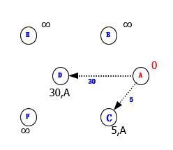|  | |
|:-:|:-:|:-:|
|图6-19|图6-20|图6-21|


|  |  |  |
| :----------------------------------------------------------: | :----------------------------------------------------------: | :----------------------------------------------------------: |
|                            图6-22                            |                            图6-23                            |                            图6-24                            |

上述例子中，有图中圆圈中的字母代表节点的信息，圆圈上面的内容代表源点到其最短距离以及前驱节点，前驱节点用于后续重现最短路径。

这里主要是使用到了一个简单的定理，**如果起点v0到目标点u之间的某一条路径是最短路径，那么在该路径上面，任何一个点u到的路径都是u'到v的最短路径。

那么这里在记录最短路径的信息时，如果需要重现路径中的顶点，那么只需要对于每一个结点设置一个前驱结点即可。

接下来继续查看一个例子，这里使用表格的形式来对整个算法流程进行分析。其中，第一行是final，第二行是路径长度，第3行是经过的路径。


| 终点 | 1    | 2    | 3    | 4    | 5    |
| ---- | ---- | ---- | ---- | ---- | ---- |
| $V_1$ | 0 <br>$+∞$<br> | 0 <br/>$+∞$<br/> | 0 <br/>$+∞$<br/> | 0 <br/>$+∞$<br/> | 0 <br/>$+∞$<br/> |
| $V_2$ | 0 <br/>10<br/>{$v_0, v_1$} | 1 |  |  |  |
| $V_3$ | 0 <br/>$+∞$<br/> | 0 <br/>60<br/>{$v_0, v_2, v_3$} | 0 <br/>50<br/>{$v_0, v_4, v_3$} | 1 |      |
| $V_4$ | 0 <br/>30<br/>{$v_0, v_2, v_3$} | 0 <br/>60<br/>{$v_0, v_2, v_3$} | 1 |      |      |
| $V_5$ | 0 <br/>100<br/>{$v_0, v_2$} | 0 <br/>100<br/>{$v_0, v_5$} | 0 <br/>90<br/>{$v_0, v_4, v_5$} | 0 <br/>60<br/>{$v_0, v_4, v_3,v_5$ } |      |
|  ||||||

 在具体实现路径重现的时候，主要是借助前驱数组和栈来进行实现，具体代码如下所示。在对该算法有了一定的理解之后，接下来就是考虑如何使用代码来实现它。由于该算法和Prim算法十分相近，所以在实现部分和Prim算法的实现部分基本一致，除了多了一个前驱数组，在初始化时，依旧是根据起点和邻接矩阵来对所有的距离进行初始化。对于源点到T中点的最短距离，也是借助一个访问数组visit和距离数组dis来进行保存，visit[i]=false代表第i个点在集合T中。之后在每次循环中，找出距离最短的，然后将其加入到集合U中。最后就是最关键的一步，也就是根据新加入的点来更新到T中剩余点的最短距离，这一步和Prim算法中的判断条件不同，需要注意。

### 6.11.2 Floyd算法「了解」

#### 什么是floyd

Floyd算法又称为插点法，是一种利用动态规划的思想寻找给定的加权图中多源点之间最短路径的算法。在一个加权图中，如果想找到各个顶点之间的最短路径，可以考虑使用弗洛伊德算法。弗洛伊德算法既适用于无向加权图，也适用于有向加权图。使用弗洛伊德算法查找最短路径时，只允许环路的权值为负数，其它路径的权值必须为非负数，否则算法执行过程会出错。

#### 时间复杂度

$O(n^3)$

####  算法思想

- 动态规划

- 算法考虑每对顶点最短路径上的中间顶点

- $d_{ij}^k$等于从第i个顶点到第j个顶点之间所有路径中最短的长度，并且路径中每一个中间顶点的编号不大于k

- 递推关系

  $$d_{ij}^k=min\{d_{ij}^{k-1},d_{ik}^{k-1}+d_{jk}^{k-1}\} $$

  $$d_{ij}^{0}=w_{ij}$$

#### 适用范围

任意两点间的最短路径。
#### 缺点

不适合计算大量数据。

#### 算法演示

如下图所示，演示使用弗洛伊德算法求解每一对顶点之间的最短路径。

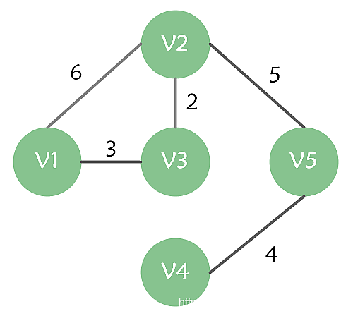

1. 在没有中转点的情况下，各个顶点之间的最短路径距离，用一个二维数组 dis 表示，如下图所示。

   


2. 假设 v1 作为中转点，则各个顶点之间的最短路径距离理论上将会被更新。然而由于 v2 经中转点 v1 到 v3 的距离大于 v2 直接到 v3 的距离（即 dis[v2][v1] + dis[v1][v3] > dis[v2][v3]），因此本次最短路径距离并未真正发生变化。

3. 再假设 v1，v2 作为中转点。此时 v5 可以经 v2 访问到 v1 和 v3，在没有中转的情况下，v5 到 v1 和 v3 的最短距离都是无穷大，因此各个顶点之间的最短路径距离将会被更新。

   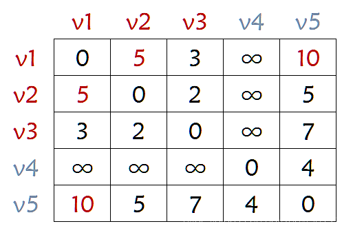

   再假设 v1，v2，v3 作为中转点。此时 v1 经 v3 访问 v2 的距离小于直接访问 v2 的距离（即 dis[v1][v3] + dis[v3][v2] < dis[v1][v2])，因此 v1 到 v2 的最短距离将会被更新；同时由于 v1 需经 v2 中转访问 v5，因此 v1 到 v5 的最短距离也要同步更新。

   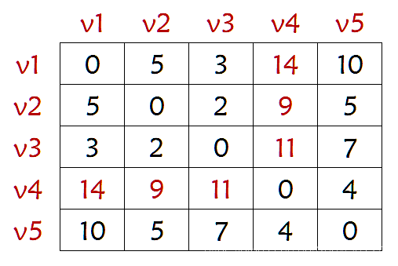

   再假设 v1，v2，v3，v4 作为中转点。由于 v4 是一个孤立的中转点因此，因此各个顶点之间的最短路径并未发生真正变化。

   再假设 v1，v2，v3，v4，v5 作为中转点。由于 v2 经 v5 中转可达 v4 且距离小于 dis[v2][v4]，因此 v2 到 v4 的最短路径将会更新，且 v1，v3 到 v4 的最短路径也会随之更新。

   至此，所有的点都作为了中转点，算法执行完毕。此时 dis 数组中存放的就是各个顶点之间的最短路径距离。


代码实现
```c
for(int k=1;k<=n;k++){
	for(int i=1;i<=n;i++)
		for(int j=1;j<=n;j++)
			dis[i][j] = min(dis[i][j],dis[i][k]+dis[k][j]);
```

## 6.12 图的遍历

### 6.12.1 深度优先搜索法
深度优先遍历（Depth_First_Search），也有称为深度优先搜索，简称为DFS。

深度优先搜索法是树的先根遍历的推广，它的基本思想是：从图G的某个顶点v0出发，访问v0，然后选择一个与v0相邻且没被访问过的顶点vi访问，再从vi出发选择一个与vi相邻且未被访问的顶点vj进行访问，依次继续。如果当前被访问过的顶点的所有邻接顶点都已被访问，则退回到已被访问的顶点序列中最后一个拥有未被访问的相邻顶点的顶点w，从w出发按同样的方法向前遍历，直到图中所有顶点都被访问。

为了更好的理解深度优先遍历，我们来做一个游戏。

```mermaid
graph LR

```

 

首先从顶点A开始，做上表示走过的记号后，面前有两条路，通向B和F，我们给自己定一个原则，在没有碰到重复顶点的情况下，始终是向右手边走，于是走到了B顶点。整个行路过程，可参看上图的右图。此时发现有三条分支，分别通向顶点C、I、G，右手通行原则，使得我们走到了C顶点。就这样，我们一直顺着右手通道走，一直走到F顶点。当我们依然选择右手通道走过去后，发现走回到顶点A了，因为在这里做了记号表示已经走过。此时我们退回到顶点F，走向从右数的第二条通道，到了G顶点，它有三条通道，发现B和D都已经是走过的，于是走到H，当我们面对通向H的两条通道D和E时，会发现都已经走过了。

此时我们是否已经遍历了所有顶点呢？没有。可能还有很多分支的顶点我们没有走到，所以我们按原路返回。在顶点H处，再无通道没走过，返回到G，也无未走过通道，返回到F，没有通道，返回到E，有一条通道通往H的通道，验证后也是走过的，再返回到顶点D，此时还有三条道未走过，一条条来，H走过了，G走过了，I，哦，这是一个新顶点，没有标记，赶快记下来。继续返回，直到返回顶点A，确认你已经完成遍历任务，找到了所有的9个顶点。

深度优先遍历其实就是一个递归的过程，如果再敏感一些，会发现其实转换成如上图的右图后，就像是一棵树的前序遍历，没错，它就是。它从图中某个顶点v出发，访问此顶点，然后从v的未被访问的邻接点出发深度优先遍历图，直至图中所有和v有路径相通的顶点都被访问到。

### 6.12.2 广度优先搜索法

广度优先遍历（Breadth_First_Search），又称为广度优先搜索，简称BFS。

图的广度优先搜索是树的按层次遍历的推广，它的基本思想是：首先访问初始点vi，并将其标记为已访问过，接着访问vi的所有未被访问过的邻接点vi1,vi2,…, vi t，并均标记已访问过，然后再按照vi1,vi2,…, vi t的次序，访问每一个顶点的所有未被访问过的邻接点，并均标记为已访问过，依次类推，直到图中所有和初始点vi有路径相通的顶点都被访问过为止。

如果说图的深度优先遍历类似树的前序遍历，那么图的广度优先遍历就类似于树的层序遍历了。我们将下图的第一幅图稍微变形，变形原则是顶点A放置在最上第一层，让与它有边的顶点B、F为第二层，再让与B和F有边的顶点C、I、G、E为第三层，再将这四个顶点有边的D、H放在第四层，如下图的第二幅图所示。此时在视觉上感觉图的形状发生了变化，其实顶点和边的关系还是完全相同的。

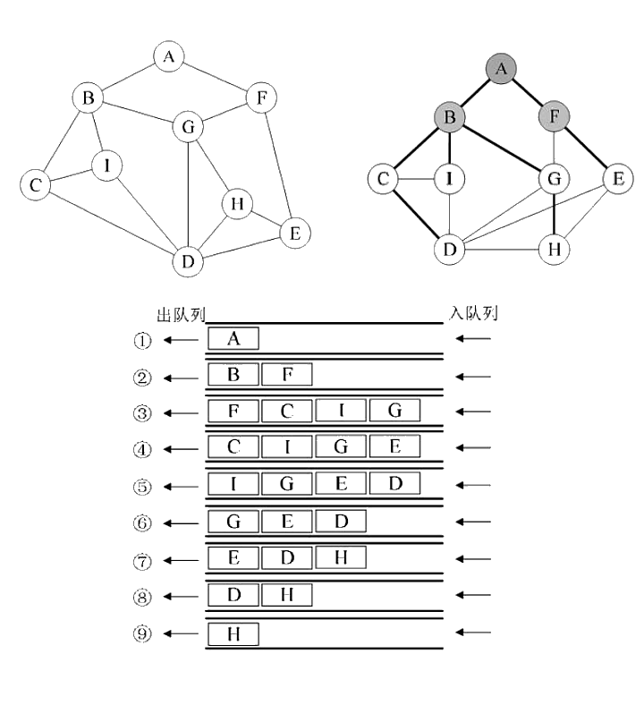 

 ## 习题


1. 下列关于无向连通图特性的叙述中，正确的是(  )。【2009年全国试题7(2分)】

I.  所有顶点的度之和为偶数

Ⅱ.边数大于顶点个数减1

Ⅲ.至少有一个顶点的度为1

A. 只有I            B.  只有Ⅱ      C.I   和Ⅱ      D.I   和Ⅲ

2. 若无向图G=(V,E)中含有7个顶点，要保证图G 在任何情况下都是连通的，则需要的边数最 少 是 (  )。【2010年全国试题7(2分)】

A.6                 B.15      C.16        D.21

3. 对下图进行拓扑排序，可以得到不同拓扑序列的个数是(  )。【2010年全国试题8(2分)】

 

**A.4**                  B.3               C.2                  D.1

4. 下列关于图的叙述中，正确的是(  )。【2011年全国试题8(2分)】

I. 回路是简单路径

Ⅱ.存储稀疏图，用邻接矩阵比邻接表更省空间

Ⅲ.若有向图中存在拓扑序列，则该图不存在回路

A.  仅Ⅱ      B. 仅 I 、Ⅱ            C.  仅Ⅲ        D.  仅 I 、Ⅲ

5. 对 有n 个 结 点 、e 条边且使用邻接表存储的有向图进行广度优先遍历，其算法时间复杂 度 是 (  )。【2012年全国试题5(2分)】

**A.O(n)**               B.O(e)               C.O(n+e)             D.O(n×e)

6. 若用邻接矩阵存储有向图，矩阵中主对角线以下的元素均为零，则关于该图拓扑序列的结论 是 (  )。【2012年全国试题6(2分)】

A. 存在，且唯一             B.  存在，且不唯一

C. 存在，可能不唯一           D.  无法确定是否存在

7. 对如下有向带权图，若采用迪杰斯特拉(Dijkstra)  算法求从源点a 到其他各顶点的最短路径， 则得到的第一条最短路径的目标顶点是 b, 第二条最短路径的目标顶点是 c, 后续得到的其 余各最短路径的目标顶点依次是(  )。【2012年全国试题7(2分)】


 

 

A.d,e,f            B.e,d,f              C.f,d,e         D. f,e,d

8. 下列关于最小生成树的叙述中，正确的是(  )。【2012年全国试题8(2分)】

I. 最小生成树的代价唯一

II. 所有权值最小的边一定会出现在所有的最小生成树中

Ⅲ.使用普里姆 (Prim) 算法从不同顶点开始得到的最小生成树一定相同

IV. 使用普里姆算法和克鲁斯卡尔 (Kruskal)  算法得到的最小生成树总不相同

A. 仅I          B. 仅Ⅱ       C. 仅 I 、Ⅲ           D. 仅Ⅱ、IV

9. 设图的邻接矩阵A如下所示。各顶点的度依次是(  )。【2013年全国试题7(2分)】

 

A.1,2,1,2            B.2,2,1,1             C.3,4,2,3             D.4,4,2,2

10.若对如下无向图进行遍历，则下列选项中，不是广度优先遍历序列的是(  )。【2013年

全国试题8(2分)】

 

A.h,c,a,b,d,e,g,f          B.e,a,f,g,b,h,c,d   **C.d.b,c,a,h,e,f,g**                   D.a,b,c,d,h,e,f,g

11. 下面AOE 网表示一项包含8个活动的工程。通过同时加快若干活动的进度可以缩短整个工程的 工期。下列选项中，加快其进度就可以缩短工程工期的是(  )。【2013年全国试题9(2分)】

 

A.c和e    B.d  和(        C.f和d           D.f和h

12. 对如下所示的有向图进行拓扑排序，得到的拓扑序列可能是(  )。【2014年全国试题7(2分)】

 


 

 


 

 

A.3,1,2,4,5,6         B.3,1,2,4,6,5           C.3,1,4,2,5,6          D.3,1,4,2,6,5

13. 设有向图G=(V,E),  顶点集 V={Vo,V₁,V₂,V₃},  边集E={<vo,v>,<vo,vz>,<vo,v₃>,<vj,v₃>},

若从顶点 V₀ 开始对图进行深度优先遍历，则可能得到的不同遍历序列个数是(   )。【2015 年全国试题5(2分)】

A.2               B.3                C.4                D.5

14. 求下面带权图的最小(代价)生成树时，可能是克鲁斯卡尔(Kruskal)  算法第二次选中但不 是普里姆 (Prim)  算法(从V₄开始)第2次选中的边是(  )。【2015年全国试题6(2分)】 A.(V₁,V₃)            B.(Vi,V₄)            C.(V₂,V₃)             **D.(V₃,V₄)**

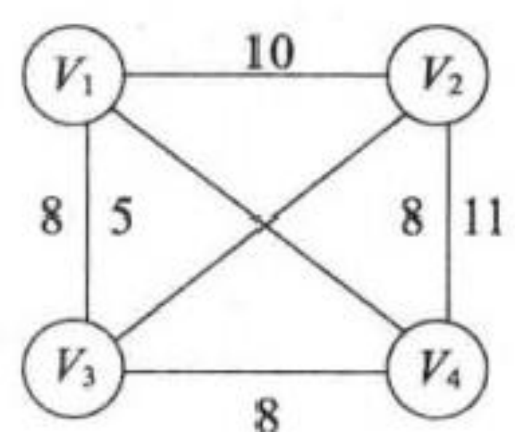 

15.以下图的叙述中，正确的是(  )。【华南理工大学2006 一、1(2分)】 A.  图与树的区别在于图的边数大于或等于顶点数

B. 假设有图G=(V,{E}), 顶点集VCV,ECE,    则 V和{E}构成G的子图 C. 无向图的连通分量指无向图中的极大连通子图

D. 图的遍历就是从图中某一顶点出发访遍图中其余顶点

16. 图中有关路径的定义是(  )。【北方交通大学2001 一 、24(2分)】

A. 由顶点和相邻顶点序偶构成的边所形成的序列

B. 由不同顶点所形成的序列

C.  由不同边所形成的序列

D. 上述定义都不是

17. 设无向图的顶点个数为n,  则该图最多有(  )条边。【清华大学1998一、5(分)】

A.n-1                **B.n(n-1)/2**             C.n(n+1)/2            D.0  E.n²

18. 具有n 个顶点的有向完全图有(  )条边。【湖南大学2008】

**A.n(n-1)/2**          **B.n(n-1)**              C.n(n+1)/2            D.n(n+1)

19. 一 个n 个顶点的连通无向图，其边的个数至少为(  )。【浙江大学1999 四、4(4分)】

A.n-1             B.n                C.n+1              D.nlogn

20. 要连通具有n 个顶点的有向图，至少需要(  )条边。【北京航空航天大学2000一、6

(2分)】

A.n-1            B.n                  C.n+1              D.2n

21. 设有向图G 是有10个顶点的强连通图，则G 至少有(  )条边。【哈尔滨工业大学2005

二、7(1分)】

A.45       B.90         C.10       D.9

22. 具有6个顶点的无向图，当有(   )条边时能确保是一个连通图。【华中科技大学2007

一、11(2分)】

A.8              B.9                C.10       D.11

23.n 个结点的完全有向图含有边的数目(  )。【中山大学1998 二、9(2分)】


 

**A.n\*n**              B.n(n+1)             C.n/2               D.n*(n-1)

24. 一个有n 个结点的图，最少有(  )个连通分量，最多有(   )个连通分量。【北京邮

电大学2000 二、5(20/8分)】

A.0              B.1                C.n-1             D.n

25. 在一个无向图中，所有顶点的度数之和等于所有边数(   )倍，在一个有向图中，所 有顶点的入度之和等于所有顶点出度之和的(   )倍。【哈尔滨工业大学2001 二、3 (2分)】

A.1/2              B.2                C.1                D.4

26. 一个有向图，共有n 条弧，则所有顶点的度的总和为(  )。【华南理工大学2006 一、9

(2分)】

**A.2****n**             B.n                C.n-1              D.n/2

27. 对于一个具有 n 个顶点的无向图，若采用邻接矩阵表示，则该矩阵的大小为(  )。【中

南大学2005 一、5(2分)】

A.(n-1)²        B.n²            C.n-1           D.n

28. 用有向无环图描述表达式(A+B)*((A+B)/A), 至少需要顶点的数目为(   )。【中山大学

1999 一、14】

**A.5**               B.6                C.8                D.9

29. 无向网(加权图)的邻接矩阵是(  )矩阵。【华中科技大学2006 一、8(2分)】

A. 下三角     B. 上三角     C. 稀疏      D. 对称

30.设有两个无向图G=(V,E),G'=(V,E'),如果G 是G 的生成树，则下列说法不正确的是(  )。

【北京交通大学2006 一、5(2分)】

A.G'是G 的子图             B.G'是G 的连通分量

C.G'是G 的无环子图          D.G 是 G 的极小连通子图，且 V=V

31.用邻接表存储图所用的空间大小(  )。【北京交通大学2004 一、7(2分)】

A. 与图的顶点数和边数都有关      B. 只与图的边数有关

C. 只与图的顶点数有关          D.  与边数的平方有关

32.对邻接表的叙述中，(  )是正确的。【华南理工大学2006 一、10(2分)】 A. 无向图的邻接表中，第i个顶点的度为第i个链表中结点数的二倍

B. 邻接表比邻接矩阵的操作更简单

C. 邻接矩阵比邻接表的操作更简便

D. 求有向图结点的度，必须遍历整个邻接表

33. 在有向图的邻接表存储结构中，顶点v 在链表中出现的次数是(   )。【北京理工大学2006

五、10(1分)2004一 、7(1分)】

A. 顶点v 的度            B. 顶点v 的出度

C. 顶点v 的入度            D.  依附于顶点v 的边数

34.n 个顶点的无向图的邻接表最多有(  )个表结点。【华中科技大学2006一、9(2分)】

A.n²           **B.n(n-1)**             C.n(n+1)            D.n(n-1)/2

35. 图 G 是 n 个顶点的无向完全图，则下列说法正确的有：(  )。【电子科技大学2003 一、

6(20/8分)】


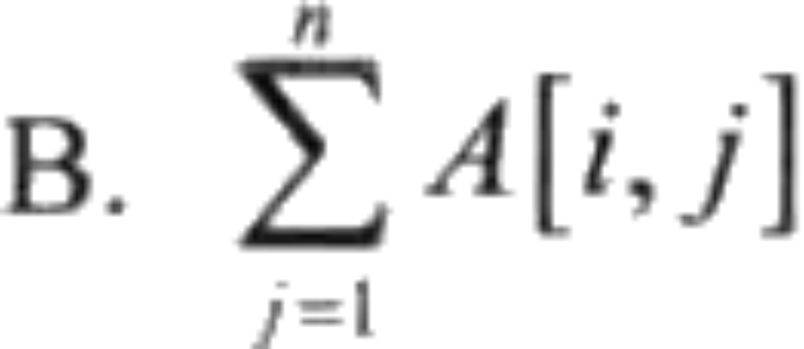 

A.G  的邻接多重表需要n(n-1)  个边结点和n 个顶点结点

B.G  的连通分量个数最少

C.G 为连通图

D.G 所有顶点的度的总和为n(n-1)

36. 下列表述中，错误的说法是(  )。【北京工业大学2005 一 、2(2分)】 A.n  个结点的树的各结点度数之和为n-1

B.n  个顶点的无向图最多有n*(n-1)     条边

C.  用邻接矩阵存储图时所需存储空间的大小与图的顶点数有关，而与边数无关 D. 哈希表中冲突的可能性大小与装填因子有关

37. 以下图的叙述中，正确的是(  )。【华南理工大学2005 一 、1(2分)】

A. 强联通有向图的任何顶点到其他所有顶点都有弧

B.  任意图顶点的入度等于出度

C.  有向完全图一定是强联通有向图

D. 有向图的边集的子集和顶点集的子集可构成原有向图的子图

38. 下列哪一种图的邻接矩阵是对称矩阵? (   )【北方交通大学2001 一 、11(2分)】

A. 有向图     B. 无向图       C.AOV 网      D.AOE  网

 

| 1.A  | 2.C  | 3.B  | 4.C   | 5.C   | 6.C   | 7.C    | 8.A  | 9.C  | 10.D |
| ---- | ---- | ---- | ----- | ----- | ----- | ------ | ---- | ---- | ---- |
| 11.C | 12.D | 13.D | 14.C  | 15.C  | 16.A  | 17.B   | 18.B | 19.A | 20.B |
| 21 C | 22.D | 23.D | 24.1B | 24.2D | 25.1B | 25.2C  | 26.A | 27.B | 28.A |
| 29.D | 30.B | 31.A | 32.D  | 33.C  | 34.B  | 35.BCD | 36.B | 37.C | 38.B |
# 第7章 广义表

## 7.1 广义表定义

广义表(Lists，又称列表)是一种非连续性的数据结构，是线性表的一种推广。即广义表中放松对表元素的原子限制，容许它们具有其自身结构。它被广泛的应用于人工智能等领域的表处理语言LISP语言中。在LISP语言中，广义表是一种最基本的数据结构，就连LISP 语言的程序也表示为一系列的广义表。

## 7.2 广义表的原子和子表

通常，广义表中存储的单个元素称为 "原子"，而存储的广义表称为 "子表"。

例如创建一个广义表 LS = (1,(1,2,3))，我们可以这样解释此广义表的构成：广义表 LS 存储了一个原子 1 和子表 (1,2,3)。

以下是广义表存储数据的一些常用形式：
* A = ()：A 表示一个广义表，只不过表是空的。
* B = (e)：广义表 B 中只有一个原子 e。
* C = (a,(b,c,d)) ：广义表 C 中有两个元素，原子 a 和子表 (b,c,d)。
* D = (A,B,C)：广义表 D 中存有 3 个子表，分别是A、B和C。这种表示方式等同于 D = ((),(e),(b,c,d)) 。
* E = (a,E)：广义表 E 中有两个元素，原子 a 和它本身。这是一个递归广义表，等同于：E = (a,(a,(a,…)))。

注意，A = () 和 A = (()) 是不一样的。前者是空表，而后者是包含一个子表的广义表，只不过这个子表是空表。
### 7.2.1 广义表的表头和表尾
当广义表不是空表时，称第一个数据（原子或子表）为「表头」，剩下的数据构成的新广义表为「表尾」。

强调一下，除非广义表为空表，否则广义表一定具有表头和表尾，且广义表的表尾一定是一个广义表。表头可能是广义表，也有可能是元素。，而其表尾必定是子表。

例如在广义表中 LS=(1,(1,2,3),5) 中，表头为原子 1，表尾为子表 (1,2,3) 和原子 5 构成的广义表，即 ((1,2,3),5)。

注：任何一个非空广义表的表头是表中第一个元素，它可以是原子，也可以是子表，**表尾不是最后一个元素，而是一个子表**

head(C)=a， tail(C)=((b,c,d))
	head(D)=A=()， tail(D)=(B,C)=((e),(a,(b,c,d)))

由于tail(D)是非空表，可继续分解得到：

head(tail(L))=(e)， tail(tail(L))=(b,c,d)


## 7.3 广义表的存储结构
由于广义表中既可存储原子（不可再分的数据元素），也可以存储子表，因此很难使用顺序存储结构表示，通常情况下广义表结构采用链表实现。

> 使用顺序表实现广义表结构，不仅需要操作 n 维数组（例如 (1,(2,(3,4))) 就需要使用三维数组存储），还会造成存储空间的浪费。

使用链表存储广义表，首先需要确定链表中节点的结构。由于广义表中可同时存储原子和子表两种形式的数据，因此链表节点的结构也有两种，如下图所示：


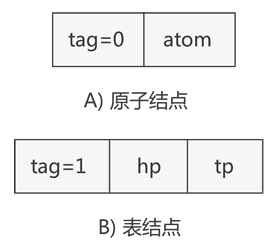  

如上图所示，表示原子的节点由两部分构成，分别是 tag 标记位和原子的值，表示子表的节点由三部分构成，分别是 tag 标记位、hp 指针和 tp 指针。

tag 标记位用于区分此节点是原子还是子表，通常原子的 tag 值为 0，子表的 tag 值为 1。子表节点中的 hp 指针用于连接本子表中存储的原子或子表，tp 指针用于连接广义表中下一个原子或子表。

因此，广义表中两种节点的 C 语言表示代码为：
```c
typedef struct GLNode(
    int tag;//标志域
    union(
        char atom;//原子结点的值域
        struct(
            struct GLNode * hp,*tp;
        )ptr;//子表结点的指针域，hp指向表头；tp指向表尾
    )subNode;
)*Glist;
```

这里用到了 union 共用体，因为同一时间此节点不是原子节点就是子表节点，当表示原子节点时，就使用 atom 变量；反之则使用 ptr 结构体。

例如，广义表 (a,(b,c,d)) 是由一个原子 a 和子表 (b,c,d) 构成，而子表 (b,c,d) 又是由原子 b、c 和 d 构成，用链表存储该广义表如下图所示: 
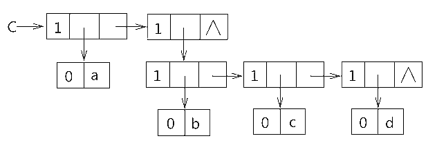  

可以看到，存储原子 a、b、c、d 时都是用子表包裹着表示的，因为原子 a 和子表 (b,c,d) 在广义表中同属一级，而原子 b、c、d 也同属一级。

一 、选择题
1. 数组A[0.5,0..6]  的每个元素占5个字节，将其按列优先次序存储在起始地址为1000的内存 单元中，则元素A[5,5]  的地址是(   )。【南京理工大学2001 一、13(1.5分)】
A.1175            B.1180             C.1205             D.1210
2. 设7行6列的数组a 以列序为主序顺序存储，基地址为1024,每个元素占2个存储单元，第 4行第5列的元素(假定无第0行第0列)的存储地址是(   )。【华中科技大学2006 一、 3(2分)】
A.1068             B.1086             C.1084             D.1066
3.若6行5列的数组以列序为主序顺序存储，基地址为1000,每个元素占2个存储单元，则第 3 行第4列的元素(假定无第0行第0列)的地址是(   )。【华中科技大学2004 一、4 (1分)】
A.1040                                B.1042
C.1026                                D. 备选答案A,B,C      都不对
4. 二维数组 A的元素都是6个字符组成的串，行下标i 的范围从0到8,列下标j 的范围从1 到10。从供选择的答案中选出应填入下列关于数组存储叙述中(   )内的正确答案。
(1)存放A 至少需要(  )个字节；
(2)A  的第8列和第5行共占(  )个字节；
(3)若A按行存放，元素A[8,5]  的起始地址与A 按列存放时的元素()的起始地址一致。 供选择的答案
(1)A.90                           B.180               C.240           D.270         E.540
(2)A.108           B.114              C.54               D.60          E.150
(3)A.A[8,5]                   B.A[3,10]                      C.A[5,8]                        D.A[0,9]
【山东工业大学2000 三、1(4分)】  【山东大学1998 三、1(4分)】
5. 设二维数组A[1.m,l.n]      (即m 行 n 列)按行存储在数组 B[1..m*n]中，则二维数组元素A[i, j]在一维数组B 中的下标为(   )。【南京理工大学1998 一、2(2分)】
A.(i-1)*n+j                   B.(i-1)*n+j-1                C.i*(j-1)                        D.j*m+i-1
6. 将一个 A[1.100,1..100]的三对角矩阵，按行优先存入一维数组 B[1..298]中，A 中元素 Aoas (即该元素下标 i=66,j=65),     在B 数组中的位置K 为  (   )。【北京邮电大学1998 二、5 (2分)】
A.198              B.195              C.197
7. 数组通常具有的两种基本操作是(   )。【中南大学2005 一、10(2分)】
A. 查找和修改       B.  查找和索引      C. 索引和修改      D. 建立和删除
8. 对矩阵压缩存储是为了(   )。【中南大学2005 一、9(2分)】


A. 方便运算         B. 方便储存        C. 提高运算速度     D. 减少储存空间
9. 稀疏矩阵一般的压缩存储方法有(   )。【南京理工大学2005 一、12(1分)】
A. 三元组和二维数组                   B. 散列和十字链表
C. 三元组和散列                         D.  三元组和十字链表
10.稀疏矩阵一般的压缩存储方法有两种，即(    )。【华南理工大学2005 一、1(2分)】【暨
南大学2010 一、12(2分)】【江苏大学2005 一、9(2分)】
A. 二维数组和三维数组                  B.  三元组和散列
C.  三元组和十字链表                    D. 散列和十字链表
11.稀疏矩阵的三元组存储方法(   )。【华南理工大学2006 一、4(2分)】 A. 实现转置运算很简单，只需将每个三元组的行标和列标交换
B. 是一种链式存储方法
C. 矩阵的非零元个数和位置在操作过程中变化不大时较有效
D. 比十字链表法更高效
12.在稀疏矩阵的快速转置算法中，num[col]表示源矩阵M 中 (   )。【北京理工大学2007一、
7(1分)】
A. 第 col行中非零元的个数              B. 第col行中零元的个数
C. 第col 列中非零元的个数              D. 第 col列中零元的个数
13. 设有一个n 行 n 列的对称矩阵A,  将其下三角部分按行存放在一个一维数组 B 中 ，A[O][0] 存放于B[0]中，那第i 行的对角元素A[i][i]存放于B 中 (    )处。【哈尔滨工业大学2005 二、5(1分)】
A.(i+3)*i/2                  B.(i+1)*i/2                    C.(2n-i+1)*i/2               D.(2n-i-1)*i/2
14.若对 n 阶对称矩阵A 以行序为主序方式将其下三角形的元素(包括主对角线上所有元素)  依次存放于一维数组B[1..(n(n+1))/2]   中，则在B 中确定a;(i<j)的位置k的关系为(   )。 【北京航空航天大学2000 一、2(2分)】【烟台大学2007 一、9(2分)】
A.i*(i-1)/2+j                B.j*(j-1)/2+i                 C.i*(i+1)/2+j                 D.j*(j+1)/2+i
15. 设A 是 n*n的对称矩阵，将A 的对角线及对角线上方的元素以列为主的次序存放在一维数
组 B[1	n(n+1)/2]中，对上述任一元素ay(1≤i,j≤n,           且 i≤j)    在B 中的位置为(    )。
【南京理工大学1999 一、9(2分)】【江苏大学2006 一、1(2分)】
A.i(i-1)/2+j                  B.j(j-1)/2+i                   C.j(j-1)/2+i-1                D.i(i-1)/2+j- 1
16. 对 n 阶对称矩阵作压缩存储时，需要表长为(   )的顺序表。【华中科技大学2006 一、
2(2分)】
A.n/2                            B.n²/2                   C.n(n+1)/2                    D.n(n- 1)/2
17. 有一个100*90的稀疏矩阵，非0元素有10个，设每个整型数占2字节，则用三元组表示 该矩阵时，所需的字节数是(   )。【南京理工大学1999 二、8(2分)】
A.60              B.66               C.18000           D.33
18. 数组 A[0..4,-1..-3,5..7] 中含有元素的个数(   )。【中山大学1998二、5(2分)】 A.55              B.45               C.36               D.16
19. 用数组r 存储静态链表，结点的 next 域指向后继，工作指针j 指向链中结点，使j 沿链移动 的操作为(   )。【南京理工大学2001 一、16(1.5分)】


A.j=r[j].next               B.j=j+1                            C.j=j->next                      D.j=r[j]->next
20. 一个非空广义表的表尾(   )。【北京交通大学2004 一 、2(2分)】
A. 不能是子表      B.  只能是子表       C.  只能是原子       D.  是原子或子表
21. 广义表(((a)),((b,(c)),(d,(e,f))),O)      的深度是(    )。【华中科技大学2007一、7(2分)】
A.2                          B.3                            C.4                            D.5
22. 广义表(a,((b,(c,d,(e,f))),g))        的深度为(    )。【北京邮电大学2005 一 、4(2分)】
A.3                                B.4                                  C.5                                  D.6
23. 广义表((a,b),c,(d,(e))             的表尾是(    )。【华中科技大学2006 一 、4(2分)】
A.(d,(e))                       B.((d,(e)))                       C.e                             D.(c,(d,(e)))
24. 已知广义表((),(a),(b,c,(d),((d,)))),           则以下说法正确的是(    )。【华南理工大学2006
一、7(2分)】
A.  表长为3,表头为空表，表尾为(a),(b,c,(d),((d,f)))
B. 表长为3,表头为空表，表尾为(b,c,(d),((d,f)))
C. 表长为4,表头为空表，表尾为((d,f))
D. 表长为3,表头为(O),  表尾为 (a),(b,c,(d),((d,f))))
25. 已知广义表 LS=((a,b,c),(d,e,)),          运用head 和 tail 函数取出LS中原子e 的运算是(    )。
【西安电子科技大学2001 应用一、3(2分)】
A.head(tail(LS))                                                   B.tail(head(LS))
C.head(tail(head(tail(LS)))                                  D.head(tail(tail(head(LS))
26. 广义表A=(a,b,(c,d),(e,(f,g))),        则下面式子 Head(Tail(Head(Tail(Tail(A))) 的值为(    )。
【北京邮电大学1999 一、2(2分)】【烟台大学2007 一 、10(2分)】
A.(g)                             B.(d)                                C.c                             D.d
27. 设广义表L=(a,b,O),    则 GetTail(GetTail(L))的结果是(    )。【北京理工大学2006 九、8
(1分)】
A.(O)                            B.)                                   C.(b,O)                            D.  都不是
28. 广义表A=(a,b,c,(d,(e,f))),        则下面式子 Head(Tail(Tail(Tail(A)))  的值为(    )。 (Head  与
Tail 分别是取表头和表尾的函数。)【华南理工大学2005 一、1(2分)】
A.(d,(e,f))                     B.d                                  C.f                        D.(e,f)
29. 某字符串满足： concat(head(s),head(tail(tail(s))))="ac",(head,tail         的定义同广义表),则s=
(    )。【中国科学技术大学1992  八、6(1分)】
A.aabc                           B.acba                              C.accc                         D.acac
30. 广义表 (a,(b,c),d,e)      的表头为(    )。【中山大学1998 二、6(2分)】
A.a                                B.a,(b,c)                          C.(a,(b,c))                       D.(a)
31. 已知 Head(Tail([Head(S),Head(Tail(Tail(S))JD)=[a], 广义表S 满足上式，则S 为 (   )(其 中，方括号表示广义表，圆括号表示函数，如[a,b   表示由a,b   构成的广义表，而 HeadO表
示取广义表的头部)。【中国科学技术大学1995 十四、5(2分)】
A.[[a,b],b,a]            B.[[b,a],[a],[b]]         C.[[a],[a,b],[b]]
D.[b,[a],[a,b]]         E.[[a],[b],[b,a]]         F.[[b],[b,a],[a]]
32. 广义表(())的表头是(   ),表尾是(   )。【电子科技大学2003一、4(20/8分)】


A.()                               B.NIL                              C.(())                              D.((()))
33. 将线性表的数据元素进行扩充，允许是带结构的线性表的是(   )。【电子科技大学2001
一、8(1分)】
A.  串              B.  树               C. 广义表           D.  栈
34. 下面说法不正确的是(    )。【南京理工大学2001 一、3(1.5分)】【江苏大学2006 一、
1(2分)】
A. 广义表的表头总是一个广义表          B. 广义表的表尾总是一个广义表
C. 广义表难以用顺序存储结构            D. 广义表可以是一个多层次的结构 35. 下面说法不正确的是(    )。【电子科技大学2008 一 、5(1分)】
A. 广义表的表尾总是一个广义表          B. 广义表难以用顺序存储结构
C.  广义表的表头总是一个广义表          D. 广义表可以是一个递归结构

| 1.A  | 2.B  | 3.A  | 4.1E  | 4.2A  | 4.3B | 5.B  | 6.B  | 7.A  | 8.D  |
| ---- | ---- | ---- | ----- | ----- | ---- | ---- | ---- | ---- | ---- |
| 9.D  | 10.C | 11.C | 12.C  | 13.A  | 14.B | 15.B | 16.C | 17.B | 18.B |
| 19.A | 20.B | 21.C | 22.C  | 23.D  | 24.A | 25.C | 26.D | 27.A | 28.A |
| 29.C | 30.A | 31.F | 32.1A | 32.2A | 33.C | 34.A |      |      |      |# 串

## 7.4 串的定义

串，即字符串(String），是由零个或多个字符组成的有限序列。一般记为其中，s是串名，引号（单/双引号都可）括起来的字符序列是串的值；可以是字母、数字或其他字符；字符下标从1开始，串中字符的个数n称为串的长度。n=0时的串称为空串（用∅表示）。

## 7.5 什么是子串

串中任意个连续的字符组成的子序列
* 主串:包含子串的串。
* 字符在主串中的位置: 字符在串中的序号。（注意位序从1开始，而不是0）
* 子串在主串中的位置: 子串的第一个字符在主串中的位置。
* 空串:即n=0；
* 空格串: 空格串即串的值是若干空格字符

### 7.5.1 串和线性表的区别

串是一种特殊的线性表，数据元素之间呈线性关系。

区别：串的数据对象限定为字符集（如中文字符、英文字符、数字字符、标点字符等)；

串的基本操作，如增删改查等通常以子串为操作对象。

### 7.5.2 串存储结构的具体实现

存储一个字符串，数据结构包含以下 3 种具体存储结构：
* 定长顺序存储：实际上就是用普通数组（又称静态数组）存储。例如 C 语言使用普通数据存储字符串的代码为 char a[20] = "data.biancheng.net"；
* 堆分配存储：用动态数组存储字符串；
* 块链存储：用链表存储字符串；

## 7.6 基本操作

假设有空串T=""，主串S="iPhone 11 Pro Max?”，字串W=“Pro"
```c
StrASSign(&T,charS)//赋值操作。把串T赋值为chars。
StrCopy(&T,S)//复制操作。由串S复制得到串T。
StrEmpty(S)//判空操作。若S为空串，则返回TRUE，否则返回FALSE。
StrLength(S)//求串长。返回串S的元素个数。
ClearString(&S)//清空操作。将S清为空串。
DestroyString(&S)//销毁串。将串S销毁（回收存储空间）。
Concat(&T,S1,S2)//串联接。用T返回由S1和S2联接而成的新串
SubString(&Sub,S,pos,len)//求子串。用Sub返回串S的第pos个字符起长度为len的子串。
Index(S,Sub)//定位操作。若主串S中存在与串Sub值相同的子串，则返回它在主串S中第一次出现的位置;否则函数值为0。
StrCompare(S,T)//比较操作。若S>T，则返回值>O;若S=T，则返回值=0;若S<T，则返回值<O。
Concat要考虑存储空间的问题；StrCompare比较的是字符在计算机中存储的二进制数的大小。
```
## 7.7 串的存储结构

存储结构不同，运算的实现方式不同。主要分为顺序存储和链式存储两种。

### 7.7.1 顺序存储的实现

顺序存储基于数组，如同顺序表一样，只不过存储的是字符而不是其他类型的数据。

```c
//静态数组（定长顺序存储） 
#define MAXLEN 255
typedef struct{
	char ch[MAXLEN]; //每个分量存储一个字符 
	int length;      //串的实际长度 
}SString;            //函数结束，系统自动回收 

//动态数组（堆分配存储 ）
typedef struct{
	char *ch;        //ch指向串的基地址 
	int length;      //串的长度 
}HString; 
HString S;
S.ch = (char *)malloc(MAXLEN*sizeof(char)); //malloc申请的空间在堆区（heap）,手动free释放存储空间 
S.length = 0;
```

### 7.7.2 链式存储

顺序存储基于链表，如同链表一样，只不过存储的是字符而不是其他类型的数据。


```c
typedef struct StringNode{
	char ch;        //每个节点存1个字符 1B
	struct StringNode *next;          //4B
}StringNode , *String;                //存储密度低（字符1B+指针4B),可以让每个节点多存些字符
//推荐下面的定义： 
typedef struct StringNode{
	char ch[4];     //每个节点存4个字符 4B
	struct StringNode *next;          //4B
}StringNode , *String; 
```


顺序串和链式串的优缺点结合顺序表和链式表分析

## 7.8 字符串的模式匹配算法

### 7.8.1 什么是模式匹配

模式匹配: search功能, 在主串中找到与模式串相同的子串，并返回其所在位置。

主串；模式串（所要找到的子串）

子串:主串的一部分,一定存在；模式串――不一定能在主串中找到

模式匹配的两种算法：朴素模式匹配算法；KMP算法

### 7.8.2 朴素模式匹配算法

思路：（暴力穷举所有子串进行匹配）与前面介绍的Index（S,Sub）思路一致

主串长度为n，模式串长度为m；

朴素模式匹配算法∶将主串中所有长度为m的子串依次与模式串对比（最多对比 n-m+1个子串），直到找到一个完全匹配的子串或所有的子串都不匹配为止。

指针回退的关键：i = i-j+2; j=1;

```c
//S:主串；T:模式串 
int Index(SString S,SString T){
	int i=1,j=1;
	while(i<=S.length && j<=T.length){//对比 S.length-T.length+1次 
		if(S.ch[i] == T.ch[j]){
			++i;++j;//当前字符匹配，对比后继字符 
		}else{//匹配到不相等的字符时，指针回退，重新匹配 
			i = i-j+2;
			j = 1; 
		}
	}
	if(j>T.length)	return i-T.length;//模式串的字符与子串全部匹配
	else return 0; 
}
```
最坏（最后一个子串与模式串匹配）时间复杂度：O(nm) 其中m=模式串长； n=主串长


### 7.8.3 KMP算法

#### 算法思想

由D.E.Knuth，J.H.Morris和V.R.Pratt提出，因此称为KMP算法。基于朴素模式匹配算法思想优化而来。

朴素模式匹配算法：需要对比n-m+1个子串；KMP算法：根据对每次匹配时，当前字符之前的字符是已知的，根据这一点，可以跳过一些对比，对朴素模式匹配算法进行优化。

下一次匹配时 i 和 j 要调到什么位置，是该算法要思考的问题。

i 跳到何位置？——next数组/nextval数组（手算next数组/nextval数组）

j 跳到何位置？——主串指针不需要回溯（好马不吃回头草）

### 7.8.4 算法代码实现

无需背诵


```c
int Index_KMP(SString S,SString T,int next[]){
	int i=1,j=1;
	while(i<=S.length && j<=T.length){
		if(S.ch[i]==T.ch[i]|| j==0){
			++i;++j;//比较后续字符 
		}else{
			j = next[j];//模式串的第j个位置不匹配，模式串指针j要根据next数组回溯 
		}
	}
	if(j>T.length) return i-T.length; //匹配成功
	else return 0; 
} 
```

算法复杂度：O(m+n) = 求next数组复杂度O(m) + 最坏匹配复杂度O(n） 

### 7.8.5 求next数组和nextval数组

首先说，next和nextval都包括1和0两种不同模式，其中模式1=模式0+1，模式0=模式1-1。例如next1=next0+1，nextval0=nextval1-1。

其次是，不管是next数组和nextval数组，都是对模式串的分析所得到的结果，与主串无关。在做题的时候，要抓住模式串这一变量。

#### 求解next1

next1数组的求解方法：**首先第一位的next值直接给0，第二位的next值直接给1，后面求解每一位的next值时，都要前一位进行比较。首先将前一位与其next值的对应位进行比较，若相等，则该位的next值就是前一位的next值加上1；若不等，继续重复这个过程，直到找到相等某一位，将其next值加1即可，如果找到第一位都没有找到，那么该位的next值即为1。**

> 故事助记：「检查作业」—— 这次是几分呢？
> 手里拿个小本，看左边的题目的结果，根据这个结果给出的位置找答案，哦一样的，在这个结果基础上加1分；哦不一样啊，以当前这个结果作为新结果，以新结果给出的位置继续找，重复进行，如果找到了，就在新结果基础上加1分；如果找不到，那就勉强给1分。

举例：

|模式串编号|1|2|3|4|5|6|7|8|
|----|----|----|----|----|----|----|----|----|
|模式串|a|b|a|a|b|c|a|c|
|next1|0|1|1|2|2|3|1|2|
|next0|-1|0|0|1|1|2|0|1|

#### 求解next0

在next1的基础上，值全部-1

#### next1数组求解示例

#### 具体求解步骤

1. 前两位必为0，1。
2. 计算第三位的时候，看第二位b的next值，为1，则把b和1对应的a进行比较，不同，则第三位a的next的值为1，因为一直比到最前一位，都没有发生比较相同的现象。
3. 计算第四位的时候，看第三位a的next值，为1，则把a和1对应的a进行比较，相同，则第四位a的next的值为第三位a的next值加上1，为2。因为是在第三位实现了其next值对应的值与第三位的值相同。
4. 计算第五位的时候，看第四位a的next值，为2，则把a和2对应的b进行比较，不同，则再将b对应的next值1对应的a与第四位的a进行比较，相同，则第五位的next值为第二位b的next值加上1，为2。因为是在第二位实现了其next值对应的值与第四位的值相同。
5. 计算第六位的时候，看第五位b的next值，为2，则把b和2对应的b进行比较，相同，则第六位c的next值为第五位b的next值加上1，为3，因为是在第五位实现了其next值对应的值与第五位相同。
6. 计算第七位的时候，看第六位c的next值，为3，则把c和3对应的a进行比较，不同，则再把第3位a的next值1对应的a与第六位c比较，仍然不同，则第七位的next值为1。
7. 计算第八位的时候，看第七位a的next值，为1，则把a和1对应的a进行比较，相同，则第八位c的next值为第七位a的next值加上1，为2，因为是在第七位和实现了其next值对应的值与第七位相同。

#### 另一种解法

先求模式串S 每一个字符前面的那个字符串的最大公共前后缀长度，将这一系列长度存成一个数组，求出来的每个长度其实就是和模式串每一个对应位置上做比较的下标。

例如：模式串是`ABACABC`，其最长公共前后缀长度数组为：我们将最长公共前后缀长度记作`LCPSF`，现在从模式串第一个字符A开始，A的前面字符串为null，所以A之前的子串的`LCPSF`是0；来到B，B的前面字符串是A，A是单独的字符不存在公共前后缀，所以长度也是0；来到A，A前面的子串是AB，`LCPSF`为0；来到C，C前面的子串是ABA，`LCPSF`为1；来到A，A前面的子串是ABAC，`LCPSF`为0；来到B，B之前子串为ABACA，`LCPSF`为1；来到C，C前面子串为ABACAB，`LCPSF`为2；到此这个最长公共前后缀数组就出来了`[0,0,0,1,0,1,2]`将这个数组从第二个值开始每个值加1后，得到`[0,1,1,2,1,2,3]` 就是将要和子串对应位置比较的下标，即为next数组。

------

#### 求解nextval数组

掌握了上面求next数组的方法后，我们可以迅速求得模式串ABACABC的next数组为[0,1,1,2,1,2,3]，现在继续求模式串ABACABC的next-val数组：

**求解nextval数组是基于next数组的，模式串每一个位置的字符和其next数组值给出的下标的对应位置的数作比较，相等就取next-val中对应的next数组值作为当前位置字符的next-val值，不等就直接取当前位置字符的next数组的值作为next-val的值。**

> 故事助记：（nextval数组第一位始终是0，从第二位开始）妈妈都会告诉小朋友不要相信陌生人，确定nextval数组的问题就可以抽象为要不要拿别人东西吃的问题，每个小朋友心里都有自己想吃的东西（当前位置数组项），并且每位小朋友手里都有一个线索（next数组项对应每位小朋友手里的线索），当别人给自己东西吃的，就拿自己线索对应的别人的吃的东西做比较，如果线索对应的东西不是自己爱吃的，那就选择吃自己的东西（保留自己的线索），否则就吃别人的东西（把别人的线索拿过来）。

**求解步骤：**

1. next-val数组第1位：0
2. next-val数组第2位：模式串第二个字符为B，对应的下标数组第二个数是1，那就是将模式串的第1个字符和B相比较，A!=B,所以直接将下标数组第二个数1作为next-val数组第二个数的值
3. next-val数组第3位：模式串第三个字符为A，对应下标数组第三个数为1，取其作为下标，找到模式串第1个字符为A，A=A，那取next-val的第一个数做为next-val第三个数的值，也就是0
4. next-val数组第n位：按照第3位计算方式计算

**举例：**

| 位置         |  1   |  2   |  3   |  4   |  5   |  6   |  7   |
| :----------- | :--: | :--: | :--: | :--: | :--: | :--: | :--: |
| 模式串       |  A   |  B   |  A   |  C   |  A   |  B   |  C   |
| next1数组    |  0   |  1   |  1   |  2   |  1   |  2   |  3   |
| Nextval1数组 |  0   |  1   |  0   |  2   |  0   |  1   |  3   |

> 注意，这里所有序号，第一个位置都是1开始

#### next 和 nextval 比较

next数组的缺陷举例如下：比如主串是"aabXXXXXXXXXXXXXX"，模式串"aac"，通过计算 "aac" 的next数组为012，当模式串在字符c上失配时，会跳到第2个字符，然后再和主串当前失配的字符重新比较，即此处用模式串的第二个a和主串的b比较，即"aabXXXXXXXXXXXXXX"vs"aac"，显然a也不等于b。然后会跳到1接着比，直到匹配成功或者匹配失败主串后移一位。而"aac"的nextval数组为002 当在c失配时会跳到2，若还失配就直接跳到0，比next数组少比较了1次。在如果模式串很长的话，那可以省去很多比较，因此使用nextval数组比next数组高效。

####  问题思考

在模式匹配的KMP算法中，求模式的next数组值（也称为KMP算法中失败函数）定义如下：


next数组的定义

+ 当j=1时，为什么要取next[1]=0?
   答：当模式串第一个字符与主串中某字符不匹配时，主串指针应移至下一字符，再和模式串第一个字符比较。（next[1]=0 表示模式串中已没有字符可与主串中当前字符 s[i] 比较）
+ 为什么要取 max{k}，k最大是多少？
   答：当主串中第 i 个字符与模式串中第 j 个字符不匹配时，若主串 i 不回溯，则假定模式串中第 k 个字符与主串中第 i 个字符比较，k 值应满足条件 1<k<j，并且 'p1...pk-1' == 'pj-k+1...pj-1'，即模式串向后移动的距离为 k，k值可能有多个，为了不使移动产生丢失可能的匹配，k要取最大值，max{k}表示移动的最大的距离，k的最大值为 j-1。
+ 其它情况是什么？为什么取 next[j] = 1?
   答：以上两种情况的不匹配，主串指针不回溯，在最坏的情况下，模式串从第 1 个字符开始与主串第 i 个字符比较，以便不丢失可能的匹配。


## 7.9 习题

### 7.9.1 选择

1. 已知字符串s 为"abaabaabacacaabaabcc", 模式串t 为“abaabc”,  采用KMP 算法进行匹配，第 一次出现“失配”(s[1!=t[i])   时 ，i=j=5, 则下次开始匹配时，i 和j 的值分别是(   )。

   A.i=1,j=0            B.i=5,j=0**            C.i=5,j=2             D.i=6,j=2

2. 下面关于串的叙述中，哪一个是不正确的?(  )

   A. 串是字符的有限序列          B. 空串是由空格构成的串

   C.  模式匹配是串的一种重要运算      D. 串既可以采用顺序存储，也可以采用链式存储

3. 若 串S₁=ABCDEFG,S2=9898,S3=###,S4=012345',   执行 concat(replace(S1,substr(S1,length(S2),length(S3)),S3),substr(S4,index(S2,'8),length(S2))),    其结果为(  )。

   A.ABC###G0123     B.ABCD###2345      C.ABC###G2345      D.ABC###2345

   E.ABC###G1234     F.ABCD###1234      G.ABC###01234

4. 设有两个串S1 和 S2, 求 S2 在 S1 中首次出现的位置的运算称作(   )。

   A. 求子串      B. 判断是否相等   C.  模型匹配     D. 连接

5. 已知串S='aaab',  其 Next 数组值为(  )。

   A.0123      B.1123      C.123]       D.1211

6. 串'ababaaababaa'的 next 数组为(   )。

   A.012345678999   B.012121111212    C.011234223456   D.012301232234

7. 字符串'ababaabab'的nextval  为(   )。

   A.(0,1,0,1,0,4,1,0,1)                        B.(0,1,0,1,0,2,1,0,1)

   C.(0,1,0,1,0,0,0,1,1)                        D.(0,1,0,1,0,1,0,1,1)

8. 模式串t=abcaabbcabcaabdab', 该模式串的next 数组的值为(   ),nextval数组的值为(   )。

   A.01112211123456712        B.01112121123456112

   C.01110013101100701        D.01112231123456712

   E.01100111011001701    F.01102131011021701

9. 若串 S="myself", 其子串的数目是(  )。
   A.20        B.21         C.22         D.23

10. 若串S=software',  其子串的数目是(  )。
    A.8                B.37        C.36       D.9

11. 设 S 为一个长度为n 的字符串，其中的字符各不相同，则S 中的互异的非平凡子串(非空且不同于S 本身)的个数为(  )。

    A.2n-1            B.n2                 C.(n2/2)+(n/2)         D.(n2/2)+(n/2)-1
    E.(n2/2)-(n/2)-1        F.其他情况

12. 串是一种特殊的线性表，其特殊性体现在(  )。【暨南大学2010 一、11(2分)】
    A.  可以顺序存储             B. 数据元素是一个字符
    C. 可以链接存储             D. 数据元素可以是多个字符

13. 在下列表述中，(  )是错误的。【华中科技大学2006 二、2(2分)】

    A. 含有一个或多个空格字符的串称为空格串
    B. 对 n(n>0)个顶点的网，求出权最小的n-1 条边便可构成其最小生成树
    C. 选择排序算法是不稳定的
    D. 平衡二叉树的左右子树的结点数之差的绝对值不超过1

### 7.9.2 编程题

1. 设 s、t为两个字符串，分别放在两个一维数组中， m、n 分别为其长度，判断t是否为s 的子 串。如果是，输出子串所在位置(第一个字符),否则输出0。
2. 输入一个字符串，内有数字和非数字字符，如： ak123x45617960?302gef4563, 将其中连续 的数字作为一个整体，依次存放到一数组a 中，例如123放入a[0],456 放入a[1],……编程统计其共有多少个整数，并输出这些数。
3. 以顺序存储结构表示串，设计算法。求串S 中出现的第一个最长重复子串及其位置并分析算 法的时间复杂度。
4. 假设串的存储结构如下(略),编写算法实现串的置换操作。
5. 函数 void  insert(char*s,char*t,int  pos)将字符串t 插入字符串s 中，插入位置为pos。请用C 语言实现该函数。假设分配给字符串s 的空间足够让字符串t 插入。(说明：不得使用任何库 函数。)
6. 设计一个二分检索的算法，在一组字符串中找出给定的字符串，假设所有字符串的长度为4。 (1)简述算法的主要思想； (3分)  
    (2)用Pascal 语言分别对算法中用到的类型和变量作出说明；  
    (3)用类 Pascal 语言或自然语言写算法的非递归过程；  
    (4)分析该算法的最大检索长度；   
    (5)必要处加上中文注释。 
7. 

## 7.10 答案

| 1.C  | 2.B  | 3.E  | 4.C   | 5.A  | 6.C  | 7.A  | 8.1D | 8.2F | 9.C  |
| ---- | ---- | ---- | ----- | ---- | ---- | ---- | ---- | ---- | ---- |
| 10.B | 11.D | 12.B | 13.BD |      |      |      |      |      |      |


1. 判断字符串t是否是字符串s 的子串，称为串的模式匹配，其基本思想是对串s 和t各设一 个指针i和j,i 的值域是0.m-n,j 的值域是0.n-1。初始值i和j 均为0。模式匹配从s₀ 和 t₀开始，若so=t₀, 则i 和j 指针增加1,若在某个位置s!=t,   则主串指针i 回溯到i=i-j+1,j 仍从0开始，进行下一轮的比较，直到匹配成功 (j>n-1),  返回子串在主串的位置 (i-j)。否 则 ， 当i>m-n  则为匹配失败。核心语句段如下：

```
while(i<=m-n &&j<=n-1)              //初值i=0,j=0;    主串s,  子 串t,m  和 n 分别是其长度
if(s[i]==t[j]){i++;j++;}              //对应字符相等，指针后移
else   {i=i-j+1;j=0;}            //对应字符不相等， i 回溯， j  仍为0
if(i<=m-n    &&j==n){cout<<"t串在s 串中位置："<<i-n+1;}//  匹配成功
else  return(0);                    //匹配失败
```
# 第8章 查找

## 8.1 什么是查找

查找是寻找一个元素处于所在容器的位置的过程。

显然，要搜索的信息必须首先以某种方式表示。为了简化问题，让我们假设我们想要搜索的是整数集合。
首先，让我们考虑：

1. 最明显和最简单的表示。
2. 使用该表示进行处理的两种潜在算法。

正如我们已经注意到的，数组是表示数字（或字符串等）集合的最简单的可能方式之一，因此我们将使用它来存储被查找信息。稍后我们将研究更复杂的数据结构，这些结构可以使存储和搜索效率更高。

例如，假设我们希望搜索的整数集是 {1,4,17,3,90,79,4,6,81}。我们可以将它们写在数组 a 中：
```
a = [1, 4, 17, 3, 90, 79, 4, 6, 81]
```
如果我们想知道`17`在这个数组中的什么位置，答案是`2`，即该元素的索引。如果我们问91在哪里? 答案还找不到的。  
我们能够用一个数字代表想要找到的位置, 找不到的我们用-1来表示。

## 8.2 查找算法

### 8.2.1 线性搜索

线性查找又称顺序查找，是一种最简单的查找方法，它的基本思想是从第一个记录开始，逐个比较记录的关键字，直到和给定的值相等，则查找成功；若比较结果与文件中n个记录的关键字都不等，则查找失败。

### 8.2.2 折半查找

人们总是需要考虑是否有可能改进一种性能特定算法，例如我们刚刚创建的算法。 在最坏的情况下，搜索一个大小为 n 的数组需要 n 个步骤。 平均而言，它需要 n/2 步。 对于大量数据集合，例如互联网上的所有网页，这在实践中是不可接受的。 因此，我们应该尝试更有效的算法。

这里我们将考虑最简单的一种: 我们仍然用数组表示集合，但现在我们按升序枚举元素。 因此，我们不使用之前的数组 [1, 4, 17, 3, 90, 79, 4, 6, 81]，而是使用与 [1, 3, 4, 4, 6, 17, 79, 81, 90] 具有相同的项目，但按升序排列。 然后我们可以使用一种改进的算法，其类似伪代码形式是：

```
// 这假设我们有一个大小为 n 的排序数组 a 和一个键 x。
// 使用整数 left 和 right（初始设置为 0 和 n-1）和 mid。
如果左边小于右边，
	将 mid 设置为 (left+right)/2 的整数部分，并且
如果 x 大于 a[mid]，
	那么 left = middle + 1
	否则 right = middle - 1
如果 a[left] 等于 x，
	那么 终止并且返回 left
	否则终止返回-1。
```

```c
/* data */
int a = [1,3,4,4,6,17,79,81,90];
Int n = 9;
int x = 79；
/* program */
int left = 0，right = n-1，midd；
while（left<righ）{
	mid = ( left + right ) / 2;
		if ( x > a[mid] ) 
      left = mid+1;
		else right = mid-1；
}
if ( a[left] == x ) 
  return left；
else 
  return -1；
```

该算法的工作原理是将数组重复分成两段，一段从左边开始到 mid，另一个从 mid + 1 到 right，其中 mid 是从中间的位置从左到右，其中，最初，左 t 和右是最左边和最右边的位置阵列。 因为数组是排序的，所以很容易看出每一对段中的哪一个已搜索的项目 x 在中，然后可以将搜索限制在该段中。 而且，因为子数组的大小从左到右的位置在每次迭代时减半。

对于 while 循环，我们只需要在平均或最坏情况下执行$ log_2 n$ 步。 看到这个在🌰中，运行时行为比早期的线性搜索算法有了很大的改进，请注意 log1000000 大约为 20，因此对于大小为 1000000 的数组只有 20在二进制搜索算法的最坏情况下需要迭代，而 1000000 是在线性搜索算法的最坏情况下需要。

值得考虑的是我们两种算法的链表版本是否可行，或者提供任何优势。 很明显，我们可以通过链接执行线性搜索以与数组基本相同的方式列出，返回相关指针而不是比一个索引。 将二分查找转换为链表形式是有问题的，因为有不是将链表分成两段的有效方法。 看来我们基于数组方法是迄今为止我们可以用我们研究过的数据结构做的最好的方法。 

### 8.2.3 折半查找算法示例

对静态查找表`{5,13,19,21,37,56,64,75,80,88,92}`采用折半查找算法查找关键字为 21 的过程为：

|  |
| :------------------------------: |
|      图 9-1 折半查找的过程       |


如上图 9-1所示，指针 low 和 high 分别指向查找表的第一个关键字和最后一个关键字，指针 mid 指向处于 low 和 high 指针中间位置的关键字。在查找的过程中每次都同 mid 指向的关键字进行比较，由于整个表中的数据是有序的，因此在比较之后就可以知道要查找的关键字的大致位置。

例如在查找关键字 21 时，首先同 56 作比较，由于`21 < 56`，而且这个查找表是按照升序进行排序的，所以可以判定如果静态查找表中有 21 这个关键字，就一定存在于 low 和 mid 指向的区域中间。

因此，再次遍历时需要更新 high 指针和 mid 指针的位置，令 high 指针移动到 mid 指针的左侧一个位置上，同时令 mid 重新指向 low 指针和 high 指针的中间位置。如图 9-2 所示：


|  |
| :------------------------------: |
|      图 9-2 折半查找的过程       |


同样，用 21 同 mid 指针指向的 19 作比较，`19 < 21`，所以可以判定 21 如果存在，肯定处于 mid 和 high 指向的区域中。所以令 low 指向 mid 右侧一个位置上，同时更新 mid 的位置。

||
|:-:|
|图 9-3 折半查找的过程|


当第三次做判断时，发现 mid 就是关键字 21 ，查找结束。

## 8.3 分块查找

分块查找是折半查找和顺序查找的一种改进方法，分块查找由于只要求索引表是有序的，对块内节点没有排序要求，因此特别适合于节点动态变化的情况。

折半查找虽然具有很好的性能，但其前提条件时线性表顺序存储而且按照关键码排序，这一前提条件在结点树很大且表元素动态变化时是难以满足的。而顺序查找可以解决表元素动态变化的要求，但查找效率很低。如果既要保持对线性表的查找具有较快的速度，又要能够满足表元素动态变化的要求，则可采用分块查找的方法。

分块查找的速度虽然不如折半查找算法，但比顺序查找算法快得多，同时又不需要对全部节点进行排序。当节点很多且块数很大时，对索引表可以采用折半查找，这样能够进一步提高查找的速度。

分块查找由于只要求索引表是有序的，对块内节点没有排序要求，因此特别适合于节点动态变化的情况。当增加或减少节以及节点的关键码改变时，只需将该节点调整到所在的块即可。在空间复杂性上，分块查找的主要代价是增加了一个辅助数组。

需要注意的是，当节点变化很频繁时，可能会导致块与块之间的节点数相差很大，没写快具有很多节点，而另一些块则可能只有很少节点，这将会导致查找效率的下降。

### 8.3.1 方法描述

分块查找要求把一个大的线性表分解成若干块，每块中的节点可以任意存放，但块与块之间必须排序。假设是按关键码值非递减的，那么这种块与块之间必须满足已排序要求，实际上就是对于任意的i，第i块中的所有节点的关键码值都必须小于第i+1块中的所有节点的关键码值。此外，还要建立一个索引表，把每块中的最大关键码值作为索引表的关键码值，按块的顺序存放到一个辅助数组中，显然这个辅助数组是按关键码值非递减排序的。查找时，首先在索引表中进行查找，确定要找的节点所在的块。由于索引表是排序的，因此，对索引表的查找可以采用顺序查找或折半查找；然后，在相应的块中采用顺序查找，即可找到对应的节点。

分块查找在现实生活中也很常用。例如，一个学校有很多个班级，每个班级有几十个学生。给定一个学生的学号，要求查找这个学生的相关资料。显然，每个班级的学生档案是分开存放的，没有任何两个班级的学生的学号是交叉重叠的，那么最好的查找方法实现确定这个学生所在的班级，然后再在这个学生所在班级的学生档案中查找这个学生的资料。上述查找学生资料的过程，实际上就是一个典型的分块查找。

### 8.3.2 分块查找的基本思想

+ 将查找表分为若干子块，要求所有这些块分块有序，即后一块中所有元素的关键码均大于前一块中所有元素的关键码（块间有序）；而每个块内的元素可以是无序的（块内无序）。
+ 另外要为这些块建立一个索引表。索引表中的每个元素均含有各块的最大关键字max_key以及该块在数据表中的起始位置（也就是各块中第一个元素的地址）。

分块查找的例子：


分块查找的过程分为两步：

在索引表中确定待查记录所在的块。由于块间有序，即索引表中的元素是有序的，故可以采用折半查找或顺序查找索引表；
在块内顺序查找该待查记录。由于块内无序，故只能采用顺序查找。
### 8.3.3 分块查找的平均查找长度
分块查找的平均查找长度为索引查找和块内查找的平均长度之和。

设长度为n的查找表均匀地分为b块，每块有s个记录，在概率相等的情况下，如果对索引表进行顺序查找，则

$$
ASL=\frac{(b+1)}{2}+\frac{(S+1)}{2}
$$

$$
s=\sqrt{n} \\   
  
ASL_{min}=\sqrt{n}+1
$$

## 8.4 B-树

传统二叉搜索树的局限性可能令人沮丧。B树是一种多才多艺的数据结构，可以轻松处理大量数据。当涉及到存储和搜索大量数据时，传统的二进制搜索树由于性能差和内存使用率高而变得不切实际。B树，也称为B树或平衡树，是一种专门为克服这些限制而设计的自平衡树。

与传统的二进制搜索树不同，B树的特点是它们可以在单个节点中存储大量的key，这就是为什么它们也被称为“大key”树。B树中的每个节点都可以包含多个键，这使得树具有更大的分支因子，从而具有更浅的高度。这种较浅的高度会减少磁盘I/O，从而加快搜索和插入操作。B树特别适合于具有缓慢、庞大数据访问的存储系统，如硬盘驱动器、闪存和CD-ROM。

在B-树中查找给定关键字的方法是，首先把根结点取来，在根结点所包含的关键字K1,…,Kn查找给定的关键字（可用顺序查找或二分查找法），若找到等于给定值的关键字，则查找成功；否则，一定可以确定要查找的关键字在Ki与Ki+1之间，Pi为指向子树根节点的指针，此时取指针Pi所指的结点继续查找，直至找到，或指针Pi为空时查找失败。

B树通过确保每个节点都有最小数量的键来保持平衡，因此树总是平衡的。这种平衡保证了插入、删除和搜索等操作的时间复杂性始终为O（logn），而与树的初始形状无关。

### 8.4.1 B-树的时间复杂性

|  No  | Algorithm | Time Complexity |
| :--: | :-------: | :-------------: |
|  1.  |  Search   |   $O(log_2n)$   |
|  2.  |  Insert   |   $O(log_2n)$   |
|  3.  |  Delete   |   $O(log_2n)$   |

### 8.4.2 B-树的例子

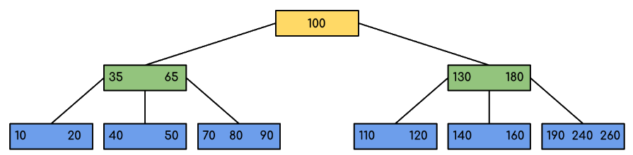

我们可以在上图中看到，所有的叶节点都在同一级别，所有的非叶节点都没有空子树，并且其关键字比其子节点的数量少一个。

### 8.4.3 B树的特征

**一棵m阶的B 树 (m叉树)的特性如下**

1. 根节点至少有两个孩子 。
2. 每个非根节点至少有「M/2（上取整）个孩子，至多有M个孩子。
3. 每个**叶子节点** 至少有 M/2-1（上取整）个关键字，至多有 M-1 个关键字。并以升序排列。（注：叶子节点是没有孩子）
4. key[i] 和 key[i+1] 之间的孩子节点的值介于 key[i] 和 key[i+1] 之间。
5. 所有的叶子节点都在同一层。

### 8.4.4 B树中的遍历

遍历也类似于二叉树的有序遍历。我们从最左边的子项开始，递归地打印最左边的个子项，然后对其余的子项和键重复相同的过程。最后，递归地打印最右边的子项。

### 8.4.5 B树中的搜索操作

搜索类似于二进制搜索树中的搜索。让要搜索的key为k。

- 从根开始，递归向下遍历。

- 对于每个访问的非叶节点，

- 如果节点有key，我们只需返回该节点。

- 否则，我们向下递归到节点的相应子节点（位于第一个较大键之前的子节点）。

- 如果我们到达一个叶节点，但在叶节点中找不到k，那么返回NULL。

搜索B-树类似于搜索二叉树。该算法与递归算法相似。在每个级别上，搜索都被优化，就好像键值不在父级的范围内，而键在另一个分支中一样。由于这些值限制了搜索，它们也被称为限制值或分离值。如果我们到达一个叶节点，但没有找到所需的键，那么它将显示NULL。


### 8.4.6 在B-树中搜索元素的算法


 

 

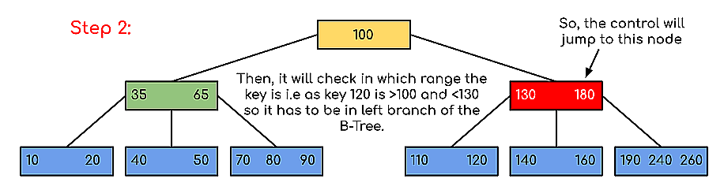


例如有M阶B树

B-tree，即B树，而不要读成B减树，它是一种多路搜索树（**并不是二叉的**）：

+ 定义任意非叶子结点最多只有M个儿子，M-1个关键字。且M>2
+ 根结点的儿子数为[2, M]
+ 每个非根结点存放至少$⌈\frac{M}{2}⌉-1$和至多M-1个关键字（至少2个关键字）
+ 非叶子结点的关键字：K[1], K[2], …, K[M-1]；且K[i] < K[i+1]
+ 非叶子结点的指针：P[1], P[2], …, P[M]；其中P[1]指向关键字小于K[1]的子树，P[M]指向关键字大于K[M-1]的子树，其它P[i]指向关键字属于(K[i-1], K[i])的子树
+ 一个非叶节点的子节点数等于其中的关键字数加上1
+ 节点的所有键都按递增顺序排序。两个键k1和k2之间的子键包含从k1到k2范围内的所有键。
+ B树从根开始生长和收缩，这与二进制搜索树不同。二进制搜索树向下生长，也从向下收缩。
+ 与其他平衡的二进制搜索树一样，搜索、插入和删除的时间复杂度为O（logn）。
+ B树中节点的插入仅发生在叶节点处。

#### B-树的搜索

从根结点开始，对结点内的关键字（有序）序列进行二分查找，如果命中则结束，否则进入查询关键字所属范围的儿子结点；重复，直到所对应的儿子指针为空，或已经是叶子结点；

#### B-树的特性

+ 关键字集合分布在整颗树中；
+ 任何一个关键字出现且只出现在一个结点中；
+ 搜索有可能在非叶子结点结束；
+ 其搜索性能等价于在关键字全集内做一次二分查找；
+ 自动层次控制；

　　由于限制了除根结点以外的非叶子结点，至少含有M/2个儿子，确保了结点的至少利用率，其最低搜索性能为：$O(log_2N)$

　　**所以B-树的性能总是等价于二分查找（与M值无关），也就没有B树平衡的问题**；

由于M/2的限制，在插入结点时，**如果结点已满，需要将结点分裂为两个各占M/2的结点；删除结点时，需将两个不足M/2的兄弟结点合并；**

## 8.5 跳表(skiplist)

跳表全称为跳跃列表，它允许快速查询，插入和删除一个有序连续元素的数据链表。跳跃列表的平均查找和插入时间复杂度都是O(logn)。快速查询是通过维护一个多层次的链表，且每一层链表中的元素是前一层链表元素的子集（见右边的示意图）。一开始时，算法在最稀疏的层次进行搜索，直至需要查找的元素在该层两个相邻的元素中间。这时，算法将跳转到下一个层次，重复刚才的搜索，直到找到需要查找的元素为止。


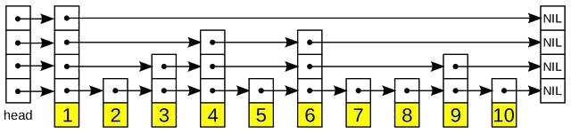

一张跳跃列表的示意图。每个带有箭头的框表示一个指针, 而每行是一个稀疏子序列的链表；底部的编号框（黄色）表示有序的数据序列。查找从顶部最稀疏的子序列向下进行, 直至需要查找的元素在该层两个相邻的元素中间。

### 8.5.1 跳表的演化过程

对于单链表来说，即使数据是已经排好序的，想要查询其中的一个数据，只能从头开始遍历链表，这样效率很低，时间复杂度很高，是 O(n)。 那我们有没有什么办法来提高查询的效率呢？我们可以为链表建立一个“索引”，这样查找起来就会更快，如下图所示，我们在原始链表的基础上，每两个结点提取一个结点建立索引，我们把抽取出来的结点叫作**索引层**或者**索引**，down 表示指向原始链表节点的指针。

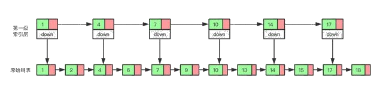

现在如果我们想查找一个数据，比如说 15，我们首先在索引层遍历，当我们遍历到索引层中值为 14 的结点时，我们发现下一个结点的值为 17，所以我们要找的 15 肯定在这两个结点之间。这时我们就通过 14 结点的 down 指针，回到原始链表，然后继续遍历，这个时候我们只需要再遍历两个结点，就能找到我们想要的数据。好我们从头看一下，整个过程我们一共遍历了 7 个结点就找到我们想要的值，如果没有建立索引层，而是用原始链表的话，我们需要遍历 10 个节点。

通过这个例子我们可以看出来，通过建立一个索引层，我们查找一个基点需要遍历的次数变少了，也就是查询的效率提高了。

那么如果我们给索引层再加一层索引呢？遍历的节点会不会更少呢，效率会不会更高呢？我们试试就知道了。


现在我们再来查找 15，我们从第二级索引开始，最后找到 15，一共遍历了 6 个节点，果然效率更高。

当然，因为我们举的这个例子数据量很小，所以效率提升的不是特别明显，如果数据量非常大的时候，我们多建立几层索引，效率提升的将会非常的明显，感兴趣的可以自己试一下，这里我们就不举例子了。

这种通过对链表加多级索引的结构，就是跳表了。

### 8.5.2 跳表具体有多快

通过上边的例子我们知道，跳表的查询效率比链表高，那具体高多少呢？下面我们一起来看一下。

衡量一个算法的效率我们可以用时间复杂度，这里我们也用时间复杂度来比较一下链表和跳表。前面我们已经讲过了，链表的查询的时间复杂度为 O(n)，那跳表的呢？

如果一个链表有 n 个结点，如果每两个结点抽取出一个结点建立索引的话，那么第一级索引的节点数大约就是 n/2，第二级索引的结点数大约为 n/4，以此类推第 m 级索引的节点数大约为 n/(2^m)。

假如一共有 m 级索引，第 m 级的节点数为两个，通过上边我们找到的规律，那么得出 n/(2^m)=2，从而求得 m=log(n)-1。如果加上原始链表，那么整个跳表的高度就是 log(n)。我们在查询跳表的时候，如果每一层都需要遍历 k 个结点，那么最终的时间复杂度就为 $O(klog_2n)$。

那这个 k 值为多少呢，按照我们每两个结点提取一个基点建立索引的情况，我们每一级最多需要遍历两个个结点，所以 k=2。为什么每一层最多遍历两个节点呢？

因为我们是每两个结点提取一个结点建立索引，最高一级索引只有两个结点，然后下一层索引比上一层索引两个结点之间增加了一个结点，也就是上一层索引两结点的中值，看到这里是不是想起来我们前边讲过的二分查找，每次我们只需要判断要找的值在不在当前结点和下一个节点之间即可。


如上图所示，我们要查询红色结点，我们查询的路线即黄线表示出的路径查询，每一级最多遍历两个节点即可。

所以跳表的查询任意数据的时间复杂度为 O(2*log(n))，前边的常数 2 可以忽略，为 O(log(n))。


### 8.5.3 跳表是用空间来换时间

跳表的效率比链表高了，但是跳表需要额外存储多级索引，所以需要的更多的内存空间。

跳表的空间复杂度分析并不难，如果一个链表有 n 个结点，如果每两个结点抽取出一个结点建立索引的话，那么第一级索引的节点数大约就是 n/2，第二级索引的结点数大约为 n/4，以此类推第 m 级索引的节点数大约为 n/(2^m)，我们可以看出来这是一个等比数列。

这几级索引的结点总和就是 n/2+n/4+n/8…+8+4+2=n-2，所以跳表的空间复杂度为 o(n)。

那么我们有没有办法减少索引所占的内存空间呢？可以的，我们可以每三个结点抽取一个索引，或者没五个结点抽取一个索引。这样索引节点的数量减少了，所占的空间也就少了。

### 8.5.4 跳表的插入和删除

我们想要为跳表插入或者删除数据，我们首先需要找到插入或者删除的位置，然后执行插入或删除操作，前边我们已经知道了，跳表的查询的时间复杂度为 O(logn），因为找到位置之后插入和删除的时间复杂度很低，为 O(1)，所以最终插入和删除的时间复杂度也为 O(longn)。

我么通过图看一下插入的过程。


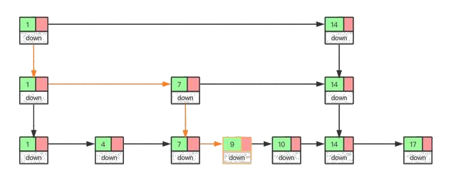

删除操作的话，如果这个结点在索引中也有出现，我们除了要删除原始链表中的结点，还要删除索引中的。因为单链表中的删除操作需要拿到要删除节点的前驱结点，然后通过指针操作完成删除。所以在查找要删除的结点的时候，一定要获取前驱结点。当然，如果我们用的是双向链表，就不需要考虑这个问题了。

如果我们不停的向跳表中插入元素，就可能会造成两个索引点之间的结点过多的情况。结点过多的话，我们建立索引的优势也就没有了。所以我们需要维护索引与原始链表的大小平衡，也就是节点增多了，索引也相应增加，避免出现两个索引之间结点过多的情况，查找效率降低。

跳表是通过一个随机函数来维护这个平衡的，当我们向跳表中插入数据的的时候，我们可以选择同时把这个数据插入到索引里，那我们插入到哪一级的索引呢，这就需要随机函数，来决定我们插入到哪一级的索引中。

这样可以很有效的防止跳表退化，而造成效率变低。

## 8.6 并查集(Union-Find Set)

### 8.6.1 什么是并查集

正如它的名字一样，并查集（Union-Find）就是用来对集合进行 合并（Union） 与 查询（Find） 操作的一种数据结构。

+ 合并 就是将两个不相交的集合合并成一个集合。
+ 查询 就是查询两个元素是否属于同一集合。

### 8.6.2 并查集的优越性

对于如下图所示的两个集合，如果我们要判断H和A是否在同一个集合中，我们需要遍历A所在的集合，并逐一判断当前节点是否是H节点，直到最后遍历完整个圆形集合，才能判断出H节点不在这个集合中。

同样的，如果我们需要合并两个集合，就需要遍历整个矩形的集合，将里面的节点一个一个加入到矩形集合中。两者都是 O (N) 的复杂度。

```mermaid
graph TB
	A((A))
	B((B))
	C((C))
	D((D))
	E((e))
	F[F]
	G[G]
	H[H]
	I[I]
	J[J]
	B---C
	D---A
	I---H
	G---F
	linkStyle 1 stroke:#0ff,stroke-width:0px
	linkStyle 2 stroke:#0ff,stroke-width:0px
	linkStyle 3 stroke:#0ff,stroke-width:0px
	linkStyle 0 stroke:#0ff,stroke-width:0px
```


同样的，如果我们需要合并两个集合，就需要遍历整个矩形的集合，将里面的节点一个一个加入到圆形集合中。两者都是O(N) 的复杂度。但倘若我们在生成集合的时候，就人为地将集合中的元素之间创建某种关联，使它们具有共同的头结点，那么查询和合并的操作将会省时很多。

就拿刚刚的两个集合举例，在创建集合的过程中，为节点之间创建「联系」，形成如下图的结构：


```mermaid
graph TB
	A((A))
	B((B))
	C((C))
	D((D))
	E((E))
	F[F]
	G[G]
	H[H]
	I[I]
	J[J]
  A-->E
  E-->B
  D-->B
  C-->D
  F-->H
  H-->J
  I-->J
  G-->J
```


可以发现，最终生成的这个结构其实就是一个树形结构

这也就意味着一个集合中的所有节点都可以找到同一个头结点。此时合并和查询操作将变得异常简单：

+ 查询：只需要判断两个元素是否具有相同的头结点。
+ 合并：只需要将一个集合的头结点挂到另一个集合的头结点下即可。

可以发现，上述两个操作的时间复杂度都与“获取头结点”这一过程，也就是树的高度有关。因此，假如生成的树只有有限高度的话，合并和查询的操作都是 O(1) 的时间复杂度。

但是话又说回来，假如生成的树的高度与集合元素个数相同，那合并和查询操作的时间复杂度就和遍历的方式差不多。

```mermaid
graph LR
	A((A))
	B((B))
	C((C))
	D((D))
	E((e))
	F[F]
	G[G]
	H[H]
	I[I]
	J[J]
  A-->E
  E-->B
  B-->D
  D-->C
  J-->G
  H-->F
  F-->J
  G-->I
```

在上图所示的最差情况下，合并和查询的时间复杂度都是 O (N)。

因此，如何减少树的高度直接决定着并查集的性能如何。那么如何尽量减少树的高度呢？

### 8.6.3 并查集的优化

#### 按秩合并

在最原始的状态下，每个点自己就是一个集合，它们的指针都指向自己。就像是一片草原上的几个原始部落，一开始他们之间毫无瓜葛，各自为政，自己就是自己的主人。

```mermaid
graph TB
	A((A))
	B((B))
	C((C))
	D((D))
	E((e))
	F[F]
	G[G]
	H[H]
	I[I]
	J[J]
  A-->A
  B-->B
  C-->C
  D-->D
  E-->E
  F-->F
  G-->G
  H-->H
  I-->I
  J-->J
```

但这片草原一共就这么大点，随着某几个部落逐渐繁荣兴盛，他们的地盘也愈发显得局促，因此他们开始互相征战，吞并其他的部落形成更大的部落。在战争中落败的一方就认另一方作为首领。

```mermaid
graph LR
	A((A))
	B((B))
	C((C))
	D((D))
	E((e))
	F[F]

  A-->A
  B-->D
  C-->A
  D-->A
  E-->E
  F-->E
```


经过几轮兼并，现在草原上只剩下两个规模比较大的部落，此时两个部落继续进行战争，圆形方凭借自身庞大的兵力轻松取胜，将矩形方纳入麾下，并形成如下的组织结构：

```mermaid
graph LR
	A((A))
	B((B))
	C((C))
	D((D))
	E[E]
	F[F]

  A-->A
  B-->D
  C-->A
  D-->A
  E-->E
  F-->E
  E-->A
```


组织上离最高首领最远的B、F两个部落如果想要向A传达信息，只需要经过自己的上司D或E一个节点就可以。但战争往往不总是尽如人意，矩形方偏偏就凭借战士们顽强的意志，拿下了这场战争的胜利，将圆形方吞并。此时就会形成如下的组织结构：

```mermaid
graph LR
	A((A))
	B((B))
	C((C))
	D((D))
	E[E]
	F[F]

  B-->D
  C-->A
  D-->A
  E-->E
  F-->E
  A-->E
```

这时就出现问题了，距离最高首领最远的B如果想要向E传达消息，就需要经过D、A两个上司，这样的效率显然不如之前一种组织结构。我们的并查集也是如此，当两棵深度不同的树进行合并时，往往将深度较小的树挂载到深度较大的树下，因为这样形成的树深度更小，在寻找头结点时也就有更高的效率。在执行合并操作时，将更小的树连接到更大的树上，这样的优化方式就称为「按秩合并」。

#### 路径压缩

随着部落日渐壮大，组织结构也越来越复杂，最底层的部落如果要向最高首领传递信息，需要经过好几个中间部落。此时我们的最高首领觉得自己的统治地位受到了威胁，因为中间经过的节点越多，自己对底层部落的控制力就越弱。所以他要想办法将底层部落的控制权全都收归自己所有。

```mermaid
graph LR
	A((A))
	B((B))
	C((C))
	D((D))
	E[E]
	F[F]

  A-->A
  B-->D
  C-->A
  D-->A
  E-->B
  F-->B
  G-->E
```


但首领并不知道自己麾下到底有多少部落，所以他颁布了一条法令：有任何部落要跟他汇报信息，都要带上他的上司一起来，他的上司也要带上他上司的上司。并且以后他们都直接向最高首领进行汇报，不用再经过其他节点。

此时上图中的部落G想要向A汇报信息，沿途会经过E、B、D，最后到达A

```mermaid
graph LR
	A((A))
	B((B))
	C((C))
	D((D))
	E[E]
	F[F]

  B-..->D
  C-->A
  D-..->A
  E-..->B
  F-->B
  G-..->E
```


按照规定，从今往后，G、E、B、D都直接向A汇报，无需再经过其他节点。

```mermaid
graph BT
	A((A))
	B((B))
	C((C))
	D((D))
	E[E]
	F[F]
  B-->A
  C-->A
  D-->A
  E-->A
  F-->B
  G-->A
```

此时，树的高度就减小了很多，效率也会大大提升。在执行查找的过程中，扁平化树的结构，这样的优化方式称为「路径压缩」。在并查集中同时使用上面的这两种优化方法，会将查找与合并的平均时间复杂度降低到常数水平（渐进最优算法）。

## 8.7 哈希表（散列表）（重点）

### 8.7.1 哈希表的构建

在初中的数学课本中学习过函数的相关知识，给定一个 x，通过一个数学公式，只需要将 x 的值带入公式就可以求出一个新的值 y。

哈希表的建立同函数类似，把函数中的 x 用查找记录时使用的关键字来代替，然后将关键字的值带入一个精心设计的公式中，就可以求出一个值，用这个值来表示记录存储的哈希地址。即：

数据的哈希地址=f(关键字的值)

> 哈希地址只是表示在查找表中的存储位置，而不是实际的物理存储位置。f(x）是一个函数，通过这个函数可以快速求出该关键字对应的的数据的哈希地址，称之为“哈希函数”。

散列技术是在记录的存储位置和它的关键字之间建立一个确定的对应关系f，使得每个关键字***\*key对应一个存储位置f（key）\****。查找时，根据这个确定的对应关系找到给***定值key的映射f（key），若查找集合中存在这个记录，则必定在f（key）的位置上。

这里我们把这种对应关系f称为***散列函数，又称为*哈希（Hash）函数。按这个思想，采用散列技术将记录存储在一块连续的存储空间中，这块连续存储空间称为散列表或哈希表（Hash table）。那么关键字对应的记录存储位置我们称为散列地址。

例如，这里有一个电话簿（查找表），电话簿中有 4 个人的联系方式：

| 姓名 | 张3         | 李四        | 王7         | 赵114514    |
| ---- | ----------- | ----------- | ----------- | ----------- |
| 电话 | 13912345678 | 15823457890 | 13409872338 | 13805834722 |

假如想查找李四的电话号码，对于一般的查找方式最先想到的是从头遍历，一一比较。而如果将电话簿构建成一张哈希表，可以直接通过名字“李四”直接找到电话号码在表中的位置。

在构建哈希表时，最重要的是哈希函数的设计。例如设计电话簿案例中的哈希函数为：每个名字的姓的首字母的 ASCII 值即为对应的电话号码的存储位置。这时会发现，张三和赵六两个关键字的姓的首字母都是 Z ，最终求出的电话号码的存储位置相同，这种现象称为冲突。在设计哈希函数时，要尽量地避免冲突现象的发生。

> 对于哈希表而言，冲突只能尽可能地少，无法完全避免。

### 8.7.2 哈希函数的构造

#### 构造要求

1. 计算简单

   你说设计一个算法可以保证所有的关键字都不会产生冲突，但是这个算法需要很复杂的计算，会耗费很多时间，这对于需要频繁地查找来说，就会大大降低查找的效率了。因此散列函数的计算时间不应该超过其他查找技术与关键字比较的时间。

2. 散列地址分布均匀

   我们刚才也提到冲突带来的问题，最好的办法就是尽量让散列地址均匀地分布在存储空间中，这样可以保证存储空间的有效利用，并减少为处理冲突而耗费的时间。

常用的哈希函数的构造方法有 6 种：直接定址法、数字分析法、平方取中法、折叠法、除留余数法和随机数法。

+ 直接定址法

其哈希函数为一次函数，即以下两种形式：

$H（key）= key $或者 $H（key）=a * key + b$

其中 H（key）表示关键字为 key 对应的哈希地址，a 和 b 都为常数。例如有一个从 1 岁到 100 岁的人口数字统计表，如表所示：

| 地址 | 01   | 02   | 03   | ...  | 25   | 26   | 27   | ...  |
| ---- | ---- | ---- | ---- | ---- | ---- | ---- | ---- | :--: |
| 年龄 | 1    | 2    | 3    | ...  | 25   | 26   | 27   | ...  |
| 人数 | 3000 | 2000 | 5000 | ...  | 1050 | 2050 | 3300 | ...  |

假设其哈希函数为第一种形式，其关键字的值表示最终的存储位置。若需要查找年龄为 25 岁的人口数量，将年龄 25 带入哈希函数中，直接求得其对应的哈希地址为 25（求得的哈希地址表示该记录的位置在查找表的第 25 位）。

数字分析法:如果关键字由多位字符或者数字组成，就可以考虑抽取其中的 2 位或者多位作为该关键字对应的哈希地址，在取法上尽量选择变化较多的位，避免冲突发生。

例如表中列举的是一部分关键字，每个关键字都是有 8 位十进制数组成：


通过分析关键字的构成，很明显可以看到关键字的第 1 位和第 2 位都是固定不变的，而第 3 位不是数字 3 就是 4，最后一位只可能取 2、7 和 5，只有中间的 4 位其取值近似随机，所以为了避免冲突，可以从 4 位中任意选取 2 位作为其哈希地址。

平方取中法是对关键字做平方操作，取中间得几位作为哈希地址。此方法也是比较常用的构造哈希函数的方法。

例如关键字序列为`{421，423，436}`，对各个关键字进行平方后的结果为`{177241，178929，190096}`，则可以取中间的两位`{72，89，00}`作为其哈希地址。

折叠法是将关键字分割成位数相同的几部分（最后一部分的位数可以不同），然后取这几部分的叠加和（舍去进位）作为哈希地址。此方法适合关键字位数较多的情况。

例如，在图书馆中图书都是以一个 10 位的十进制数字为关键字进行编号的，若对其查找表建立哈希表时，就可以使用折叠法。

若某书的编号为：0-442-20586-4，分割方式如图 1 中所示，在对其进行折叠时有两种方式：一种是移位折叠，另一种是间界折叠：

- 移位折叠是将分割后的每一小部分，按照其最低位进行对齐，然后相加，如图 （a）；
- 间界折叠是从一端向另一端沿分割线来回折叠，如图（b）。


+ 除留余数法

  此方法为最常用的构造散列函数方法。对于散列表长为m的散列函数公式为：f(key)=key mod p(p≤m)mod是取模（求余数）的意思。
  
  很显然，本方法的关键就在于选择合适的p，p如果选得不好，就可能会容易产生同义词。
  
  例如下表，我们对于有12个记录的关键字构造散列表时，就用了f(key)=key mod 12的方法。比如29 mod 12=5，所以它存储在下标为5的位置。
  
  | 下标   | 0    | 1    | 2    | 3    | 4    | 5    | 6    | 7    | 8    | 9    | 10   | 11   |
  | ------ | ---- | ---- | ---- | ---- | ---- | ---- | ---- | ---- | ---- | ---- | ---- | ---- |
  | 关键字 | 12   | 25   | 38   | 15   | 16   | 29   | 78   | 67   | 56   | 21   | 22   | 47   |
  
  不过这也是存在冲突的可能的，因为12=2×6=3×4。如果关键字中有像18(3×6)、30(5×6)、42(7×6)等数字，它们的余数都为6，这就和78所对应的下标位置冲突了。
  
  甚至极端一些，对于下表的关键字，如果我们让p为12的话，就可能出现下面的情况，所有的关键字都得到了0这个地址数。
  
  | 下标   | 0    | 0    | 0    | 0    | 0    | 0    | 0    | 0    | 0    | 0    | 0    | 0    |
  | ------ | ---- | ---- | ---- | ---- | ---- | ---- | ---- | ---- | ---- | ---- | ---- | ---- |
  | 关键字 | 12   | 24   | 36   | 48   | 60   | 72   | 84   | 96   | 108  | 120  | 132  | 144  |
  
   
  
  我们不选用p=12来做除留余数法，而选用p=11，如下表所示。
  
  此就只有12和144有冲突，相对来说，就要好很多。
  
  | 下标   | 1    | 2    | 3    | 4    | 5    | 6    | 7    | 8    | 9    | 10   | 0    | 1    |
  | ------ | ---- | ---- | ---- | ---- | ---- | ---- | ---- | ---- | ---- | ---- | ---- | ---- |
  | 关键字 | 12   | 24   | 36   | 48   | 60   | 72   | 84   | 96   | 108  | 120  | 132  | 144  |
  
  因此根据前辈们的经验，若散列表表长为m，通常p为小于或等于表长（最好接近m）的最小质数或不包含小于20质因子的合数。

> 在此方法中，对于 p 的取值非常重要，由经验得知 p 可以为不大于 m 的质数或者不包含小于 20 的质因数的合数。

+ 折叠法

  折叠法是将关键字从左到右分割成位数相等的几部分（注意最后一部分位数不够时可以短些），然后将这几部分叠加求和，并按散列表表长，取后几位作为散列地址。

  比如我们的关键字是9876543210，散列表表长为三位，我们将它分为四组，987|654|321|0，然后将它们叠加求和987+654+321+0=1962，再求后3位得到散列地址为962。

  有时可能这还不能够保证分布均匀，从一端向另一端来回折叠后对齐相加。比如我们将987和321反转，再与654和0相加，变成789+654+123+0=1566，此时散列地址为566。

  折叠法事先不需要知道关键字的分布，适合关键字位数较多的情况。


+ 随机数法

  选择一个随机数，取关键字的随机函数值为它的散列地址。也就是`f(key)=random(key)`。这里random是随机函数。当关键字的长度不等时，采用这个方法构造散列函数是比较合适的。

  有同学问，那如果关键字是字符串如何处理？其实无论是英文字符，还是中文字符，也包括各种各样的符号，它们都可以转化为某种数字来对待，比如ASCII码或者Unicode码等，因此也就可以使用上面的这些方法。

  总之，现实中，应该视不同的情况采用不同的散列函数。我们只能给出一些考虑的因素来提供参考： 1.计算散列地址所需的时间。 2.关键字的长度。 3.散列表的大小。 4.关键字的分布情况。 5.记录查找的频率。

  综合这些因素，才能决策选择哪种散列函数更合适。
  
+ 平方取中法

  这个方法计算很简单，假设关键字是1234，那么它的平方就是1522756，再抽取中间的3位就是227，用做散列地址。再比如关键字是4321，那么它的平方就是18671041，抽取中间的3位就可以是671，也可以是710，用做散列地址。平方取中法比较适合于不知道关键字的分布，而位数又不是很大的情况。

注意：这里的随机函数其实是伪随机函数，随机函数是即使每次给定的 key 相同，但是 H（key）都是不同；而伪随机函数正好相反，每个 key 都对应的是固定的 H（key）。

如此多的构建哈希函数的方法，在选择的时候，需要根据实际的查找表的情况采取适当的方法。通常考虑的因素有以下几方面：

- 关键字的长度。如果长度不等，就选用随机数法。如果关键字位数较多，就选用折叠法或者数字分析法；反之如果位数较短，可以考虑平方取中法；
- 哈希表的大小。如果大小已知，可以选用除留余数法；
- 关键字的分布情况；
- 查找表的查找频率；
- 计算哈希函数所需的时间（包括硬件指令的因素）

### 8.7.3 处理冲突的方法

对于哈希表的建立，需要选取合适的哈希函数，但是对于无法避免的冲突，需要采取适当的措施去处理。

通常用的处理冲突的方法有以下几种：

- 开放定址法 

  H（key）=（H（key）+ d）MOD m（其中 m 为哈希表的表长，d 为一个增量） 当得出的哈希地址产生冲突时，选取以下 3 种方法中的一种获取 d 的值，然后继续计算，直到计算出的哈希地址不在冲突为止，这 3 种方法为：
  
  - 线性探测法：d=1，2，3，…，m-1
  - 二次探测法：d=12，-12，22，-22，32，…
  - 伪随机数探测法：d=伪随机数

  例如，在长度为 11 的哈希表中已填写好 17、60 和 29 这 3 个数据（如图 2（a） 所示），其中采用的哈希函数为：H（key）=key MOD 11，现有第 4 个数据 38 ，当通过哈希函数求得的哈希地址为 5，与 60 冲突，则分别采用以上 3 种方式求得插入位置如图 9-21（b）所示：
  
|  |
| :----------------------------------------------------------: |
|                            图9-21                            |

  注释：在线性探测法中，当遇到冲突时，从发生冲突位置起，每次 +1，向右探测，直到有空闲的位置为止；二次探测法中，从发生冲突的位置起，按照 +12，-12，+22，…如此探测，直到有空闲的位置；伪随机探测，每次加上一个随机数，直到探测到空闲位置结束。


- 再散列函数法
  
  我们继续用买房子来举例，如果你看房时的选择标准总是以市中心、交通便利、价格适中为指标，这样的房子凤毛麟角，基本上当你看到时，都已经被人买去了。
  
  我们不妨换一种思维，选择市郊的房子，交通尽管要差一些，但价格便宜很多，也许房子还可以买得大一些、质量好一些，并且由于更换了选房的想法，很快就找到了你需要的房子了。
  
  对于我们的散列表来说，我们事先准备多个散列函数。
  
  $$
  f_i(key)=RH_i(key)(i=1,2,...,k)
  $$
  
  这里RHi就是不同的散列函数，你可以把我们前面说的什么除留余数、折叠、平方取中全部用上。每当发生散列地址冲突时，就换一个散列函数计算，相信总会有一个可以把冲突解决掉。这种方法能够使得关键字不产生聚集，当然，相应地也增加了计算的时间。
  
- 链地址法

  将具有相同哈希地址的元素（或记录）存储在同一个线性链表中。 链地址法是一种更加常用的哈希冲突解决方法。相比于开放地址法，链地址法更加简单。 假设哈希函数产生的哈希地址区间为 [0, m - 1]，哈希表的表长为 m。则可以将哈希表定义为一个有 m 个头节点组成的链表指针数组 T。

  这样在插入关键字的时候，只需要通过哈希函数 Hash(key) 计算出对应的哈希地址 i，然后将其以链表节点的形式插入到以 T[i] 为头节点的单链表中。在链表中插入位置可以在表头或表尾，也可以在中间。如果每次插入位置为表头，则插入操作的时间复杂度为 O(1)。

  而在在查询关键字的时候，只需要通过哈希函数 Hash(key) 计算出对应的哈希地址 i，然后将对应位置上的链表整个扫描一遍，比较链表中每个链节点的键值与查询的键值是否一致。查询操作的时间复杂度跟链表的长度 k 成正比，也就是 O(k)。对于哈希地址比较均匀的哈希函数来说，理论上讲，k= n//m，其中 n 为关键字的个数，m 为哈希表的表长。

  将所有产生冲突的关键字所对应的数据全部存储在同一个线性链表中。例如有一组关键字为`{19,14,23,01,68,20,84,27,55,11,10,79}`，其哈希函数为：$ H(key)=key MOD 13$，使用链地址法所构建的哈希表图所示： 

  
  
  

- 开放定址法

  开放定址法就是一旦发生了冲突，就去寻找下一个空的散列地址，只要散列表足够大，空的散列地址总能找到，并将记录存入。

  它的公式是：$f_i(key)=(f(key)+di)MOD m(di=1,2,3,......,m-1)$

  包括

  + 线性探测法：$F(i) = 1, 2, 3, …, m - 1$
  + 二次探测法：$F(i) = 1^2, -1^2, 2^2, -2^2, …, n^2(n ≤ m / 2)$
    伪随机数序列：F(i) = 伪随机数序列

  比如说，我们的关键字集合为{12,67,56,16,25,37,22,29,15,47,48,34}，表长为12。我们用散列函数f(key)=key mod 12。当计算前5个数{12,67,56,16,25}时，都是没有冲突的散列地址，直接存入，如下表所示：

  | 下标   | 0    | 1    | 2    | 3    | 4    | 5    | 6    | 7    | 8    | 9    | 10   | 11   |
  | ------ | ---- | ---- | ---- | ---- | ---- | ---- | ---- | ---- | ---- | ---- | ---- | ---- |
  | 关键字 | 12   | 25   |      |      | 16   |      |      | 67   | 56   |      |      |      |

  计算key=37时，发现f(37)=1，此时就与25所在的位置冲突。于是我们应用上面的公式f(37)=(f(37)+1)mod 12=2。于是将37存入下标为2的位置。这其实就是房子被人买了于是买下一间的作法，如下表所示。

  | 下标   | 0    | 1    | 2    | 3    | 4    | 5    | 6    | 7    | 8    | 9    | 10   | 11   |
  | ------ | ---- | ---- | ---- | ---- | ---- | ---- | ---- | ---- | ---- | ---- | ---- | ---- |
  | 关键字 | 12   | 25   | 37   |      | 16   |      |      | 67   | 56   |      | 22   |      |

  下来22,29,15,47都没有冲突，正常的存入，如下表所示。

  | 下标   | 0    | 1    | 2    | 3    | 4    | 5    | 6    | 7    | 8    | 9    | 10   | 11   |
  | ------ | ---- | ---- | ---- | ---- | ---- | ---- | ---- | ---- | ---- | ---- | ---- | ---- |
  | 关键字 | 12   | 25   | 37   | 15   | 16   | 29   |      | 67   | 56   |      | 22   | 47   |

  到了key=48，我们计算得到f(48)=0，与12所在的0位置冲突了，不要紧，我们f(48)=(f(48)+1)mod 12=1，此时又与25所在的位置冲突。于是f(48)=(f(48)+2)mod 12=2，还是冲突……一直到f(48)=(f(48)+6)mod 12=6时，才有空位，机不可失，赶快存入，如下表所示。

  | 下标   | 0    | 1    | 2    | 3    | 4    | 5    | 6    | 7    | 8    | 9    | 10   | 11   |
  | ------ | ---- | ---- | ---- | ---- | ---- | ---- | ---- | ---- | ---- | ---- | ---- | ---- |
  | 关键字 | 12   | 25   | 37   | 15   | 16   | 29   | 48   | 67   | 56   |      | 22   | 47   |

  我们把这种解决冲突的开放定址法称为线性探测法。

  从这个例子我们也看到，我们在解决冲突的时候，还会碰到如48和37这种本来都不是同义词却需要争夺一个地址的情况，我们称这种现象为堆积。很显然，堆积的出现，使得我们需要不断处理冲突，无论是存入还是查找效率都会大大降低。

  总之，开放定址法只要在散列表未填满时，总是能找到不发生冲突的地址，是我们常用的解决冲突的办法。

- 公共溢出区法

  这个方法其实就更加好理解，你不是冲突吗？好吧，凡是冲突的都跟我走，我给你们这些冲突找个地儿待着。这就如同孤儿院收留所有无家可归的孩子一样，我们为所有冲突的关键字建立了一个公共的溢出区来存放。

  就前面的例子而言，我们共有三个关键字{37,48,34}与之前的关键字位置有冲突，那么就将它们存储到溢出表中，如下图所示。

  | 基本表 | 12   | 25   | ^    | 15   | 16   | 29   | ^    | 67   | 57   | ^^   | 22   | 47   |
  | ------ | ---- | ---- | ---- | ---- | ---- | ---- | ---- | ---- | ---- | ---- | ---- | ---- |
  | 溢出表 | 37   | 48   | 34   | ^    | ^    | ^    | ^    | ^    | ^    | ^    | ^    | ^    |
  | 索引   | 0    | 1    | 2    | 3    | 4    | 5    | 6    | 7    | 8    | 9    | 10   | 11   |

  在查找时，对给定值通过散列函数计算出散列地址后，先与基本表的相应位置进行比对，如果相等，则查找成功；如果不相等，则到溢出表去进行顺序查找。如果相对于基本表而言，有冲突的数据很少的情况下，公共溢出区的结构对查找性能来说还是非常高的。
  

### 8.7.4 哈希表ASL计算方法

假设查找成功的

|关键字序列|（7、8、30、11、18、9、14）|
|:-:|:-:|
|散列函数| $H(Key) = (key * 3) MOD 7$|
|装载因子| 0.7|
|处理冲突|线性探测再散列法|

因为现在的数据是7个，填充因子是0.7。所以数组大小=7/0.7=10，即写出来的散列表大小为10，下标从0~9。 

1. 第一个元素7，带入散列函数，计算得0。 

2. 第二个元素8，带入散列函数，计算得3。 

3. 第三个元素30，带入散列函数，计算得6。 

4. 第四个元素11，带入散列函数，计算得5。 

5. 第五个元素18，带入散列函数，计算得5；此时和11冲突，使用线性探测法，得7。 

6. 第六个元素9，带入散列函数，计算得6；此时和30冲突，使用线性探测法，得8。 

7. 第七个元素14，带入散列函数，计算得0；此时和7冲突，使用线性探测法，得1。 

   所以**散列表**：

| 地址    | 0    | 1    | 2    | 3    | 4    | 5    | 6    | 7    | 8    | 9    |
| ------- | ---- | ---- | ---- | ---- | ---- | ---- | ---- | ---- | ---- | ---- |
| **key** | 7    | 14   |      | 8    |      | 11   | 30   | 18   | 9    |      |

所以查找成功的计算： 

1. 如果查找7，则需要查找1次。 

2. 如果查找8，则需要查找1次。 

3. 如果查找30，则需要查找1次。 

4. 如果查找11，则需要查找1次。 

5. 如果查找18，则需要查找3次：第一次查找地址5，第二次查找地址6，第三次查找地址7，查找成功。 

6. 如果查找9，则需要查找3次：第一次查找地址6，第二次查找地址7，第三次查找地址8，查找成功。 

7. 如果查找地址14，则需要查找2次：第一次查找地址0，第二次查找地址1，查找成功。 

   所以，**ASL=（1+2+1+1+1+3+3）/ 7=12/ 7**

------

**查找不成功的ASL计算方法：**

> 鉴于网络上有各种版本，本人认为此种计算方法比较合理。验证实例可以参考2010年的计算机408考研真题的第一道计算大题和答案。

1. 定义什么叫查找不成功
   举个例子来说吧。在已知上面散列表的基础上，如果要查找**key为4**的关键字。根据散列函数可以计算Hash(key)=Hash(4)=5。此时在地址为5的地方取出那个数字，发现key=11，不等于4。这就说明在装填的时候会发生冲突。根据冲突处理方法，会继续检测地址为6的值，发现key=30，依然不等。这个时候到了**地址为6**，但是**依然没有找到**。那么就说明根本就没有key=4这个关键字，**说明本次查找不成功。**注意：为什么到地址6？因为散列函数中有 mod7 ，对应的地址为0\~6，即0\~6查找失败的查找次数。 
   
   再举一个例子。查找**key为0**的关键字，根据散列函数可以计算Hash(key)=Hash(0)=0。此时在地址为0的地方取出那个数字，发现key=7，不等于0。这就说明在装填的时候会发生冲突。根据冲突处理方法，会继续检测地址为1的值，发现key=14，依然不等。这个时候到了**地址为3，发现为空**，**依然没有找到**。所以停止查找，**本次查找不成功。**因为如果key=0这个关键字存在的话，依照冲突处理函数，就一定能找到它。总不能丢了吧。

2. 根据第一点定义的不成功，依次推下去
   查找地址为0的值所需要的次数为3， 
   查找地址为1的值所需要的次数为2， 
   查找地址为2的值所需要的次数为1， 
   查找地址为3的值所需要的次数为2， 
   查找地址为4的值所需要的次数为1， 
   查找地址为5的值所需要的次数为5， 
   查找地址为6的值所需要的次数为4。 
   **3.计算** 
   查找不成功ASL=（3+2+1+2+1+5+4）/ 7=18/ 7

## 8.8 配对堆（了解）

配对**堆**是一种实现相对简单、实际分摊性能优良的堆。配对堆是堆有序的多路树结构，并且可以被认为是简化的斐波那契堆。[它们被认为是实现Prim 的 MST 算法]等算法的「稳健选择」 ，并支持以下操作（假设是最小堆）：

- *find-min*：简单地返回堆的顶部元素。
- *meld*：比较两个根元素，较小的仍然是结果的根，较大的元素及其子树作为该根的子树附加。
- *insert*：为插入的元素创建一个新堆，并*合并*到原始堆中。
- *decrease-key*（可选）：删除以要减少的键为根的子树，用较小的键替换该键，然后将结果*合并*回堆中。
- *delete-min*：删除根并重复*合并*其子树，直到剩下一棵树。采用各种合并策略。

配对堆的时间复杂度分析最初是受到[splay 树](https://en.wikipedia.org/wiki/Splay_tree)的启发。[[1\]](https://en.wikipedia.org/wiki/Pairing_heap#cite_note-FSST-1)*每个delete-min 的* 摊销时间为*O* (log *n* )，操作*find-min*、*meld*和*insert在O*(1)摊销时间内运行。

### 8.8.1 配对堆的操作

#### FIND-MIN

简单地返回该堆堆顶即可。

#### MERGE

首先合并空堆将返回另一个堆，否则我们返回新堆的根。假设我们要把Heap1和Heap2这两个堆合并起来。那么我们需要比较一下$root_{Heap1}$和$root_{Heap2}$的权值，不妨设$root_{Heap1}$的权值大于$root_{Heap2}$的权值。这样我们只需要把新的根节点设置为为$root_{Heap2}$让$root_{Heap1}$成为$root_{Heap2}$的子节点。

```mermaid
graph TB

subgraph Merged Heap
t9((9))
t8((8))
t61((6))
t3((3))
tt7((7))
tt6((6))
tt7---tt6
t9---t8
t9---t61
t61---t3
t9---tt7
end


subgraph Heap2
9((9))
8((8))
61((6))
r3((3))
9---8
9---61
61---r3
end


subgraph Heap1
7((7))
6((6))
7---6
end
```

#### INSERT

假设我们要向堆Heap中加入一个权值为Val的节点。
其实很简单，我们只要新建一个只含有这个节点的堆Heap1，然后把它和Heap合并起来就可以了，即使用**MERGE**操作。

```mermaid
graph TB


subgraph Merged Heap
dt9((9))
dt8((8))
dt61((6))
dt3((3))
dtt7((7))
dtt6((6))
u2((2))
dtt7---dtt6
dt9---dt8
dt9---dt61
dt61---dt3
dt9---dtt7
dt9---u2
end

subgraph Heap2
2((2))
end

subgraph Heap1
t9((9))
t8((8))
t61((6))
t3((3))
tt7((7))
tt6((6))
tt7---tt6
t9---t8
t9---t61
t61---t3
t9---tt7
end


```

#### DECREASE-KEY
这是一个堆中非常常用的操作，尤其对于Dijkstra最短路算法极为有用，这样我们可以避免重复加入一个节点带来的内存和时间开销，而直接更改对应节点具有的距离键值。假设我们要把堆中节点u的权值减少Δ，注意，Δ≥0。首先，若u是当前堆的堆顶，我们直接修改权值即可，堆不会有其他任何变化。否则，我们将以u为根的堆（设为$Heap_u$）从原堆中提出，更改它的权值，并用MERGE操作把它和原来的堆合并。当然这里有一个注意点就是，我们把$Heap_u$提出时，并不直接从其父节点$Fa_u$的$Son$集合中删除节点u，而是仅将$Fa_u$设为NULL，表示它是当前堆的根节点。至于对Fau的影响，我们暂不考虑，等到后面的操作再去涉及，以达到均衡复杂度的目的。

#### DELETE-MIN

这是整个配对堆中最为重要也最为奇妙的操作。

删除根节点root后，我们可以直接把所有儿子一个一个合并，但是很明显，这样的复杂度是O(n)的，非常暴力。我们当然有更好的方法。标准方法是：首先将子堆从左到右、一对一对地合并（这就是它叫这个名字的原因），然后再从右到左合并该堆。这样子复杂度就是$O(log_2n)$的。当然，由于前面的DECREASE-KEY操作，root可能存在一些「假」的子节点，由于我们需要知道这些子节点并将它们合并，那我们只需要在扫描时判断一下Fason是否为root即可。

### 8.8.2 复杂度分析

- find-min : $O(1)$
- merge : $O(1)$
- insert : $O(1)$
- delete-min : $O(logn)$

## 8.9 拓展知识点

### 8.9.1 2-3树

2-3树每一个节点都具有2个孩子（也称为2结点）或3个孩子（也称为3结点）。

一个2结点包含一个元素和两个孩子（或没有孩子），与二叉排序树类似，左子树包含元素小于该元素，右子树包含元素大于该元素。2结点要么有2个孩子，要么没有孩子。

一个3结点包含一大一小两个元素和三个孩子（或没有孩子），一个3结点要么有3个孩子，要么没孩子。如果3结点右孩子，左子树包含小于较小元素的元素，右子树包含大于较大元素的元素，中间子树包含介于两元素之间的元素。
2-3树的所有叶子结点都在同一层次。

问：2-3-4树

2-3-4树是2-3树的扩展概念，包括了一个4结点，4结点包含小中大三个元素和4个孩子（或没有孩子），4结点有孩子的话，左子树小于最小的元素，第二子树大于最小元素小于中间元素，第三子树大于中间元素小于最大元素，右子树大于最大元素。


### 8.9.2 B+树
在B树结构中，如果要遍历B树，假设每个结点属于硬盘的不同页面，往返于每个结点之间意味着在硬盘的不同页面之间进行多次访问。

问：当中序遍历所有结点时，需要从页面2->页面1->页面3->页面1->页面4->页面5
这样来回在硬盘的不停页面之间检索，时间性能低。
为了解决元素的遍历问题，在原有的B树结构基础上，加上新的元素组织形式，形成B+树。

B+树应文件系统所需而出的一种B树变形树。在B树中，每一个元素在该树中只会出现一次，可能在叶子结点，也可能在分支节点。在B+树中，出现在分支节点中的元素会被当作在该分支结点位置的中序后继者（叶子结点）中再次列出。每一个叶子结点都会保存一个指向后一叶子结点的指针。

问：一棵m阶的B+树和m阶的B树的差异在于：

有n棵子树的结点中包含有n个关键字（包含双亲的一个关键字）

叶子结点包含所有的关键字信息，以及指向包含关键字记录的指针，叶子结点本身根据关键字的大小从小到大进行顺序链接

所有的分支节点是索引，结点中仅包含其子树中的最大（或最小）关键字 ，不会存关键字记录的指针，所有的数据地址必须到叶子节点才能获取到，因此每次数据查询次数一样

 


# 第9章 排序

## 9.1 什么是排序
「排序」通常是指将集合中无序的元素变为有序的过程。例如: [8,3,4,5,2]是无序的, [2, 3, 4，5，8]则变成了从小到大一次有序的。
## 9.2 排序算法
排序算法就是解决上述问题的步骤。   排序就是把集合中的元素按照一定的次序排序在一起。一般来说有升序排列和降序排列2种排序，在算法中有8中基本排序：


|稳定排序|不稳定排序|
|:-:|:-:|
|冒泡排序|选择排序|
| 插入排序|希尔排序|
| 归并排序|快速排序|
|基数排序|计数排序|
|堆排序||
|桶排序||


## 9.3 评价标准
稳定性是一个 特别重要的评估标准。稳定的算法在排序的过程中不会改变元素彼此的位置的相对次序，反之不稳定的排序算法经常会改变这个次序，这是我们不愿意看到的。我们在使用排序算法或者选择排序算法时，更希望这个次序不会改变，更加稳定，所以排序算法的稳定性，是一个特别重要的参数衡量指标依据。就如同空间复杂度和时间复杂度一样，有时候甚至比时间复杂度、空间复杂度更重要一些。所以往往评价一个排序算法的好坏往往可以从下边几个方面入手：
1. 时间复杂度：即从序列的初始状态到经过排序算法的变换移位等操作变到最终排序好的结果状态的过程所花费的时间度量。
2. 空间复杂度：就是从序列的初始状态经过排序移位变换的过程一直到最终的状态所花费的空间开销。
3. 使用场景：排序算法有很多，不同种类的排序算法适合不同种类的情景，可能有时候需要节省空间对时间要求没那么多，反之，有时候则是希望多考虑一些时间，对空间要求没那么高，总之一般都会必须从某一方面做出抉择。
4. 稳定性：稳定性是不管考虑时间和空间必须要考虑的问题，往往也是没什么用的因素。

## 9.4 排序的策略

组织各种排序算法的一种方法是对基本思想进行分类，或者「战略」。 一些关键策略是：

+ 交换排序: 如果发现两件物品顺序不对，就交换它们。 重复直到所有项目都井然有序。

  基于交换的排序有：冒泡排序和快速排序

+ 选择排序: 找到最小的项目，放在第一个位置，找到最小的剩下的物品，放在第二个位置。

  基于选择的排序有简单选择排序和堆排序

+ 插入排序: 一次取出一个项目并将它们插入到初始空数据结构使得数据结构继续是在每个阶段排序。
  
  基于插入的排序有：直接插入排序，折半插入排序，希尔排序。

## 9.5 冒泡排序(bubble sort)

### 9.5.1 什么是冒泡排序

冒泡排序算法是把较小的元素往前调或者把较大的元素往后调。这种方法主要是通过对相邻两个元素进行大小的比较，根据比较结果和算法规则对该二元素的位置进行交换，这样逐个依次进行比较和交换，就能达到排序目的。冒泡排序的基本思想是，首先将第1个和第2个记录的关键字比较大小，如果是逆序的，就将这两个记录进行交换，再对第2个和第3个记录的关键字进行比较，依次类推，重复进行上述计算，直至完成第(n一1)个和第n个记录的关键字之间的比较，此后，再按照上述过程进行第2次、第3次排序，直至整个序列有序为止。排序过程中要特别注意的是，当相邻两个元素大小一致时，这一步操作就不需要交换位置，因此也说明冒泡排序是一种严格的稳定排序算法，它不改变序列中相同元素之间的相对位置关系。

冒泡排序遵循交换排序方法。 它很容易实现，但往往跑起来特别慢。 假设我们有一个大小为 n 的数组 a，我们希望对其进行排序。 气泡排序从比较 a[n-1] 和 a[n-2] 开始，如果顺序错误则交换它们。然后它比较 a[n-2] 和 a[n-3] 并在需要时交换它们，依此类推。 这意味着一旦到达 a[0]，最小的条目将位于正确的位置。 然后从再次返回，比较成对的“邻居”，但单独留下第零个条目（这是已知是正确的）。再次到达前面后，第二小的条目将到位。 它不断地“遍历”数组，直到它被排序。 更一般地，在第 i 个冒泡排序阶段“从后面”比较相邻条目，并根据需要交换它们。与它的右邻居相比，具有最低索引的项目是 a[i-1]。 之后在第 i 个阶段，条目 a[0],...,a[i-1] 处于它们的最终位置。

例如，对无序表{49，38，65，97，76，13，27，49}进行升序排序的具体实现过程如图 1 所示：

||
|:--:|
|图10-1 第一次起泡|

如图 10-1 所示是对无序表的第一次起泡排序，最终将无序表中的最大值 97 找到并存储在表的最后一个位置。具体实现过程为：
首先 49 和 38 比较，由于 38<49，所以两者交换位置，即从（1）到（2）的转变；

然后继续下标为 1 的同下标为 2 的进行比较，由于 49<65，所以不移动位置，（3）中 65 同 97 比较得知，两者也不需要移动位置；
直至（4），97 同 76 进行比较，76<97，两者交换位置，如（5）所示；

同样 97>13（5）、97>27（6）、97>49（7) ，所以经过一次冒泡排序，最终在无序表中找到一个最大值 97，第一次冒泡结束；


||
|:--:|
|图10-2 第二次起泡|
由于 97 已经判断为最大值，所以第二次冒泡排序时就需要找出除 97 之外的无序表中的最大值，比较过程和第一次完全相同。

经过第二次冒泡，最终找到了除 97 之外的又一个最大值 76，比较过程完全一样，这里不再描述。

### 9.5.2 冒泡排序的实现

```c
#include <stdio.h>
#include <stdlib.h>
int main() {
    int a[]= {12,4,132,55,46,232,789,1,0,98,523,666};//随机数组
    int n = sizeof(a)/sizeof(a[0]);//获取数组大小
    int i,j,k;
//比较相邻的两个数据，如果第二个数小，就交换位置。从后向前两两比较，一直到比较最前两个数据。
        for(i = 1; i < n; i ++) {
            for(j = 0; j < n-1; j ++) {
                if(a[j] > a[j+1]) {//从小到大排序
                    k = a[j];
                    a[j] = a[j+1];
                    a[j+1] = k;
                }
            }
        }  
    for(i = 0; i < n; i ++)//输出排序后的结果
        printf("%d ",a[i]);
    return 0;
}
//运行结果如下：
//0 1 4 12 46 55 98 132 232 523 666 789
```

### 9.5.3 算法分析

+ 空间复杂度：因为冒泡排序并未借助其他多余的空间，只是在原地进行排序，所以时间复杂度为$O(1)$
+ 时间复杂度：每进行的一轮的冒泡每个元素都需要与相邻的元素进行比较，而这个过程要经历n轮，所以不难看出冒泡排序的时间复杂度为$O(n^2)$。
+ 稳定性：冒泡排序在元素交换的过程中，相等的两个元素的值的相对位置不会发生变化，所以冒泡排序是一种稳定的排序算法。
  

## 9.6 插入排序(insertion sorting)

### 9.6.1 什么是插入排序

插入排序算法是基于某序列已经有序排列的情况下，通过一次插入一个元素的方式按照原有排序方式增加元素。这种比较是从该有序序列的最末端开始执行，即要插入序列中的元素最先和有序序列中最大的元素比较，若其大于该最大元素，则可直接插入最大元素的后面即可，否则再向前一位比较查找直至找到应该插入的位置为止。插入排序的基本思想是，每次将1个待排序的记录按其关键字大小插入到前面已经排好序的子序列中，寻找最适当的位置，直至全部记录插入完毕。执行过程中，若遇到和插入元素相等的位置，则将要插人的元素放在该相等元素的后面，因此插入该元素后并未改变原序列的前后顺序。我们认为插入排序也是一种稳定的排序方法。插入排序分直接插入排序、折半插入排序和希尔排序3类。

例如采用直接插入排序算法将无序表{3,1,7,5,2,4,9,6}进行升序排序的过程为：
首先考虑记录 3 ，由于插入排序刚开始，有序表中没有任何记录，所以 3 可以直接添加到有序表中，则有序表和无序表可以如图 10- 所示:

|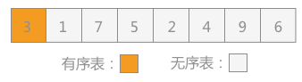| 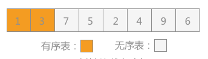|
|:--:| :--:|
| 图10-3 |图10-4|
|向有序表中插入记录 1 时，同有序表中记录 3 进行比较，1<3，所以插入到记录 3 的左侧，如图 10-4所示：|向有序表插入记录 7 时，同有序表中记录 3 进行比较，3<7，所以插入到记录 3 的右侧，如图 10-5 所示：|

|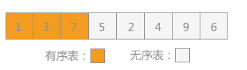| |
|:--:| :--:|
| 图10-5 |图10-6|

向有序表中插入记录 5 时，同有序表中记录 7 进行比较，5<7，同时 5>3，所以插入到 3 和 7 中间，如图 10-6 所示：

|| |
|:--:| :--:|
|图10-7|图10-8|

向有序表插入记录 2 时，同有序表中记录 7进行比较，2<7，再同 5，3，1分别进行比较，最终确定 2 位于 1 和 3 中间，如图 10-7 所示。

照此规律，依次将无序表中的记录 4，9 和 6插入到有序表中，如图 10-8 所示。

### 9.6.2 复杂度分析

插入排序的平均时间复杂度也是 $O(n^2)$，空间复杂度为常数阶 $O(1)$，具体时间复杂度和数组的有序性也是有关联的。

插入排序中，当待排序数组是有序时，是最优的情况，只需当前数跟前一个数比较一下就可以了，这时一共需要比较 **N-1** 次，时间复杂度为 **O(N)**。最坏的情况是待排序数组是逆序的，此时需要比较次数最多，最坏的情况是 $O(n^2)$。

### 9.6.3 插入排序代码实现

```c
#include<stdio.h>
#include<stdlib.h>
int main() {
    int a[]= {12,4,132,55,46,232,789,1,0,98,523,666};//随机数组
    int n = sizeof(a)/sizeof(a[0]);//获取数组大小
    int i,j,k;
 //在要排序的一组数中，假定前n-1个数已经排好序，现将第n个数插到前面的有序数列中，
 //使得这n个数也是排好顺序的。如此反复循环，直到全部排好顺序。
    for(i = 0; i < n-1; i ++) {
        for(j = i+1; j > 0; j --)
            if(a[j] < a[j-1]) {
                k = a[j-1];
                a[j-1] = a[j];
                a[j] = k;
            } else
                break;
    }
    for(i = 0; i < n; i ++)//输出排序后的结果
        printf("%d ",a[i]);
    return 0;
}
//运行结果如下：
//0 1 4 12 46 55 98 132 232 523 666 789
```

## 9.7 选择排序(selection sort)

选择排序算法的基本思路是为每一个位置选择当前最小的元素。选择排序的基本思想是，基于直接选择排序和堆排序这两种基本的简单排序方法。首先从第1个位置开始对全部元素进行选择，选出全部元素中最小的给该位置，再对第2个位置进行选择，在剩余元素中选择最小的给该位置即可；以此类推，重复进行“最小元素”的选择，直至完成第(n-1)个位置的元素选择，则第n个位置就只剩唯一的最大元素，此时不需再进行选择。使用这种排序时，要注意其中一个不同于冒泡法的细节。举例说明：序列58539．我们知道第一遍选择第1个元素“5”会和元素“3”交换，那么原序列中的两个相同元素“5”之间的前后相对顺序就发生了改变。因此，我们说选择排序不是稳定的排序算法，它在计算过程中会破坏稳定性。 

例如对无序表{56，12，80，91，20}采用简单选择排序算法进行排序，具体过程为：
第一次遍历时，从下标为 1 的位置即 56 开始，找出关键字值最小的记录 12，同下标为 0 的关键字 56 交换位置：

|| 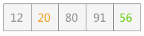|
|:--:| :--:|
|图10-|图2|

第二次遍历时，从下标为 2 的位置即 56 开始，找出最小值 20，同下标为 2 的关键字 56 互换位置：

|| 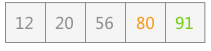|
|:--:| :--:|
|图3|图4|

第三次遍历时，从下标为 3 的位置即 80 开始，找出最小值 56，同下标为 3 的关键字 80 互换位置：

第四次遍历时，从下标为 4 的位置即 91 开始，找出最小是 80，同下标为 4 的关键字 91 互换位置：

到此简单选择排序算法完成，无序表变为有序表。

### 9.7.1 复杂度

选择排序的时间复杂度是$O(n^2)$, 额外空间复杂度为$O(1)$。

### 9.7.2 选择排序代码实现

```c
#include <stdio.h>
#include <stdlib.h>
int main() {
    int a[]= {12,4,132,55,46,232,789,1,0,98,523,666};//随机数组
    int n = sizeof(a)/sizeof(a[0]);//获取数组大小
    int i,j,k;
        //第一次遍历n-1个数，找到最小的数值与第一个元素交换
        //第二次遍历n-2个数，找到最小的数值与第二个元素交换
        // 以此类推
        //第n-1次遍历，找到最小的数值与第n-1个元素交换，排序完成。
    for(i = 0; i < n-1; i ++) {
        for(j = i+1; j < n; j ++) {
             if(a[i] > a[j]) {//从小到大排序
                    k = a[i];
                    a[i] = a[j];
                    a[j] = k;
             }
         }
    }
    for(i = 0; i < n; i ++)//输出排序后的结果
        printf("%d ",a[i]);
    return 0;
}
//运行结果如下：
//0 1 4 12 46 55 98 132 232 523 666 789
```
## 9.8 快速排序(Fast Sort)

### 9.8.1 基础快速排序

快速排序的基本思想是:通过一趟排序算法把所需要排序的序列的元素分割成两大块，其中，一部分的元素都要小于或等于另外一部分的序列元素，然后仍根据该种方法对划分后的这两块序列的元素分别再次实行快速排序算法，排序实现的整个过程可以是递归的来进行调用，最终能够实现将所需排序的无序序列元素变为一个有序的序列。 

快速排序是C.R.A.Hoare于1962年提出的一种划分交换排序。它采用了一种分治的策略，通常称其为分治法(Divide-and-ConquerMethod)。

该方法的基本思想是：

- 先从数列中取出一个数作为基准数。

- 分区过程，将比这个数大的数全放到它的右边，小于或等于它的数全放到它的左边。

- 再对左右区间重复第二步，直到各区间只有一个数。  


虽然快速排序称为分治法，但分治法这三个字显然无法很好的概括快速排序的全部步骤。因此我的对快速排序作了进一步的说明：挖坑填数+分治法：

先来看实例。

以一个数组作为示例，取区间第一个数为基准数。

| 0    | 1    | 2    | 3    | 4    | 5    | 6    | 7    | 8    | 9    |
| ---- | ---- | ---- | ---- | ---- | ---- | ---- | ---- | ---- | ---- |
| 72   | 6    | 57   | 88   | 60   | 42   | 83   | 73   | 48   | 85   |

初始时，i = 0; j = 9;  X = a[i] = 72

由于已经将 a[0] 中的数保存到 X 中，可以理解成在数组 a[0] 上挖了个坑，可以将其它数据填充到这来。

从j开始向前找一个比X小或等于X的数。当j=8，符合条件，将a[8]挖出再填到上一个坑a[0]中。a[0]=a[8]; i++; 这样一个坑a[0]就被搞定了，但又形成了一个新坑a[8]，这怎么办了？简单，再找数字来填a[8]这个坑。这次从i开始向后找一个大于X的数，当i=3，符合条件，将a[3]挖出再填到上一个坑中a[8]=a[3]; j--;

| 0    | 1    | 2    | 3    | 4    | 5    | 6    | 7    | 8    | 9    |
| ---- | ---- | ---- | ---- | ---- | ---- | ---- | ---- | ---- | ---- |
| 48   | 6    | 57   | 88   | 60   | 42   | 83   | 73   | 88   | 85   |

i = 3;  j = 7;  X=72

再重复上面的步骤，先从后向前找，再从前向后找。

从j开始向前找，当j=5，符合条件，将a[5]挖出填到上一个坑中，a[3] = a[5]; i++;

从i开始向后找，当i=5时，由于i==j退出。

此时，i = j = 5，而a[5]刚好又是上次挖的坑，因此将X填入a[5]。

数组变为：

| 0    | 1    | 2    | 3    | 4    | 5    | 6    | 7    | 8    | 9    |
| ---- | ---- | ---- | ---- | ---- | ---- | ---- | ---- | ---- | ---- |
| 48   | 6    | 57   | 42   | 60   | 72   | 83   | 73   | 88   | 85   |

可以看出a[5]前面的数字都小于它，a[5]后面的数字都大于它。因此再对a[0…4]和a[6…9]这二个子区间重复上述步骤就可以了。  

对挖坑填数进行总结:
1．i =L; j = R; 将基准数挖出形成第一个坑a[i]。
2．j--由后向前找比它小的数，找到后挖出此数填前一个坑a[i]中。
3．i++由前向后找比它大的数，找到后也挖出此数填到前一个坑a[j]中。
4．再重复执行2，3二步，直到i==j，将基准数填入a[i]中。

#### 快速排序代码实现

```c
#include <stdio.h>
#include <stdlib.h>
int arr[]= {12,4,132,55,46,232,789,1,0,98,523,666};//随机数组
int n = sizeof(arr)/sizeof(arr[0]);//获取数组大小
void adjustHeap(int i, int lef) {
    int temp=arr[i];
    for(int k=i*2+1; k<lef; k=k*2+1) { //从i结点的左子结点开始，也就是2i+1处开始
        if(k+1<lef&&arr[k]<arr[k+1]) {
            k++;
        }
        if(arr[k]>temp) { //如果子节点大于父节点，将子节点值赋给父节点（不用进行交换）
            arr[i]=arr[k];
            i=k;
        } else {
            break;
        }
    }
    arr[i]=temp;//将temp值放到最终的位置
}
void swap(int a, int b) {
    int temp=arr[a];
    arr[a] = arr[b];
    arr[b] = temp;
}
void heapsort() {
    // 1、构建大顶堆
    for(int i = n/2-1; i>=0; i--) {
        //从第一个非叶子节点从下至上，从右至左调整结构
        adjustHeap(i,n);
    }
    //2、调整堆结构+交换堆顶元素与末尾元素
    for(int j=n-1; j>0; j--) {
        swap(0,j);//将堆顶元素与末尾元素进行交换
        adjustHeap(0, j);//重新对堆进行调整
    }
}
int main() {
    int i;
    heapsort();
    for(i = 0; i < n; i ++)
        printf("%d ",arr[i]);
    return 0;
}
//运行结果如下：
//0 1 4 12 46 55 98 132 232 523 666 789

```
### 9.8.2 随机化快速排序

#### 概念及其介绍

**随机化快速排序基本思想：**通过一趟排序将要排序的数据分割成独立的两部分，其中一部分的所有数据都比另外一部分的所有数据都要小，然后再按此方法对这两部分数据分别进行快速排序，整个排序过程可以递归进行，以此达到整个数据变成有序序列。

#### 适用说明

快速排序是一种比较快速的排序算法，它的平均运行时间是 **O(nlogn)**，之所以特别快是由于非常精练和高度优化的内部循环，最坏的情形性能为 **O(n^2)**。像归并一样，快速排序也是一种分治的递归算法。从空间性能上看，快速排序只需要一个元素的辅助空间，但快速排序需要一个栈空间来实现递归，空间复杂度也为**O(logn)。**

#### 过程图

在一个数组中选择一个基点，比如第一个位置的 4，然后把4挪到正确位置，使得之前的子数组中数据小于 4，之后的子数组中数据大于 4，然后逐渐递归下去完成整个排序。


如何和把选定的基点数据挪到正确位置上，这是快速排序的核心，我们称为 Partition。

过程如下所示，其中 **i** 为当前遍历比较的元素位置：


### 9.8.3 双路快速排序

#### 概念及其介绍

双路快速排序算法是随机化快速排序的改进版本，partition 过程使用两个索引值（i、j）用来遍历数组，将 **<v** 的元素放在索引i所指向位置的左边，而将 **>v** 的元素放在索引j所指向位置的右边，**v** 代表标定值。

#### 适用说明

时间和空间复杂度同随机化快速排序。 对于有大量重复元素的数组，如果使用上一节随机化快速排序效率是非常低的，导致 partition 后大于基点或者小于基点数据的子数组长度会极度不平衡，甚至会退化成 **O(n\*2)** 时间复杂度的算法，对这种情况可以使用双路快速排序算法。

#### 过程图示

使用两个索引值（i、j）用来遍历我们的序列，将 **<=v** 的元素放在索引 i 所指向位置的左边，而将 **>=v** 的元素放在索引 j 所指向位置的右边，平衡左右两边子数组。

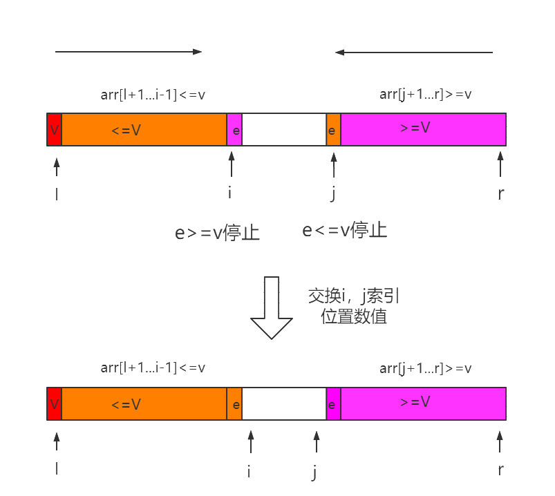

## 9.9 归并排序(merge sort)

归并排序算法就是把序列递归划分成为一个个短序列，以其中只有1个元素的直接序列或者只有2个元素的序列作为短序列的递归出口，再将全部有序的短序列按照一定的规则进行排序为长序列。归并排序融合了分治策略，即将含有n个记录的初始序列中的每个记录均视为长度为1的子序列，再将这n个子序列两两合并得到n/2个长度为2(当凡为奇数时会出现长度为l的情况)的有序子序列；将上述步骤重复操作，直至得到1个长度为n的有序长序列。需要注意的是，在进行元素比较和交换时，若两个元素大小相等则不必刻意交换位置，因此该算法不会破坏序列的稳定性，即归并排序也是稳定的排序算法。 

### 9.9.1 概念及其介绍

归并排序（Merge sort）是建立在归并操作上的一种有效、稳定的排序算法，该算法是采用分治法(Divide and Conquer）的一个非常典型的应用。将已有序的子序列合并，得到完全有序的序列；即先使每个子序列有序，再使子序列段间有序。若将两个有序表合并成一个有序表，称为二路归并。

### 9.9.2 适用说明

当有 n 个记录时，需进行 logn 轮归并排序，每一轮归并，其比较次数不超过 n，元素移动次数都是 n，因此，归并排序的时间复杂度为 O(nlogn)。归并排序时需要和待排序记录个数相等的存储空间，所以空间复杂度为 O(n)。

归并排序适用于数据量大，并且对稳定性有要求的场景。

### 9.9.3 过程图示

归并排序是递归算法的一个实例，这个算法中基本的操作是合并两个已排序的数组，取两个输入数组 A 和 B，一个输出数组 C，以及三个计数器 i、j、k，它们初始位置置于对应数组的开始端。

A[i] 和 B[j] 中较小者拷贝到 C 中的下一个位置，相关计数器向前推进一步。

当两个输入数组有一个用完时候，则将另外一个数组中剩余部分拷贝到 C 中。


自顶向下的归并排序，递归分组图示：

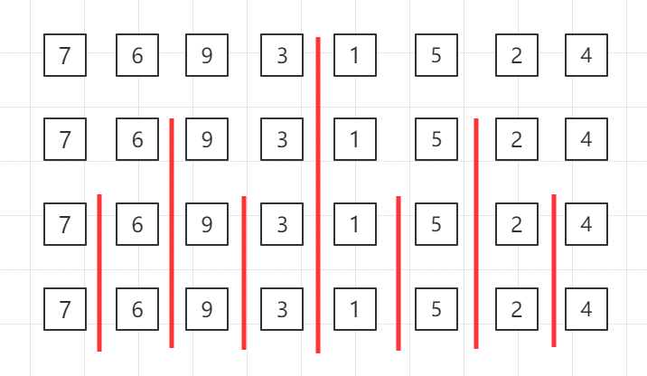

对第三行两个一组的数据进行归并排序


对第二行四个一组的数据进行归并排序

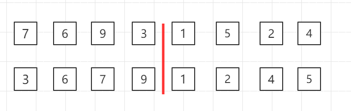

整体进行归并排序

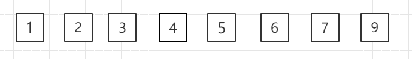

## 9.10 堆排序(heap sort)

对于堆的定义也可以使用完全二叉树来解释，因为在完全二叉树中第 i 个结点的左孩子恰好是第 2i 个结点，右孩子恰好是 2i+1 个结点。如果该序列可以被称为堆，则使用该序列构建的完全二叉树中，每个根结点的值都必须不小于（或者不大于）左右孩子结点的值。

### 9.10.1 复杂度

时间复杂度:$O(alog_2n)$，额外空间复杂度$O(1)$

### 9.10.2 操作步骤

以无序表`{49，38，65，97，76，13，27，49}`来讲，其对应的堆用完全二叉树来表示为：


> 提示：堆用完全二叉树表示时，其表示方法不唯一，但是可以确定的是树的根结点要么是无序表中的最小值，要么是最大值。

通过将无序表转化为堆，可以直接找到表中最大值或者最小值，然后将其提取出来，令剩余的记录再重建一个堆，取出次大值或者次小值，如此反复执行就可以得到一个有序序列，此过程为堆排序。

堆排序过程的代码实现需要解决两个问题
1. 如何将得到的无序序列转化为一个堆？
2. 在输出堆顶元素之后（完全二叉树的树根结点），如何调整剩余元素构建一个新的堆？

首先先解决第 2 个问题。图 3 所示为一个完全二叉树，若去除堆顶元素，即删除二叉树的树根结点，此时用二叉树中最后一个结点 97 代替，如下图1所示：

|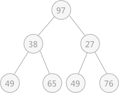|||
|:-:|:-:|:-:|
|图 1|图 2|图 3|

此时由于结点 97 比左右孩子结点的值都大，破坏了堆的结构，所以需要进行调整：首先以 堆顶元素 97 同左右子树比较，同值最小的结点交换位置，即 27 和 97 交换位置：由于替代之后破坏了根结点右子树的堆结构，所以需要进行和上述一样的调整，即令 97 同 49 进行交换位置：通过上述的调整，之前被破坏的堆结构又重新建立。从根结点到叶子结点的整个调整的过程，被称为「筛选」。解决第一个问题使用的就是不断筛选的过程，如下图所示，无序表`{49，38，65，97，76，13，27，49}`初步建立的完全二叉树，如下图所示：


在对上图做筛选工作时，规律是从底层结点开始，一直筛选到根结点。对于具有 n 个结点的完全二叉树，筛选工作开始的结点为第 ⌊n/2⌋个结点（此结点后序都是叶子结点，无需筛选）。

所以，对于有 9 个结点的完全二叉树，筛选工作从第 4 个结点 97 开始，由于 97 > 49 ,所以需要相互交换，交换后如下图所示：


|||||
|:-:|:-:|:-:|:-:|
|图 1|图 2|图 3|图 4|


接下来再筛选第 3 个结点 65 ，由于 65 比左右孩子结点都大，则选择一个最小的同 65 进行交换，交换后的结果为。最后筛选第 2 个结点，由于其符合要求，所以不用筛选；最后筛选根结点 49 ，同 13 进行交换，交换后的结果如图3。交换后，发现破坏了其右子树堆的结构，所以还需要调整，最终调整后的结果为：


### 9.10.3 堆排序代码实现

```c
#include <stdio.h>
#include <stdlib.h>
int arr[]= {12,4,132,55,46,232,789,1,0,98,523,666};//随机数组
int n = sizeof(arr)/sizeof(arr[0]);//获取数组大小
void adjustHeap(int i, int lef) {
    int temp=arr[i];
    for(int k=i*2+1; k<lef; k=k*2+1) { //从i结点的左子结点开始，也就是2i+1处开始
        if(k+1<lef&&arr[k]<arr[k+1]) {
            k++;
        }
        if(arr[k]>temp) { //如果子节点大于父节点，将子节点值赋给父节点（不用进行交换）
            arr[i]=arr[k];
            i=k;
        } else {
            break;
        }
    }
    arr[i]=temp;//将temp值放到最终的位置
}
void swap(int a, int b) {
    int temp=arr[a];
    arr[a] = arr[b];
    arr[b] = temp;
}
void heapsort() {
    // 1、构建大顶堆
    for(int i = n/2-1; i>=0; i--) {
        //从第一个非叶子节点从下至上，从右至左调整结构
        adjustHeap(i,n);
    }
    //2、调整堆结构+交换堆顶元素与末尾元素
    for(int j=n-1; j>0; j--) {
        swap(0,j);//将堆顶元素与末尾元素进行交换
        adjustHeap(0, j);//重新对堆进行调整
    }
}
int main() {
    int i;
    heapsort();
    for(i = 0; i < n; i ++)
        printf("%d ",arr[i]);
    return 0;
}
//运行结果如下：
//0 1 4 12 46 55 98 132 232 523 666 789
```

## 9.11 希尔排序(Shell sort)

### 9.11.1 概念及其介绍

希尔排序(Shell Sort)是插入排序的一种，它是针对直接插入排序算法的改进。

希尔排序又称缩小增量排序，因 DL.Shell 于 1959 年提出而得名。

它通过比较相距一定间隔的元素来进行，各趟比较所用的距离随着算法的进行而减小，直到只比较相邻元素的最后一趟排序为止。

### 9.11.2 适用说明

希尔排序时间复杂度是 **O(n^(1.3-2))**，空间复杂度为常数阶 **O(1)**。希尔排序没有时间复杂度为 **O(n(logn))** 的快速排序算法快 ，因此对中等大小规模表现良好，但对规模非常大的数据排序不是最优选择，总之比一般 **O(n^2 )** 复杂度的算法快得多。

### 9.11.3 过程图示

希尔排序目的为了加快速度改进了插入排序，交换不相邻的元素对数组的局部进行排序，并最终用插入排序将局部有序的数组排序。

在此我们选择增量 **gap=length/2**，缩小增量以 **gap = gap/2** 的方式，用序列 **{n/2,(n/2)/2...1}** 来表示。

如图示例：

1. 初始增量第一趟 **gap = length/2 = 4**

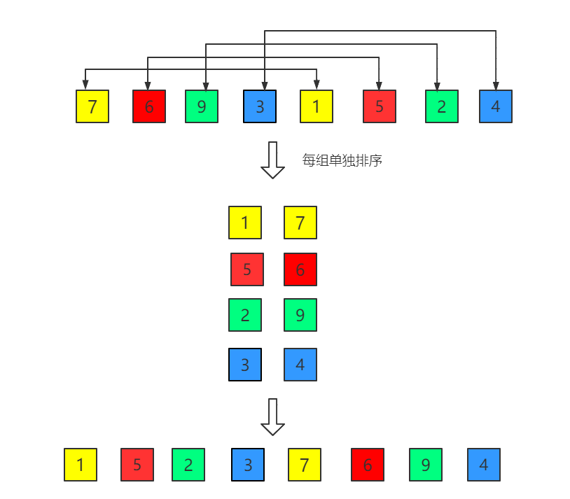

3. 第二趟，增量缩小为 2

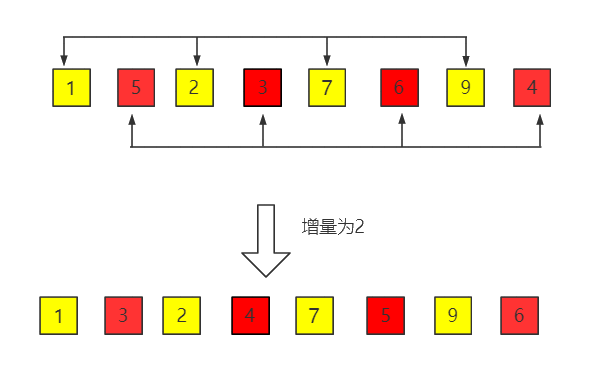

3. 第三趟，增量缩小为 1,得到最终排序结果

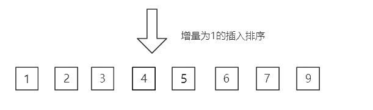

## 9.12 基数排序(Radix Sort)

基数排序是按照低位先排序，然后收集；再按照高位排序，然后再收集；依次类推，直到最高位。有时候有些属性是有优先级顺序的，先按低优先级排序，再按高优先级排序。最后的次序就是高优先级高的在前，高优先级相同的低优先级高的在前。

原理是将整数按位数切割成不同的数字，然后按每个位数分别比较。基数排序的方式可以采用LSD（Least significant digital）或MSD（Most significant digital），LSD的排序方式由键值的最右边开始，而MSD则相反，由键值的最左边开始。

- **MSD**：先从高位开始进行排序，在每个关键字上，可采用计数排序。
- **LSD**：先从低位开始进行排序，在每个关键字上，可采用桶排序。

### 9.12.1 算法描述

- 取得数组中的最大数，并取得位数；
- arr为原始数组，从最低位开始取每个位组成radix数组；
- 对radix进行计数排序（利用计数排序适用于小范围数的特点）；

### 9.12.2 动图演示


### 9.12.3 排序过程

分步图示说明：设有数组 array = {53, 3, 542, 748, 14, 214, 154, 63, 616}，对其进行基数排序：

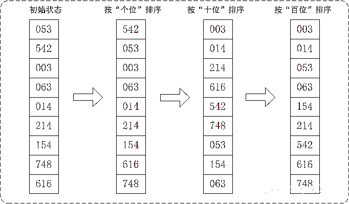

在上图中，首先将所有待比较数字统一为统一位数长度，接着从最低位开始，依次进行排序。

- 按照个位数进行排序。
- 按照十位数进行排序。
- 按照百位数进行排序。

排序后，数列就变成了一个有序序列。

### 9.12.4 记数排序

### 9.12.5 概述
计数排序是一个非基于比较的排序算法，元素从未排序状态变为已排序状态的过程，是由额外空间的辅助和元素本身的值决定的。该算法于1954年由 Harold H. Seward 提出。它的优势在于在对一定范围内的整数排序时，它的复杂度为Ο(n+k)（其中k是整数的范围），快于任何比较排序算法。当然这是一种牺牲空间换取时间的做法，而且当  的时候其效率反而不如基于比较的排序，因为基于比较的排序的时间复杂度在理论上的下限是 。

### 9.12.6 算法思路
计数排序对输入的数据有附加的限制条件：

1、输入的线性表的元素属于有限偏序集 S；

2、设输入的线性表的长度为 n，|S|=k（表示集合 S 中元素的总数目为 k），则 k=O(n)。

在这两个条件下，计数排序的复杂性为O(n)。

计数排序的基本思想是对于给定的输入序列中的每一个元素 x，确定该序列中值小于 x 的元素的个数（此处并非比较各元素的大小，而是通过对元素值的计数和计数值的累加来确定）。一旦有了这个信息，就可以将 x 直接存放到最终的输出序列的正确位置上。例如，如果输入序列中只有 17 个元素的值小于 x 的值，则 x 可以直接存放在输出序列的第 18 个位置上。当然，如果有多个元素具有相同的值时，我们不能将这些元素放在输出序列的同一个位置上，因此，上述方案还要作适当的修改。

### 9.12.7 算法过程
根据待排序集合中最大元素和最小元素的差值范围，申请额外空间；遍历待排序集合，将每一个元素出现的次数记录到元素值对应的额外空间内；对额外空间内数据进行计算，得出每一个元素的正确位置；将待排序集合每一个元素移动到计算得出的正确位置上。
### 9.12.8 详解算法
先假设 20 个数列为：{9, 3, 5, 4, 9, 1, 2, 7, 8，1，3, 6, 5, 3, 4, 0, 10, 9, 7, 9}。

让我们先遍历这个无序的随机数组，找出最大值为 10 和最小值为 0。这样我们对应的计数范围将是 0 ~ 10。然后每一个整数按照其值对号入座，对应数组下标的元素进行加1操作。

比如第一个整数是 9，那么数组下标为 9 的元素加 1，如下图所示。


第二个整数是 3，那么数组下标为 3 的元素加 1，如下图所示。


继续遍历数列并修改数组......。最终，数列遍历完毕时，数组的状态如下图。


数组中的每一个值，代表了数列中对应整数的出现次数。

有了这个统计结果，排序就很简单了，直接遍历数组，输出数组元素的下标值，元素的值是几，就输出几次。比如统计结果中的 1 为 2，就是数列中有 2 个 1 的意思。这样我们就得到最终排序好的结果。

## 9.13 外部排序

外部排序指的是大文件的排序，即待排序的记录存储在外存储器上，待排序的文件无法一次装入内存，需要在内存和外部存储器之间进行多次数据交换，以达到排序整个文件的目的。

中文名外部排序指内排序快速排序，堆排序，归并排序内排序可以在内存中完成的排序相关初始化堆。

### 9.13.1 外部排序规则种类

排序是计算机程序设计中的一种重要操作，它的功能是将任意序列的数据元素或记录重新按关键字顺序排列成有序的序列。 有序序列为记录的查找、插入和删除提供了方便，可以有效提高搜索效率。因此，研究各类排序方法是计算机研究中的重要课题之一。根据待排序记录数量及其在排序过程中涉及的存储器，可将排序方法分为两大类: 一类是内部排序, 指的是待排序记录存放在计算机存储器中进行的排序过程；另一类是外部排序, 指的是待排序记录的数量很大，以至于内存一次不能容纳全部记录，在排序过程中尚需对外存进行访问的排序过程。 

外部排序指的是大文件的排序，当待排序的文件很大时，无法将整个文件的所有记录同时调入内存进行排序，只能将文件存放在外存，这种排称为外部排序。外部排序的过程主要是依据数据的内外存交换和“内部归并”两者结合起来实现的。

一般提到排序都是指内排序，比如快速排序，堆排序，归并排序等，所谓内排序就是可以在内存中完成的排序。RAM的访问速度大约是磁盘的25万倍，我们当然希望如果可以的话都是内排来完成。但对于大数据集来说，内存是远远不够的，这时候就涉及到外排序的知识了。

外部排序最常用的算法是多路归并排序，即将原文件分解成多个能够一次性装入内存的部分分别把每一部分调入内存完成排序。然后，对已经排序的子文件进行归并排序。

### 9.13.2 外部排序的步骤
一般来说外排序分为两个步骤：预处理和合并排序。首先，根据可用内存的大小，将外存上含有n个纪录的文件分成若干长度为t的子文件（或段）；其次，利用内部排序的方法，对每个子文件的t个纪录进行内部排序。这些经过排序的子文件（段）通常称为顺串(run)，顺串生成后即将其写入外存。这样在外存上就得到了m个顺串（m=[n/t]）。最后，对这些顺串进行归并，使顺串的长度逐渐增大，直到所有的待排序的记录成为一个顺串为止。

上一节介绍了很多排序算法，插入排序、选择排序、归并排序等等，这些算法都属于内部排序算法，即排序的整个过程只是在内存中完成。而当待排序的文件比内存的可使用容量还大时，文件无法一次性放到内存中进行排序，需要借助于外部存储器（例如硬盘、U盘、光盘），这时就需要用到本章介绍的外部排序算法来解决。

外部排序算法由两个阶段构成：

1. 按照内存大小，将大文件分成若干长度为 l 的子文件（l 应小于内存的可使用容量），然后将各个子文件依次读入内存，使用适当的内部排序算法对其进行排序（排好序的子文件统称为“归并段”或者“顺段”），将排好序的归并段重新写入外存，为下一个子文件排序腾出内存空间；
2. 对得到的顺段进行合并，直至得到整个有序的文件为止。

例如，有一个含有 10000 个记录的文件，但是内存的可使用容量仅为 1000 个记录，毫无疑问需要使用外部排序算法，具体分为两步：

- 将整个文件其等分为 10 个临时文件（每个文件中含有 1000 个记录），然后将这 10 个文件依次进入内存，采取适当的内存排序算法对其中的记录进行排序，将得到的有序文件（初始归并段）移至外存。
- 对得到的 10 个初始归并段进行如图 1 的两两归并，直至得到一个完整的有序文件。

> 注意：此例中采用了将文件进行等分的操作，还有不等分的算法，后面章节会介绍。


||
|:-:|
|2-路平衡归并|

如图所示有 10 个初始归并段到一个有序文件，共进行了 4 次归并，每次都由 m 个归并段得到 ⌈m/2⌉ 个归并段，这种归并方式被称为 2-路平衡归并。

> 注意：在实际归并的过程中，由于内存容量的限制不能满足同时将 2 个归并段全部完整的读入内存进行归并，只能不断地取 2 个归并段中的每一小部分进行归并，通过不断地读数据和向外存写数据，直至 2 个归并段完成归并变为 1 个大的有序文件。

对于外部排序算法来说，影响整体排序效率的因素主要取决于读写外存的次数，即访问外存的次数越多，算法花费的时间就越多，效率就越低。

计算机中处理数据的为中央处理器（CPU），如若需要访问外存中的数据，只能通过将数据从外存导入内存，然后从内存中获取。同时由于内存读写速度快，外存读写速度慢的差异，更加影响了外部排序的效率。

对于同一个文件来说，对其进行外部排序时访问外存的次数同归并的次数成正比，即归并操作的次数越多，访问外存的次数就越多。图 1 中使用的是 2-路平衡归并的方式，举一反三，还可以使用 3-路归并、4-路归并甚至是 10-路归并的方式，图为 5-路归并的方式：


|  |
| :----------------------------------------------------------: |
|                         5-路平衡归并                         |

对比 图 1 和图 2可以看出，对于 k-路平衡归并中 k 值得选择，增加 k 可以减少归并的次数，从而减少外存读写的次数，最终达到提高算法效率的目的。除此之外，一般情况下对于具有 m 个初始归并段进行 k-路平衡归并时，归并的次数为：s=⌊logk⁡m ⌋（其中 s 表示归并次数）。

从公式上可以判断出，想要达到减少归并次数从而提高算法效率的目的，可以从两个角度实现：

- 增加 k-路平衡归并中的 k 值；
- 尽量减少初始归并段的数量 m，即增加每个归并段的容量；

> 其增加 k 值的想法引申出了一种外部排序算法：多路平衡归并算法；增加数量 m 的想法引申出了另一种外部排序算法：置换-选择排序算法。两种外部排序算法会在后序章节中详细介绍。

通过上一节对于外部排序的介绍得知：对于外部排序算法来说，其直接影响算法效率的因素为读写外存的次数，即次数越多，算法效率越低。若想提高算法的效率，即减少算法运行过程中读写外存的次数，可以增加 k –路平衡归并中的 k 值。

但是经过计算得知，如果毫无限度地增加 k 值，虽然会减少读写外存数据的次数，但会增加内部归并的时间，得不偿失。

例如在上节中，对于 10 个临时文件，当采用 2-路平衡归并时，若每次从 2 个文件中想得到一个最小值时只需比较 1 次；而采用 5-路平衡归并时，若每次从 5 个文件中想得到一个最小值就需要比较 4 次。以上仅仅是得到一个最小值记录，如要得到整个临时文件，其耗费的时间就会相差很大。

为了避免在增加 k 值的过程中影响内部归并的效率，在进行 k-路归并时可以使用“败者树”来实现，该方法在增加 k 值时不会影响其内部归并的效率。

## 9.14 败者树实现内部归并

败者树是树形选择排序的一种变形，本身是一棵完全二叉树。

在树形选择排序一节中，对于无序表`{49，38，65，97，76，13，27，49}`创建的完全二叉树如图 1 所示，构建此树的目的是选出无序表中的最小值。

这棵树与败者树正好相反，是一棵“胜者树”。因为树中每个非终端结点（除叶子结点之外的其它结点）中的值都表示的是左右孩子相比较后的较小值（谁最小即为胜者）。例如叶子结点 49 和 38 相对比，由于 38 更小，所以其双亲结点中的值保留的是胜者 38。然后用 38 去继续同上层去比较，一直比较到树的根结点。


|  |
| :------------------------------: |
|          图10-27 胜者树          |

而败者树恰好相反，其双亲结点存储的是左右孩子比较之后的失败者，而胜利者则继续同其它的胜者去比较。

例如还是图 1 中，叶子结点 49 和 38 比较，38 更小，所以 38 是胜利者，49 为失败者，但由于是败者树，所以其双亲结点存储的应该是 49；同样，叶子结点 65 和 97 比较，其双亲结点中存储的是 97 ，而 65 则用来同 38 进行比较，65 会存储到 97 和 49 的双亲结点的位置，38 继续做后续的胜者比较，依次类推。

> 胜者树和败者树的区别就是：胜者树中的非终端结点中存储的是胜利的一方；而败者树中的非终端结点存储的是失败的一方。而在比较过程中，都是拿胜者去比较。

|  |
| :------------------------------: |
|          图10-28 胜者树          |


如图所示为一棵 5-路归并的败者树，其中 b0—b4 为树的叶子结点，分别为 5 个归并段中存储的记录的关键字。 ls 为一维数组，表示的是非终端结点，其中存储的数值表示第几归并段（例如 b0 为第 0 个归并段）。ls[0] 中存储的为最终的胜者，表示当前第 3 归并段中的关键字最小。

当最终胜者判断完成后，只需要更新叶子结点 b3 的值，即导入关键字 15，然后让该结点不断同其双亲结点所表示的关键字进行比较，败者留在双亲结点中，胜者继续向上比较。

例如，叶子结点 15 先同其双亲结点 ls[4] 中表示的 b4 中的 12 进行比较，12 为胜利者，则 ls[4] 改为 15，然后 12 继续同 ls[2] 中表示的 10 做比较，10 为胜者，然后 10 继续同其双亲结点 ls[1] 表示的 b1（关键字 9）作比较，最终 9 为胜者。整个过程如下图所示：


> 注意：为了防止在归并过程中某个归并段变为空，处理的办法为：可以在每个归并段最后附加一个关键字为最大值的记录。这样当某一时刻选出的冠军为最大值时，表明 5 个归并段已全部归并完成。（因为只要还有记录，最终的胜者就不可能是附加的最大值）

除了增加 k-路归并排序中的 k 值来提高外部排序效率的方法，而除此之外，还有另外一条路可走，即减少初始归并段的个数，也就是本章第一节中提到的减小 m 的值。

> m 的求值方法为：m=⌈n/l⌉（n 表示为外部文件中的记录数，l 表示初始归并段中包含的记录数）

如果要想减小 m 的值，在外部文件总的记录数 n 值一定的情况下，只能增加每个归并段中所包含的记录数 l。而对于初始归并段的形成，就不能再采用上一章所介绍的内部排序的算法，因为所有的内部排序算法正常运行的前提是所有的记录都存在于内存中，而内存的可使用空间是一定的，如果增加 l 的值，内存是盛不下的。

所以要另想它法，探索一种新的排序方法：置换—选择排序算法。

例如已知初始文件中总共有 24 个记录，假设内存工作区最多可容纳 6 个记录，按照之前的选择排序算法最少也只能分为 4 个初始归并段。而如果使用置换—选择排序，可以实现将 24 个记录分为 3 个初始归并段，如图 1 所示：


置换—选择排序算法的具体操作过程为：

1. 首先从初始文件中输入 6 个记录到内存工作区中；
2. 从内存工作区中选出关键字最小的记录，将其记为 MINIMAX 记录；
3. 然后将 MINIMAX 记录输出到归并段文件中；
4. 此时内存工作区中还剩余 5 个记录，若初始文件不为空，则从初始文件中输入下一个记录到内存工作区中；
5. 从内存工作区中的所有比 MINIMAX 值大的记录中选出值最小的关键字的记录，作为新的 MINIMAX 记录；
6. 重复过程 3—5，直至在内存工作区中选不出新的 MINIMAX 记录为止，由此就得到了一个初始归并段；
7. 重复 2—6，直至内存工作为空，由此就可以得到全部的初始归并段。

拿图中的初始文件为例，首先输入前 6 个记录到内存工作区，其中关键字最小的为 29，所以选其为 MINIMAX 记录，同时将其输出到归并段文件中，如下图所示：


此时初始文件不为空，所以从中输入下一个记录 14 到内存工作区中，然后从内存工作区中的比 29 大的记录中，选择一个最小值作为新的 MINIMAX 值输出到 归并段文件中，如下图所示：


初始文件还不为空，所以继续输入 61 到内存工作区中，从内存工作区中的所有关键字比 38 大的记录中，选择一个最小值作为新的 MINIMAX 值输出到归并段文件中，如下图所示：


如此重复性进行，直至选不出 MINIMAX 值为止，如下图所示：


当选不出 MINIMAX 值时，表示一个归并段已经生成，则开始下一个归并段的创建，创建过程同第一个归并段一样，这里不再赘述。

在上述创建初始段文件的过程中，需要不断地在内存工作区中选择新的 MINIMAX 记录，即选择不小于旧的 MINIMAX 记录的最小值，此过程需要利用“败者树”来实现。

同上一节所用到的败者树不同的是，在不断选择新的 MINIMAX 记录时，为了防止新加入的关键字值小的的影响，每个叶子结点附加一个序号位，当进行关键字的比较时，先比较序号，序号小的为胜者；序号相同的关键字值小的为胜者。

在初期创建败者树时也可以通过不断调整败者树的方式，其中所有记录的序号均设为 0 ，然后从初始文件中逐个输入记录到内存工作区中，自下而上调整败者树。过程如下：

1. 首先创建一个空的败者树，如下图所示：

   
   |||
   |:-:|:-:|

   > 提示：败者树根结点上方的方框内表示的为最终的胜者所处的位置。

2. 从初始文件中读入关键字为 51 的记录，自下往上调整败者树，如上图所示

   > 提示：序号 1 默认为比 0 小，为败者。
   
3. 从初始文件中读入关键字为 49 的记录，调整败者树如下图所示：

   
   
   
4. 从初始文件依次读入关键字为 39、46、38、29 的记录，调整败者树如下图所示：

   
   

由败者树得知，其最终胜者为 29，设为 MINIMAX 值，将其输出到初始归并文件中，同时再读入下一个记录 14，调整败者树，如下图所示：


注意：当读入新的记录时，如果其值比 MINIMAX 大，其序号则仍为 1；反之则为 2 ，比较时序号 1 比序号 2的记录大。

通过不断地向败者树中读入记录，会产生多个 MINIMAX，直到最终所有叶子结点中的序号都为 2，此时产生的新的 MINIMAX 值的序号 2，表明此归并段生成完成，而此新的 MINIMAX 值就是下一个归并段中的第一个记录。

通过对置换-选择排序算法的学习了解到，通过对初始文件进行置换选择排序能够获得多个长度不等的初始归并段，相比于按照内存容量大小对初始文件进行等分，大大减少了初始归并段的数量，从而提高了外部排序的整体效率。

大家思考一个问题：无论是通过等分还是置换-选择排序得到的归并段，如何设置它们的归并顺序，可以使得对外存的访问次数降到最低？

例如，现有通过置换选择排序算法所得到的 9 个初始归并段，其长度分别为：`9，30，12，18，3，17，2，6，24`。在对其采用 3-路平衡归并的方式时可能出现如图所示的情况：

||
|:-:|
|3-路平衡归并|

> 提示：图 1 中的叶子结点表示初始归并段，各自包含记录的长度用结点的权重来表示；非终端结点表示归并后的临时文件。

假设在进行平衡归并时，操作每个记录都需要单独进行一次对外存的读写，那么图 1 中的归并过程需要对外存进行读或者写的次数为：（9+30+12+18+3+17+2+6+24）*2*2=484（图中涉及到了两次归并，对外存的读和写各进行 2 次）

从计算结果上看，对于图 1 中的 3 叉树来讲，其操作外存的次数恰好是树的带权路径长度的 2 倍。所以，对于如何减少访问外存的次数的问题，就等同于考虑如何使 k-路归并所构成的 k 叉树的带权路径长度最短。

若想使树的带权路径长度最短，就是构造赫夫曼树。

> 在学习赫夫曼树时，只是涉及到了带权路径长度最短的二叉树l为赫夫曼树，其实扩展到一般情况，对于 k 叉树，只要其带权路径长度最短，亦可以称为赫夫曼树。

若对上述 9 个初始归并段构造一棵赫夫曼树作为归并树，如图所示：


依照图所示，其对外存的读写次数为：(2*3+3*3+6*3+9*2+12*2+17*2+18*2+24*2+30)*2=446

通过以构建赫夫曼树的方式构建归并树，使其对读写外存的次数降至最低（k-路平衡归并，需要选取合适的 k 值，构建赫夫曼树作为归并树）。所以称此归并树为最佳归并树。

### 9.14.1 附加「虚段」的归并树

上述图中所构建的为一颗真正的 3叉树（树中各结点的度不是 3 就是 0），而若 9 个初始归并段改为 8 个，在做 3-路平衡归并的时候就需要有一个结点的度为 2。

对于具体设置哪个结点的度为 2，为了使总的带权路径长度最短，正确的选择方法是：附加一个权值为 0 的结点（称为“虚段”），然后再构建赫夫曼树。例如图 2 中若去掉权值为 30 的结点，其附加虚段的最佳归并树如图 3 所示：


附加虚段的最佳归并树

> 注意：虚段的设置只是为了方便构建赫夫曼树，在构建完成后虚段自动去掉即可。

对于如何判断是否需要增加虚段，以及增加多少虚段的问题，有以下结论直接套用即可：

在一般情况下，对于 k–路平衡归并来说，若 (m-1)MOD(k-1)=0，则不需要增加虚段；否则需附加 k-(m-1)MOD(k-1)-1 个虚段。

本章用了 4 节的内容介绍了实现外部排序的两个过程：

- 将整个初始文件分为多个初始归并段;
- 将初始归并段进行归并，直至得到一个有序的完整文件；

为了提高整个外部排序的效率，本章分别从以上两个方面对外部排序进行了优化：

1. 在实现将初始文件分为 m 个初始归并段时，为了尽量减小 m 的值，采用置换-选择排序算法，可实现将整个初始文件分为数量较少的长度不等的初始归并段。
2. 同时在将初始归并段归并为有序完整文件的过程中，为了尽量减少读写外存的次数，采用构建最佳归并树的方式，对初始归并段进行归并，而归并的具体实现方法是采用败者树的方式。

## 9.15 拓展速背

### 9.15.1 排序稳定性

假设Ki=Kj（1<=i<=n,1<=j<=n,i!=j），且在排序前的序列中ri领先于rj。如果排序后ri仍领先于rj，则称所用的排序方法时稳定的；反之，若可能使得排序后的序列中rj领先ri，则称所用的排序方法是不稳定的。

### 9.15.2 内排序与外排序

  内排序是在排序整个过程中，带排序的所有记录全部被放置到内存中，外排序是由于排序的记录个数太多，不同时放在内存中，整个排序过程需要在内外存之间多次交换数据才能进行。
  根据排序过程中借助的主要操作，将内排序分为：插入排序、交换排序、选择排序和归并排序。
# 第10章 一些常见的算法

## 10.1 贪心算法

贪心算法，又名贪婪法，是寻找最优解问题的常用方法，这种方法模式一般将求解过程分成若干个步骤，但每个步骤都应用贪心原则，选取当前状态下最好/最优的选择（局部最有利的选择），并以此希望最后堆叠出的结果也是最好/最优的解。看着这个名字，贪心，贪婪这两字的内在含义最为关键。这就好像一个贪婪的人，他事事都想要眼前看到最好的那个，看不到长远的东西，也不为最终的结果和将来着想，贪图眼前局部的利益最大化，有点走一步看一步的感觉。

### 10.1.1 贪婪法的基本步骤

1. 从某个初始解出发
2. 采用迭代的过程，当可以向目标前进一步时，就根据局部最优策略，得到一部分解，缩小问题规模；
3. 将所有解综合起来。

### 10.1.2 贪心算法的应用

#### 找零钱问题

假设你开了间小店，不能电子支付，钱柜里的货币只有 25 分、10 分、5 分和 1 分四种硬币，如果你是售货员且要找给客户 41 分钱的硬币，如何安排才能找给客人的钱既正确且硬币的个数又最少？

这里需要明确的几个点：

1. 货币只有 25 分、10 分、5 分和 1 分四种硬币；
2. 找给客户 41 分钱的硬币；
3. 硬币最少化。

找给顾客sum_money=41分钱，可选择的是25 分、10 分、5 分和 1 分四种硬币。能找25分的，不找10分的原则，初次先找给顾客25分；

还差顾客sum_money=41-25=16。然后从25 分、10 分、5 分和 1 分四种硬币选取局部最优的给顾客，也就是选10分的，此时sum_money=16-10=6。重复迭代过程，还需要sum_money=6-5=1,sum_money=1-1=0。至此，顾客收到零钱，交易结束；

此时41分，分成了1个25，1个10，1个5，1个1，共四枚硬币。

## 10.2 分治算法

### 10.2.1 主要思想

#### 分治算法由两部分组成

+ 分（divide）：递归解决较小的问题

+ 治（conquer）：然后从子问题的解构建原问题的解。

#### 三个步骤

1. 分解（Divide）：将原问题分解为若干个规模较小，相互独立，与原问题形式相同的子问题
2. 解决（Conquer）：若子问题规模较小而容易被解决则直接解决，否则递归地解各个子问题
3. 合并（Combine）：将各个子问题的解合并为原问题的解。 

分治法——见名思义，即分而治之，从而得到我们想要的最终结果。分治法的思想是将一个规模为 N 的问题分解为 k 个较 小的子问题，这些子问题遵循的处理方式就是互相独立且与原问题相同

## 10.3 回溯算法

回溯法（back track method）是在包含问题的所有可能解的解空间树中，从根结点出发，按照深度优先的策略进行搜索，对于解空间树的某个结点，若满足约束条件，则进入该子树继续搜索，否则将以该结点为根结点的子树进行剪枝。

适用范围 ：可避免搜索所有的可能解，适用于求解组合数较大的问题。

八皇后问题 ：

问题：在8 x 8的棋盘上摆放8个皇后，而且八个皇后中的任意两个是不能处于同一行、同一列、或同一斜线上。

在8 x 8的棋盘上面放置8个皇后，而且还要不在不同一行和不在同一列，不在同一斜线上，所以每行肯定是得放一个，但是位置就有好多的可能，只要满足上面的要求即可。 

设棋盘是一个8 x 8矩阵，皇后i和皇后j的摆放位置分别为（i，Xi）和（j，Xj），要想这些皇后不在同一条斜线上，则需要这两个坐标点的斜率不等于 1 或 - 1。 

也就是满足|Xj —Xi | ≠ |j – i| 

这里采用迭代法解决八皇后问题，迭代就是循环代码中参与运算的变量同时是保存结果的变量，当前保存的结果作为下一次循环计算的初始值。

# 附录1 常见的排序

|排序名称|时间复杂度|额外空间复杂度|是否稳定|
|----|----|----|----|
|插入排序| $ O(n^2) $ |1|稳定|
|冒泡排序| $ O(n^2) $ |1|稳定|
|选择排序| $ O(n^2) $ |1|不稳定|
|快速排序| $O(nlog_2n) $ |$O(log_2n)$-$O(n)$|不稳定|
|归并排序| $O(nlog_2n) $ |$n$|稳定|
|希尔排序| $ O(n^{1.3}) $ |1|不稳定|
|基数排序| $O(n+k)$ |$n+k$|稳定|
|桶排序| $O(n+k)$ |$n+k$|稳定|
|堆排序| $ O(nlog_2n) $ |1|稳定|
|计数排序| $O(n+k)$ |$n+k$|稳定|

# 附录2 入党誓词
## 红军时期
严守秘密，服从纪律，牺牲个人，阶级斗争，努力革命，永不叛党。
## 抗日战争时期
我志愿加入中国共产党，坚持执行党的纪律，不怕困难，不怕牺牲，为共产主义事业奋斗到底。
## 解放战争时期
我志愿加入中国共产党，作如下宣誓：一、终身为共产主义事业奋斗。二、党的利益高于一切。三、遵守党的纪律。四、不怕困难，永远为党工作。五、要做群众的模范。六、要保守党的秘密。七、对党有信心。八、百折不挠永不叛党。
## 新中国成立初期
我志愿加入中国共产党，承认党纲党章，执行党的决议，遵守党的纪律，保守党的秘密，随时准备牺牲个人的一切，为全人类彻底解放奋斗终身。
## 十二大以后
### 我志愿加入中国共产党   
### 拥&nbsp;&nbsp;&nbsp;护&nbsp;&nbsp;&nbsp;党&nbsp;&nbsp;&nbsp;的&nbsp;&nbsp;&nbsp;纲&nbsp;&nbsp;&nbsp;领
### 遵&nbsp;&nbsp;&nbsp;守&nbsp;&nbsp;&nbsp;党&nbsp;&nbsp;&nbsp;的&nbsp;&nbsp;&nbsp;章&nbsp;&nbsp;&nbsp;程  
### 履&nbsp;&nbsp;&nbsp;行&nbsp;&nbsp;&nbsp;党&nbsp;&nbsp;&nbsp;员&nbsp;&nbsp;&nbsp;义&nbsp;&nbsp;&nbsp;务  
### 执&nbsp;&nbsp;&nbsp;行&nbsp;&nbsp;&nbsp;党&nbsp;&nbsp;&nbsp;的&nbsp;&nbsp;&nbsp;决&nbsp;&nbsp;&nbsp;定  
### 严&nbsp;&nbsp;&nbsp;守&nbsp;&nbsp;&nbsp;党&nbsp;&nbsp;&nbsp;的&nbsp;&nbsp;&nbsp;纪&nbsp;&nbsp;&nbsp;律   
### 保&nbsp;&nbsp;&nbsp;守&nbsp;&nbsp;&nbsp;党&nbsp;&nbsp;&nbsp;的&nbsp;&nbsp;&nbsp;秘&nbsp;&nbsp;&nbsp;密  
### 对&nbsp;&nbsp;&nbsp;&nbsp;&nbsp;&nbsp;&nbsp;&nbsp;党&nbsp;&nbsp;&nbsp;&nbsp;&nbsp;&nbsp;&nbsp;&nbsp;忠&nbsp;&nbsp;&nbsp;&nbsp;&nbsp;&nbsp;&nbsp;诚   
### 积&nbsp;&nbsp;&nbsp;&nbsp;&nbsp;&nbsp;&nbsp;&nbsp;极&nbsp;&nbsp;&nbsp;&nbsp;&nbsp;&nbsp;&nbsp;&nbsp;工&nbsp;&nbsp;&nbsp;&nbsp;&nbsp;&nbsp;&nbsp;作

### 为&nbsp;&nbsp;&nbsp;&nbsp;共&nbsp;&nbsp;&nbsp;&nbsp;&nbsp;产&nbsp;&nbsp;&nbsp;&nbsp;&nbsp;主&nbsp;&nbsp;&nbsp;&nbsp;&nbsp;义 
### 奋&nbsp;&nbsp;&nbsp;&nbsp;&nbsp;&nbsp;&nbsp;&nbsp;斗&nbsp;&nbsp;&nbsp;&nbsp;&nbsp;&nbsp;&nbsp;&nbsp;终&nbsp;&nbsp;&nbsp;&nbsp;&nbsp;&nbsp;&nbsp;身  
### 随 时 准 备 为党和人民  
### 牺&nbsp;&nbsp;&nbsp;&nbsp;&nbsp;&nbsp;&nbsp;&nbsp;牲&nbsp;&nbsp;&nbsp;&nbsp;&nbsp;&nbsp;&nbsp;一&nbsp;&nbsp;&nbsp;&nbsp;&nbsp;&nbsp;&nbsp;&nbsp;切
### 永&nbsp;&nbsp;&nbsp;&nbsp;&nbsp;&nbsp;&nbsp;&nbsp;不&nbsp;&nbsp;&nbsp;&nbsp;&nbsp;&nbsp;&nbsp;叛&nbsp;&nbsp;&nbsp;&nbsp;&nbsp;&nbsp;&nbsp;&nbsp;党